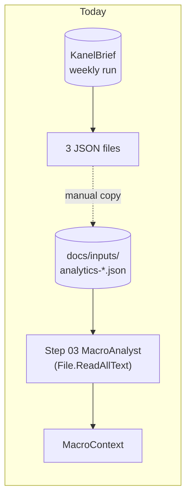
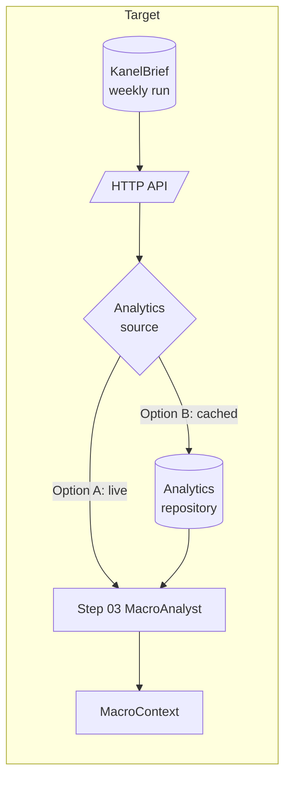
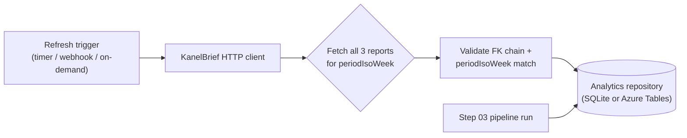
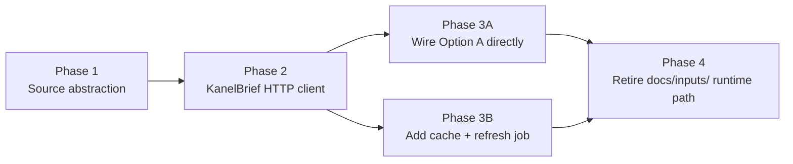

<!--
  STATUS: NEW FEATURE — PLANNING ONLY.
  No code exists yet for this migration. This document is a design sketch.

  Authoring rules for AI assistants and humans editing this file:
  - DO NOT write code (no C#, no XAML, no JSON config snippets, no shell).
  - DO use Mermaid diagrams to express architecture, flows, and state.
  - Prose stays at the "what / why / where it lives" level — no API
    signatures, no class names, no method bodies. Implementation belongs
    in a follow-up doc once this plan is agreed on.
  - DO NOT modify other documents from this plan. Cross-references are
    one-way: link out from this file to other docs, but never edit those
    other docs to point back here.
  - DO NOT invent architecture. If a piece of the flow is not yet decided,
    write it as an open question, not as a confident design.
-->

# Weekly Analytics JSON Migration — Feature Plan

> **Related:**
> - [Docs/storage-migration-plan.md](./storage-migration-plan.md) —
>   the pluggable storage layer (SQLite locally, Azure Tables in
>   production) that Option B would reuse.
> - [Docs/backend-nav-sync-plan.md](./backend-nav-sync-plan.md) —
>   the queue-driven Function pipeline. Step 03 runs inside it; this
>   doc decides how Step 03's macro inputs arrive.
> - [FikaFinans.InfrastructureV2.Tests/docs/pipeline-plan.md](../FikaFinans.InfrastructureV2.Tests/docs/pipeline-plan.md) —
>   the 10-step pipeline. Step 03 (MacroAnalyst) is the only consumer
>   of the three analytics JSONs.
> - [FikaFinans.InfrastructureV2.Tests/docs/inputs/analytics-json-schema.md](../FikaFinans.InfrastructureV2.Tests/docs/inputs/analytics-json-schema.md) —
>   authoritative schema for the three reports. Treat as read-only
>   reference; this plan does not redefine field shapes.
> - [FikaFinans.InfrastructureV2.Tests/docs/03-macroanalyst.md](../FikaFinans.InfrastructureV2.Tests/docs/03-macroanalyst.md) —
>   Step 03 contract.

## Context

Today the three weekly analytics reports —
`analytics-weekly-summary.json`, `analytics-substitution-chain.json`,
`analytics-rotation-targets.json` — are **files on disk** that
[MacroAnalystAgent](../FikaFinans.Infrastructure/Pipeline/Agents/MacroAnalystAgent.cs)
reads at the top of every Step 03 run. The path resolution lives in
[IPathsService](../FikaFinans.Application/Paths/IPathsService.cs)
(`AnalyticsWeeklySummaryJson`, `AnalyticsSubstitutionChainJson`,
`AnalyticsRotationTargetsJson`) and is anchored by
`AppSettings.Database`-adjacent path settings. The implementation walks
straight to `File.ReadAllText`.

Three things make this awkward:

1. **The files are produced by a different system.** The KanelBrief
   pipeline (in a separate repo, deployed alongside this app) emits
   the three reports on a weekly cadence and exposes an HTTP API for
   downstream consumers. Today FikaFinans never calls that API — the
   files arrive by manual copy into `docs/inputs/`.
2. **Step 03 is the only consumer.** None of the other nine agents
   read these JSONs directly. Once Step 03 has built `MacroContext`,
   the rest of the chain consumes that derived structure. The blast
   radius of how the three inputs arrive is therefore one agent.
3. **The validation contract is non-trivial.** Step 03 enforces a
   GUID-FK chain (`chain.weeklySummaryRunId == summary.runId`,
   `targets.substitutionChainRunId == chain.runId`), insists that all
   three share `periodIsoWeek`, and that `periodIsoWeek` matches the
   bundle's `dataLoader.IsoWeek`. Those checks must survive any
   migration — they catch stale-data and producer-bug classes of
   failure that the file shape alone cannot.

This document plans:

- An abstraction layer — Step 03 reads from a typed analytics source,
  not from disk.
- The two viable backings for that source — **live API call** to
  KanelBrief at pipeline run time, or **cached in our storage** with
  a separate refresh job. The choice between them is recorded as an
  open question; both are described so the trade-offs are explicit.
- The migration order — abstraction first, then a real KanelBrief
  HTTP client, then either the cache layer or direct wiring,
  depending on the decision.

## Today vs target

The target diagram deliberately keeps both options on one canvas — the
boundary the abstraction enforces is the same regardless of which
backing wins. Step 03 sees a typed source; the difference between A
and B is who paid the network round-trip and when.

## The abstraction layer

Whichever data path wins, Step 03 stops calling `File.ReadAllText`
and stops resolving paths through `IPathsService`. It reads from a
single typed analytics source whose contract is:

- **Input:** an `isoWeek` and (transitively) the `dataLoader.IsoWeek`
  it must match.
- **Output:** the three already-validated runs as their existing
  domain types
  ([WeeklySummaryRun](../FikaFinans.Domain/Macro/WeeklySummaryRun.cs),
  [SubstitutionChainRun](../FikaFinans.Domain/Macro/SubstitutionChainRun.cs),
  [OpportunityScanRun](../FikaFinans.Domain/Macro/OpportunityScanRun.cs)),
  with the FK chain and `periodIsoWeek` invariants already enforced
  before the agent sees them.
- **Failure modes:** a single typed exception per "couldn't get the
  bundle for this week" reason — upstream unavailable, partial
  payload, FK chain broken, bundle-vs-week mismatch. The agent
  catches one shape, not three deserialization paths.

Critically: the **invariant checks live on the source side**, not in
the agent. Pulling `MacroAnalystAgent.ValidateInputs` out of the
agent and into the source implementation is part of this migration
— otherwise every backing has to re-implement them and they drift.

The three existing domain types stay unchanged. The
[AnalyticsJsonOptions](../FikaFinans.Infrastructure/Pipeline/Json/AnalyticsJsonOptions.cs)
serializer survives — only the byte-stream origin changes.

## Option A — live API call from Step 03

Step 03 calls KanelBrief's HTTP API at the start of every run. No
FikaFinans-side persistence of analytics; the producer is the source
of truth at all times.

**Why this is attractive:**

- No second copy of the data to keep in sync. KanelBrief's published
  output is the only authoritative copy.
- No cache-coherence questions. "Latest" is defined by KanelBrief.
- Smaller storage footprint and zero refresh job to maintain.
- Backtests that re-run a historical week query the same API for
  that week's `periodIsoWeek` — assuming KanelBrief retains history.

**What it costs:**

- Step 03 cannot run if KanelBrief is unreachable. The pipeline halts
  at agent 3 instead of agent 1, but a halt is a halt.
- Every Step 03 run pays a network round-trip — fine for the daily
  per-ISIN pipeline (small), but worth thinking about during
  backtest replays of many weeks.
- The "what week's data does KanelBrief currently have published"
  question becomes a runtime concern. If a Wednesday ISIN run fires
  before Thursday's weekly publication, the producer may legitimately
  return the previous week's bundle — the bundle-vs-`isoWeek` check
  catches that, but the operational answer is "wait, then retry."
- Coupling — every pipeline environment (local dev, Azure prod) needs
  network access to a real KanelBrief endpoint. Local-only iteration
  on Step 03 stops working unless we mock the source.

## Option B — cached in our storage

A refresh job pulls the three reports from KanelBrief and writes them
into our store (the same repository abstraction
[storage-migration-plan.md](./storage-migration-plan.md) introduces
for positions and `IsinProgress`). Step 03 reads from the store.

**Why this is attractive:**

- Pipeline runs are decoupled from KanelBrief availability — once
  the week's bundle is cached, Step 03 always finds it.
- Backtests are local — historical weeks' bundles are sitting in our
  store and replays don't depend on the producer's retention policy.
- Local dev iteration stays fast. Engineers seed the store directly
  in tests; no network mock layer.
- The cached entity becomes a natural read source for any future
  consumer beyond Step 03 (a UI dashboard, an audit report) without
  re-coupling to the producer.

**What it costs:**

- Two copies of the same data. Cache invalidation is a real concern
  — if KanelBrief republishes a corrected `runId` for the same week,
  our cache is stale until the refresh job catches up.
- A refresh job to run, monitor, and reason about — when does it fire,
  what does it do on partial publication (summary done but chain not
  yet), and how does it report failures?
- Storage shape needs an opinion: latest-only per `periodIsoWeek`
  (overwrite on refresh), or runId-addressable history, or both.
- The bundle-vs-`isoWeek` check now has two failure modes: "cache is
  for the wrong week" vs "cache is missing entirely." The source
  abstraction has to disambiguate them clearly.

### Hybrid sketch (briefly)

A third shape sits between the two: **API-first with cached fallback**.
Step 03 calls KanelBrief; if the call fails or returns a stale bundle,
it falls back to the local cache. The refresh job becomes "warm the
cache so the fallback is current."

This is more moving parts than either pure option. Listed here for
completeness — the recommendation in the open questions section is to
pick A or B cleanly first; revisit hybrid only if real failure modes
warrant it.

## Schema

Schema is unchanged from
[analytics-json-schema.md](../FikaFinans.InfrastructureV2.Tests/docs/inputs/analytics-json-schema.md).
This plan does not propose a new wire format; it proposes a new
*delivery mechanism* for the same JSON. The three reports keep:

- `runId` GUID, `runDate`, `createdAt`, `modelId`, `status`,
  `durationSeconds`, token counts, `reportType`, `periodStart`,
  `periodEnd`, `periodIsoWeek`.
- The cross-file FK chain — `weeklySummaryRunId` on the substitution
  chain, `substitutionChainRunId` on the rotation targets.
- Their existing enum vocabularies (`RunStatus`, `MarketSentiment`,
  `ConfidenceLevel`, `SignalStrength`).

If Option B wins, the cache row carries the same fields plus the
storage envelope (`PartitionKey`, `RowKey`, `LastRefreshedAt`,
`Source` — see § 6). The payload itself is not reshaped.

## Storage shape (only if Option B wins)

This section spells out what the cached entity looks like. It is
separate from the §3.1 entity-shape rules in
[storage-migration-plan.md](./storage-migration-plan.md) — same
contract (no FKs, no joins, last-write-wins, no DTO `ETag`) but a
different table.

| Aspect | Sketch |
| --- | --- |
| Logical name | `AnalyticsBundle` (one row holds all three reports for a given week) — alternative shape: three rows per week, one per `reportType`. Open question. |
| `PartitionKey` | `"analytics"` — single producer, no need to shard. |
| `RowKey` (latest-only) | `periodIsoWeek` (e.g. `"2026-W17"`). Overwritten when KanelBrief republishes a correction. |
| `RowKey` (history-keeping) | `"{periodIsoWeek}/{runId-of-summary}"`. Latest-pointer is a separate row. Open question whether we need it. |
| `LastRefreshedAt` | Timestamp of the most recent successful refresh. Independent of `runDate`/`createdAt` from KanelBrief. |
| `Source` | `"kanelbrief-api"` for normal refresh; `"manual"` for an admin override. Diagnostic only. |
| Payload columns | The three report payloads serialized to string columns (or — if shaped per-`reportType` — one payload per row). |

The lifecycle:

The refresh job is the only writer; the pipeline is read-only. Same
single-writer / last-write-wins pattern as the rest of the storage
plan, so no `ETag` coordination is needed even if KanelBrief
re-publishes mid-refresh.

## Producer-side considerations

The KanelBrief HTTP API is **out of scope to change** from this plan
— that's a separate repo, separate doc. What this plan does need
from the producer side is captured as open questions:

- Does KanelBrief expose one endpoint per report, or a single
  endpoint that returns all three for a given `periodIsoWeek`?
- Is the API runId-addressable (fetch a specific run by GUID), or
  always "latest published for this week"? Backtest replays care
  about this.
- What's the auth model — API key, managed identity, AAD? FikaFinans
  Function and KanelBrief both deploy into the same Azure tenant, so
  managed-identity-to-managed-identity is plausible but not assumed.
- Does the producer have any concept of "this week's bundle is fully
  published" vs "summary done, chain pending"? Option A and Option B
  both need a way to tell partial from complete.

These questions get answers from the KanelBrief team before the
phase that introduces a real HTTP client (phase 2 below).

## Migration phases

1. **Define the analytics source abstraction.** Pull the three
   `File.ReadAllText` calls and the `ValidateInputs` block out of
   `MacroAnalystAgent`. The current file-based behaviour moves
   behind the new abstraction as the only implementation. Tests
   under
   [FikaFinans.InfrastructureV2.Tests/Agents/03-macroanalyst](../FikaFinans.InfrastructureV2.Tests/Agents/03-macroanalyst/)
   keep passing — they're decoupled from disk paths but still hit
   the legacy backing.
2. **Add a real KanelBrief HTTP client implementation.** Same
   abstraction, new backing. Auth, retry, timeout, and the
   "what does the API return for partial publication" question get
   answered here. This is where the producer-side open questions
   become concrete.
3. **Pick A or B and wire it.**
   - **3A (live):** DI swap — the HTTP client becomes Step 03's
     analytics source. Done.
   - **3B (cached):** add the analytics repository (per § 6) and a
     refresh job that uses the HTTP client to populate it. Step 03's
     analytics source becomes the repository read.
4. **Retire the local JSON runtime path.** The
   `IPathsService.AnalyticsWeeklySummaryJson` /
   `AnalyticsSubstitutionChainJson` /
   `AnalyticsRotationTargetsJson` properties stay on the interface
   only as long as test fixtures need them. The files in
   `docs/inputs/` may stay as historical references; nothing on the
   runtime path opens them.

Phases 1 and 2 are independently mergeable. Phase 3 cannot start
until phase 2 is real (or the option chosen is A and the HTTP client
*is* phase 2's deliverable). Phase 4 lands once the chosen path is
proven in CI.

## Test strategy

- **Unit tests for the analytics source abstraction.** Mock the
  underlying backing (file, HTTP, repository); assert the FK chain
  and `periodIsoWeek` checks fire under each kind of malformed
  input. The validation logic moves with the abstraction, so its
  tests move too.
- **Step 03 tests stop knowing about disk paths.** The existing
  integration tests at
  [MacroAnalystAgentIntegrationTests.cs](../FikaFinans.InfrastructureV2.Tests/Agents/03-macroanalyst/MacroAnalystAgentIntegrationTests.cs)
  today read fixture JSONs from
  [docs/inputs/](../FikaFinans.InfrastructureV2.Tests/docs/inputs/).
  Post-migration they construct a stub source that hands the parsed
  fixture objects directly. The fixture files stay as the source of
  truth for what a "real" KanelBrief bundle looks like.
- **HTTP client tests** (phase 2) hit a recorded-response stub or
  a Wiremock-style fake. No network access in CI.
- **Cache tests** (phase 3B only) seed the repository directly,
  then verify Step 03 reads what was seeded. Refresh-job tests sit
  on the refresh job, not on Step 03.

## Open questions

The decisions that should land before code starts on phase 2 or 3:

- **Option A vs Option B** — the headline choice. Both are viable;
  the trade-offs are listed in §4 and §5.
- **API surface** — single endpoint returning all three reports, or
  three endpoints? RunId-addressable, or latest-only? (KanelBrief
  team to answer.)
- **Auth model** — API key in user-secrets / Key Vault, AAD app
  registration, or managed-identity-to-managed-identity?
- **Partial publication handling** — KanelBrief publishes the three
  reports in order (summary → chain → targets). What does the API do
  if a consumer hits it after summary but before chain? Block, return
  partial, return previous week?
- **Refresh trigger (Option B only)** — timer (Thursday after
  publication), webhook from KanelBrief, on-demand from the
  Function host, or a combination?
- **Cache row shape (Option B only)** — one row per week (all three
  payloads joined) vs three rows per week (one per `reportType`).
  Affects RowKey design and partial-publication semantics.
- **Backtest replay** — if Option A wins, does KanelBrief retain
  enough history to replay a year-old week? If not, Option B is
  effectively forced for the backtest path.
- **Failure-mode mapping** — what does the abstraction's exception
  taxonomy look like? "Source unreachable", "bundle-week mismatch",
  "partial payload", "FK chain broken" — single exception type with
  a discriminator, or four sibling types?

## Out of scope

- **Changing KanelBrief.** The producer side stays as it is; this
  plan only describes what FikaFinans needs from it.
- **Schema evolution.** The
  [analytics-json-schema](../FikaFinans.InfrastructureV2.Tests/docs/inputs/analytics-json-schema.md)
  is treated as fixed. If KanelBrief versions the schema, that's a
  separate plan.
- **The daily news brief input.** Out-of-scope per the schema doc;
  this plan covers only the three weekly reports Step 03 reads.
- **WPF UX.** Step 3's view in WPF
  ([Step3MacroAnalystViewModel.cs](../FikaFinans.Wpf/ViewModels/Steps/Step3MacroAnalystViewModel.cs))
  consumes `MacroContext` — unchanged by this migration.
- **Code, ARM/Bicep, DI snippets.** Same authoring rules as the
  sibling plans.
