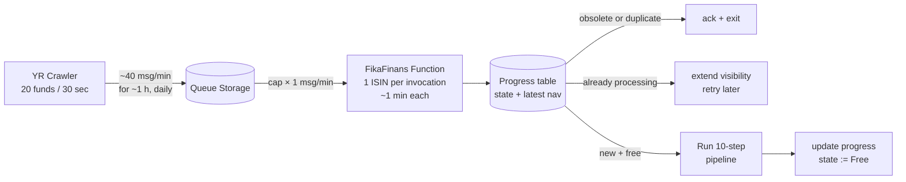
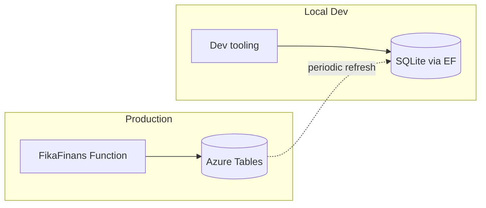
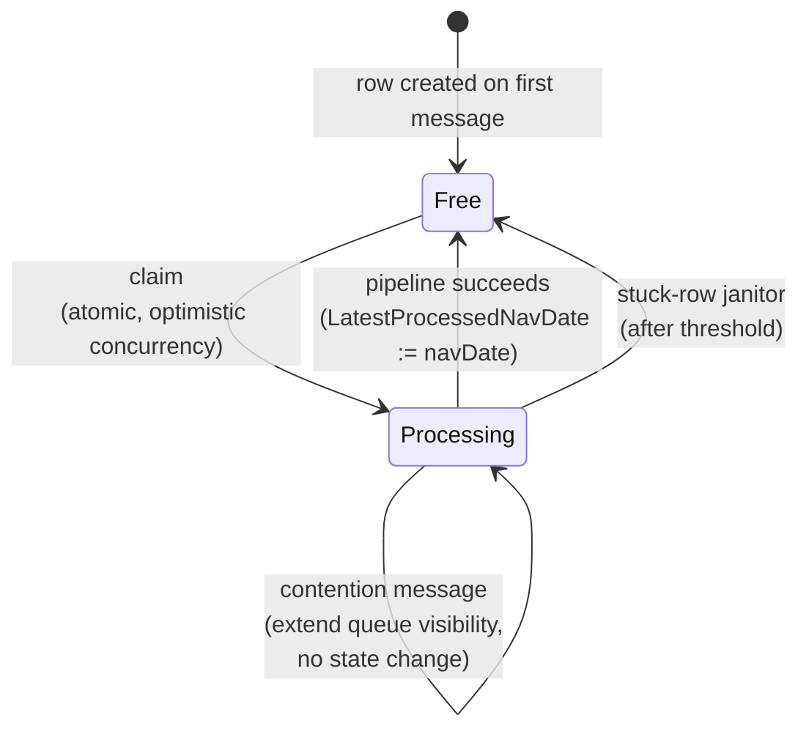
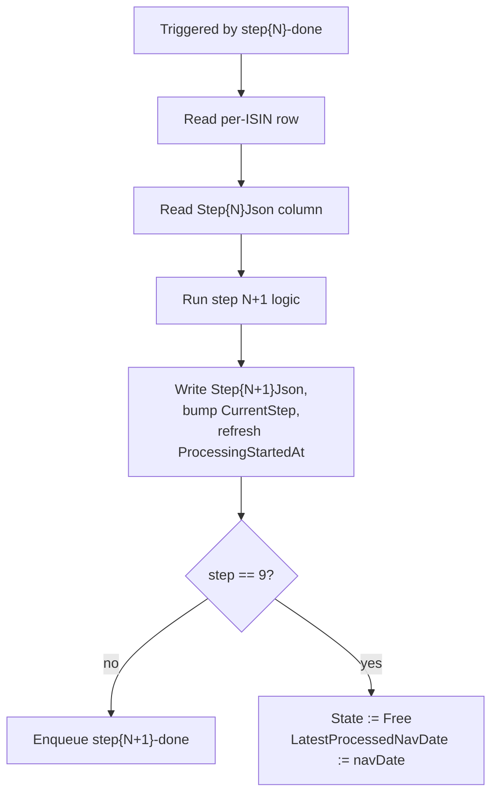

<!--
  STATUS: NEW FEATURE — PLANNING ONLY.
  No code exists yet. This document is a design sketch.

  Authoring rules for AI assistants and humans editing this file:
  - DO NOT write code (no C#, no XAML, no JSON config snippets, no shell).
  - DO use Mermaid diagrams to express architecture, flows, and state.
  - Prose stays at the "what / why / where it lives" level — no API signatures,
    no class names, no method bodies. Implementation belongs in a follow-up doc
    once this plan is agreed on.
  - DO NOT modify other documents from this plan. Cross-references are
    one-way: link out from this file to other docs, but never edit those
    other docs to point back here. This plan is self-contained; other
    docs (e.g. pipeline-plan.md) stay untouched.
  - DO NOT invent architecture. If a piece of the flow is not yet decided,
    write it as an open question, not as a confident design.
-->

# Backend + NAV Sync — Feature Plan

TODO: weekly analytics json
TODO: current holding and send orders back to bank.

> **Related:** the 10-step orchestrator the FikaFinans Function will run is
> specified in
> [FikaFinans.InfrastructureV2.Tests/docs/pipeline-plan.md](../FikaFinans.InfrastructureV2.Tests/docs/pipeline-plan.md).
> That document defines *what* the orchestrator does; this document plans
> *how* messages reach it and which Azure messaging service ferries them.

FikaFinans's new backend will run on **Azure Functions (Consumption
plan)**. The workload — small per-fund jobs arriving in a slow drip,
once-a-day cadence — fits queue-triggered, scale-to-zero Functions
better than a long-running App Service slot. YieldRacoon already owns
the existing F1 web app; Functions sidesteps that question entirely and
only pays for compute when there is work to do.

## Context

Two separate Azure projects, each owned by a different repo:

- **Project 1 — YieldRacoon backend (Azure App Service, F1).** Already
  planned. The YieldRacoon WPF desktop app publishes NAV rows at any time.
  Its App Service saves them to its primary DB and posts a batch of
  messages (e.g. 20 per publish) onto a queue.
- **Project 2 — FikaFinans backend (this repo, Azure Functions on the
  Consumption plan).** Does not exist yet. Queue-triggered. Each message
  kicks off the 10-step orchestrator and writes a `ProcessedNav` table row.

We want to keep project separated, YieldRacoon backend should not know about current project. We need some kind of Queue.

The Queue is the Bridge

```text
App Service (Project 1)
  ├─ Saves 20 nav rows to primary DB
  └─ Posts message to Queue Storage
     (and then forgets about it)

Queue Storage (The Broker)
  └─ Sits there with 20 messages

Azure Functions (Project 2)
  ├─ Reads messages from Queue
  ├─ Launches workflows
  ├─ Writes to separate datatable
  └─ Doesn't care about App Service
```

Benefits of separation:

- App Service doesn't need to know Azure Functions exist
- Azure Functions don't call back to App Service
- Each project evolves independently
- Different teams, different deployments, different monitoring
- If one crashes, the other still works

Why This is the Right Pattern

Without queue:

- App Service would need to call Azure Function directly
- Creates a hard dependency
- If Azure Functions go down, App Service breaks
- Tight coupling

With queue:

- App Service publishes message and exits (doesn't wait)
- Queue persists the message
- Azure Functions pick it up whenever ready
- Loose coupling, independent scaling

This is the classic producer-consumer pattern for decoupled systems.

## Working Assumptions

These are the numbers and shape decisions the rest of this plan rests on.
Lock them in before deeper design.

### Volume and cadence

- **Universe size:** ~1,500 funds.
- **Crawler behaviour:** YieldRacoon's crawler fetches 20 funds at a
  time with ~30 sec between batches. A full crawl is ~75 batches and
  takes about 1 hour end-to-end.
- **Frequency:** typically once per day.
- **Update cadence varies by fund.** Many funds publish daily, but a
  meaningful slice updates only weekly or monthly. The crawler still
  visits all 1,500 every day; for most funds on most days the answer
  is "no new NAV."
- **Late arrivals.** NAV for a given trading day is not always
  available the same calendar day — time-zone differences and slow
  publishers mean a crawl run today routinely carries yesterday's (or
  older) NAV dates. The `navDate` on a message is the *trading date*,
  **not** the arrival date, and the two are allowed to diverge.
- **Duplicates are the common case, not the exception.** The crawler
  revisits unchanged funds and may re-emit the same NAV row. The
  consumer **must** dedupe, and must drop duplicates **early** — before
  running the 10-step pipeline — or we burn compute on no-op work.

### Per-fund workflow

- **Planning baseline:** 1 minute per fund for the full 10-step run.
  The proof-of-concept measured 8 minutes for 200 funds in batchy
  mode; 1 minute per fund is a deliberate over-estimate that gives
  ~10× headroom under the 10-min Consumption-plan cap.
- **Message granularity:** one ISIN per queue message. The PoC
  pipeline is batchy by accident of implementation, not because the
  work is shared across funds. Splitting to per-fund unlocks clean
  retries, per-ISIN poison handling, and natural progress tracking.
- **Identifier:** ISIN as the fund key. Stable, global, no coupling
  to YR-side internal IDs.
- **Dedup mechanism:** a per-ISIN progress table tracks
  `LatestProcessedNavDate` and processing state (`Free` /
  `Processing`). The first thing the Function does on any message is
  consult this table; if the incoming `navDate` is not newer than what
  has already been processed, ack and exit. The same row also acts as
  the in-flight lock — see "Progress Table" below for the full state
  machine.

### Throughput math (for reference)

Producer feeds the queue at ~40 msg/min for ~1 hour, then stops.
Consumer drain time depends on the concurrency cap:

| Concurrency cap | Wall time to drain a full crawl |
| --- | --- |
| 5 | ~5 h |
| 10 | ~2.5 h |
| 20 | ~75 min |
| 25+ | matches producer; queue stays near-empty |

The queue's job is **smoothing the slow drip + giving retries + letting
YR fire-and-forget**. It is not absorbing bursts — there are no bursts.

### LLM rate limits

At any reasonable concurrency cap (≤25), the consumer makes ≤25 LLM
calls per minute. Comfortably below Azure OpenAI quotas. Not a design
constraint at this volume.



## Phases

Phase 1: Develop Locally

Use Rx.NET
├─ Load 1,000 rows
├─ Create observable stream
├─ Process with maxConcurrency: 5
└─ Test locally (no cloud cost)

Phase 2: Deploy to Cloud (Optional)
Replace observable with Azure Queue
├─ Timer Trigger loads rows into queue
├─ Queue-triggered function reads messages
├─ Semaphore ensures max 5 concurrent
└─ Same business logic, cloud durability

Your Rx code doesn't change, only the data source/sink.

## The Decision — Queue Storage vs Service Bus

The big open question. We need to pick **one**.

### Specs side-by-side

Comparison to Real-World
Think of it like an inbox on your desk:

**Service Bus** = Fancy mailroom service

- Delivers mail at specific times
- Handles complex routing
- Tracks everything
-Expensive

**Queue Storage** = Simple inbox

- Mail just sits there
- You check it yourself
- No fancy features
- Cheap

#### What Takes Up Space

- Each message = your data size (usually < 1 KB for your use case)
- 1,000 messages × 1 KB = 1 MB
- Messages auto-delete after 7 days (or when you delete them)

#### Cost Breakdown

- Storage: $0.01/month (seriously, 1 cent)
- Operations: Reading/writing messages = $0.0001 per 10,000 ops
- Your 1,000 messages: ~$0.001/month

Total: ~$0.01/month for Queue Storage

#### Key Limitations (That Don't Matter for You)

Limitation, Impact on Your Use Case
64 KB message size: ✅ Fine (your row data is tiny)
7-day retention max: ✅ Fine (messages processed in hours)
No scheduling: ✅ Fine (you don't need it)
No filtering: ✅ Fine (you process all messages)
FIFO not guaranteed: ⚠️ Doesn't matter (rows independent)

| Property | **Queue Storage** | **Service Bus — Basic** | **Service Bus — Standard** |
| --- | --- | --- | --- |
| Max message size | 64 KB | 256 KB | 256 KB |
| Max queue size | 500 TB (storage-account limit) | 80 GB | 80 GB |
| Default TTL | 7 days | 14 days | 14 days |
| Max TTL | 7 days, **or `-1` for never-expire** | 14 days | unbounded (configurable) |
| Visibility / lock window | up to 7 days | up to 5 minutes (renewable) | up to 5 minutes (renewable) |
| FIFO / ordering | best-effort, **no** strict FIFO | FIFO | FIFO; sessions for grouped FIFO |
| Built-in dead-letter | **no** (DIY: track dequeue count, move to a `-poison` queue) | yes | yes |
| Topics / pub-sub | no | no | yes |
| Duplicate detection | no | no | yes |
| Transactions / sessions | no | no | yes |
| Delivery guarantee | at-least-once | at-least-once | at-least-once |

### Cost (rough — verify against current Azure pricing before committing)

| Service | Base monthly | Per-operation |
| --- | --- | --- |
| **Queue Storage** | none — storage only (~$0.045 / GB-month, LRS) | ~$0.0004 per 10 000 transactions |
| **Service Bus Basic** | none | ~$0.05 per million operations |
| **Service Bus Standard** | ~$10/month flat (per namespace, ~$0.0135/hour) | ~$0.80 per million operations |

For our load (~1,500 messages once a day; see Working Assumptions),
Queue Storage and Service Bus Basic both round to **\$0/month** in
practice. Service Bus Standard's flat fee dominates everything else and
only earns its keep if we actually need topics, sessions, or dedup.

### How long messages are kept

| Service | Behaviour |
| --- | --- |
| Queue Storage | TTL 1 sec → 7 days, **or `-1` never-expire**. After max-dequeue-count, no automatic move — the consumer must handle poison. |
| Service Bus Basic / Standard | TTL up to 14 days (Basic) or unbounded (Standard). On max-delivery-count the broker auto-moves the message to a `$DeadLetterQueue` subqueue. |

### What the actual flow needs

| Requirement (from the diagram above) | Queue Storage covers it? | Service Bus Basic covers it? |
| --- | --- | --- |
| Single producer (YieldRacoon App Service) → single consumer (FikaFinans Function) | ✅ | ✅ |
| 20 small messages per publish, well under 64 KB each | ✅ | ✅ |
| "5-concurrent + requeue" pattern via visibility timeout / lock release | ✅ | ✅ |
| Ordering | not strictly needed — each NAV row is independent | n/a | n/a |
| Multiple subscribers | not needed today | n/a | (Standard only) |
| Built-in DLQ | nice-to-have, not load-bearing | ❌ DIY | ✅ |

### Decision

**Queue Storage** — agreed during planning iteration. The natural fit:

- Volume is tiny; both services round to free, but Queue Storage has no
  monthly floor at all.
- Single producer / single consumer — Service Bus's topic story buys us
  nothing.
- The 64 KB cap is comfortable for NAV-row-shaped messages.
- The "5-concurrent + requeue" pattern uses visibility timeout, which
  Queue Storage supports up to 7 days (more than we'll ever need).
- Already part of the Storage Account that the Functions app needs anyway
  → no extra resource.

**Cost of going with Queue Storage:** we lose the built-in dead-letter
queue. We'd track dequeue count ourselves and shovel poison messages onto
a sibling `*-poison` queue. That's small — a known pattern with
QueueClient — but it is real work.

**When to revisit:** if we ever need fan-out to a second consumer, FIFO
guarantees, or duplicate detection, escalate to Service Bus Standard. Until
then, Queue Storage.

## FikaFinans Function — Responsibilities

A single queue-triggered Function. Per message:

- Receive an `(isin, navDate)` signal from the queue. The message
  carries no NAV value — fund data travels out of band, fetched from
  YR's per-ISIN endpoint. See "Data Fetch" below.
- Consult the progress table for that ISIN. Three outcomes:
  - **Obsolete or duplicate** (incoming `navDate` ≤ recorded
    `LatestProcessedNavDate`) → ack & exit. Dominant path on most
    days, since the crawler revisits unchanged funds and many funds
    only update weekly or monthly.
  - **Currently processing** → extend the queue message's visibility
    timeout and exit *without* deleting. The message reappears later
    and the front-door check runs again. See "Progress Table" for
    the rationale.
  - **New + ISIN is free** → atomically claim the row (state →
    `Processing`), fetch the fund's data from YR, run the 10-step
    pipeline, finalize (state → `Free`, `LatestProcessedNavDate` :=
    `navDate`). The pipeline itself is defined in
    [pipeline-plan.md](../FikaFinans.InfrastructureV2.Tests/docs/pipeline-plan.md).
- On unhandled failure during processing, the claim row is left in
  `Processing`. A stuck-row janitor releases it (see "Progress
  Table"), and the queue's visibility timeout returns the message
  for retry. After max-dequeue-count it moves to the `*-poison`
  sibling queue (DIY DLQ; see the Decision section above).

Nothing in the Function holds state across invocations. No long-running
supervisor, no in-memory queue mirror, no shared semaphore between
invocations. Concurrency is configured at the host level, not in code.

## Data Fetch — YR Fund Endpoint

The queue message is a **signal**, not a payload. Actual fund data
travels out of band: when the Function decides to run the pipeline
for an ISIN, it pulls fund data from a YR HTTP endpoint.

### What YR provides

YR's authoritative data covers three slices, matching what the PoC
data loader currently consumes from CSV files:

- **Metadata** — ISIN, name, currency, family, etc. One row per fund.
- **Snapshot** — the current snapshot for one ISIN (latest NAV, last
  update timestamp, etc.).
- **Summary** — the NAV-history buckets for one ISIN.

YR does **not** know about positions, pinnings, or any
FikaFinans-shaped concept. Those are FF-owned (see Storage).

### Per-ISIN, not bulk

The signal-driven flow naturally fetches one fund at a time, so YR
exposes one HTTP route returning the three slices joined for a given
ISIN. This reuses YR's existing F1 App Service surface (no new blob
container, no separate file-publish pipeline) and keeps the YR
contract narrow.

Bulk endpoints and blob-published CSV dumps were considered and
rejected: blob storage isn't part of YR's surface today, and a
per-ISIN endpoint aligns 1-1 with queue messages.

### Coupling boundary

The endpoint returns YR's natural domain shape — date+value pairs,
units, currency, whatever YR finds idiomatic. **YR does not shape
data for FF.** FF owns an adapter that normalizes YR's DTOs into
its pipeline-internal shape. If YR's shape changes, FF's adapter
changes; YR doesn't blink.

### Caching

FF mirrors YR fetches in its primary store (Azure Tables in prod,
SQLite locally — see Storage). On a message: check cache → fetch on
miss or staleness → run pipeline. Cold-start populates the mirror
fund-by-fund as messages arrive; the mirror is never bulk-primed.

### Open contract

The wire shape, auth (managed identity is the obvious default),
error taxonomy, and versioning need a small contract doc owned
jointly with YR. Tracked in Open Questions.

## Time-Limit Constraint — Why No Long-Running Orchestrator

### The 10-Minute Hard Limit

Consumption-plan activity functions have a **10-minute hard limit**.
With 1 minute as the per-fund planning baseline (see Working
Assumptions), we sit at ~10× headroom — the cap is not a design
constraint at this volume. Revisit only if measured per-fund time
creeps past ~3 minutes; until then, treat the cap as someone else's
problem.

### Why a Long-Running Orchestrator Is Still Wrong

Even with comfortable per-message timing, a single orchestrator that
loads the universe, holds a semaphore, and supervises the queue
end-to-end is the wrong shape. The queue itself happily holds messages
without a constantly-running consumer; queue-triggered Functions wake
on demand and only then incur cost. An orchestrator that supervises
the batch would:

- Need to stay alive for the duration of a crawl drain (multiple
  hours at low concurrency caps).
- Get replayed constantly as activities complete, accumulate
  execution time, hit service timeouts, and **fail unpredictably**.
- Cost compute time even when there is nothing to do.

Verdict: stateless queue worker. The Functions runtime *is* the
orchestrator.

## Storage — Azure Tables + Local SQLite Mirror

Azure Tables is the system of record. Local development uses SQLite as a
faithful mirror, accessed via EF Core. Same shape, same access patterns —
SQLite *behaves like* Tables, not the other way around.



### Rules

- **Shared entity shape.** `PartitionKey`, `RowKey`, `Timestamp`, `ETag`
  are real properties on every entity. The same POCO serialises to both
  stores.
- **Repository hides the store.** Business code sees a storage interface;
  one implementation targets Tables, the other EF/SQLite. Switching is a
  DI swap.
- **No relational features in the contract.** No foreign keys, no
  navigation properties, no joins, no `IQueryable` leaks. Allowed query
  shapes: PK lookup, PK + RK range scan, partition scan.
- **Tables-shaped writes.** Batch transactions live within a single
  partition (≤100 entities, ≤4 MB). The contract pretends SQLite has the
  same constraint so behaviour matches in both modes.
- **Explicit upsert / update.** No reliance on EF change tracking.

### Acknowledged seams

- Schema setup differs (EF migrations vs. "create table if not exists").
  Run at startup, not unified.
- A small dev-only utility refreshes SQLite from Azure Tables. The only
  local-only code that exists.

## Progress Table — Per-ISIN State

A small per-ISIN table that doubles as the dedup record and the
in-flight processing lock. The previous design's separate
"latest-seen" table and `(isin, navDate)`-keyed processed-list
collapse into this single row-per-ISIN table.

### Shape

| Column | Purpose |
| --- | --- |
| `Isin` | primary key |
| `State` | `Free` or `Processing` |
| `LatestProcessedNavDate` | nullable; null until first success |
| `ProcessingStartedAt` | timestamp when state moved to `Processing`; used for stuck-row recovery |
| `LastError`, `AttemptCount` | optional, for diagnostics |

### State machine



The claim step is atomic via the storage layer's optimistic
concurrency primitive (ETag in Tables, transaction in SQLite). The
front door loses races cleanly: a second worker that tries to claim
while the first already did simply sees `Processing` and takes the
contention branch.

### Contention — extend visibility, don't re-enqueue

When a message arrives for an ISIN whose row is `Processing`, the
Function does **not** delete the message. Instead it asks the queue
to push the message's visibility timeout forward by a margin
comfortably longer than typical pipeline duration. The message
reappears later, the front-door check runs again, and by then the
in-flight run has usually finished. If the new `navDate` is then
≤ `LatestProcessedNavDate`, it falls through the obsolete-skip
path naturally.

Why extend-visibility rather than re-enqueue:

- One queue operation, atomic from the caller's perspective.
- No risk of duplicating the message (which a delete-then-add
  sequence could do if delete fails between the two operations).
- Preserves the message's dequeue count, so the queue's poison
  threshold still acts as a backstop for genuinely stuck ISINs.

### Stuck-row recovery

A function crash, an unhandled exception, or a Consumption-plan
host eviction can leave a row in `Processing` with no live worker.
The queue's visibility timeout returns the message for retry — but
the row stays locked, so retries hit the contention branch
indefinitely.

A small janitor handles this: any row whose `ProcessingStartedAt`
is older than a threshold (15 minutes is comfortable — well past
the 10-minute Consumption-plan hard cap) is reset to `Free`. The
janitor can run as a timer-triggered Function or piggyback on the
front-door check itself ("if `Processing` but stale, treat as
`Free`"). Placement is an open question.

### Acknowledged trade

Two messages for the same ISIN with different `navDate` values can
race past the front door if the second arrives just before the
first finishes its claim. The result is occasional duplicate
processing — accepted, per Working Assumptions. The progress table
is *not* trying to be a strict serializer per ISIN; it's trying to
be cheap, dedup-correct on the common path, and survive crashes.

## Step Outputs — Inline in the Same Row

The 10-step pipeline produces a JSON output per step per fund.
Local Rx composes steps as function calls and passes outputs as
parameters. On Azure each step is a separate Function invocation,
so step outputs need somewhere durable to land between calls.

The per-ISIN row introduced by the Progress Table doubles as the
output store. Each step has its own column on the same row.

### Extended row shape

Same entity as the Progress Table state. Additional columns:

| Column | Purpose |
| --- | --- |
| `RunId` | trace id for the current run |
| `NavDate` | trading date being processed |
| `CurrentStep` | 0–9; how far the run has progressed |
| `Step01Json` … `Step09Json` | per-step output, JSON serialized inline |

Step 10's output is run-independent and lives outside this row —
see "Step 10 — Daily Portfolio Trades".

Latest-only — each new run for an ISIN overwrites in place. No
historical runs are kept.

### Run boundary

When the front door admits a new run for an ISIN, the claim
transaction (Free → Processing) **also clears `Step01Json`
through `Step09Json`** and writes a fresh `RunId`. Steps 2–9 then
write their own column on success; nothing else clears.

Without this reset, columns from the previous run would coexist
with columns from the in-flight run, and `CurrentStep` could no
longer unambiguously identify what is fresh.

### Why inline, not blobs

Measured on the integration-test corpus
(`FikaFinans.InfrastructureV2.Tests/stepOutputs`, 16 funds,
9 per-ISIN steps), per-fund per-step JSON is **~17–19 KiB**.
Azure Tables' string-property cap is **~32K UTF-16 characters**,
so each column has roughly 1.8× headroom, and the 1 MiB row cap
is unreachable (9 columns × 18 KiB ≈ 162 KiB per row).

At this size, inline beats blob storage on three axes:

- **Atomicity.** Step output and progress state update in a single
  row write. No "wrote blob, then crashed before the table"
  inconsistency window to reason about.
- **One row = one dashboard.** Fetching a fund returns its full
  pipeline state in a single round trip. Status views project big
  columns out via `$select`.
- **Fewer moving parts.** Same storage account as the queues; no
  separate blob container, no extra lifecycle to manage.

### Column size guard

Per-step output sizes will drift as the pipeline evolves. Silently
hitting the property cap means a write fails in production. Two
layered guards keep this a build-time concern, not a 3-AM concern.

- **Runtime guard** — a single chokepoint in the writer that
  serializes the step output, measures the encoded byte count,
  and throws a clear error if it exceeds a chosen threshold
  (~30 KiB, leaving headroom against the cap). Every step writer
  routes through this helper, so no code path bypasses the check.
- **Integration-test guard** — a parameterized test in
  `FikaFinans.InfrastructureV2.Tests` runs the pipeline against
  the `stepOutputs` corpus and asserts every per-fund per-step
  slice stays under the threshold. Catches drift in PR review,
  not in production.

If a step ever legitimately needs more than ~30 KiB, the escape
hatch is gzip+base64 on that single column, or splitting just
that column out to blob storage. Until the test fails, treat the
cap as plenty.

## Step-to-Step Chaining — One Queue per Step Boundary

The front door (`pipeline-start`) is the entry point from YR. Past
it, eight more queues stitch step N to step N+1 within the per-ISIN
chain. Step 9 is the per-ISIN terminal step. Step 10 runs on a
separate daily timer (see "Step 10 — Daily Portfolio Trades") and
is not part of this chain.

### Queue layout

| Queue | Triggers | Written by |
| --- | --- | --- |
| `pipeline-start` | Step 1 (Data Loader) | YR producer |
| `step01-done` | Step 2 (Metrics) | Step 1 Function |
| `step02-done` | Step 3 (Macro) | Step 2 Function |
| `step03-done` | Step 4 (Signal) | Step 3 Function |
| `step04-done` | Step 5 (Macro Align) | Step 4 Function |
| `step05-done` | Step 6 (Catalyst) | Step 5 Function |
| `step06-done` | Step 7 (Thesis) | Step 6 Function |
| `step07-done` | Step 8 (Recommendation) | Step 7 Function |
| `step08-done` | Step 9 (Enrichment) | Step 8 Function |

Each step's Function binds to its trigger queue and writes to the
next queue when finished. Queue identity encodes the step number,
so the message body stays minimal. Step 9 has no successor queue —
it finalizes the row (`State := Free`,
`LatestProcessedNavDate := navDate`) instead of enqueueing.

### Message shape

Inter-step messages are signals, not payloads. Step output data
lives in the per-ISIN row and is fetched by primary key.

| Field | Purpose |
| --- | --- |
| `isin` | row key for the per-ISIN state row |
| `navDate` | trading date — for tracing and logging |
| `runId` | trace id — joins logs across the 10 hops |

No `fromStep` field; the queue binding identifies that. No NAV
value, no step JSON inline.

### Function loop

Every step Function follows the same template.



### Failure handling

Same primitives as the front door — Queue Storage's at-least-once
delivery plus DIY poison handling.

- Function throws → message returns to queue → auto-retry.
- After max-dequeue-count → message moves to `step{N}-done-poison`.
- Per-step poison queues mean triage is "look at which poison
  queue has messages" — an immediate signal for which step is
  broken.
- The per-ISIN row's `LastError` and `AttemptCount` give the
  per-fund view.

### Why this shape, not the alternatives

- **Single queue with `targetStep` field.** Saves nine queues but
  poison messages from all steps mix into one bucket. The
  "which step is broken" signal disappears. Not worth the saving.
- **Durable Functions.** Native fan-in/fan-out and automatic
  checkpointing. Not used here. The only fan-in we need is Step 10,
  and it fits a plain TimerTrigger Function reading the table
  directly (see "Step 10 — Daily Portfolio Trades"). DF would be
  ceremony on top of strictly sequential per-ISIN flow.

## Step 10 — Daily Portfolio Trades

Step 10 is the one stage that needs the whole portfolio in view at
once: it produces the day's trades from each fund's Step 9 output.
It runs outside the per-ISIN chain.

### Trigger

A timer-triggered Function fires **once per day at 23:00 CET**.
By that hour, the morning crawl plus a generous slack window has
finished for almost every fund (1,500 funds × ~1 min wall time
fits well inside a workday). Funds still mid-run at the trigger
moment are simply not represented in tonight's trades; they get
picked up in tomorrow's run.

### Inputs

The Function reads `Step09Json` from every per-ISIN row,
**regardless of NavDate freshness**. A fund whose last successful
run was a week ago contributes its week-old Step 9 view; a fund
whose row has `Step09Json = null` (never completed, or mid-run
after the front door cleared the column) is skipped.

This is the deliberate trade made by clearing per-fund columns at
run boundaries: the daily trades reflect the state of each fund's
last *completed* pipeline, not necessarily its latest NAV.

### Output destination

Open question. Two candidates:

- **Single portfolio entity** — one row per day in a separate
  partition (`PartitionKey = "portfolio-trades"`,
  `RowKey = "2026-05-09"`). Natural fit since Step 10's output is
  inherently portfolio-wide.
- **Per-ISIN `Step10Json` column** — fan the per-fund slice of
  the trades back into each ISIN's row. Keeps the "one row tells
  you everything" property; costs duplicated storage and a write
  per fund.

Pick before implementing Step 10. Tracked in Open Questions.

### Failure handling — daily timer

The timer Function is idempotent at the day level — running it
twice on the same day overwrites the same target with the same
inputs (assuming no per-ISIN runs completed between the two
invocations). On unhandled failure, manual rerun via Azure Portal
or a small admin trigger is acceptable; this is not a hot path.

## Infrastructure Summary

Everything the FikaFinans backend needs in production. Single
storage account, single Function App, no premium tiers.

| Resource | Count | Plan / Tier | Purpose |
| --- | --- | --- | --- |
| Storage Account | 1 | Standard LRS | hosts queues + table |
| Queue Storage queues | 9 | — | front door (`pipeline-start`) + 8 chained `step{N}-done` queues |
| Poison queues | up to 9 | — | sibling `*-poison` per queue, created on demand |
| Azure Tables table | 1 | — | per-ISIN row (state + 9 step JSON columns) plus a daily portfolio-trades row from Step 10 |
| Function App | 1 | Consumption | hosts the 9 queue-triggered step Functions plus the Step 10 daily timer in one deployment |

No multi-account fan-out, no premium tier, no separate Function App
per step. Queue Storage and Tables share the storage account the
Functions runtime needs anyway.

Cost shape (rough — see Open Questions for hard numbers):

- Table storage: ~245 MiB at full universe (1,500 funds × ~162 KiB
  per row), plus a few KiB per day for the portfolio-trades row.
  Fractions of a cent per month.
- Queue operations: a daily crawl is ~25K transactions across all
  step queues; pennies at the published rate.
- Function executions: once-a-day workload sits well inside the
  Consumption-plan monthly free grant.

Total rounds to free.

## Open Questions

- **Concurrency cap value.** Mechanism is settled — host-level setting
  on the Function (`host.json` `maxConcurrentCalls` or equivalent), not
  an in-code semaphore. Starting recommendation: 5–10. Pick the actual
  number once we see real per-fund timing during Phase 1.
- **Front-door message schema.** Smaller now that the message is a
  pure signal. Known shape: `isin`, `navDate` (trading date, may
  lag arrival), `arrivedAt`, optional `seq` (YR-side publish
  counter, for tracing). No NAV value on the wire. Still needs a
  small contract doc (separate file) before either side codes
  against it. Distinct from the inter-step messages on
  `step{N}-done` queues, which carry only `isin`, `navDate`,
  `runId` (see Step-to-Step Chaining).
- **Step 10 output destination.** Single portfolio-wide entity
  (`PartitionKey = "portfolio-trades"`, `RowKey = date`) vs
  per-ISIN `Step10Json` column populated by the daily run. See
  "Step 10 — Daily Portfolio Trades".
- **Step 10 trigger time and timezone.** 23:00 CET as the working
  default — needs confirmation against Stockholm DST behaviour
  (CET ↔ CEST) and the latest-arriving NAV's typical clock time.
- **YR fund endpoint contract.** The per-ISIN HTTP shape (request,
  response, error taxonomy), auth (managed identity is the obvious
  default), and versioning. Owned jointly with YR. Lives in the same
  contract doc as the queue message schema.
- **Stuck-row janitor placement.** Front-door check (cheap, runs on
  every message) vs. dedicated timer-triggered Function (clean
  separation, costs almost nothing). Pick during Phase 2.
- **Visibility-extension margin.** Specific number of seconds to push
  the message forward when the front door sees `Processing`. Should
  be comfortably longer than typical pipeline duration; pick once we
  see real per-fund timing during Phase 1.
- **Progress tracking.** How we surface "how many of the ~1,500
  messages are done / running / queued / poison" to the FikaFinans WPF
  app and to ops. Candidates: query Application Insights, expose queue
  depth + progress-table counts via a small dashboard endpoint, or
  both. Pick before the first real run — debugging without visibility
  is painful.
- **Cost comparison.** Concrete numbers (Function executions,
  GB-seconds, Queue Storage operations) for one daily crawl plus the
  ~23 h of idle. Believed to round to nothing on the Consumption free
  tier; want a real estimate before locking the design in.

## Out of Scope for This Document

- Any code, configuration, or `.bicep` / ARM template.
- YieldRacoon's internals — what its primary DB looks like, how it batches
  publishes.
- Auth between the two backends (managed identity is the obvious default,
  but the contract doc decides).
