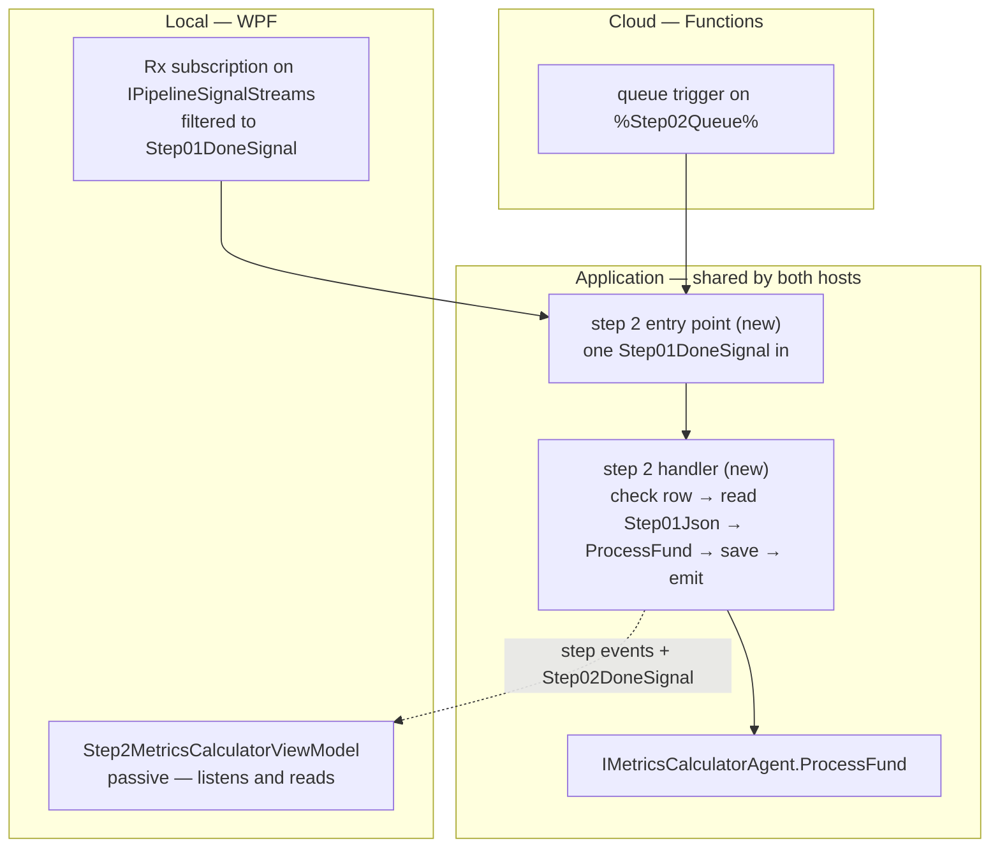
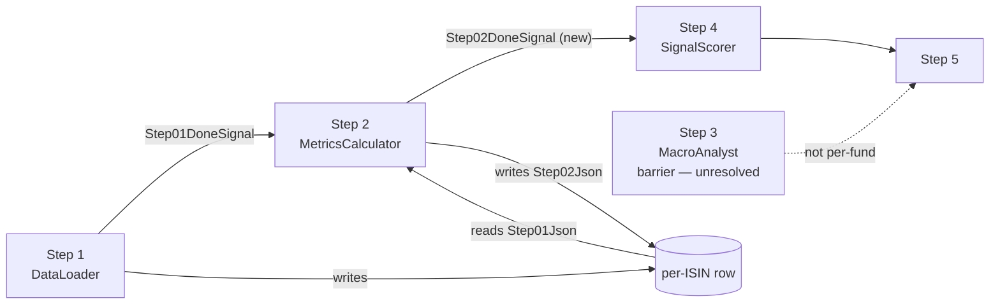

<!--
  Authoring rules: see README.md in this folder.
  STATUS: design only. Nothing here is implemented.
-->

# Step 2 — MetricsCalculator

> **Related:**
>
> - The cross-cutting design this follows from:
>   [event-driven-orchestration-plan.md](./event-driven-orchestration-plan.md)
> - The step this one follows, and the pattern it copies:
>   [01-dataloader.md](./01-dataloader.md)
> - What this step does **today** — I/O schemas, failure modes, test
>   fixtures:
>   [02-metricscalculator.md](../../FikaFinans.InfrastructureV2.Tests/docs/02-metricscalculator.md)

`StepId.MetricsCalculator`, implemented by `MetricsCalculatorAgent`
behind `IMetricsCalculatorAgent`, surfaced in the desktop app as
`Step2MetricsCalculatorViewModel`. This page covers only what the move to
signal-driven, per-fund processing changes.

Step 1 did the hard part: the fetch seam, the progress-store seam, the
done-signal family and the phase-split handler all exist now. Step 2 is
the first step that *consumes* a done-signal rather than a
`NavChangeSignal`, so it is where the "carry only the signal, read from
the row" model gets exercised for real.

## Where step 1 left things

What exists today and is reused as-is:

| Piece | Built for step 1 | What step 2 does with it |
| --- | --- | --- |
| [`Step01DoneSignal`](../../FikaFinans.Application/Pipeline/Signals/Step01DoneSignal.cs) | step 1's output signal | **its input** |
| [`IPipelineSignals`](../../FikaFinans.Application/Pipeline/Signals/IPipelineSignals.cs) | one overload, step 1's | gains a second overload, for step 2's done-signal |
| [`IPipelineSignalStreams`](../../FikaFinans.Application/Pipeline/Signals/IPipelineSignalStreams.cs) | one stream of every `IStepDoneSignal` | step 2 subscribes and filters to `Step01DoneSignal` — nothing on the interface changes |
| [`IIsinProgressStore`](../../FikaFinans.Application/Pipeline/Progress/IIsinProgressStore.cs) | claim, save, run-wide read | save is reused; step 2 must **not** claim (see below); needs a per-fund read it does not have |
| [`IStepEventPublisher`](../../FikaFinans.Application/Pipeline/IStepEventPublisher.cs) | step 1's progress ticks | same, with `StepId.MetricsCalculator` |
| [`IStep01DataLoader`](../../FikaFinans.Application/Pipeline/Steps/IStep01DataLoader.cs) + [`Step01DataLoaderHandler`](../../FikaFinans.Application/Pipeline/Steps/Step01DataLoaderHandler.cs) | phase-split, per-fund handler with run state in fields | **the template** — step 2 gets its own pair in the same shape |
| [`PipelineFrontDoor`](../../FikaFinans.Application/Pipeline/PipelineFrontDoor.cs) | drives step 1's phases per `NavChangeSignal` | **does not reach step 2** — nothing drives step 2 off a done-signal yet |

And what runs step 2 today, which this page replaces:

| Path | How it reaches step 2 | Input from | Output to |
| --- | --- | --- | --- |
| Per-tab "Run this step" button | `Step2MetricsCalculatorViewModel` → `IMetricsCalculatorAgent.Run(isoWeek, runId)` | step 1's JSON **file**, via `IPathsService` | step 2's JSON file |
| Streaming runner | `PipelineRunner` calls `ProcessFund` per fund, in memory | the fund record handed over in memory | `Step02Json`, via `StreamingPipelineGateway`'s block write |

Neither reads `Step01Json`. Locally the column is written and then
ignored — the exact gap the parent plan's "what travels on a hop" section
describes.

## Sketch — the same step, two hosts

Illustrative only. Names marked *(new)* do not exist yet; queue names are
owned by [backend-nav-sync-plan.md](../backend-nav-sync-plan.md).

### What is the same in both hosts

Same rule as step 1: the step depends on interfaces, only the
registration differs.

| Interface | Local | Cloud |
| --- | --- | --- |
| `IPipelineSignalStreams` | `LocalRxPipelineSignalBus` | — nothing subscribes |
| `IPipelineSignals` | `LocalRxPipelineSignalBus` | queue publisher *(new)* |
| `IIsinProgressStore` | `RepositoryBackedIsinProgressStore` over SQLite | the same class over Tables |
| `IStepEventPublisher` | `LocalRxStepEventBus` | still open — the parent plan's run-lifecycle question |
| Step 2 config | `config-02-metrics.json` via `IPathsService` | **still open** — no filesystem |

No fetch seam. Step 2 never talks to YieldRaccoon — everything it needs
is already on the row. That makes it the cheapest step in the chain to
move, and a good place to prove the row-read pattern before steps that
also have LLM calls to worry about.

### Handler shape

Same rule as step 1 — one signal in, constructor for stable
dependencies, no transport types. Same phase split, so the caller can
order "write, then emit" itself:

| Step 1 phase | Step 2 equivalent | Difference |
| --- | --- | --- |
| `BeginProcessingAsync` — **claims** the row | verify the row is this run's | must not claim — see "Do not claim" below |
| `LoadFundAsync` — fetch identity, holdings, pins | read `Step01Json` for this ISIN and run id | one key lookup, no fetch |
| `AssembleAgentInputAsync` — compute buckets, snapshot | load the step 2 config | config only; the record is already assembled |
| `RunAgentAsync` — `IDataLoaderAgent.RunInMemory` | `IMetricsCalculatorAgent.ProcessFund` | already on the interface, already pure |
| `PersistAsync` — `Step01Json` | `Step02Json` | same store call, different `StepId` |
| `EmitDoneAsync` — `Step01DoneSignal` | step 2's done-signal | new signal type, new overload |
| `ReadOutputAsync` | same, `StepId.MetricsCalculator` | none |

Whether step 2 keeps six phases or collapses the middle three is a
judgement call — the middle is a lookup, a config read and a pure call.
Keeping the same shape makes the step files diff cleanly against each
other, which is what the README template asks for. **Not decided.**

### Where the code lives

**Step 2 is triggered by `Step01DoneSignal` — in both hosts, always.**
Everything that runs on that signal lives in Application and is shared;
only the few lines that connect a transport to it differ per host.



| Piece | Lives in | Shared with cloud |
| --- | --- | --- |
| The calculation — `ProcessFund` | Infrastructure, behind `IMetricsCalculatorAgent` | yes |
| Step 2 handler — the phases | Application, beside step 1's | yes |
| Step 2 entry point — runs the phases in order, the front door's twin | Application, beside `PipelineFrontDoor` | yes |
| Signal → entry point | `MainWindowViewModel` locally, a Function class in cloud | no — transport wiring |
| The tab | WPF | no — display only |

The entry point is a twin of `PipelineFrontDoor`, not an extension of
it: one signal type in, one step's phases out, a fresh handler per
signal from a factory. That keeps step 1's front door untouched.

### Local

The subscription sits next to step 1's, in `MainWindowViewModel`, and
copies it — off the Rx callback, every exception caught so the stream
survives:

```text
// sketch
pipelineSignals.Signals                          // IPipelineSignalStreams
    .OfType<Step01DoneSignal>()
    .Subscribe(done => RunStep02Async(step02Door, done));   // (new)
```

Wiring only. `MainWindowViewModel` holds it because that is where step
1's wiring already is; the parent plan's "extract the coordinator" slice
moves both later, together. No coalescing buffer here — unlike
`NavChangeSignal`, a done-signal is emitted once per run per fund.

**No step ViewModel runs step 2.** `Step1DataLoaderViewModel` already
subscribes to this stream, but only to know which run id to read for
display. That is a read, so the parent plan's "single-consumer by
convention" rule — which binds the *work* subscriber — is not broken by
it.

### Cloud

The step-2 queue already appears in step 1's sketch as the output
binding. Step 2 is its trigger:

```text
// sketch
[Function("Step02MetricsCalculator")]                       // (new)
public Task Run(
    [QueueTrigger("%Step02Queue%")] Step01DoneSignal signal,
    CancellationToken ct)
    => _step02Door.HandleAsync(signal, ct);                 // (new)
```

The same entry point the local subscription calls — so the cloud adds a
trigger, not a second copy of the step.

The return-value-as-send question from step 1 applies unchanged.
Whichever wins there, step 2 takes.

## Input trigger

`Step01DoneSignal` — fund identifier, trading date, run id. No payload.

| | Producer | Transport | How the step is reached |
| --- | --- | --- | --- |
| Local | `Step01DataLoaderHandler.EmitDoneAsync` → `IPipelineSignals` | `LocalRxPipelineSignalBus` | subscribe to `IPipelineSignalStreams.Signals`, filter to step 1 |
| Cloud | the same handler, queue-backed publisher | `%Step02Queue%` | **nothing subscribes** — the Functions host invokes the step per message |

Delivery is at-least-once, as for step 1. Two cases matter:

| Arrives | Row says | Action |
| --- | --- | --- |
| Duplicate of a signal already handled | same run id, `Step02Json` populated | run again — the column is latest-only, overwrite is safe |
| Late — a newer run has claimed the fund since | a **different** run id | drop it. Its `Step01Json` was cleared by the newer claim; there is nothing to read and nothing to write |

The second row is new with step 2. Step 1 never has it, because step 1
mints the run id. Every later step inherits it.

### Do not claim

`IIsinProgressStore.ClaimAsync` is step 1's lock, and it **clears every
step column** — that is how a new run starts clean. Calling it from
step 2 would wipe the `Step01Json` step 2 is about to read.

So step 2's first phase is a check, not a claim: the row exists, it is
in flight, and its run id is the signal's. Anything else → log, report,
stop. The lock taken by step 1 covers the whole chain for that fund.

### Manual trigger — WPF only

The tab keeps its "Run this step" debug button, and the GUI does not
change. It stays a desktop affordance with no cloud counterpart.

It behaves as step 1's does today: the button calls
`IMetricsCalculatorAgent.Run`, which reads step 1's output from disk.
Not the signal path, and not meant to be — it is for debugging the
calculation in isolation. Both buttons move together when the parent
plan's "unify the run paths" slice routes them through the runner.

## Input data — what the step reads

| Input data | Current | WPF | Cloud |
| --- | --- | --- | --- |
| **Step 1's fund record** — identity, buckets, snapshot, holding, layer | `01-dataloader-{iso_week}-{run_id}.json` (button) or the in-memory record (runner) | `Step01Json` on this fund's row, matched by run id | same, Tables |
| **Config** — stale-snapshot window, fee horizon | `config-02-metrics.json` via `IPathsService`, falling back to defaults when absent | unchanged | **still open** — step 1's page already lists step configs as having no cloud home |

### The per-fund read does not exist

`IIsinProgressStore.ReadStepOutputAsync` is a *display* read: it scans
the whole partition, gathers every fund that names the run id, and
returns them as one blob. Step 2 wants one row by key — the ISIN —
checked against the run id.

**TODO:** a per-fund read on `IIsinProgressStore`, by ISIN, returning
that row's record for one step plus enough of the row to run the
"is this still my run" check. A point read, which is exactly what Tables
is cheap at.

### What the row does not carry

`Step01Json` holds one `FundRecord`. The `DataLoaderOutput` envelope
around it — frozen positions, cash available, run-level data-quality
warnings, ISO week, company — never reaches the row;
`SaveStepOutputAsync` picks the fund's record out and drops the rest.

Step 2 does not care: `ProcessFund` takes a `FundRecord` and nothing
else. `RunInMemory` copies the envelope through untouched, but that is
the universe-wide path. Recorded here because step 2 is the first step to
read the row back, so it is the first place the loss is visible — the
consumers that do need the envelope (step 10's cash floor) are further
down.

### The config has fields that move to step 1

`MetricsCalculatorConfig` mixes two kinds of setting:

| Field | Used by | After the redesign |
| --- | --- | --- |
| `StaleSnapshotWarnDays`, `FeeDeductionHorizonWeeks` | `ComputeMetrics` | still step 2 |
| `MinBucketDays`, `DropPartialBuckets` | nothing in step 2's code — the bucketing is the producer's today | describe what `SliceIntoWindows` does, which step 1's page moves **into step 1** |
| `PrimarySharpeHorizonWeeks`, `TreatNanSharpeAsZeroForRules`, `WarnOnBucketsTotalLt`, `DataQualityFlagsEnabled` | not read by `ComputeMetrics` | unchanged — not this page's concern |

Once step 1 computes buckets itself, the bucketing rules are step 1's
input, sitting in step 2's file. Whether they move, are duplicated, or
stay and get read by step 1 is open.

## Pre-processing — assemble the agent input

Nothing to assemble. Step 1 already produced the record `ProcessFund`
takes, and the only other input is the config.

Compare step 1, whose pre-processing was a whole calculator port. That
asymmetry is the point of the chain: every fetch and every join happens
once, at the front, and later steps only read.

## Agent work

Code, not an LLM. Contract:
[02-metricscalculator.md](../../FikaFinans.InfrastructureV2.Tests/docs/02-metricscalculator.md).

The call is
[`IMetricsCalculatorAgent.ProcessFund(fund, config)`](../../FikaFinans.Application/Pipeline/Agents/IMetricsCalculatorAgent.cs),
implemented by
[`MetricsCalculatorAgent`](../../FikaFinans.Infrastructure/Pipeline/Agents/MetricsCalculatorAgent.cs).

Unlike step 1, **nothing stands in the way**:

| Step 1 had | Step 2 has |
| --- | --- |
| the in-memory call missing from the interface | `ProcessFund` already on it |
| `TextReader` inputs | a typed `FundRecord` |
| a universe to join across | one fund, no cross-fund reads |

`ProcessFund` is pure — no I/O, no clock, returns an enriched copy with
`Metrics` set and every earlier field preserved. The append-only rule
holds without any change. `Run` and `RunInMemory` stay for the
universe-wide button and tests; the per-fund step does not call them.

### One flag that may lose its meaning

`snapshot_stale_vs_summary` compares the snapshot's as-of date with the
latest bucket's end date. Today those come from two separate producer
files, which can be exported at different times — so they can drift.

After step 1's redesign both are computed from the same mirrored series
in the same run. The drift the flag detects stops being possible, unless
the two calculators are ever fed different slices of the series. Keep
the flag — the contract is unchanged and it costs nothing — but it is
worth knowing it will read `false` by construction.

## Post-processing — write and emit

One write, then one signal. Same order as step 1, same reason.

| Written | The call | Where it lands | Local | Cloud |
| --- | --- | --- | --- | --- |
| This fund's enriched record | `IIsinProgressStore.SaveStepOutputAsync` with `StepId.MetricsCalculator` | `Step02Json` on this fund's row; `CurrentStep` advances to 2 | SQLite | Azure Tables |

No NAV rows, no mirror — step 2 writes only its column. The row stays in
flight; step 2 does not release it.

**TODO:** `SaveStepOutputAsync` takes a `DataLoaderOutput` and picks the
fund out. Step 2 has one `FundRecord`. Either it wraps the record in an
envelope to satisfy the signature, or the store grows a per-fund
overload. The second matches the per-fund read above and stops every
later step from building an envelope just to have it taken apart.

### Emit

**TODO:** add `Step02DoneSignal` *(new)* — fund identifier, trading date,
run id, no payload. Same shape as step 1's, implementing
`IStepDoneSignal`. Named by the producing step's number, as decided on
step 1's page.

**TODO:** add its overload to `IPipelineSignals`, and implement it on
`LocalRxPipelineSignalBus`. The build breaks until both are done, which
is what the overloads-not-generic choice was for.

Nothing changes on `IPipelineSignalStreams` — it already carries every
`IStepDoneSignal`.

### Who consumes it

Not step 3. MacroAnalyst is a universe-wide barrier with no per-fund
input from step 2; its translation is unresolved. Step 4 (SignalScorer)
is the next per-fund consumer of step 2's output.

So step 2's done-signal goes to step 4's queue in cloud, skipping a
number. That is fine for the signal — named by producer — but it is the
first hop where the queue name and the step numbers stop lining up, and
it leans on the barrier question being answered the way the step-flow
plan assumes. See Open questions.



## What a frontend reads when the user opens the view

Same as step 1: opening the tab is a read of `Step02Json`, never a
trigger.

`Step2MetricsCalculatorViewModel.LoadOutputAsync` today goes through
`IsinProgressOutputLoader` with a column selector, then falls back to
step 2's JSON file on disk. Step 1's ViewModel has already moved off
both onto its handler's `ReadOutputAsync`, and it follows the step
rather than running it — subscribing to step events for its `StepId` and
to its own done-signal to know which run id to read.

**TODO:** the same move for step 2 — the tab becomes **passive**, a copy
of step 1's:

| The tab | Does |
| --- | --- |
| Listens to step events | filtered to `StepId.MetricsCalculator`, projected onto status, duration, error |
| Listens to `Step02DoneSignal` *(new)* | to learn the run id, then reads that run's output |
| Reads | through the step 2 handler's `ReadOutputAsync`, never the repository directly |
| Runs | **nothing** on a signal — only the debug button, as above |

`IsinProgressOutputLoader` and the disk fallback leave the tab. No XAML
changes. The three view states from step 1's page — populated, in
flight, not processed — apply unchanged.

## TODO summary

| # | Work | Touches |
| --- | --- | --- |
| 1 | Step 2 handler interface and default implementation, in step 1's shape | Application, `Pipeline/Steps` |
| 2 | First phase checks the row instead of claiming it | the handler |
| 3 | Per-fund read on the progress store | `IIsinProgressStore`, `RepositoryBackedIsinProgressStore` |
| 4 | Per-fund save, or wrap the record | the same two |
| 5 | `Step02DoneSignal` *(new)* and its overload | `Pipeline/Signals`, `LocalRxPipelineSignalBus` |
| 6 | Step 2 entry point, the front door's twin | Application, `Pipeline` |
| 7 | Subscription: `Step01DoneSignal` → entry point, beside step 1's | `MainWindowViewModel` |
| 8 | Step 2's tab goes passive — listens, reads, keeps its debug button | `Step2MetricsCalculatorViewModel`, no XAML |
| 9 | Registration — handler per-dependency, entry point single-instance, like step 1's | `InfrastructureModule` |

None of it touches `MetricsCalculatorAgent`. The agent is done.

## Open questions

Raised by this page; they belong in the parent plan's Open Questions,
not settled here.

- **Where the local wiring ends up.** Step 2's subscription sits beside
  step 1's in `MainWindowViewModel` for now. Both move out together in
  the "extract the coordinator" slice; step 2 adds nothing that slice
  did not already have to move.
- **Who releases the row.** Step 1 claims, step 2 neither claims nor
  releases. In a per-step chain, which step — or which barrier — moves
  the row out of in flight and advances the dedup anchor? Today that is
  `ReleaseIsinProgressAsync` on the universe-wide gateway path.
- **Where the run-level envelope lives.** Cash available, frozen
  positions and run-level warnings are dropped when step 1's output is
  stored per fund. Step 2 does not need them; step 10 does.
- **Where the bucketing config lives** once step 1 owns the bucketing.
- **Step 2's done-signal skips step 3.** Holds only if the barrier
  question resolves with step 3 off the per-fund chain.
- **Where step configs live in cloud.** Already open on step 1's page;
  step 2 is its first consumer. Note the silent fallback to defaults
  when the file is missing — harmless on a desktop, a silent
  misconfiguration in a host with no file at all.
