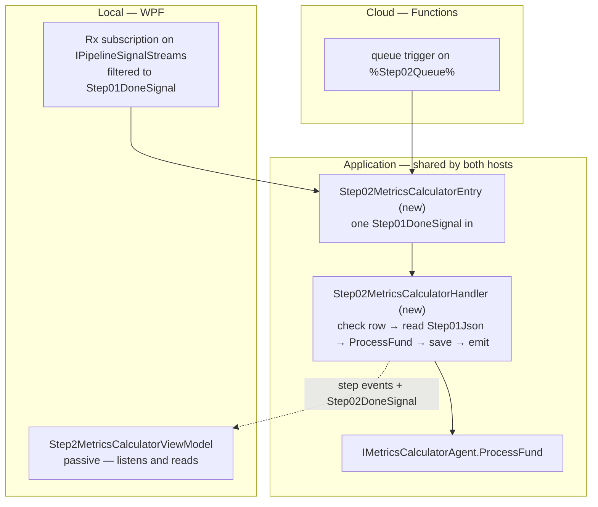
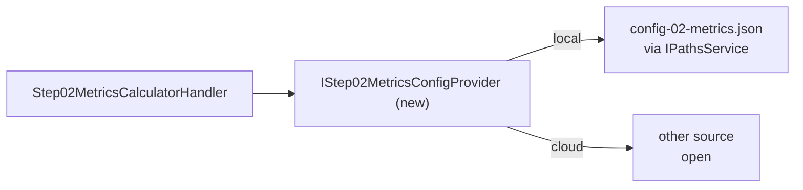
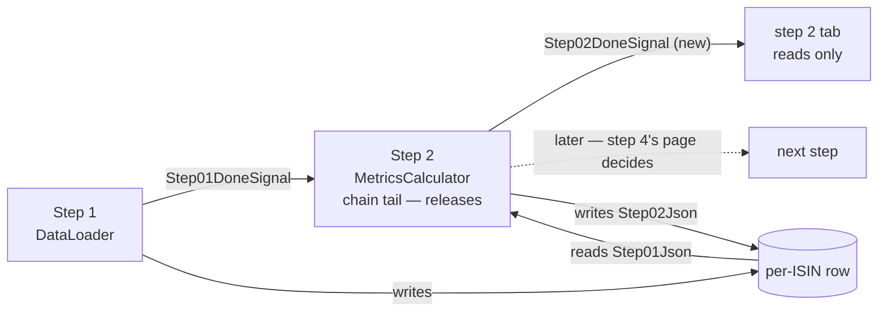

<!--
  Authoring rules: see README.md in this folder.
  STATUS: design only. Nothing here is implemented.
-->

# Step 2 — MetricsCalculator

> **Related:**
>
> - The cross-cutting design this follows from:
>   [event-driven-orchestration-plan.md](./event-driven-orchestration-plan.md)
> - The step this one follows, and the pattern it copies:
>   [01-dataloader.md](./01-dataloader.md)
> - What this step does **today** — I/O schemas, failure modes, test
>   fixtures:
>   [02-metricscalculator.md](../../FikaFinans.InfrastructureV2.Tests/docs/02-metricscalculator.md)

`StepId.MetricsCalculator`, implemented by `MetricsCalculatorAgent`
behind `IMetricsCalculatorAgent`, surfaced in the desktop app as
`Step2MetricsCalculatorViewModel`. This page covers only what the move to
signal-driven, per-fund processing changes.

Step 1 did the hard part: the fetch seam, the progress-store seam, the
done-signal family and the phase-split handler all exist now. Step 2 is
the first step that *consumes* a done-signal rather than a
`NavChangeSignal`, so it is where the "carry only the signal, read from
the row" model gets exercised for real.

## Where step 1 left things

What exists today and is reused as-is:

| Piece | Built for step 1 | What step 2 does with it |
| --- | --- | --- |
| [`Step01DoneSignal`](../../FikaFinans.Application/Pipeline/Signals/Step01DoneSignal.cs) | step 1's output signal | **its input** |
| [`IPipelineSignals`](../../FikaFinans.Application/Pipeline/Signals/IPipelineSignals.cs) | one overload, step 1's | gains a second overload, for step 2's done-signal |
| [`IPipelineSignalStreams`](../../FikaFinans.Application/Pipeline/Signals/IPipelineSignalStreams.cs) | one stream of every `IStepDoneSignal` | step 2 subscribes and filters to `Step01DoneSignal` — nothing on the interface changes |
| [`IIsinProgressStore`](../../FikaFinans.Application/Pipeline/Progress/IIsinProgressStore.cs) | claim, save, run-wide read | read and save reused; step 2 must **not** claim (see below). Gains a per-fund release and a stuck-row query |
| [`IStepEventPublisher`](../../FikaFinans.Application/Pipeline/IStepEventPublisher.cs) | step 1's progress ticks | same, with `StepId.MetricsCalculator` |
| [`IStep01DataLoader`](../../FikaFinans.Application/Pipeline/Steps/IStep01DataLoader.cs) + [`Step01DataLoaderHandler`](../../FikaFinans.Application/Pipeline/Steps/Step01DataLoaderHandler.cs) | phase-split, per-fund handler with run state in fields | **the template** — step 2 gets its own pair in the same shape |
| [`PipelineFrontDoor`](../../FikaFinans.Application/Pipeline/PipelineFrontDoor.cs) | drives step 1's phases per `NavChangeSignal` | **does not reach step 2** — nothing drives step 2 off a done-signal yet |

And what runs step 2 today, which this page replaces:

| Path | How it reaches step 2 | Input from | Output to |
| --- | --- | --- | --- |
| Per-tab "Run this step" button | `Step2MetricsCalculatorViewModel` → `IMetricsCalculatorAgent.Run(isoWeek, runId)` | step 1's JSON **file**, via `IPathsService` | step 2's JSON file |
| Streaming runner | `PipelineRunner` calls `ProcessFund` per fund, in memory | the fund record handed over in memory | `Step02Json`, via `StreamingPipelineGateway`'s block write |

Neither reads `Step01Json`. Locally the column is written and then
ignored — the exact gap the parent plan's "what travels on a hop" section
describes.

## Names

Every new type carries the step number, the way step 1's do. All
*(new)*:

| Role | Step 1 (exists) | Step 2 *(new)* |
| --- | --- | --- |
| Handler interface | `IStep01DataLoader` | `IStep02MetricsCalculator` |
| Handler | `Step01DataLoaderHandler` | `Step02MetricsCalculatorHandler` |
| Entry point — runs the phases per signal | `PipelineFrontDoor` | `IStep02MetricsCalculatorEntry` + `Step02MetricsCalculatorEntry` |
| Done-signal | `Step01DoneSignal` | `Step02DoneSignal` |
| Config provider | — step 1 has no config | `IStep02MetricsConfigProvider` + `JsonBackedStep02MetricsConfigProvider` |
| Cloud function | `Step01DataLoaderFunction` *(sketch)* | `Step02MetricsCalculatorFunction` |

`PipelineFrontDoor` keeps its name — it is the pipeline's entry, not
only step 1's. `JsonBacked…` follows `RepositoryBackedIsinProgressStore`
and `MarkdownBackedPortfolioStructureProvider`.

## Sketch — the same step, two hosts

Illustrative only. Names marked *(new)* do not exist yet; queue names are
owned by [backend-nav-sync-plan.md](../backend-nav-sync-plan.md).

### What is the same in both hosts

Same rule as step 1: the step depends on interfaces, only the
registration differs.

| Interface | Local | Cloud |
| --- | --- | --- |
| `IPipelineSignalStreams` | `LocalRxPipelineSignalBus` | — nothing subscribes |
| `IPipelineSignals` | `LocalRxPipelineSignalBus` | queue publisher *(new)* |
| `IIsinProgressStore` | `RepositoryBackedIsinProgressStore` over SQLite | the same class over Tables |
| `IStepEventPublisher` | `LocalRxStepEventBus` | still open — the parent plan's run-lifecycle question |
| `IStep02MetricsConfigProvider` *(new)* | `JsonBackedStep02MetricsConfigProvider` *(new)* — `config-02-metrics.json` via `IPathsService` | another source — which one is still open |

No fetch seam. Step 2 never talks to YieldRaccoon — everything it needs
is already on the row. That makes it the cheapest step in the chain to
move, and a good place to prove the row-read pattern before steps that
also have LLM calls to worry about.

### Handler shape

Same rule as step 1 — one signal in, constructor for stable
dependencies, no transport types. Same phase split, so the caller can
order "write, then emit" itself:

| Step 1 phase | Step 2 equivalent | Difference |
| --- | --- | --- |
| `BeginProcessingAsync` — **claims** the row | read `Step01Json` for the signal's run id; null → stop | must not claim — see "Do not claim" below |
| `LoadFundAsync` — fetch identity, holdings, pins | take this fund's record out of what Begin read | no I/O |
| `AssembleAgentInputAsync` — compute buckets, snapshot | load the step 2 config through the config provider | config only; the record is already assembled |
| `RunAgentAsync` — `IDataLoaderAgent.RunInMemory` | `IMetricsCalculatorAgent.ProcessFund` | already on the interface, already pure |
| `PersistAsync` — `Step01Json` | `Step02Json` | same store call, different `StepId` |
| `EmitDoneAsync` — `Step01DoneSignal` | step 2's done-signal | new signal type, new overload |
| `ReadOutputAsync` | same, `StepId.MetricsCalculator` | none |

**Decided: six phases, same as step 1.** The middle three are only a
lookup, a config read and a pure call, so they could be merged — but
keeping the shape means the entry point is a near-copy of
`PipelineFrontDoor`, the step files diff cleanly against each other,
and steps 4–8, which add LLM calls, inherit a split they will need.

### Where the code lives

**Step 2 is triggered by `Step01DoneSignal` — in both hosts, always.**
Everything that runs on that signal lives in Application and is shared;
only the few lines that connect a transport to it differ per host.



| Piece | Lives in | Shared with cloud |
| --- | --- | --- |
| The calculation — `ProcessFund` | Infrastructure, behind `IMetricsCalculatorAgent` | yes |
| `Step02MetricsCalculatorHandler` — the phases | Application, beside step 1's | yes |
| `Step02MetricsCalculatorEntry` — runs the phases in order, the front door's twin | Application, beside `PipelineFrontDoor` | yes |
| Signal → entry point | `MainWindowViewModel` locally, a Function class in cloud | no — transport wiring |
| The tab | WPF | no — display only |

The entry point is a twin of `PipelineFrontDoor`, not an extension of
it: one signal type in, one step's phases out, a fresh handler per
signal from a factory. That keeps step 1's front door untouched.

### Local

The subscription sits next to step 1's, in `MainWindowViewModel`, and
copies it — off the Rx callback, every exception caught so the stream
survives:

```text
// sketch
pipelineSignals.Signals                          // IPipelineSignalStreams
    .OfType<Step01DoneSignal>()
    .Subscribe(done => RunStep02Async(step02Entry, done));  // (new)
```

Wiring only. `MainWindowViewModel` holds it because that is where step
1's wiring already is; the parent plan's "extract the coordinator" slice
moves both later, together. No coalescing buffer here — unlike
`NavChangeSignal`, a done-signal is emitted once per run per fund.

**No step ViewModel runs step 2.** `Step1DataLoaderViewModel` already
subscribes to this stream, but only to know which run id to read for
display. That is a read, so the parent plan's "single-consumer by
convention" rule — which binds the *work* subscriber — is not broken by
it.

### Cloud

The step-2 queue already appears in step 1's sketch as the output
binding. Step 2 is its trigger:

```text
// sketch
// in Step02MetricsCalculatorFunction (new)
[Function("Step02MetricsCalculator")]
public Task Run(
    [QueueTrigger("%Step02Queue%")] Step01DoneSignal signal,
    CancellationToken ct)
    => _step02Entry.HandleAsync(signal, ct);   // IStep02MetricsCalculatorEntry (new)
```

The same entry point the local subscription calls — so the cloud adds a
trigger, not a second copy of the step.

The return-value-as-send question from step 1 applies unchanged.
Whichever wins there, step 2 takes.

## Input trigger

`Step01DoneSignal` — fund identifier, trading date, run id. No payload.

| | Producer | Transport | How the step is reached |
| --- | --- | --- | --- |
| Local | `Step01DataLoaderHandler.EmitDoneAsync` → `IPipelineSignals` | `LocalRxPipelineSignalBus` | subscribe to `IPipelineSignalStreams.Signals`, filter to step 1 |
| Cloud | the same handler, queue-backed publisher | `%Step02Queue%` | **nothing subscribes** — the Functions host invokes the step per message |

Delivery is at-least-once, as for step 1. Two cases matter:

| Arrives | Row says | Action |
| --- | --- | --- |
| Duplicate of a signal already handled | same run id, `Step02Json` populated | run again — the column is latest-only, overwrite is safe |
| Late — a newer run has claimed the fund since | a **different** run id | drop it. Its `Step01Json` was cleared by the newer claim; there is nothing to read and nothing to write |

The second row is new with step 2. Step 1 never has it, because step 1
mints the run id. Every later step inherits it.

### Do not claim

`IIsinProgressStore.ClaimAsync` is step 1's lock, and it **clears every
step column** — that is how a new run starts clean. Calling it from
step 2 would wipe the `Step01Json` step 2 is about to read.

So step 2's first phase is a check, not a claim: does this fund's row
still carry the signal's run id, with `Step01Json` written? The lock
taken by step 1 covers the whole chain for that fund.

The check falls out of the read. `ReadStepOutputAsync` only returns rows
naming the run id it is given, so a null answer covers every "not mine"
case at once — no row, a newer run's claim, or a cleared column. Null →
log and return false, the way step 1's refused claim does. The read
therefore happens in the first phase, so the gate stays first.

### Manual trigger — WPF only

The tab keeps its "Run this step" debug button, and the GUI does not
change. It stays a desktop affordance with no cloud counterpart.

It behaves as step 1's does today: the button calls
`IMetricsCalculatorAgent.Run`, which reads step 1's output from disk.
Not the signal path, and not meant to be — it is for debugging the
calculation in isolation. Both buttons move together when the parent
plan's "unify the run paths" slice routes them through the runner.

## Input data — what the step reads

| Input data | Current | WPF | Cloud |
| --- | --- | --- | --- |
| **Step 1's fund record** — identity, buckets, snapshot, holding, layer | `01-dataloader-{iso_week}-{run_id}.json` (button) or the in-memory record (runner) | `Step01Json` on this fund's row, matched by run id | same, Tables |
| **Config** — stale-snapshot window, fee horizon | `config-02-metrics.json` via `IPathsService`, falling back to defaults when absent — read separately by the agent's `Run` and by `StreamingPipelineGateway.LoadMetricsConfig` | through the config provider *(new)*, JSON-backed — same file | through the same provider, other source |

### Config through a seam

**Decided: the step reads its config through
`IStep02MetricsConfigProvider` *(new)*, never a file.** The same move as step 1's fetch seams — the
handler knows it needs a `MetricsCalculatorConfig`, not that it lives
in a JSON file under the inputs folder.



| | Local | Cloud |
| --- | --- | --- |
| Implementation | `JsonBackedStep02MetricsConfigProvider` — the file the tab's config editor already edits | not chosen — app settings, a table row and blob storage are all plausible |
| Source of truth | unchanged | the open question already on step 1's page |

The provider is the step's only way to its config. The tab's config
editor keeps writing the same file, so locally nothing visible changes.
The agent's own `Run` still reads the file directly — that is the debug
button's path, which this page leaves alone.

The provider also owns the missing-config policy. Today's silent
fallback to defaults is harmless on a desktop; in a host with no file it
is a silent misconfiguration. Whether the cloud implementation falls
back or fails is its call — but it is one place to decide it, not two.

Steps 4, 9 and 10 have config files of their own and inherit this
pattern.

### The existing read is enough — a run is one fund

`IIsinProgressStore.ReadStepOutputAsync(step, runId)` gathers every row
naming a run id. Step 1 mints a fresh run id per fund
(`IPipelineRunIdFactory.NewRunId(isin, navDate)`), so under per-fund
processing that is always exactly one row — the answer's fund list has
one entry, and it is this fund's.

**Decided: reuse it, no change to the read.** The cost is a partition scan
where a point read by ISIN would do. At the local universe size that is
nothing; a point read can be added later if it ever shows up in cloud
cost or latency.

### What the row does not carry

`Step01Json` holds one `FundRecord`. The `DataLoaderOutput` envelope
around it — frozen positions, cash available, run-level data-quality
warnings, ISO week, company — never reaches the row;
`SaveStepOutputAsync` picks the fund's record out and drops the rest.

Step 2's calculation does not care: `ProcessFund` takes a `FundRecord`
and nothing else. But the consumers further down do — step 10's cash
floor needs cash available, and frozen positions must never be proposed
for sale.

**Decided: carry the envelope on the row**, so every step reads it the
same way it reads the fund record, and step 2 passes it through
untouched — the append-only rule, applied to the envelope too.

The cost, accepted:

| Cost | Why it is acceptable |
| --- | --- |
| Portfolio-wide data duplicated on every fund's row | the universe is small; a few fields per row |
| Two rows can disagree — each holds cash and positions as of its own run | each row records what *that* run saw, which is the right audit trail; a consumer wanting the current picture takes the most recent row |

#### Open — how the envelope is stored

Two shapes, neither chosen:

| | Whole one-fund output in each step column | Separate envelope column |
| --- | --- | --- |
| What `Step{N}Json` holds | the step's full `DataLoaderOutput` — envelope plus its single fund record | the fund record only, as today |
| Where the envelope lives | inside every step column — each step's copy | one new column on `IsinProgressEntity`, written by step 1, cleared at the claim |
| Store change | save stops picking the record out; the read hands back the envelope too | new column in the SQLite row and the Tables entity, plus a migration and a read path |
| Can a later step add to the envelope | yes — it rewrites its own copy | only by writing the shared column |
| Rests on | a run being one fund — which holds today | nothing extra |

The first is smaller and stores what the step actually produced,
verbatim. The second keeps the step columns as they are and stores the
envelope once. Decide before step 2 is built, since step 2 is the first
step to read the envelope back.

### The config has fields that move to step 1

`MetricsCalculatorConfig` mixes two kinds of setting:

| Field | Used by | After the redesign |
| --- | --- | --- |
| `StaleSnapshotWarnDays`, `FeeDeductionHorizonWeeks` | `ComputeMetrics` | still step 2 |
| `MinBucketDays`, `DropPartialBuckets` | nothing in step 2's code — the bucketing is the producer's today | describe what `SliceIntoWindows` does, which step 1's page moves **into step 1** |
| `PrimarySharpeHorizonWeeks`, `TreatNanSharpeAsZeroForRules`, `WarnOnBucketsTotalLt`, `DataQualityFlagsEnabled` | not read by `ComputeMetrics` | unchanged — not this page's concern |

Once step 1 computes buckets itself, the bucketing rules are step 1's
input, sitting in step 2's file. Whatever step 1 ends up reading them
from, it reads through a config provider like step 2's, never the file.
Which provider, and whether the two fields move, is step 1's bucketing
port to decide — step 2 does not read them either way.

## Pre-processing — assemble the agent input

Nothing to assemble. Step 1 already produced the record `ProcessFund`
takes, and the only other input is the config.

Compare step 1, whose pre-processing was a whole calculator port. That
asymmetry is the point of the chain: every fetch and every join happens
once, at the front, and later steps only read.

## Agent work

Code, not an LLM. Contract:
[02-metricscalculator.md](../../FikaFinans.InfrastructureV2.Tests/docs/02-metricscalculator.md).

The call is
[`IMetricsCalculatorAgent.ProcessFund(fund, config)`](../../FikaFinans.Application/Pipeline/Agents/IMetricsCalculatorAgent.cs),
implemented by
[`MetricsCalculatorAgent`](../../FikaFinans.Infrastructure/Pipeline/Agents/MetricsCalculatorAgent.cs).

Unlike step 1, **nothing stands in the way**:

| Step 1 had | Step 2 has |
| --- | --- |
| the in-memory call missing from the interface | `ProcessFund` already on it |
| `TextReader` inputs | a typed `FundRecord` |
| a universe to join across | one fund, no cross-fund reads |

`ProcessFund` is pure — no I/O, no clock, returns an enriched copy with
`Metrics` set and every earlier field preserved. The append-only rule
holds without any change. `Run` and `RunInMemory` stay for the
universe-wide button and tests; the per-fund step does not call them.

### One flag that may lose its meaning

`snapshot_stale_vs_summary` compares the snapshot's as-of date with the
latest bucket's end date. Today those come from two separate producer
files, which can be exported at different times — so they can drift.

After step 1's redesign both are computed from the same mirrored series
in the same run. The drift the flag detects stops being possible, unless
the two calculators are ever fed different slices of the series. Keep
the flag — the contract is unchanged and it costs nothing — but it is
worth knowing it will read `false` by construction.

## Post-processing — write and emit

One write, then one signal. Same order as step 1, same reason.

| Written | The call | Where it lands | Local | Cloud |
| --- | --- | --- | --- | --- |
| This fund's enriched record | `IIsinProgressStore.SaveStepOutputAsync` with `StepId.MetricsCalculator` | `Step02Json` on this fund's row; `CurrentStep` advances to 2 | SQLite | Azure Tables |

No NAV rows, no mirror — step 2 writes only its column.

`SaveStepOutputAsync` takes a `DataLoaderOutput` and picks this fund's
record out. **Decided: reuse it** — step 2 wraps its one enriched record
in a one-fund envelope, which is what step 1's output already is under
per-fund processing. If the envelope ends up stored whole in each step
column (see "How the envelope is stored"), the save stops picking the
record out; the call stays.

### Release — the chain tail frees the row

Step 1's claim sets the row to processing, and on the signal path
nothing sets it back. `ReleaseIsinProgressAsync` exists, but only the
universe-wide `PipelineRunner` calls it. Two consequences, live today:

| Case | What happens |
| --- | --- |
| Step 1 succeeds | row stays in flight forever — the next NAV signal for that fund is refused at the claim, and the dedup anchor never advances |
| Step 1 fails | same — its comment says the janitor will reset it, but no janitor exists |

**Decided: whichever step is currently last on the signal path releases
the row**, once its emit is done:

| Outcome | Row after release |
| --- | --- |
| Success | free; `LatestProcessedNavDate` advanced to the run's trading date |
| Failure, any phase | free; anchor **not** advanced, `LastError` set — the next signal retries the fund |

The tail moves as the chain grows: step 1 today, step 2 once it lands
— and step 2 stays the tail until a later step consumes its
done-signal. So step 2 takes the release over from step 1 in the same
change that wires it — one step releases, never two.

**Fix step 1 first**, as its own small change: it is broken today
whether or not step 2 exists.

**TODO:** a release on `IIsinProgressStore`. The gateway's `ReleaseIsinProgressAsync` is universe-shaped
(the whole step 1 output plus a failed set) and lives on the old path;
the per-fund chain needs the same two outcomes for one ISIN.

### Stuck rows — restart when the tab opens (WPF only)

A crash or app shutdown mid-run still leaves a row in flight, because no
code gets to run the release. The "janitor" step 1's comments promise —
a background job that resets rows stuck too long — does not exist.

**Decided, local only: each step tab restarts its own stuck funds when
it opens** — the rows whose `CurrentStep` is that tab's step. Step 2's
tab restarts funds that died in step 2, step 1's those that died in
step 1. For each such row still in flight:

| Check | Then |
| --- | --- |
| claimed **before this app session started** | its run is dead — nothing from an earlier process can still be running. Reset the row and publish a fresh `NavChangeSignal` for its ISIN and trading date through `INavSignalPublisher` |
| claimed during this session | leave it — it may genuinely be running right now |

The restart goes back through the front door like any other signal, so
it always starts at step 1, whichever step the run died in. The dedup
anchor is untouched by the reset.

**A deliberate exception** to the rule on step 1's page that opening a
view is only a read. It is limited to rows the session-start check
proves dead, so a view still never starts work that is already
underway.

The reset must land before the signal: step 1's claim refuses a row
still in flight, so a re-published signal against a row not yet reset
would just be dropped. Finding the rows needs a store query step 2 does not
otherwise use — every in-flight row at a given step.

Cloud is not covered — decided when the cloud host is built.

### Emit

**TODO:** add `Step02DoneSignal` *(new)* — fund identifier, trading date,
run id, no payload. Same shape as step 1's, implementing
`IStepDoneSignal`. Named by the producing step's number, as decided on
step 1's page.

**TODO:** add its overload to `IPipelineSignals`, and implement it on
`LocalRxPipelineSignalBus`. The build breaks until both are done, which
is what the overloads-not-generic choice was for.

Nothing changes on `IPipelineSignalStreams` — it already carries every
`IStepDoneSignal`.

### Who consumes it

**Decided: nobody, yet.** Step 2 emits its done-signal and nothing
consumes it for work. Step 2 is the chain tail, so it is also the step
that releases the row (see "Release" above).

Why not wire step 4 now: step 3 (MacroAnalyst) is a universe-wide
barrier, and step 4 is the next per-fund consumer of step 2's output —
but whether step 4 hangs off step 2 directly depends on how the barrier
question resolves. Step 4's page decides what it listens to; step 2
only publishes.

The signal is still worth emitting with no work consumer: step 2's tab
listens to it to know which run id to read, the same way step 1's tab
does.



## What a frontend reads when the user opens the view

Same as step 1: opening the tab is a read of `Step02Json`, never a
trigger — with the one exception of restarting funds proven dead (see
"Stuck rows").

`Step2MetricsCalculatorViewModel.LoadOutputAsync` today goes through
`IsinProgressOutputLoader` with a column selector, then falls back to
step 2's JSON file on disk. Step 1's ViewModel has already moved off
both onto its handler's `ReadOutputAsync`, and it follows the step
rather than running it — subscribing to step events for its `StepId` and
to its own done-signal to know which run id to read.

**TODO:** the same move for step 2 — the tab becomes **passive**, a copy
of step 1's:

| The tab | Does |
| --- | --- |
| Listens to step events | filtered to `StepId.MetricsCalculator`, projected onto status, duration, error |
| Listens to `Step02DoneSignal` *(new)* | to learn the run id, then reads that run's output |
| Reads | through the step 2 handler's `ReadOutputAsync`, never the repository directly |
| Runs | **nothing** on a signal — only the debug button, as above |

`IsinProgressOutputLoader` and the disk fallback leave the tab. No XAML
changes. The three view states from step 1's page — populated, in
flight, not processed — apply unchanged.

## TODO summary

| # | Work | Touches |
| --- | --- | --- |
| 1 | `IStep02MetricsCalculator` + `Step02MetricsCalculatorHandler`, in step 1's shape | Application, `Pipeline/Steps` |
| 2 | First phase reads `Step01Json` by run id instead of claiming; null → stop | the handler — no store changes |
| 3 | — | *(was: per-fund read — dropped, the run-wide read already returns one fund)* |
| 4 | Save wraps the record in a one-fund envelope | the handler |
| 5 | `Step02DoneSignal` *(new)* and its overload | `Pipeline/Signals`, `LocalRxPipelineSignalBus` |
| 6 | `IStep02MetricsCalculatorEntry` + `Step02MetricsCalculatorEntry`, the front door's twin | Application, `Pipeline` |
| 7 | Subscription: `Step01DoneSignal` → entry point, beside step 1's | `MainWindowViewModel` |
| 8 | Step 2's tab goes passive — listens, reads, keeps its debug button | `Step2MetricsCalculatorViewModel`, no XAML |
| 9 | Registration — handler per-dependency, entry point single-instance, like step 1's | `InfrastructureModule` |
| 10 | Per-fund release — success advances the anchor, failure does not | `IIsinProgressStore`, `RepositoryBackedIsinProgressStore` |
| 11 | **Before everything else:** step 1 releases at the tail, so a fund is not locked after one signal | `Step01DataLoaderHandler`, `PipelineFrontDoor` |
| 12 | Hand the release from step 1 to step 2 when step 2 is wired | both handlers |
| 13 | Carry the envelope on the row — shape still open, see "How the envelope is stored" | `IIsinProgressStore` and its storage, both handlers |
| 14 | `IStep02MetricsConfigProvider` in Application, `JsonBackedStep02MetricsConfigProvider` in Infrastructure | Application, Infrastructure, `InfrastructureModule` |
| 15 | Each step tab restarts its own stuck funds on open — `CurrentStep` is its step, claimed before this session; reset first, then re-published as `NavChangeSignal`. Needs an in-flight-rows-by-step query | step 1 and step 2 tabs, `IIsinProgressStore`, `INavSignalPublisher` |

None of it touches `MetricsCalculatorAgent`. The agent is done.

## Open questions

Raised by this page; they belong in the parent plan's Open Questions,
not settled here.

- **Where the local wiring ends up.** Step 2's subscription sits beside
  step 1's in `MainWindowViewModel` for now. Both move out together in
  the "extract the coordinator" slice; step 2 adds nothing that slice
  did not already have to move.
- **Crash recovery in cloud.** Local restarts on tab open; cloud has no
  tab and needs a timeout-based reset. Decided when the cloud host is
  built.
- **How the envelope is stored on the row** — whole one-fund output in
  each step column, or a separate envelope column. Options laid out
  under "What the row does not carry".
- **Which row step 10 trusts for the envelope.** Every row carries its
  own run's cash and positions. Step 10 runs on a timer across the
  universe, so it must pick one — most recent run is the obvious answer,
  but it is step 10's page to decide.
- **Where the bucketing config lives** once step 1 owns the bucketing —
  through a config provider either way; which one is step 1's call.
- **Who consumes step 2's done-signal.** Nobody for now; step 2 is the
  tail. Step 4 is the natural consumer if step 3 resolves as a barrier
  off the per-fund chain — step 4's page owns the decision.
- **The cloud config source.** The seam is decided (config provider);
  what sits behind it in cloud is not — app settings, a table row, or
  blob. Also whether the cloud implementation falls back to defaults or
  fails when nothing is there.
