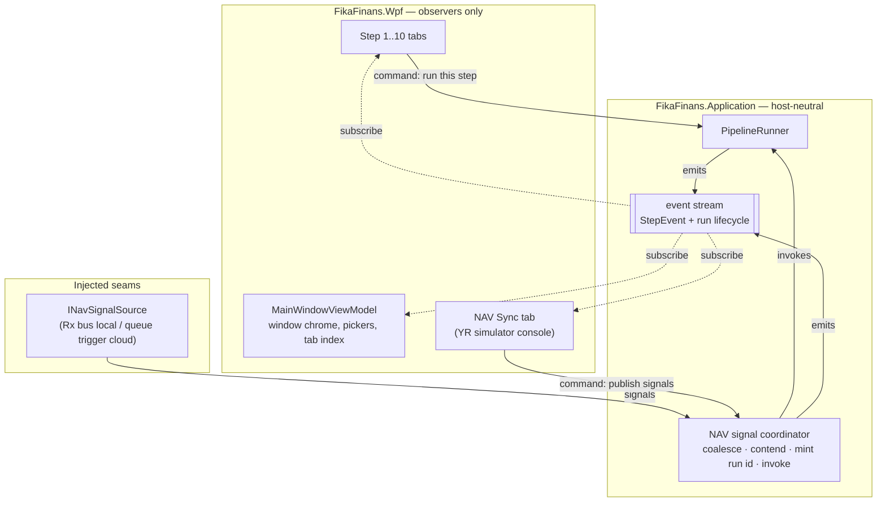
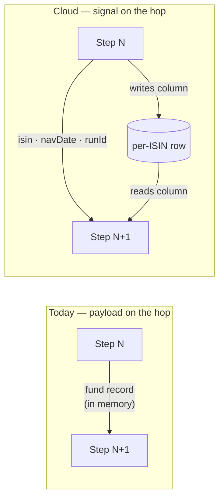
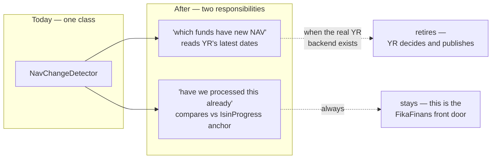
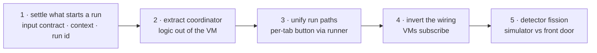

<!--
  STATUS: PLANNING ONLY (2026-08-25). Nothing in this plan has been
  implemented. It describes moving orchestration logic out of
  `MainWindowViewModel` and into the Application layer so the same logic
  can be hosted by an Azure Function.

  Context that motivated this plan: the local NAV-change front door
  shipped in code (`INavChangeDetector`, `NavChangeDetector`,
  `ILatestNavProvider`, `INavSignalPublisher`, `INavSignalSource`,
  `LocalRxNavSignalBus`, `YieldRaccoonSqliteNavProvider`, the NAV Sync
  tab) but is not described in any existing plan document. The signal
  loop is closed end-to-end locally — and it closes *through a WPF
  ViewModel*, which is the problem this plan exists to fix.

  Authoring rules for AI assistants and humans editing this file:
  - DO NOT write code (no C#, no XAML, no JSON config snippets, no shell).
  - DO use Mermaid diagrams to express architecture, flows, and state.
  - Prose stays at the "what / why / where it lives" level — no API
    signatures, no method bodies. Class names already in the codebase may
    be referenced; do not invent new ones as if they existed.
  - DO NOT modify other documents from this plan. Cross-references are
    one-way: link out from this file to other docs, but never edit those
    other docs to point back here.
  - DO NOT invent architecture. If a piece of the flow is not yet decided,
    write it as an open question, not as a confident design.
-->

# Event-Driven Orchestration — Feature Plan

> **Related:**
>
> - The queue-driven backend this plan is preparing for is planned in
>   [backend-nav-sync-plan.md](../backend-nav-sync-plan.md). That document
>   owns the cloud-side design (queues, progress table, poison handling);
>   this document owns getting the *local* logic into a shape that can be
>   dropped into it.
> - The Rx streaming runner that already exists — and that this plan
>   leaves untouched — is planned in
>   [pipeline-step-flow-plan.md](../pipeline-step-flow-plan.md).
> - The per-ISIN row that holds run state and step outputs is planned in
>   [storage-migration-plan.md](../storage-migration-plan.md).

## The Problem

`MainWindowViewModel` is currently the pipeline's orchestrator. Not by
design — by accretion. When the NAV-change front door landed, its
"queue trigger" half landed in the ViewModel too, and the class now
carries a comment describing itself as *the local equivalent of the
Azure queue trigger*.

A WPF ViewModel cannot be hosted in an Azure Function. So every piece
of decision-making that lives there has to be rewritten for the cloud,
which breaks the central design bet of
[pipeline-step-flow-plan.md](../pipeline-step-flow-plan.md) — that only
the source and sink change between local and cloud, never the logic.

### What is trapped today

| Lives in the ViewModel | What it actually is | Cloud needs it? |
| --- | --- | --- |
| Buffering the signal stream into batches | transport policy | host does the batching; the window is still a decision |
| Collapsing a batch to newest-date-per-ISIN | **dedup logic** | yes |
| Dropping the batch when a run is in flight | **contention policy** | yes — as extend-visibility |
| Minting the run id from the wall clock | **run identity** | yes |
| Cancel-previous-then-reissue token handling | **run lifecycle** | yes |
| Classifying the outcome (cancelled / failed at step N / ok) | **run result** | yes |
| Status pips, tab following, per-fund counters, context push | UI rendering | no |

Everything above the line is hostable logic wearing a ViewModel
costume. Everything below it is legitimately WPF's job.

### Two parallel status paths

A second, quieter problem. There are two ways a step can run today and
they report progress differently:

- **Run All** goes through the streaming runner, which emits
  `StepEvent` ticks that the ViewModel layer renders.
- **Run this step** (the per-tab button) calls the step's agent
  *directly* from the step ViewModel and emits no events at all — the
  ViewModel times the call itself and sets its own status.

Two paths to the same visual state is a bug farm, and only one of them
survives the move to Functions.

**The per-step buttons stay.** They are debug affordances and they earn
their keep — triggering one step manually is how the pipeline gets
debugged. What changes is only how they reach the work: through the
runner, which already exposes a single-step entry point that no
ViewModel currently uses, rather than reaching around it to the agent.
Same button, same manual control, one status path instead of two.

The principle generalises, and the codebase already has an example of
it: the NAV Sync tab's debug publish command deliberately skips dedup,
but still publishes through the real signal bus rather than around it.

> Debug affordances bypass **policy**, not **transport**.

A debug button is also allowed *debug* semantics. "Run this step" for
the fan-out step has no clean per-ISIN meaning once fetching is
signal-driven — but as an explicitly manual affordance it does not need
one, and should not be contorted into pretending it maps to something
the cloud does.

## The Rule — Commands Down, Events Up

The shape that resolves both problems is a strict one-way flow.

- **Down:** a ViewModel may *ask* for work by invoking a command on an
  Application-layer service. That is the only direction WPF may push.
- **Up:** progress travels exclusively as events on an observable
  stream. Nothing ever calls a method on a ViewModel to update it.

The second half is the load-bearing one. If the coordinator pushed
into a ViewModel, it would need a reference to a WPF type — and the
Azure host has no such type to give it. Subscription is what keeps the
Application layer ignorant of its host.

No arrow points from the Application layer into the UI box. That
absence is the whole design.

## What Azure Actually Provides

The local signal bus is a *bus*: one hot stream, many subscribers, and
every subscriber sees every signal. That is a tested guarantee — the
bus tests subscribe twice and assert both receive.

Queue Storage, chosen in
[backend-nav-sync-plan.md](../backend-nav-sync-plan.md), is **not** a
bus. It is a point-to-point queue with competing consumers: a message
is dequeued by exactly one consumer and is then gone. There is no
fan-out, no topics, no second subscriber.

So the local abstraction is *strictly richer* than the thing it stands
in for. Anything built on multi-subscriber fan-out of signals has no
cloud counterpart and gets rewritten at cutover — precisely the
failure this plan exists to prevent.

The rule that keeps this honest:

> ViewModels subscribe to the **event stream** (progress, travelling
> up). Never to the **signal stream** (work, travelling down).

One consumer takes the work; everyone else watches the progress. The
work half maps onto Queue Storage cleanly, and the progress half maps
onto the progress table plus Application Insights, which
[backend-nav-sync-plan.md](../backend-nav-sync-plan.md) already names as
the cloud progress surface.

### The event stream is a desktop affordance

Only one of the two front ends needs it. The web frontend has no use for
push: a person opens a page, switches a tab, or refreshes, and it reads
whatever the current state is. The desktop app is the one that wants a
grid updating under the user's cursor without a refresh button, and Rx
events are how that happens.

So the event stream has **no cloud counterpart at all**. Nothing
subscribes to it in a Function host. The durable truth is the per-ISIN
row — `IsinProgressEntity`, read and written through
`IIsinProgressRepository`, carrying current step, state, last error and
attempt count — plus telemetry. The event stream is a latency shortcut
to what that row already says.

That yields an invariant worth stating, because breaking it fails
silently:

> Events are **observational**. No behaviour may depend on a subscriber
> existing, because in cloud none does.

Anything worth knowing has to be durable — in the row or in the log —
and not only in an event. The current design already honours this: a
per-fund failure is stamped into the row's error field rather than only
announced, and per-fund timing goes to the log. Keep new diagnostics to
the same standard.

The useful consequence: the shape of the run-lifecycle events is a
desktop design decision, not a cross-host contract. It can change later
without touching anything the cloud depends on.

## Local Batch vs Cloud Single Message

An asymmetry worth internalising before the coordinator's contract is
designed around the wrong shape.

- **Locally:** one run, many ISINs. The bus is buffered into a batch,
  the scope map carries many entries, and the merge operator fans out
  *inside* a single run.
- **In cloud:** one message, one ISIN, one invocation. Fan-out is the
  Function host's concurrency setting across independent invocations,
  and nothing holds state between them.

Consequence: the universe-wide streaming entry point has no cloud
counterpart at all. What ports is the per-fund chain *inside* it,
decomposed into separately-triggered pieces. The batch is a local
artifact of the Rx bus, not a domain concept.

The coordinator may still accept a batch — locally it has to — but a
batch must never be load-bearing for anything downstream of it.

## Modelling the Cloud in Rx

Rx is how the desktop app models the queue chain: each step boundary
becomes an observable hop, and cutover replaces each hop's transport
without touching what sits either side of it. That is the design bet,
and it only pays off if the local model stays *within* what the cloud
can actually do.

Rx is strictly more capable than Queue Storage in three ways. Each one
is a trap.

| Rx can | Queue Storage can | Discipline required |
| --- | --- | --- |
| Fan out to many subscribers | Deliver to exactly one consumer | Treat every work hop as single-consumer, by convention |
| Buffer the stream into a universe-wide barrier | No fan-in primitive in a per-step queue chain | Do not lean on barriers the cloud has no answer for yet |
| Pass rich objects in memory between stages | Carry a small signal; step output lives in the per-ISIN row | See the open decision below |

The second row is the sharp one. Two of the ten steps are universe-wide
barriers, Rx expresses them trivially, and the queue chain has no
settled way to do so at all — see the barrier question under Open
Questions. The local model will therefore run *ahead* of the cloud
design at exactly those two points, and it should stay visibly flagged
rather than quietly working.

### The open decision — what travels on a hop

In cloud, an inter-step message carries only the fund identifier, the
trading date, and the run id. The step reads its actual input from the
per-ISIN row by primary key. Step output never rides the queue.

Locally today, the per-ISIN chain passes the fund record itself from
stage to stage in memory. The boundary columns are still written, but
nothing reads them back — the in-memory object is used instead.

So the choice:

- **Keep the payload on the hop.** Faster locally, and it is what
  already works. But the chain then diverges from cloud at every
  boundary, and cutover rewrites all of it — which is the failure this
  plan exists to prevent.
- **Carry only the signal, read from the row.** The local chain becomes
  the cloud chain minus the queue. Costs one row read per step per
  fund; at the local universe size that is unremarkable, and it forces
  the row-column contract to be correct *before* anything depends on it
  in production.

The second is the one consistent with the rest of this plan. It is
recorded as open rather than decided because the cost is real and lands
on a path that currently works.

## The Detector Fission

`NavChangeDetector` is doing two jobs that belong to two different
systems, and the boundary between them is invisible today.

Per [backend-nav-sync-plan.md](../backend-nav-sync-plan.md), YieldRacoon
publishes and forgets; it deliberately does not know what FikaFinans
has already processed. Dedup is the *first* thing the consumer does on
every message, precisely because duplicates are the common case rather
than the exception.

So half this class is a simulator that dies at cloud cutover, and half
is production logic that must survive it. Fusing them means the
cutover cannot be done cleanly. Splitting them is cheap now and
expensive later.

**Not yet decided:** whether the split is two classes, one class with
two clearly-separated seams, or the simulator half moving into the WPF
project outright (it exists only to drive the demo). See Open
Questions.

## Typed Identifiers Across the Seam

**Decided 2026-08-25:** the extracted contracts use the domain
identifier types — the fund identifier and the pipeline run id — rather
than raw strings.

Both types already exist as validating value objects in the Domain
layer, and the signal record already uses the fund identifier properly.
But the typed boundary holds only at the edges and dissolves in the
interior: the signal-driven scope map is keyed by string, the
progress-row lookup is keyed by string, and the batch coalescing
unwraps to string to group. That interior is precisely the code that
becomes the Function, so it is the last place that should be stringly
typed.

Typing it also removes a latent hazard for free. The fund identifier
normalises its casing on construction; a lookup keyed by the type
therefore cannot miss on a casing difference. Today the progress-row
lookup builds a case-sensitive dictionary from stored strings and
probes it with a normalised value. If stored casing ever diverges from
normalised casing, the anchor is never found, the fund reads as "never
processed", and it is re-signalled on **every** detection pass — a
silent infinite-duplicate path. Keying by the type closes it without a
comparer choice to remember.

### Signals share a marker interface

**Decided 2026-08-25.** Every signal in the flow — the front-door
arrival and each step-to-step hop — implements one common interface,
deliberately **empty**.

It states membership of the flow, gives generic logging and correlation
somewhere to bind, and gives wire-format concerns a place to hang when
queue serialisation arrives.

Empty rather than carrying the fund identifier, even though both known
signals have one. Two of the ten steps are universe-wide barriers whose
translation to the queue chain is unresolved; if those ever get signals,
they are universe-scoped and have no fund identifier at all. Mandating
one now would either exclude them or force a hierarchy split later.
Adding a member to an empty marker is cheap; removing a mandatory one is
not. If it does grow, the fund identifier is the candidate, and the
barrier resolution decides whether it belongs on the root or on a
per-fund interface beneath it.

Two loose ends, both open:

- The fund identifier type defines an implicit conversion from string.
  That is convenient, and it means the compiler will not catch a raw
  string leaking across the seam we are trying to harden. Whether to
  keep it is a separate call from this decision.
- The run id type validates only through its factory, not through its
  constructor, and the constructor is what current callers use. An
  empty run id is representable today.

## The Fetch Seam

The start signal is deliberately **thin** — it names a fund and a
trading date and carries no fund data.
[backend-nav-sync-plan.md](../backend-nav-sync-plan.md) states this
outright: the message is a signal, not a payload, and fund data travels
out of band.

That choice is sound — YieldRacoon publishes its own natural shape and
does not tailor anything for FikaFinans, the message stays far inside
the size cap, and fetching at processing time yields current data
rather than a snapshot that aged in a queue. But it has a structural
consequence worth stating plainly:

> A thin signal has no standalone value. It is a pointer, not a record.
> The consumer must be able to call back, or the signal is worthless.

So the consumer depends on the producer at runtime. Not on its
internals — the dependency is a published contract, with FikaFinans
owning the adapter that normalises the producer's shape — but the
dependency is real. The queue decouples *timing* and *implementation*;
it does not make the consumer independent of the producer being up.
Retry, poison thresholds and the cache-first mirror are how that is
managed, not eliminated.

### One interface, two implementations

The seam is the same shape as the detection seam already in the
codebase, and swaps the same way:

| | Local | Cloud |
| --- | --- | --- |
| Detection — latest NAV dates | read-only query over the producer's database | producer endpoint |
| **Fetch — one fund's data** | **read-only query over the producer's database** | **producer REST contract** |

Locally the database path is configured in settings and the producer's
file is opened read-only, so the desktop app reads exactly the data the
producer's own API would serve. That is a better fidelity story than
the current file-based inputs, because both environments then read the
same source of truth and differ only in the transport in front of it.

### The existing read model does not cover this yet

A read-only mirror of the producer's schema already exists in the
Infrastructure layer, with the connection handling already correct
(read-only mode, no pooled handle held on the producer's file). It is
the right foundation.

But it is **trimmed to what detection needs**: fund identity, display
name, company, and the NAV *date*. It does not carry the NAV value, nor
the rest of the fields the three input slices require. Widening that
read model — against the producer repo's schema guide — is part of
building the fetch seam, not a separate concern.

Note also what this dissolves: once both slices come from the
producer's database locally, the weekly input files stop being how fund
data is located. That is the same conclusion the cache-first decision
reached from the other direction.

## Terminology — Company, Not Family

**Decided 2026-08-25.** The organisation that runs a fund is the
**company** — fund company, management company, asset manager. A
*family* is a range of funds under one brand, which is a different thing
and not one-to-one: one company can own several families.

This system models only the company. The `family` token in the
producer's export filenames is defined by the producer's own guide as
the lower-cased company name — a filename detail, not a domain concept.

So there are not two "which company" ideas to reconcile. There is one
idea wearing two names, one of them borrowed from a concept this system
does not model. Domain types, signals and run context use the company;
`family` stays confined to file naming. That also leaves the word free
for what it actually means, should this system ever need it.

## Not Yet Implemented by the Producer

### What the producer already has

More than assumed. A backend API exists, configured with a URL and key,
and raw fund data already flows to it continuously — a dual-write path
syncs profiles and history during crawling, alongside an on-demand bulk
sync. The history payload carries the NAV value.

The cloud therefore already holds the raw material. The gap is smaller
than "build a service".

### What is missing

| Needed | Status |
| --- | --- |
| Read endpoint — identity slice, by fund | **absent**; every documented endpoint is a write |
| Read endpoint — NAV history, by fund, date-ordered | **absent**; same |
| Metric computation reachable from a service | exists — inside the producer's *desktop app*, as an export dialog |

The third is this plan's own problem seen in another codebase: working
logic trapped in a WPF host.

### Decided — the consumer computes

**2026-08-25.** The producer serves raw rows; the consuming Function
derives both metric slices and stores the result.

- The arithmetic is trivial; *being asked* is what costs. Serving rows
  from an indexed table is the one thing the constrained free tier is
  good at.
- The alternative blocks on the producer extracting its own logic first.
- "Compute once, store the result" is already the per-ISIN row design.

Three things keep it honest:

- **Conformance.** The producer's weekly exports are canonical numbers
  for a known week, and copies already sit in this repo's test fixtures.
  Same series in, assert the same numbers out — a golden-file test
  against the other implementation rather than two that drift apart.
- **Delta fetch.** History is append-only, one row per fund per NAV
  date, never back-filled. The first fetch pulls the window; afterwards
  only rows newer than the last known date. Steady state is one row per
  fund per day, which is what keeps this inside the free tier's
  bandwidth allowance.
- **Placement.** The guard that emits a non-number when volatility falls
  below threshold does get implemented — but in the fetch seam, never in
  an agent. The pipeline contract has an explicit invariant forbidding
  agents from re-implementing it.

Reversible: if the producer later serves computed slices, that is a
second implementation of the same seam, cross-checked by the same
fixtures.

### The export's hidden filter surface

The weekly exports are not the universe — they are a *parameterised
view*. Buyable-only, a minimum-owners threshold, an optional company
filter, a window size that sets bucket granularity, and a lookback that
sets how much history. Every one is chosen at export time and inherited
invisibly by this pipeline today.

Fetching per fund makes all of them explicit, and they are the substance
of the loader-options abstraction: the same values, resolved from
settings locally and from environment configuration in cloud.

### A ceiling nobody has measured against

The producer's backend rate-limits requests, and the producer's own sync
throttles well below that limit and backs off when refused. A per-fund
fetch across the universe meets that ceiling long before it meets
pipeline throughput — and competes with the producer's own traffic for
it.

The concurrency-cap question left open in the queue design assumes the
limit is per-fund processing time. It may be the producer's rate limit
instead.

## The Front-Door Flow

What the first Function does per message. Order matters, because most
messages are rejections and the rejections must be cheap.

1. **Signal arrives** — fund and trading date, nothing else.
2. **Progress-row check.** Already at or past this trading date → ack and
   exit. Already in flight → extend visibility, exit without deleting.
   This is the dominant path on most days.
3. **Claim.** State to processing, later step columns cleared, fresh run
   id.
4. **Fetch the identity slice.**
5. **Fetch the history delta** — rows newer than the mirror holds.
6. **Compute** both metric slices from the mirrored series.
7. **Run the step**, write its column.
8. **Enqueue** the next step's signal.

Two things worth stating explicitly:

- Step 2 precedes any network call. That is deliberate — the producer's
  rate limit is the scarce resource, and most messages need no data at
  all.
- **The company filter is not here.** It is a detection-side concern,
  applied by `NavChangeDetector` before anything is published, so a
  filtered-out fund never produces a signal. Consumers never see the
  company and never need it. It is also configuration, not a rule: its
  local default exists only because the desktop app deliberately does
  not run the full universe; the cloud default should be no filter.

### Where the output lands, and what writes it

All run state — in-flight lock, dedup anchor, current step, last error,
attempt count and every step-output column — is one entity:
**`IsinProgressEntity`**, persisted through **`IIsinProgressRepository`**.

That repository is the single access path in both directions. The
gateway writes through it; the NAV-change detector reads the dedup
anchors through it. Nothing else touches the rows.

| Piece | Name |
| --- | --- |
| Table | `IsinProgress` — one row per fund, all in the single `isin-progress` partition, keyed by ISIN |
| Contract | `IIsinProgressRepository` — get, query-partition, upsert, upsert-batch, delete |
| Application entity | `IsinProgressEntity` |
| SQLite EF row | `IsinProgressRow` — where `Step01Json` … `Step09Json` are declared |

The contract is already Tables-shaped: partition and row key are real
properties, writes are upserts, and there is no concurrency token. So it
survives the move to cloud unchanged — the missing piece is an
implementation behind the same interface, which the storage plan owns.

Writes into it go through `IStreamingPipelineGateway`, implemented by
`StreamingPipelineGateway`:

| Helper | Writes |
| --- | --- |
| `ClaimIsinProgressAsync` | claims the row **and** populates `Step01Json` |
| `WriteIsinProgressBlockAsync` | the per-ISIN block's columns, Steps 2–8 |
| `WriteIsinProgressStep9Async` | `Step09Json` after the universe-wide barrier |
| `MarkFundFailedAsync` | `LastError`, increments the attempt count |
| `ReleaseIsinProgressAsync` | releases the row and advances the dedup anchor |

Note the local database default is a **file**, not a transient store.
The provider setting also accepts an in-memory option, but that one is
documented as a legacy store for tests and does not survive a restart —
which the mirror must.

### The claim helper fuses two steps the cloud flow separates

`ClaimIsinProgressAsync` takes Step 1's output as an argument, because
today the whole universe runs Step 1 *first* and the rows are claimed
afterwards with the result in hand.

The front-door flow needs the opposite order. The claim **is** the
in-flight lock: it has to happen before any fetch, so that a second
message for the same fund sees `Processing` and takes the contention
branch instead of duplicating the work. Output can only be written after
the step has run.

So this one call has to become two — claim (take the lock, clear the
later columns, stamp a fresh run id) and write-output (`Step01Json`,
advance the current step). That is known work, not an open question, but
it is easy to miss because the fused version reads as correct in the
universe-wide path it was written for.

## Per-Step Designs

The per-step consequences of everything above live beside this document,
one file per step, indexed by [README.md](./README.md). Each uses the
same four sections: input trigger, input data and source, what
processing is done, and output plus what triggers the next step.

| Step | Page |
| --- | --- |
| 1 — DataLoader | [01-dataloader.md](./01-dataloader.md) |

Open questions raised by a step page stay **here**, in this document. A
step page may restate a constraint this plan has already settled; it may
not settle one on its own.

## What Moves, What Stays

| Piece | Destination |
| --- | --- |
| Signal subscription + batching | Application — the coordinator |
| Newest-per-ISIN coalescing | Application — the coordinator |
| Contention decision | Application — the coordinator |
| Run id minting | Application — behind a clock/factory seam |
| Run cancellation lifecycle | Application — the coordinator |
| Outcome classification | Application — emitted as a run-lifecycle event |
| "Run this step" button | stays in WPF, but routed through the runner |
| Status pips, progress text, tab following | stays in WPF |
| Reading a step's persisted output for display | stays in WPF |

### The step ViewModel's four coupling points

The base step ViewModel currently accepts four inbound pushes from its
parent: run context, output reload, run invocation, and — via the
per-tab path — a direct call into the agent that skips the runner
entirely. All four are consequences of the parent being the
orchestrator.

Target: **one** inbound path (a subscription the ViewModel owns) and
**one** outbound path (a command to the runner). The parent stops
knowing that its children exist as a collection to be driven.

## Blockers to Settle First

All three must be decided before the extraction, not during it. The
first is substantially larger than the other two and was under-scoped
in this plan's first draft.

### Step 1's input contract is the wrong shape

The start signal is **(one fund, one trading day)**. Step 1's input is
**(one family, one ISO week, all funds)**. Those do not compose, and
today they are bridged by a filter applied *after* a full batch load:
the whole weekly universe is read from CSV, then narrowed to the
signalled ISINs.

Consequences, all live today:

- A "signal-driven" run still requires that week's CSV files on disk.
  The signal fetches nothing.
- A signalled fund absent from the CSV is dropped silently. The log
  reports how many funds the scope matched; it never reports how many
  signals matched nothing.
- NAV date comes from YR (daily, trading date, may lag arrival) while
  fund data comes from a weekly CSV. They can disagree, and
  [backend-nav-sync-plan.md](../backend-nav-sync-plan.md) explicitly
  expects late arrivals.
- In cloud there are no CSVs at all.

Step 1's inputs decompose cleanly against what YR offers, with one
exception:

| Step 1 input | Cloud source | Status |
| --- | --- | --- |
| metadata slice | YR per-ISIN endpoint | maps 1:1 |
| summary slice | YR per-ISIN endpoint | maps 1:1 |
| snapshot slice | YR per-ISIN endpoint | maps 1:1 |
| positions | already behind a repository contract | ready |
| portfolio structure / pinnings | **nothing** | unresolved |

The pinning file is FikaFinans-owned and load-bearing — it carries the
`core` and `writeoff` pins that later steps must never propose selling
— but it lives as a file at a fixed path and has no cloud home in any
plan. The positions migration moved its sibling into a table and left
this one behind.

There is a second-order problem with it: pins are matched *by name*
against fund metadata across the whole universe, and a per-ISIN
Function only ever holds one fund's metadata. "This pin matches no
fund" becomes unanswerable. That is warning-only today, not fatal, but
it is a genuine loss when Step 1 goes per-ISIN.

Three ways were considered. **The third is chosen (2026-08-25).**

- **Per-ISIN fetch seam.** Step 1 becomes "load these funds" with a
  fund-data source injected — file-backed locally, YR endpoint in
  cloud. Largest change; matches the target directly.
- **Keep the weekly batch.** Signals mean only "re-run these". Cheapest
  and does not survive cutover.
- **Cache-first mirror.** What
  [backend-nav-sync-plan.md](../backend-nav-sync-plan.md) already
  specifies under caching: FikaFinans mirrors fund data in its own
  store, checks cache, fetches on miss. Local files become a way to
  *seed* the mirror rather than a per-run input.

The third dissolves the ISO week as an input axis entirely — the week
stops being how fund data is located and goes back to being a label for
weekly analytics. It also collapses the fund family into the same
concept as the detection-side company filter, which removes the
mismatch described next.

### Two unreconciled notions of "which company"

The detection side filters funds by company name matched against YR's
data. The pipeline side uses a fund family to select which input files
Step 1 opens. Nothing checks that the two agree.

When they disagree, detection raises signals for funds that are not in
the selected family's inputs, the scope filter drops every one, and the
run completes having done nothing — with no error. Worth a guard
regardless of which direction the input contract goes.

### Run context has no cloud source

The streaming runner takes a fund family and an ISO week. Today both
come from combo boxes on the main window, pushed into every step
ViewModel before each run. An Azure Function has no combo box.

Options, undecided: carry them on the signal, read them from
configuration, or derive the week from the triggering trading date.
The last is appealing because it removes a whole class of "the user
left the picker on the wrong week" bugs, but it changes what a run
*means* for the manual path.

### Run id is UI-shaped

The run id is minted in the ViewModel from the wall clock at
minute resolution. That is fine when a human clicks a button and
collides when a queue drives the work. It also needs to survive as the
trace id joining logs across all queue hops, per
[backend-nav-sync-plan.md](../backend-nav-sync-plan.md).

Needs a seam (clock or factory) and a resolution decision before it
leaves the ViewModel.

## Contention — the Policy That Has No Home

When signals arrive while a run is already in flight, the current
behaviour is to log a warning and discard them. Those funds simply
miss the run.

The cloud design has a third branch here — extend the message's
visibility and let it come back — specified in
[backend-nav-sync-plan.md](../backend-nav-sync-plan.md). Locally there
is no message to extend, so the local equivalent has to be chosen:
hold the signals and run them after the current run drains, merge them
into the in-flight run, or keep dropping them and accept the gap.

This is listed separately because it is the one place where the
extraction is not a pure refactor. Moving the policy into the
coordinator is mechanical; *deciding* the policy is a real design
choice, and doing it while the logic sits in a ViewModel is how it got
left as a one-line drop in the first place.

## Proposed Sequence

Slices sized so the build stays green and the app stays usable
throughout. Ordering is a proposal, not a commitment.

1. **Settle what starts a run.** Pick a direction for Step 1's input
   contract, find a home for the pinning file, reconcile the two
   company filters, and decide where run context and run ids come from.
   This slice is mostly decisions; the code change that follows from it
   is scoped only once the direction is chosen.
2. **Extract the coordinator.** Move the subscription, coalescing,
   contention, lifecycle and outcome classification into the
   Application layer. The ViewModel calls into it and still renders the
   result the old way. Contention policy decision lands here.
3. **Unify the run paths.** Route the per-tab button through the runner
   so it emits events like every other path, and retire the ViewModel's
   private stopwatch-and-status handling.
4. **Invert the wiring.** Step tabs and the NAV Sync tab subscribe to
   the stream and filter for what concerns them. The parent's event
   router and its run method disappear; the NAV Sync tab stops being
   blind to what its own signals triggered.
5. **Detector fission.** Separate the "which funds changed" half from
   the "have we processed this" half, so cloud cutover retires one and
   keeps the other.

Slices 1–4 are pure local work with no cloud dependency. Slice 5 is
what makes the cutover itself a small change rather than a rewrite.

## Open Questions

- **Step 1 input contract direction.** ✅ **Resolved 2026-08-25 —
  cache-first mirror.** FikaFinans mirrors fund data in its own store
  and fetches on miss; local files seed the mirror rather than being a
  per-run input. Chosen because it is already what
  [backend-nav-sync-plan.md](../backend-nav-sync-plan.md) specifies
  under caching, it leaves local and cloud differing only at the
  fetch-on-miss seam, and it dissolves both the ISO-week input axis and
  the company-filter mismatch as side effects. Cost: it is the largest
  of the three options and it changes a contract every later step reads
  from. See "Blockers" for the alternatives that were rejected.
- **Hop payload versus hop signal.** See "Modelling the Cloud in Rx" —
  the one open decision inside the Rx model.
- **Where the pinning file lives in cloud.** It is small, it is
  FikaFinans-owned, and it currently has no destination in any storage
  plan. Configuration, a table row, and blob storage are all plausible;
  none has been chosen.
- **Cross-fund pin validation under per-ISIN processing.** "This pin
  matches no fund" needs the universe to answer. Accept the lost
  warning, move the check to a separate universe-wide pass, or
  re-express it per-fund?
- **Barrier steps versus the queue chain.** The queue layout in
  [backend-nav-sync-plan.md](../backend-nav-sync-plan.md) presents every
  step-to-step hop as per-ISIN, but the agent audit in
  [pipeline-step-flow-plan.md](../pipeline-step-flow-plan.md) classifies
  two of those steps as universe-wide barriers — one shared analysis
  each, not one per fund. Running them per-ISIN would mean repeating
  identical work once per fund. The second document flags this as open
  and defers it to "when Phase 2 begins"; the first reads as settled.
  It is not settled, and this plan cannot draw a complete
  which-Function-consumes-what picture until it is. Owned by those two
  documents, recorded here because it blocks the picture.
- **Is the start signal a domain event?** It reads like one: the
  vocabulary is FikaFinans vocabulary, FikaFinans keeps its own anchor
  of where each fund stands, and the "has this advanced" decision is a
  FikaFinans rule applied by FikaFinans code. What complicates the
  label is that one record is doing two jobs — carrying a *fact* ("this
  fund's NAV advanced past our anchor") and serving as an *instruction*
  ("process this fund"). The transport settles the second: a
  single-consumer queue delivering work is command-shaped whatever the
  record is called. Splitting fact from instruction is possible but
  buys clarity that a doc comment also buys, and the extra subscriber
  it would enable is exactly what the cloud transport cannot provide.
  Recorded as unresolved because the naming follows from it.
- **Where event and identifier types live.** The layering is already
  inconsistent: the step identifier and run id types sit in the Domain
  layer while the step event record sits in the Application layer, with
  no stated principle separating them. Whatever is decided about the
  question above, that inconsistency should be resolved in the same
  pass rather than extended.
- **A stale claim in the queue design.** The benefits list in
  [backend-nav-sync-plan.md](../backend-nav-sync-plan.md) states that
  the consuming Functions do not call back to the producing App
  Service. The same document's data-fetch section requires exactly that
  call, on every processed message. The design is fine — the decoupling
  is a published-contract boundary, not an absence of calls — but that
  one line contradicts the section that specifies the mechanism and
  will mislead the next reader. Owned by that document; recorded here
  because this plan depends on the fetch call existing.
- **Who produces the files the model host needs.** Code-interpreter
  analysis uploads files, so it wants the identity and history slices on
  disk even after this pipeline stops reading them from there. Either
  the producer keeps exporting them, or this system writes them from the
  mirror when that agent runs. Nobody owns this today.
- **Two naming conventions on one folder.** The fan-out step resolves
  week- and company-tagged filenames from the inputs folder; the
  model-host file set resolves fixed canonical names from the same
  setting. Either both live there or the two are pointed elsewhere in
  practice. It works until someone changes a folder setting.
- **Where the mirrored history lives.** The delta-fetch design implies
  the consumer keeps each fund's NAV series across runs. No storage plan
  has a home for it. One constraint is already settled: it **cannot**
  live in the per-ISIN step-output columns, because the claim step
  clears those at the start of every run by design. Cached history
  stored there would be wiped on each run, silently degrading delta
  fetch back to a full fetch — visible only as bandwidth. It needs its
  own table or partition, with a lifetime independent of any run.
- **Concurrency cap ceiling.** If the producer's rate limit binds before
  per-fund processing time does, the cap is an upstream constraint, not
  a throughput tuning exercise. Needs measuring against the real limit
  before a number is chosen. Interacts with the cap question owned by
  [backend-nav-sync-plan.md](../backend-nav-sync-plan.md).
- **Is the producer's export scheduled or manual?** Its documentation
  describes an interactive export window with per-run parameters. If a
  scheduled weekly job also exists, it is undocumented — and it matters,
  because the parameters chosen at export time are the ones this
  pipeline has been inheriting.
- **Producer availability during a fetch.** Largely mitigated: the
  producer is what raised the signal, so it was alive moments earlier.
  The residual case is a message consumed long after publication — queue
  latency, or a retry after poison backoff — where "alive at publish" no
  longer implies "alive at consume". Ordinary retry handling, but it
  should be a deliberate choice rather than a default.
- **Run context source.** Carried on the signal, read from config, or
  derived from the trading date? Changes what a run means for the
  manual path. See "Blockers".
- **Run id shape and resolution.** Needs to be collision-free under
  queue-driven concurrency and usable as a cross-hop trace id. Note the
  run id type's own documentation states that it is generated at the UI
  as a minute-resolution stamp — when minting moves, that remark
  describes the old world and needs correcting with it.
- **Local contention policy.** Hold-and-drain, merge-into-run, or keep
  dropping? See "Contention".
- **Detector fission mechanics.** Two classes, one class with two
  seams, or the simulator half relocating into the WPF project?
- **Run-lifecycle event shape.** The existing per-step event record
  carries step, kind, optional ISIN, message, duration and total. Run
  lifecycle (started / finished / scope / outcome) is a different
  granularity. Extend the existing record, add a sibling event type, or
  expose a second stream? Decide before the ViewModels subscribe,
  because it is what they subscribe *to* — but note this is a desktop
  design choice, not a cross-host contract, so it is cheap to revisit.
- **Whether the coordinator owns cancellation.** Cancel-previous is
  reasonable for a desktop app with one user and one button. It is
  meaningless for a queue-driven host where runs are independent. The
  behaviour may not be portable, in which case it stays in WPF as a
  UI-level concern.
- **What the NAV Sync tab shows post-extraction.** It becomes a
  subscriber, but the useful view — per-ISIN progress for the funds it
  just signalled — needs the run-lifecycle events to carry enough
  detail to join back to its grid rows.

## Out of Scope for This Document

- Any code, configuration, or DI wiring.
- The cloud-side queue, progress-table and poison-queue design — owned
  by [backend-nav-sync-plan.md](../backend-nav-sync-plan.md).
- The streaming runner's internals and the per-ISIN block — owned by
  [pipeline-step-flow-plan.md](../pipeline-step-flow-plan.md).
- The per-step agent contracts — owned by
  [pipeline-plan.md](../../FikaFinans.InfrastructureV2.Tests/docs/pipeline-plan.md).
- The Azure Tables storage implementation — owned by
  [storage-migration-plan.md](../storage-migration-plan.md).
