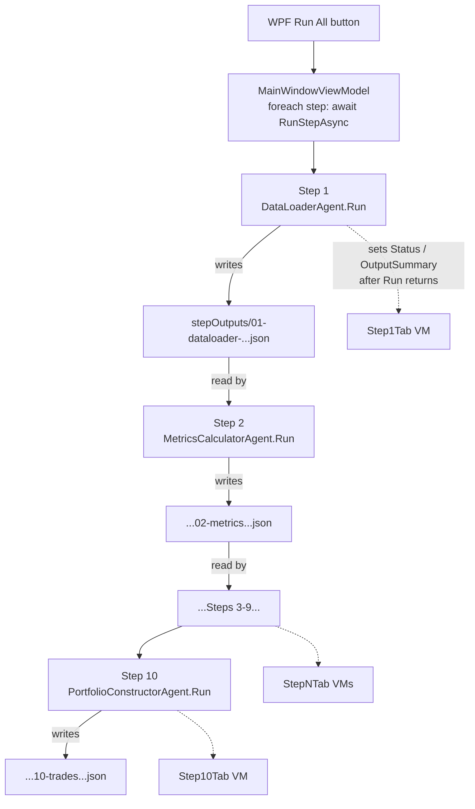
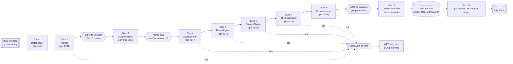
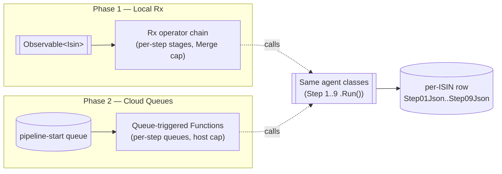

<!--
  STATUS: PHASE 1 STARTER SLICE SHIPPED 2026-05-24. The sequential
  `PipelineRunner` lives in `FikaFinans.Application/Pipeline/` and is
  wired through Autofac in `InfrastructureModule`. It implements
  `IPipelineRunner`, emits `StepEvent`s on `Started`/`Succeeded`/
  `Failed`, and walks the 10 agents in order (matching today's WPF
  "Run All" behaviour). Step number reshaped to a `StepId` value
  object with 10 well-known static instances (`StepId.DataLoader`,
  `StepId.MacroAnalyst`, …) and an `AgentName` property — one source
  of truth. 11 NUnit tests in `FikaFinans.Application.Tests` cover
  happy path, error path, cancellation, single-step run, and
  `StepId` validation.

  WPF VM MIGRATION — SHIPPED 2026-05-24. The WPF "Run All" loop no
  longer iterates `StepViewModel`s; `MainWindowViewModel.OnRunAllAsync`
  now calls `IPipelineRunner.RunAllAsync` and the step-tab pips light
  up live via an `IPipelineRunner.Events` subscription on
  `_uiScheduler`. Shape that landed:
  - `StepViewModel.LoadOutputAsync()` — virtual no-op on the base.
    Each step VM overrides with deserialise + summary refresh from
    its persisted output file.
  - All 10 step VMs refactored so `RunStepCoreAsync` (used by the
    per-tab "Run this step" button) does `agent.Run(...)` then
    `await LoadOutputAsync()`. Per-tab button path stays intact
    end-to-end; the runner path skips the agent call inside the VM
    because the orchestrator already did it.
    - `Step9UniverseEnricherViewModel` rebuilds the signals chart
      inside `LoadOutputAsync` from the deserialised
      `DataLoaderOutput`.
    - `Step10PortfolioConstructorViewModel` re-hydrates the
      `_lastOutput` field that the SendToBank button depends on
      inside `LoadOutputAsync` (deserialised `TradesOutput`).
  - `MainWindowViewModel` resolves `IPipelineRunner` from the
    Autofac scope in `OnLoaded`, builds a `step-number → VM`
    dictionary, and subscribes to
    `_runner.Events.ObserveOn(_uiScheduler)`. The single
    `OnStepEvent(StepEvent)` handler routes:
    - `Started` → `Status = Running`, `IsRunning = true`,
      `SelectedTabIndex` follows the running step,
      `RunStatusText = "Step N/10…"`.
    - `Succeeded` → `Status = Ok`, `LastRunText`/`DurationText`
      stamped, fire-and-forget `LoadOutputAsync` (failures logged).
    - `Failed` → `Status = Error`, `HasError = true`,
      `ErrorText = Message`.
  - `OnRunAllAsync` itself shrank to: cancel previous, set context
    on all VMs, `await _runner.RunAllAsync(...)`, then read
    aggregated status from the VMs to set the closing
    `RunStatusText`/`StatusBarText`.

  PER-ISIN STREAMING — SLICES 1 + 2 SHIPPED 2026-05-25.

  Slice 1 (2026-05-24): `StepEvent` gained an optional `Isin? Isin`
  field, and Step 2 (`MetricsCalculator`) got the per-fund
  `ProcessFund` method as the **template** for the rest.

  Slice 2 (2026-05-25): the template now lives on all 6 per-ISIN
  agents — Steps 2, 4, 5, 6, 7, 8 each expose a per-fund method on
  their interface. Steps that emit universe-level warnings during
  per-fund processing (5, 6, 7, 8) return a small
  `FundProcessingResult(FundRecord Fund, IReadOnlyList<string>
  Warnings)` record so the orchestrator can fold warnings back into
  `DataQuality.Warnings` after the merge; Steps 2 and 4 return a
  bare `FundRecord` because their per-fund warnings live inside the
  `FundRecord` itself (`Metrics.DataQuality` / `CriteriaEvaluation
  .DataQualityWarnings`).
  - Step 2 `IMetricsCalculatorAgent.ProcessFund(FundRecord,
    MetricsCalculatorConfig) → FundRecord` (shipped slice 1).
  - Step 4 `ISignalScorerAgent.ProcessFund(FundRecord,
    SignalScorerConfig) → FundRecord`.
  - Step 5 `IMacroAlignerAgent.ProcessFundAsync(FundRecord,
    IReadOnlyList<RotationTheme>, CancellationToken) →
    FundProcessingResult`.
  - Step 6 `ICatalystTaggerAgent.ProcessFundAsync(FundRecord,
    IReadOnlyList<Catalyst>, CancellationToken) →
    FundProcessingResult`.
  - Step 7 `IThesisValidatorAgent.ProcessFundAsync(FundRecord,
    CancellationToken) → FundProcessingResult`.
  - Step 8 `IRecommenderAgent.ProcessFund(FundRecord) →
    FundProcessingResult`.

  Each implementation:
  - The existing private per-fund method (`EnrichWithSignal`,
    `AlignFundAsync`, `TagFundAsync`, `ValidateFundAsync`,
    `EnrichFund`) has been promoted to the new public method, with
    `ArgumentNullException` guards on every reference-type
    parameter.
  - The universe-wide `RunInMemory[Async]` now calls `ProcessFund`
    per fund and folds the returned warnings into the universe
    `DataQuality.Warnings` exactly as the old private path did. No
    behavioural change for the universe-wide path.
  - The shared warning list is no longer threaded through the
    per-fund call — each `ProcessFund` invocation builds its own
    warning list and returns it. This is what makes the per-fund
    path safe under `Merge(maxConcurrent: N)`: no shared mutable
    state.

  Tests added (4–5 per agent, mirroring the Step 2 ProcessFund
  block):
  - `04-signalscorer` — standard fund, append-only, null-fund,
    null-config, no-metrics neutral path.
  - `05-macroaligner` — direct match (no LLM call), no themes
    (none + no warning), empty category (none + warning), null
    fund, null themes.
  - `06-catalysttagger` — direct match populates catalyst, no
    catalysts (null + no LLM), empty category (null + warning),
    null fund, null catalysts.
  - `07-thesisvalidator` — matrix-only happy path (no LLM call),
    null signal → NotApplicable + warning, LLM > 1-step override →
    matrix baseline + warning, null fund.
  - `08-recommender` — strength+valid+direct → CatalystEntry, null
    signal → Skip + warning, null fund, repeat-call equivalence
    (purity).

  Build is green end-to-end (full solution, 0 errors, 21
  pre-existing duplicate-using warnings unchanged). All tests pass:
  Domain 1/1, Application 14/14, InfrastructureV2 207/207.

  Slice 3 (2026-05-25): `Merge(maxConcurrent: N)` orchestration
  primitive is in. `PipelineRunner.RunPerIsinBlockAsync` takes a
  loaded Step 1 `DataLoaderOutput`, a loaded Step 3 `MacroContext`,
  the Step 2 / Step 4 configs, and a `maxConcurrent` fan-out
  budget; it streams every fund through Steps 2 → 4 → 5 → 6 → 7 → 8
  with `Merge(maxConcurrent: N)` and returns a
  `PerIsinBlockResult` — six universe snapshots, one per per-ISIN
  step boundary, with input fund order preserved.
  - Each per-fund step emits both `Started` and `Succeeded` events
    with `StepEvent.Isin` populated; if any step throws, a `Failed`
    event with `Isin` + `Message` is emitted and the exception
    propagates (the merge halts). The per-fund warning lists
    returned by Steps 5–8 are aggregated into a thread-safe
    `ConcurrentBag<string>` and folded back into
    `DataQuality.Warnings` on the returned universe output.
  - `Subject<StepEvent>` is not thread-safe under concurrent
    publishers; emission now goes through a single
    `lock`-serialised `Emit(...)` helper so the `Merge` fan-out
    can't interleave half-written events.
  - The new primitive is a public method on `PipelineRunner`, not
    yet on `IPipelineRunner` — the interface stays minimal until
    the wiring slice decides whether the universe-wide entry point
    (`RunAllAsync`) is replaced by a call into this primitive or
    whether both coexist.
  - 6 new tests in `FikaFinans.Application.Tests`: every per-ISIN
    agent gets called once per fund; `Started` + `Succeeded` events
    with `Isin` are emitted for all six per-ISIN steps; the
    enriched universe preserves fund count and identity fields;
    per-fund warnings are folded into `DataQuality.Warnings`; a
    failing step emits `Failed` + `Isin` + `Message`; null-arg and
    `maxConcurrent < 1` guard tests.

  Slice 4 (2026-05-25): `RunAllStreamingAsync` is wired end-to-end.
  Runs Step 1 + Step 3 universe-wide via the existing agents, fans
  out the per-ISIN block (Steps 2 → 4 → 5 → 6 → 7 → 8) through
  `Merge(maxConcurrent: 5)` by default, writes the six boundary
  JSON files so the per-tab "Run this step" buttons keep working
  after a streaming run, then runs Step 9 + Step 10 universe-wide.
  - File-IO concerns live behind a new
    `IStreamingPipelineGateway` (in `FikaFinans.Application
    /Pipeline/`), implemented by `StreamingPipelineGateway` in
    Infrastructure on top of `IPathsService` + `JsonOptions.Default`.
    The runner stays free of JSON/disk knowledge.
  - Universe-wide `Started` events for the six per-ISIN steps fire
    together at the block start; per-fund `Started`/`Succeeded`
    events with `Isin` populated stream during the merge;
    universe-wide `Succeeded` events for all six steps fire after
    the boundary files are written. WPF VMs can route on the
    `Isin is null` events for tab status and on per-fund events
    for live progress counters.
  - If the per-ISIN block throws, universe-wide `Failed` events
    fire for all six steps (plus the per-fund `Failed` event for
    the offending ISIN that the block already emitted).
  - Autofac wires `StreamingPipelineGateway` as a singleton and
    passes it to the runner constructor.
  - 6 new tests in `FikaFinans.Application.Tests`:
    `RunAllStreamingAsync` returns true on the happy path, writes
    all six per-ISIN boundary files, emits universe-`Succeeded`
    for every one of the 10 steps, halts without touching the
    gateway when Step 1 fails, emits universe-`Failed` for all six
    per-ISIN steps when the block throws, and surfaces
    `OperationCanceledException` on a pre-cancelled token.
  - Existing 4 `RunPerIsinBlockAsync` tests updated to the new
    `PerIsinBlockResult` shape (`result.Step8Output.Funds` etc.);
    new test asserts input fund order survives the merge across
    every boundary output.

  Build is green end-to-end (full solution, 0 errors, 21
  pre-existing duplicate-using warnings unchanged). All tests pass:
  Domain 1/1, Application **27/27** (20 + 7 new in slice 4 — 1
  ordering test for slice 3's primitive plus 6 for the wiring),
  InfrastructureV2 207/207.

  Slice 5 (2026-05-26): WPF + integration test. The "Run All"
  button now drives the streaming runner, and per-fund ticks
  emitted during the per-ISIN block update a live progress counter
  on each of the six per-ISIN step tabs.
  - `MainWindowViewModel.OnRunAllAsync` calls
    `RunAllStreamingAsync` (instead of `RunAllAsync`), keeping its
    existing cancellation/status-text plumbing intact.
  - `StepEvent` gained an optional `Total` field, set on the
    universe-wide `Started` event for each of the six per-ISIN
    steps to the streaming universe size (Step 1 fund count). The
    field is null for every other event, so the contract change is
    purely additive.
  - `StepViewModel` gained `PerFundProcessed`, `PerFundTotal`, and
    a computed `PerFundProgressText` ("137 / 1500" once Total is
    set; empty otherwise). The WPF `StepView` binds the new text
    into the Run-status panel as a "Progress" row.
  - `MainWindowViewModel.OnStepEvent` routes universe-wide events
    exactly as before (status pip, tab follow, LoadOutputAsync).
    Per-fund events (`Isin` populated) bump the per-step counter
    without flipping the tab status. The universe-`Started` event
    with `Total` set captures the denominator and resets the
    counter to 0.
  - Stale XML doc on `StepEvent` ("no agent is wired to the
    per-fund path yet — the field exists so the contract is
    locked before…") replaced by a current-state description that
    documents the `Total` field.
  - Integration test for `StreamingPipelineGateway` against real
    disk paths in `FikaFinans.InfrastructureV2.Tests/Pipeline/`,
    seven cases: round-trip a `DataLoaderOutput` through
    `SaveStepOutput` for all six per-ISIN steps; reject the four
    universe-wide steps; round-trip Step 1 and Step 3 outputs
    through write-then-load; verify the two `LoadConfig` paths
    deserialise the real fixtures; assert `LoadStep1Output` throws
    `FileNotFoundException` for a missing file. Each test writes
    to a unique Guid-based runId and cleans up in TearDown.

  Build is green end-to-end (full solution, 0 errors, 21
  pre-existing duplicate-using warnings unchanged). All tests pass:
  Domain 1/1, Application 27/27, InfrastructureV2 **214/214** (207
  + 7 new in slice 5).

  Per-ISIN streaming work is now end-to-end complete: orchestrator
  primitive + universe-wide wiring + WPF UI + disk-path integration
  test all shipped.

  Phase numbering in this doc mirrors the Phase 1 / Phase 2 split
  that previously lived in
  [backend-nav-sync-plan.md](./backend-nav-sync-plan.md).

  AGREED SEQUENCE (2026-05-24): local-first. Phase 1 (Rx in-process
  stream) lands NEXT — ahead of Storage Phase 7 (IsinProgress + step
  JSON columns) and Storage Phase 4 (SendToBank out of WPF). Azure
  Tables (Storage Phase 6) is the last step before the cloud deploy.
  See [storage-migration-plan.md §8 "Recommended sequence"](./storage-migration-plan.md#recommended-sequence--local-first-tables-last).

  AUDIT DONE (2026-05-24): per-ISIN vs cross-fund classification of
  all 10 agents is resolved — see "Per-ISIN vs cross-fund — agent
  audit" inline. Headline: Steps 2, 4, 5, 6, 7, 8 are per-ISIN;
  Steps 3 and 9 are universe-wide barriers; Step 1 is fan-out,
  Step 10 is the portfolio sink. Stream shape: three barriers
  split the chain into four blocks.

  Authoring rules for AI assistants and humans editing this file:
  - DO NOT write code (no C#, no XAML, no JSON config snippets, no shell).
  - DO use Mermaid diagrams to express architecture, flows, and state.
  - Prose stays at the "what / why / where it lives" level — no API
    signatures, no class names beyond what's already in the codebase,
    no method bodies. Implementation lives alongside the code; this
    doc captures the intent.
  - DO NOT modify other documents from this plan. Cross-references are
    one-way: link out from this file to other docs, but never edit those
    other docs to point back here.
  - DO NOT invent architecture. If a piece of the flow is not yet
    decided, write it as an open question, not as a confident design.
-->

# Pipeline Step Flow — Feature Plan

> **Related:**
>
> - The 10 step contracts (inputs, outputs, ownership of fields) are
>   defined in
>   [FikaFinans.InfrastructureV2.Tests/docs/pipeline-plan.md](../FikaFinans.InfrastructureV2.Tests/docs/pipeline-plan.md).
>   That document defines *what each step does*; this document plans
>   *how* the steps are stitched together at runtime.
> - The queue-driven backend that eventually replaces the in-process
>   Rx stream is planned in
>   [backend-nav-sync-plan.md](./backend-nav-sync-plan.md). The
>   step-to-step chaining via per-`step{N}-done` queues lives there;
>   this doc covers the local-dev predecessor that the cloud version
>   is shaped to mirror.
> - The per-ISIN row that holds `Step01Json … Step09Json` between
>   steps is part of the storage migration in
>   [storage-migration-plan.md](./storage-migration-plan.md) (Phase 7).

## Current Event Flow — Synchronous, File-Based, No Rx

What runs today, before any of the planned changes land.

### How a run starts

A run is kicked off by the **WPF "Run All" button** in the main
window. The handler lives in
[`MainWindowViewModel.OnRunAllAsync`](../FikaFinans.Wpf/ViewModels/MainWindowViewModel.cs)
(`FikaFinans.Wpf/ViewModels/MainWindowViewModel.cs:193`). It:

1. Generates a fresh `RunId` from the current timestamp.
2. Pushes `(family, isoWeek, runId)` context into every step's
   ViewModel.
3. Walks the ten `StepNTab` ViewModels in order and `await`s
   `RunStepAsync()` on each.
4. Halts on the first step whose `Status` becomes `Error`.

There is no orchestrator class. The ViewModel layer **is** the
orchestrator.

### How steps hand data to each other

Steps communicate through **JSON files on disk**, not in-process
objects. Each agent under
[`FikaFinans.Infrastructure/Pipeline/Agents/`](../FikaFinans.Infrastructure/Pipeline/Agents/)
exposes a synchronous `Run(...)` method that:

- Reads its inputs by file path from the previous step's JSON output
  (paths resolved via `IPathsService`).
- Computes its slice in memory.
- Writes its own JSON to `stepOutputs/{NN}-{name}-{isoWeek}-{runId}.json`.
- Returns a typed POCO to its caller.

The handoff invariant from
[pipeline-plan.md](../FikaFinans.InfrastructureV2.Tests/docs/pipeline-plan.md)
is preserved by convention: each step's JSON contains the union of
every prior step's fields plus its own additions (the "append-only
chain"). Field ownership is one-agent-per-column.

### What the UI sees

There is no event stream today. Each `StepViewModel` updates a small
set of bindable properties (`Status`, `OutputSummaryText`,
`ErrorText`, etc.) **after** its `RunStepAsync` completes. The user
sees nothing change mid-step — the tab flips from `Pending` to
`Running` to `Ok`/`Error` as a whole.

An `IObservable<StepEvent>` surface **is sketched** in
[`IPipelineRunner.Events`](../FikaFinans.Application/Pipeline/IPipelineRunner.cs)
together with the
[`StepEvent`](../FikaFinans.Application/Pipeline/StepEvent.cs) record
(`StepNumber`, `AgentName`, `Kind` ∈ {`Started`, `Succeeded`,
`Failed`}, optional message + duration). **Neither type has any
caller or implementation today.** They are placeholders for the
planned Rx phase below.

### Concurrency

None. The outer loop is sequential. Within each step, all funds in
the universe are processed together inside a single agent call —
there is no per-fund parallelism and no maxConcurrency knob.

### Pain points the next phase has to fix

- **No live progress.** The user can't tell whether step 5 is at fund
  3/200 or 199/200 — there is no per-fund tick.
- **Batchy by accident.** Each step processes the whole universe as
  one object. That's incidental to the file-on-disk shape, not a
  design choice. The eventual cloud shape from
  [backend-nav-sync-plan.md](./backend-nav-sync-plan.md) is strictly
  per-ISIN; the local runtime should match.
- **No concurrency knob.** Steps are sequential and within-step
  parallelism is implicit at best. Nothing to tune.
- **Step boundaries are filesystem paths.** Migrating to queues means
  swapping the I/O layer everywhere `IPathsService` is touched.
  Workable, but the boundary is too low-level — agents shouldn't
  care whether their input came from a file or a queue.

## What's Planned — Phase 1: Local Rx.NET Stream

The headline change: replace the "WPF loops over ten ViewModels"
orchestrator with an Rx-composed pipeline that streams **per-ISIN**
through the ten steps, with a configurable concurrency cap and a
real `StepEvent` stream that the UI subscribes to.

The plan keeps every agent's `Run(...)` signature intact. **The
agents don't change.** Only what feeds them and what collects their
output does.

### Shape

- **Source.** The ISIN universe materialises as an observable
  sequence — one element per fund. Today's "load 1,500 funds" maps
  to "emit 1,500 ISINs into the stream."
- **Operators between steps.** Each step is a single async stage
  applied per ISIN. The cross-step composition uses standard Rx
  operators (`Select` / `SelectMany` / `Merge`) — no custom
  scheduler.
- **Concurrency cap.** A `Merge(maxConcurrency: N)`-style throttle
  sits at the entry to the chain. Starting point: 5. Final value
  picked once we measure per-fund wall time. Same cap value the
  cloud-side Function host will use, so behaviour matches.
- **Per-step persistence.** Per-fund step output lands in the
  per-ISIN row (the `Step01Json … Step09Json` columns from
  [backend-nav-sync-plan.md §"Step Outputs — Inline in the Same Row"](./backend-nav-sync-plan.md#step-outputs--inline-in-the-same-row))
  via the
  [`IPositionsRepository`](../FikaFinans.Application/Storage/Bank/)-style
  contract introduced in
  [storage-migration-plan.md](./storage-migration-plan.md). The
  on-disk `stepOutputs/` files survive as a development convenience,
  not as the cross-step transport.
- **Event surface.** The unused
  [`IPipelineRunner.Events`](../FikaFinans.Application/Pipeline/IPipelineRunner.cs)
  observable gets a real implementation. Each step publishes
  `Started` / `Succeeded` / `Failed` ticks; WPF step tabs subscribe
  and update progress live instead of waiting for `Run()` to return.

### What the agents see

Nothing. The `Run(...)` method on each agent stays sync-or-async per
its current signature, takes its existing inputs, returns its
existing output. The Rx layer is *outside* the agents — it picks the
inputs out of upstream state, calls `Run`, and routes the output to
the per-ISIN row plus the next step. This is deliberate: the same
agents will be hosted unchanged by the Function-per-step shape in
Phase 2.

### Per-fund instead of per-step batches

Today's agents process the whole universe per call. The Rx phase
flips this: one invocation per (step, fund), composed into a
stream. Three benefits:

- **Live progress.** Each fund's transitions are observable, so the
  UI can show "Step 4 — 137 / 1500."
- **Failure granularity.** A single fund that throws no longer takes
  down the entire step. Stream filters route bad-fund events to a
  diagnostic sink; the rest of the universe drains.
- **Direct mapping to queues.** The per-ISIN ticks at the Phase-1
  step boundary are isomorphic to the per-ISIN messages on the
  `step{N}-done` queues in Phase 2.

The catch: some agents read "the whole universe" at once and can't
trivially split per-fund. The audit below identifies them.

### Per-ISIN vs cross-fund — agent audit (2026-05-24)

Result of walking every agent in
[`FikaFinans.Infrastructure/Pipeline/Agents/`](../FikaFinans.Infrastructure/Pipeline/Agents/)
and asking: *can `Run` operate on one fund, given upstream context?*

| Step | Agent | Shape | Notes |
| --- | --- | --- | --- |
| 1 | DataLoaderAgent | **fan-out** (universe-wide input → per-ISIN output) | Reads CSVs + positions partition once; cross-fund validations (orphan ISINs, pinning) on input only; emits per-fund `FundRecord` stream |
| 2 | MetricsCalculatorAgent | ✅ **per-ISIN** | `input.Funds.Select(EnrichWithMetrics)`; pure per-fund math on its own snapshot/buckets |
| 3 | MacroAnalystAgent | ❌ **universe-wide barrier** | One LLM call produces themes/catalysts shared by every downstream fund; needs universe categories to filter on |
| 4 | SignalScorerAgent | ✅ **per-ISIN** | `ScoreFund` looks only at one fund's metrics |
| 5 | MacroAlignerAgent | ✅ **per-ISIN** (with shared Step 3 input) | `foreach fund: AlignFundAsync(fund, macro.RotationThemes)`; themes are a constant input from Step 3, not cross-fund |
| 6 | CatalystTaggerAgent | ✅ **per-ISIN** (with shared Step 3 input) | `foreach fund: TagFundAsync(fund, activeCatalysts)`; catalysts constant from Step 3 |
| 7 | ThesisValidatorAgent | ✅ **per-ISIN** | Per-fund LLM call |
| 8 | RecommenderAgent | ✅ **per-ISIN** | Per-fund 4-tuple → recommendation logic |
| 9 | UniverseEnricherAgent | ❌ **partial barrier** | Pass 1 (rotation pair grouping) + Pass 2 (peer index by category) need the universe; Pass 3 (per-fund conviction breakdown) is per-fund. Could be split into `Step9a-universe` + `Step9b-per-fund` if the streaming benefit is worth the refactor |
| 10 | PortfolioConstructorAgent | ❌ **portfolio-wide** | Cash floor, concentration cap, sector cap all need portfolio view; already planned as daily timer outside the chain |

**Headline:** 6 of the 10 steps (2, 4, 5, 6, 7, 8) are trivially
per-ISIN today. Two are universe-wide barriers (3, 9). Two are
intentional non-stream stages (1 = fan-out source, 10 = portfolio
sink).

### Stream shape that falls out

Three barriers split the chain into four blocks. Between barriers,
the stream runs per-ISIN with the `Merge` cap applied; at each
barrier, the stream buffers to completion, runs the universe-wide
stage once, then re-emits per-ISIN.

Step 10 is the deliberate exception — it operates portfolio-wide by
design (see
[backend-nav-sync-plan.md §"Step 10 — Daily Portfolio Trades"](./backend-nav-sync-plan.md#step-10--daily-portfolio-trades))
and does not participate in the per-ISIN stream.

**Implications for Phase 2 (queues):** the barriers don't translate
1-1 to per-step queues. Steps 3 and 9 either become "wait for all
ISINs to finish the prior step before triggering" (queue-of-one
plus a fan-in) or stay as in-process Rx within their step's
Function. To be decided when Phase 2 begins; for Phase 1 the
barriers are just `Buffer().Take(1).SelectMany(...)`-style
operators.

## Phase 2 — Same Logic, Swap the Source/Sink for Queues

Phase 2 is where this plan hands the baton to
[backend-nav-sync-plan.md](./backend-nav-sync-plan.md). The
agents — and ideally the per-step orchestration logic around them —
don't change. What changes is what feeds the chain and where each
step's output lands.

| Concern | Phase 1 (this doc) | Phase 2 ([backend-nav-sync-plan.md](./backend-nav-sync-plan.md)) |
| --- | --- | --- |
| Source of work | `Observable<Isin>` materialised in-process | `pipeline-start` queue, written by YR |
| Step → step transport | next Rx operator in the chain | `step{N}-done` queue per boundary |
| Concurrency cap | `Merge(maxConcurrent: N)` in code | Function host `maxConcurrentCalls` |
| Per-step persistence | per-ISIN row columns (already cloud-shaped) | same per-ISIN row columns |
| Failure handling | Rx error pipeline + diagnostic sink | at-least-once + DIY `*-poison` queues |
| Progress surface | `IPipelineRunner.Events` for WPF | progress table + App Insights |

The line lifted out of the original phases sketch — "Your Rx code
doesn't change, only the data source/sink" — is the central design
bet of this plan. Whether it survives contact with a real
implementation is the open question that justifies building Phase 1
first.

## Open Questions

- **Where the Rx orchestrator lives.** A new class under
  `FikaFinans.Application/Pipeline/` implementing `IPipelineRunner`,
  or a thicker WPF-side composition? Application layer is the
  obvious answer — keeps the WPF VM thin and matches the Phase 2
  Function shape. Confirm during the first concrete build-out.
- **Which steps cannot go per-ISIN.** ✅ **Resolved 2026-05-24.**
  Audit lives in "Per-ISIN vs cross-fund — agent audit" above. Steps
  3 and 9 are barriers; Step 5 is per-ISIN (uses universe-wide
  themes as a shared input, not as cross-fund context). Step 9
  *could* later split into 9a (universe pairing + peer index) + 9b
  (per-fund conviction) — flagged as a follow-up, not a blocker.
- **`StepEvent` granularity.** Current record is per-step
  (`StepNumber`, `AgentName`, `Kind`). For per-fund streaming the UI
  wants per-(step, ISIN) ticks. Extend the record with an optional
  `Isin` field, or add a sibling event type? Decide before wiring
  the WPF subscription.
- **Disk-JSON fallback during Phase 1.** Keep
  `stepOutputs/{NN}-...json` written alongside the per-ISIN row
  writes for developer-side debugging, or retire it the moment the
  Rx path lands? Lean: keep, gated behind a setting; retire once the
  per-ISIN row inspector UI is good enough.
- **Concurrency cap value.** Pick once per-fund wall time is
  measured. Same number the Phase 2 Function host will use — see
  the equivalent open question in
  [backend-nav-sync-plan.md §Open Questions](./backend-nav-sync-plan.md#open-questions).
- **Error routing.** A bad fund inside Step N — does it produce a
  `Failed` `StepEvent` and drop out of the stream, or block the
  whole run? The cloud shape will lean "drop and dead-letter"; Phase
  1 should match so behaviour transfers cleanly.
- **Cancellation.** `OnRunAllAsync` already threads a
  `CancellationTokenSource`. The Rx pipeline needs to honour it
  end-to-end — confirm the operator chain disposes promptly on
  cancel.

## Out of Scope for This Document

- Any code, configuration, or DI snippets.
- The per-step contracts themselves — owned by
  [pipeline-plan.md](../FikaFinans.InfrastructureV2.Tests/docs/pipeline-plan.md).
- The cloud-side queue / progress-table / poison-queue design —
  owned by
  [backend-nav-sync-plan.md](./backend-nav-sync-plan.md).
- The storage contract that lands the per-ISIN row — owned by
  [storage-migration-plan.md](./storage-migration-plan.md).
