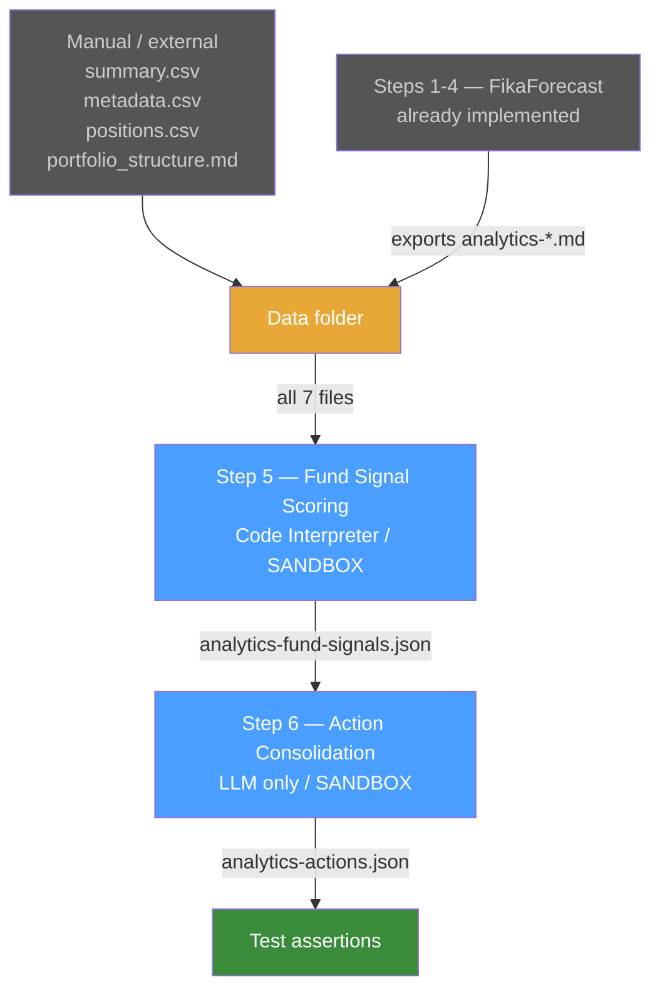
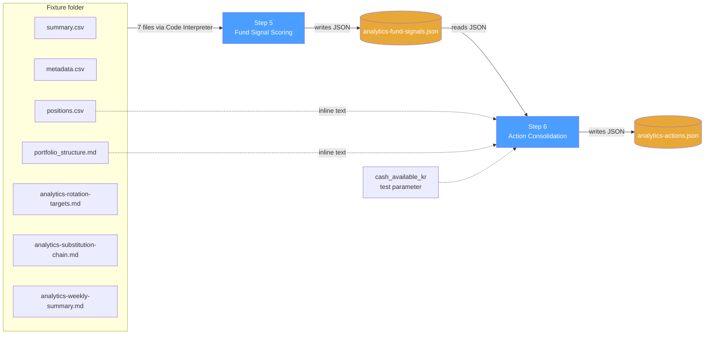
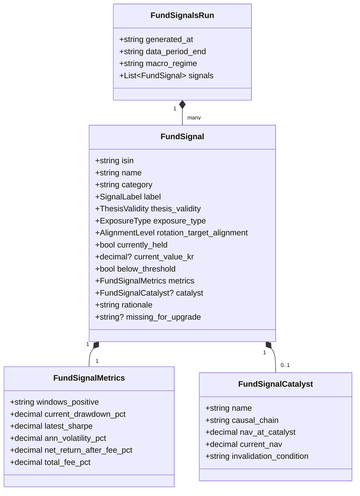
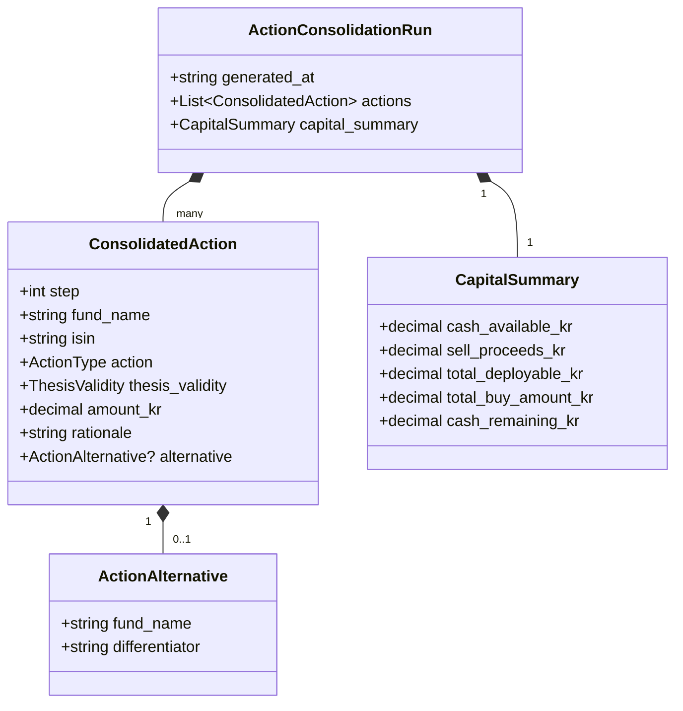
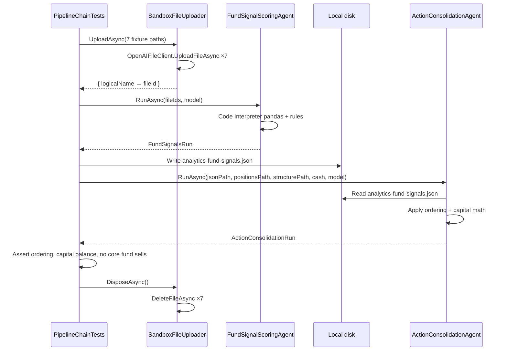

# Step 5 + Step 6 — Fund Pipeline Sandbox

A test-project-only prototype for the fund-scoring + action-consolidation stages that complete the chat-driven workflow captured in [Full-prompt-chain.md](Full-prompt-chain.md). No production code changes — sandbox lives entirely under the existing test project so we can iterate on prompts and JSON contracts before promoting anything to `FikaFinans.Infrastructure`.

---

## Context

The existing [prompt_analytics.md](prompt_analytics.md) is a single mega-prompt that loads **all seven files** (3 CSVs + 4 markdown) on every run. That approach didn't pan out — too much upfront context, model gets distracted, calculations re-run unnecessarily, and when something looked off it was hard to tell which stage broke.

[Full-prompt-chain.md](Full-prompt-chain.md) shows the workflow that *did* work in chat, in three logical stages:

1. **News brief + macro analysis** — already implemented as Steps 1-4 in the separate [FikaForecast](../../FikaForecast/) app, exported as `analytics-*.md` files.
2. **Second-pass beneficiary scan + catalyst override** — applies buy/sell rules to `summary.csv` filtered by rotation targets, with thesis validity. Not implemented.
3. **Signal consolidation** — ranks scored signals into a single action list with capital math. Not implemented.

This doc plans stages 2 and 3 as **Step 5 (Fund Signal Scoring)** and **Step 6 (Action Consolidation)**, mirroring the Step 1-4 design pattern from [docs/step1-news-brief-agent.md](../../docs/step1-news-brief-agent.md) but file-mediated instead of DB-mediated.

**Hard constraints set by the user:**

- **Do not modify existing code.** Existing `FikaFinans.Application` / `.Infrastructure` / `.Domain` / `.Wpf` projects stay untouched. The existing `prompt_analytics.md`, `EmbeddedPromptProvider`, `CodeInterpreterFundAnalyticsAgent`, `FoundryFileStore`, `FundDataFiles`, and `InfrastructureModule` are read-only references.
- **All new code lives in `FikaFinans.Infrastructure.Tests/`** under a new dedicated folder.
- **Simplified structure** — no port interfaces, no DI, no embedded resources, no mtime sidecar. Direct class instantiation, prompts as plain text files, file uploads via a thin per-test helper.
- **No FikaForecast coupling** — Step 5/6 read only files in a single fixture folder.
- **No GUI.** Tests are the only entry points.
- **`prompt_analytics.md` stays as the ad-hoc query prompt** — not retired, not modified.

**Intended outcome:** a self-contained sandbox with fixtures, prompts, simplified agent classes, and integration tests that prove Step 5 → Step 6 chains correctly end-to-end. Promotion to production code is a separate plan, after the logic is verified.

---

## Pipeline position



The blue boxes are the new sandbox stages. Everything else already exists.

---

## Architecture

**Why JSON between Step 5 and Step 6.** Step 6's input must be deterministic — not regex over Step 5's prose. The chaining contract is "Step 5 writes JSON to disk; Step 6 reads JSON from disk." Markdown rendering is **out of scope for the sandbox** — JSON is enough to verify logic.

**Where Step 5 sees CSVs but Step 6 doesn't.** Step 5 is the one place raw fund data enters the system — Code Interpreter does pandas work once. Step 6 consumes the structured signals and never re-touches `summary.csv` / `metadata.csv`. This is the answer to the original chaining question: **calculations happen once, in Step 5, and propagate as structured data.**



Solid arrows are the file-upload / file-read paths. Dashed arrows are inline-text inputs (small enough to embed in the prompt).

---

## Sandbox folder layout

Everything new lives under one folder inside the existing test project:

```text
FikaFinans/FikaFinans.Infrastructure.Tests/
└── FundPipelineSandbox/
    ├── Prompts/
    │   ├── fund_signals.prompt.md
    │   └── action_consolidation.prompt.md
    ├── Models/
    │   ├── FundSignal.cs              (POCO records — no domain layer)
    │   ├── FundSignalsRun.cs
    │   ├── FundSignalCatalyst.cs
    │   ├── FundSignalMetrics.cs
    │   ├── ConsolidatedAction.cs
    │   ├── ActionConsolidationRun.cs
    │   ├── CapitalSummary.cs
    │   └── ActionAlternative.cs
    ├── Agents/
    │   ├── SandboxFileUploader.cs     (thin per-run uploader, no sidecar)
    │   ├── FundSignalScoringAgent.cs  (Code Interpreter)
    │   └── ActionConsolidationAgent.cs (plain Responses API)
    ├── TestData/
    │   ├── summary.csv
    │   ├── metadata.csv
    │   ├── positions.csv
    │   ├── portfolio_structure.md
    │   ├── analytics-rotation-targets.md
    │   ├── analytics-substitution-chain.md
    │   └── analytics-weekly-summary.md
    └── Tests/
        ├── FundSignalScoringAgentTests.cs
        ├── ActionConsolidationAgentTests.cs
        └── PipelineChainTests.cs
```

Prompt and TestData files are added as `<None CopyToOutputDirectory="PreserveNewest" />` in `FikaFinans.Infrastructure.Tests.csproj` so tests can read them at runtime via `Path.Combine(AppContext.BaseDirectory, ...)` — no embedded-resource ceremony.

Models are plain `record` types with `System.Text.Json` attributes, scoped to the sandbox namespace. They do **not** mirror or extend the production `FikaFinans.Domain` types.

---

## Step 5 — Fund Signal Scoring Agent (sandbox class)

Apply buy/sell rules + catalyst override + thesis validity across the full fund universe. One label per fund: `BuySignal | CatalystEntry | Watch | Pass | SellSignal`.

### Step 5 inputs

The agent takes a `Step5Inputs` record:

```csharp
public sealed record Step5Inputs(
    string FixtureFolder,        // path to TestData/ folder for this run
    string ModelDeploymentName); // which Foundry model to call
```

The agent uploads all seven files from the fixture folder via a fresh `SandboxFileUploader` instance (created → uploads → returns fileIds → caller deletes after the test). No mtime sidecar, no caching.

### Step 5 output

`FundSignalsRun` record with a `IReadOnlyList<FundSignal>` and run metadata (timestamp, model, token counts). The agent also writes the JSON to disk at a caller-supplied path so Step 6 can read it.

### Step 5 prompt outline

`Prompts/fund_signals.prompt.md` — copies the rule logic verbatim from [Full-prompt-chain.md](Full-prompt-chain.md) ("Second-pass macro beneficiary scan" + "Catalyst override") and [prompt_analytics.md](prompt_analytics.md) ("Buy and sell signals" section).

Core instructions:

1. Load all seven files via pandas / `open()`.
2. Identify beneficiary categories from `analytics-rotation-targets.md` (🟢 Strong / 🟡 Moderate).
3. For every fund in `summary.csv`:
   - Apply the **trending momentum** rule set.
   - Apply the **explosive/thematic** rule set.
   - Compute `rotation_target_alignment` (Strong / Moderate / None).
   - Evaluate **catalyst override** eligibility per the four conditions in [Full-prompt-chain.md](Full-prompt-chain.md) lines 89-94.
   - Evaluate **thesis validity** by comparing the fund to category peers in the same window.
4. Emit one signal per fund — strict JSON only, no prose around it.

JSON schema enforced via `ResponseTextFormat.CreateJsonSchemaFormat` with `jsonSchemaIsStrict: true` (same pattern as the existing Step 1-4 agents documented in [docs/step1-news-brief-agent.md](../../docs/step1-news-brief-agent.md) lines 322-340).

### Step 5 JSON schema



Concrete example:

```json
{
  "generated_at": "2026-04-27T12:00:00Z",
  "data_period_end": "2026-04-25",
  "macro_regime": "Stagflation / risk-off",
  "signals": [
    {
      "isin": "SE0000XXXXXX",
      "name": "Fund Name",
      "category": "Energy",
      "label": "CatalystEntry",
      "thesis_validity": "Valid",
      "exposure_type": "Direct",
      "rotation_target_alignment": "Strong",
      "currently_held": false,
      "current_value_kr": null,
      "below_threshold": false,
      "metrics": {
        "windows_positive": "3 of 3",
        "current_drawdown_pct": 0.0,
        "latest_sharpe": 1.7,
        "ann_volatility_pct": 14.2,
        "net_return_after_fee_pct": 4.1,
        "total_fee_pct": 0.8
      },
      "catalyst": {
        "name": "US-Israel war on Iran / Hormuz disruption",
        "causal_chain": "Hormuz disruption → Brent above $100 → upstream producers benefit",
        "nav_at_catalyst": 121.5,
        "current_nav": 134.2,
        "invalidation_condition": "Ceasefire or Hormuz reopening, Brent back below $80"
      },
      "rationale": "Direct beneficiary of Brent shock, three positive windows, NAV 10.5% above catalyst-onset.",
      "missing_for_upgrade": null
    }
  ]
}
```

`Pass` rows are included so Step 6 has full visibility. `catalyst` is null for every label except `CatalystEntry`. `missing_for_upgrade` is populated only for `Watch`.

---

## Step 6 — Action Consolidation Agent (sandbox class)

Convert `analytics-fund-signals.json` into a single ranked action list with capital math. No CSV access — pure transformation.

### Step 6 inputs

```csharp
public sealed record Step6Inputs(
    string SignalsJsonPath,         // file produced by Step 5
    string PositionsCsvPath,        // raw text, inlined into prompt
    string PortfolioStructurePath,  // raw text, inlined into prompt
    decimal CashAvailableKr,
    string ModelDeploymentName);
```

`positions.csv` and `portfolio_structure.md` are small enough to read into memory and inline into the prompt as text — **no Code Interpreter, no file uploads.** Step 6 is a pure Responses API call.

### Step 6 prompt outline

`Prompts/action_consolidation.prompt.md` — implements the rules from [Full-prompt-chain.md](Full-prompt-chain.md) "Third scan — Signal consolidation" verbatim:

1. **Sell ordering:** rule-triggered sells → sub-threshold weak signals → sub-threshold intact signals (top-up decisions).
2. **Buy ordering:** `BuySignal` (full 20 000 kr) → `CatalystEntry` (half, 10 000 kr) → max 3 buys total, rank by Sharpe momentum.
3. **Alternative-fund check:** for each buy, scan `signals` for a same-category fund with a meaningfully better profile (lower fee / stronger Sharpe momentum / less NAV captured) and surface as a one-line alternative.
4. **Hold rows:** include only sub-threshold positions with intact signals.
5. **Capital math:** cash + sell proceeds − buy amounts = remaining.
6. **Pinned exclusion:** never recommend selling a fund flagged as `core` or `writeoff` in `portfolio_structure.md`.

Strict JSON output, same pattern as Step 5.

### Step 6 JSON schema



Concrete example:

```json
{
  "generated_at": "2026-04-27T12:01:00Z",
  "actions": [
    {
      "step": 1,
      "fund_name": "Held Stagnant Fund",
      "isin": "SE0000ZZZZZZ",
      "action": "Sell",
      "thesis_validity": "Invalid",
      "amount_kr": 12000,
      "rationale": "Two consecutive negative windows; category peers also falling — invalid thesis, full exit."
    },
    {
      "step": 2,
      "fund_name": "Energy Direct Fund",
      "isin": "SE0000XXXXXX",
      "action": "Buy",
      "thesis_validity": "Valid",
      "amount_kr": 20000,
      "rationale": "BUY SIGNAL — three positive windows, drawdown zero, 🟢 Strong rotation alignment.",
      "alternative": {
        "fund_name": "Lower-fee peer fund",
        "differentiator": "0.4% lower total fee, similar Sharpe momentum"
      }
    }
  ],
  "capital_summary": {
    "cash_available_kr": 50000,
    "sell_proceeds_kr": 12000,
    "total_deployable_kr": 62000,
    "total_buy_amount_kr": 20000,
    "cash_remaining_kr": 42000
  }
}
```

`alternative` is null for non-Buy actions and Buys without a better peer.

---

## SandboxFileUploader

Tiny helper, ~50 lines. Existence is to keep the sandbox isolated from the production `FoundryFileStore` (which the user said to leave untouched).

```csharp
public sealed class SandboxFileUploader : IAsyncDisposable
{
    // ctor takes OpenAIFileClient
    // UploadAsync(IEnumerable<string> localPaths) → IReadOnlyDictionary<string, string> (logicalName → fileId)
    // DisposeAsync deletes every uploaded fileId server-side
}
```

No mtime tracking, no sidecar, no re-use across runs. Each test run uploads fresh and cleans up at the end. Slower than production but trivially correct.

---

## Test fixtures

`FundPipelineSandbox/TestData/` — small hand-crafted files with planted scenarios. Six funds, four windows each:

| Fund | Category | Windows positive | Drawdown | Held | Expected Step 5 label |
| --- | --- | --- | --- | --- | --- |
| A | Energy (🟢 Strong) | 3 of 3 | 0% | No | `BuySignal` |
| B | Defence (🟡 Moderate) | 2 of 3 | −2.1% | No | `Watch` (missing: drawdown to 0) |
| C | Tech (⚪ None) | 0 of 2 (held) | −8% | Yes (12 000 kr) | `SellSignal` (sub-threshold, 2 consecutive negative) |
| D | Energy (🟢 Strong) | 2 of 3, no negative Sharpe | NAV at catalyst-onset high | No | `CatalystEntry` |
| E | Sweden equity | 3 of 3 | 0% | Yes (28 000 kr) | `BuySignal` (held, healthy — no action) |
| F | Bonds | 1 of 3 | −1.5% | No | `Pass` |

`positions.csv` lists Funds C and E. `portfolio_structure.md` pins one fund (e.g., a global index ETF that does NOT appear in `summary.csv`) as `core` to verify Step 6 never proposes selling it. `metadata.csv` includes a peer fund in the Energy category with a lower fee than Fund A so Step 6's alternative-fund check has something to surface.

The `analytics-*.md` fixtures match the example in [Full-prompt-chain.md](Full-prompt-chain.md) lines 154-192: Hormuz disruption catalyst, Brent above $100, Fed hold.

---

## Test plan

All tests live in `FundPipelineSandbox/Tests/`. Gated on `FOUNDRY_PROJECT_ENDPOINT` per the existing `IntegrationConfig` pattern in the test project.

### Step 5 tests — `FundSignalScoringAgentTests.cs`

- `Run_WithFixtureFiles_AssignsExpectedLabels` — uploads fixtures, runs agent, asserts label per fund matches the table above.
- `Run_WithFixtureFiles_PopulatesCatalystBlockForCatalystEntries` — Fund D has non-null `catalyst` block with `nav_at_catalyst`, `current_nav`, `invalidation_condition`.
- `Run_WithFixtureFiles_TagsRotationAlignment` — Fund A and D get `Strong`, Fund B gets `Moderate`, Fund F gets `None`.
- `Run_WithFixtureFiles_FlagsHeldFunds` — Fund C and E have `currently_held: true` and `current_value_kr` populated.
- `Run_WithFixtureFiles_SetsBelowThresholdForSmallPositions` — Fund C (12 000 kr) has `below_threshold: true`; Fund E (28 000 kr) has `false`.

Tolerance: assert structural fields, not exact rationale wording. JSON schema is the contract.

### Step 6 tests — `ActionConsolidationAgentTests.cs`

Use a hand-crafted `analytics-fund-signals.json` fixture (not the live Step 5 output — keeps tests independent and fast):

- `Run_OrdersSellsBeforeBuys` — every `Sell` step number is lower than every `Buy` step number.
- `Run_PrioritisesBuySignalOverCatalystEntry` — Fund A (BuySignal, 20 000 kr) appears before Fund D (CatalystEntry, 10 000 kr).
- `Run_NeverSellsCoreFunds` — no action targets the fund pinned as `core`.
- `Run_EmitsHoldRowForSubThresholdIntactSignal` — when fed a fixture with a sub-threshold + intact signal, emits a `Hold` row.
- `Run_CapitalMathBalances` — `cash + sell_proceeds == total_deployable`; `total_deployable - total_buy == cash_remaining`.
- `Run_SurfacesAlternativeWhenLowerFeePeerExists` — Fund A's buy row has a populated `alternative` block.
- `Run_RespectsMaxThreeBuys` — feed a fixture with 5 BuySignals; output has exactly 3 buy actions.

### End-to-end chain test — `PipelineChainTests.cs`

`RunFullChain_ProducesActionableOutput` validates the file-mediated chaining contract:



### What's *not* tested

- Markdown rendering — sandbox emits JSON only.
- N-model parallel runs — single default model.
- Production DI / GUI integration — not in scope.

---

## Implementation order

1. Create `FundPipelineSandbox/` folder + sub-folders inside `FikaFinans.Infrastructure.Tests`.
2. Add `<None CopyToOutputDirectory="PreserveNewest">` entries in `FikaFinans.Infrastructure.Tests.csproj` for the prompts and test-data files.
3. Write fixture files (TestData) — 6 funds with the planted scenarios above.
4. Write the two prompt files. Iterate against the fixtures in a Foundry playground first if needed.
5. Write the POCO records (Models).
6. Write `SandboxFileUploader`.
7. Write `FundSignalScoringAgent`.
8. Write `FundSignalScoringAgentTests` — iterate prompt + parser until the labels table holds.
9. Write `ActionConsolidationAgent`.
10. Write `ActionConsolidationAgentTests` — iterate prompt until ordering and capital math hold.
11. Write `PipelineChainTests` — confirm file-mediated chain works.
12. **Stop here.** Promotion to production code is a separate plan.

---

## Verification

1. **Fixture-based correctness** — run `dotnet test FikaFinans.Infrastructure.Tests --filter "FullyQualifiedName~FundPipelineSandbox"` with `FOUNDRY_PROJECT_ENDPOINT` set; all assertions pass.
2. **Existing tests unchanged** — same `dotnet test` command without the filter; pre-existing tests (including `FoundryFileStoreIntegrationTests`) still green. Confirms no production-code regression.
3. **Token cost check** — log input/output tokens per run. Step 5 (Code Interpreter, 7 files) is the expensive call; Step 6 should be cheap. Establishes a baseline for the eventual production version.
4. **Sandbox cleanup** — confirm `SandboxFileUploader.DisposeAsync` deletes uploaded fileIds (Foundry portal Files tab should not accumulate test fileIds across runs).

---

## What gets promoted later (separate plan)

When Step 5/6 logic is verified, a follow-up plan will:

- Move POCO records into `FikaFinans.Domain`.
- Add `IFundSignalScoringAgent` / `IActionConsolidationAgent` ports in `FikaFinans.Application`.
- Re-implement the agents in `FikaFinans.Infrastructure` using `EmbeddedPromptProvider` and the production `FoundryFileStore`.
- Wire DI in `InfrastructureModule`.
- Add `AnalyticsFileWriter` to persist `analytics-fund-signals.{json,md}` and `analytics-actions.{json,md}` into the live data folder alongside the existing `analytics-*.md`.
- N-model parallel comparison (matches existing `CodeInterpreterFundAnalyticsAgent` pattern).
- Markdown rendering for human review.
- GUI integration (separate plan again).

None of this happens in the current sandbox plan.

---

## Open items deferred

- **Markdown output** — sandbox emits JSON only. Markdown rendering is added during promotion.
- **Trend analysis** — sandbox overwrites JSON per run. Production version may want timestamped archives or SQLite.
- **Cash-available source** — test parameter for now. Production version owns it through UI.
- **Catalyst-onset detection accuracy** — Step 5's prompt asks the model to identify the catalyst date from `analytics-weekly-summary.md`. If sandbox tests show poor accuracy, the production version may need explicit catalyst-date metadata in the FikaForecast exports.
