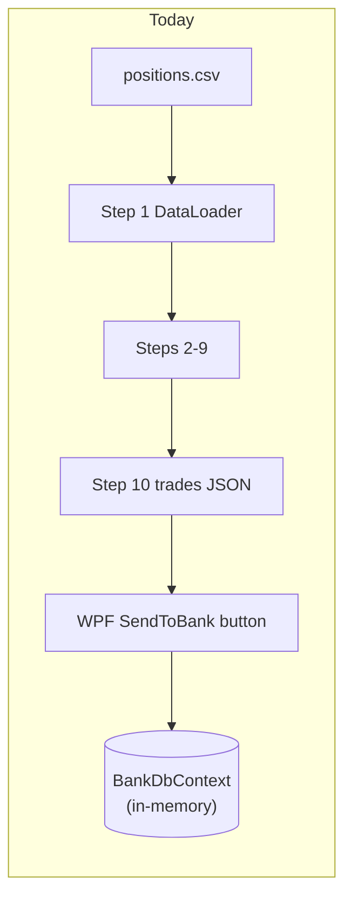
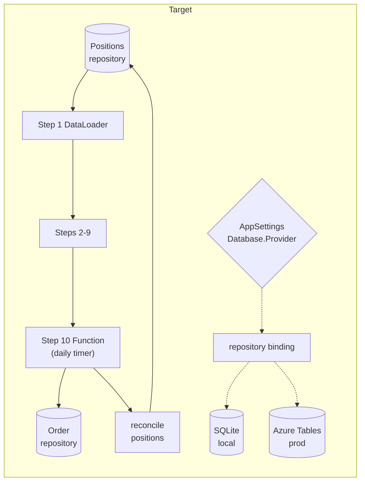
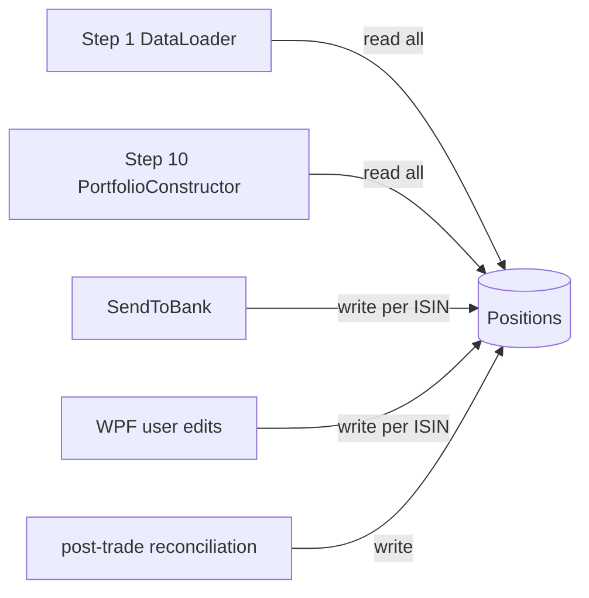
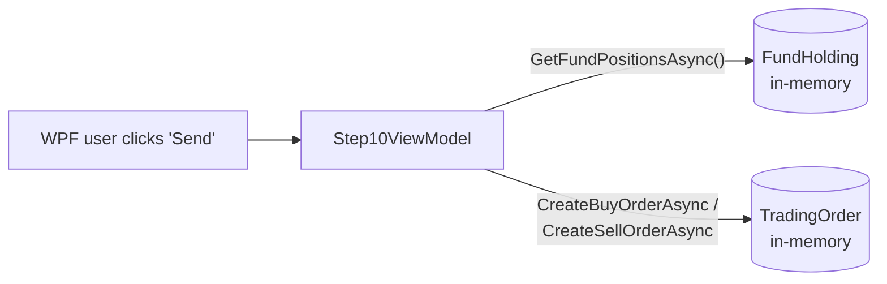
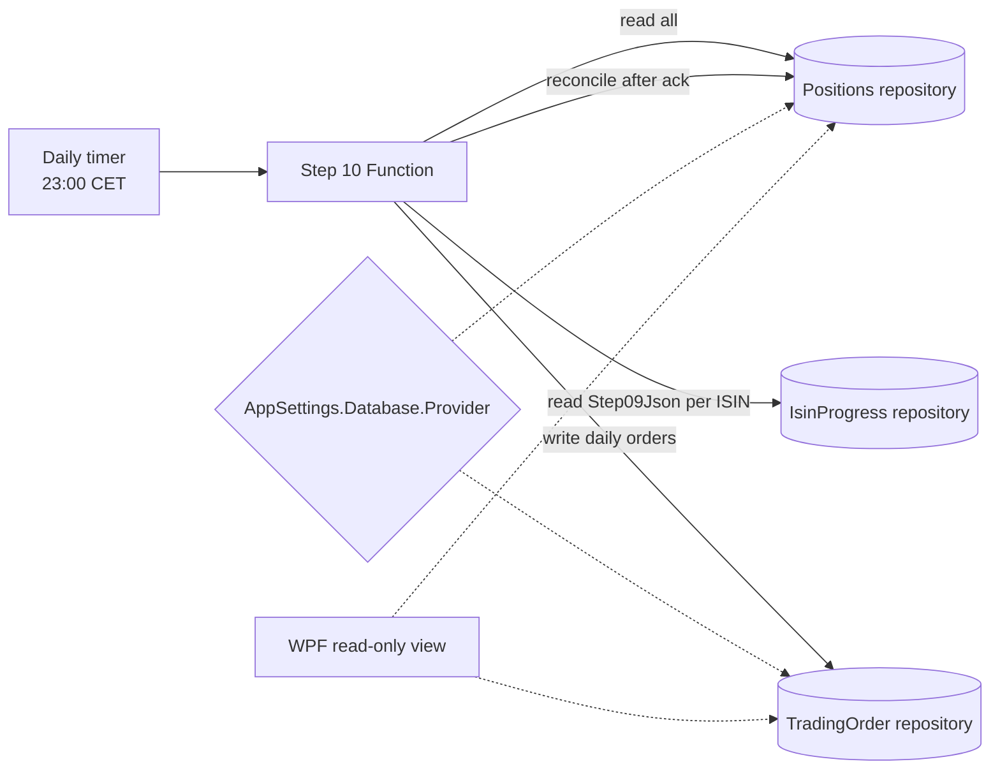

<!--
  STATUS: NEW FEATURE — PLANNING ONLY.
  No code exists yet for this migration. This document is a design sketch.

  Authoring rules for AI assistants and humans editing this file:
  - DO NOT write code (no C#, no XAML, no JSON config snippets, no shell).
  - DO use Mermaid diagrams to express architecture, flows, and state.
  - Prose stays at the "what / why / where it lives" level — no API
    signatures, no class names, no method bodies. Implementation belongs
    in a follow-up doc once this plan is agreed on.
  - DO NOT modify other documents from this plan. Cross-references are
    one-way: link out from this file to other docs, but never edit those
    other docs to point back here.
  - DO NOT invent architecture. If a piece of the flow is not yet decided,
    write it as an open question, not as a confident design.
-->

# Storage Migration & Positions Table — Feature Plan

> **Related:**
> - [Docs/backend-nav-sync-plan.md](./backend-nav-sync-plan.md) — the
>   queue-driven Function pipeline this storage feeds.
> - [FikaFinans.InfrastructureV2.Tests/docs/pipeline-plan.md](../FikaFinans.InfrastructureV2.Tests/docs/pipeline-plan.md) —
>   the 10-step pipeline that reads positions in Step 1 and writes orders
>   in Step 10.

## Context

Three things in the current codebase don't match where the rest of the
plan is heading:

1. **There is no SQLite database today.** `BankDbContext` uses
   `UseInMemoryDatabase("FikaFinansBankDb")` —
   [BankDbContext.cs](../FikaFinans.Infrastructure/Bank/Persistence/BankDbContext.cs).
   No `.db` file on disk, no EF migrations folder. State evaporates on
   process exit. "Migrating to SQLite" is a first-time install, not a
   schema change.
2. **Positions are still a CSV input.**
   [PositionsCsvParser.cs](../FikaFinans.Infrastructure/Pipeline/Csv/PositionsCsvParser.cs)
   feeds Step 1; nothing reads positions from a table.
3. **SendToBank lives in WPF.**
   [Step10PortfolioConstructorViewModel.cs](../FikaFinans.Wpf/ViewModels/Steps/Step10PortfolioConstructorViewModel.cs)
   maps trades to `TradingOrder` rows on a button click. The pipeline
   backend that
   [backend-nav-sync-plan.md](./backend-nav-sync-plan.md) plans for has
   no order-submission path of its own.

This document plans:

- A pluggable storage layer — **SQLite locally, Azure Tables in
  production, switched by config**.
- A first-class **Positions table** that replaces `positions.csv` and
  the existing `FundHolding` EF entity.
- Moving Step 10's order-submission logic out of WPF and into the
  daily Step 10 Function from
  [backend-nav-sync-plan.md](./backend-nav-sync-plan.md).
- The migration order — local SQLite first, then positions, then
  Step 10 rewiring, then the Azure Tables backend behind the same
  contract.

## Today vs target

## Storage abstraction

The contract that lets the two backends swap. Reuses the rules from
[backend-nav-sync-plan.md §Storage](./backend-nav-sync-plan.md#storage--azure-tables--local-sqlite-mirror)
with one deliberate divergence (no ETag — see §3.1).

- One repository interface per logical entity (Positions, Orders,
  per-ISIN progress, etc.).
- No FKs, no navigation properties, no joins, no `IQueryable` leaks
  across the contract boundary.
- `PartitionKey` and `RowKey` are real properties on every entity. Same
  POCO serializes to both stores.
- Tables-shaped writes only — batch ops scoped to a single partition,
  ≤100 entities, ≤4 MB. SQLite layer pretends to honour the same cap
  so behaviour matches in both modes.

The existing `BankDbContext` relies on EF features (cascade deletes,
FK relations on `Fund`/`NavSnapshot`/`Transaction`/`JournalEntry`)
that the new contract forbids. Those entities are reshaped, not
preserved.

### 3.1 Entity-shape gap — keys reshape, no ETag

Current EF entities use surrogate `Guid Id` keys
([AccountConfiguration.cs](../FikaFinans.Infrastructure/Bank/Persistence/Configurations/AccountConfiguration.cs)
and the other six configurations). Azure Tables wants `PartitionKey`
+ `RowKey`. The migration picks a natural two-part key for every
entity and retires the surrogate `Guid Id`.

**Decision: no ETag on any DTO.** Last-write-wins everywhere.

The Azure Tables service still maintains its internal ETag on every
row — we cannot turn that off and don't try to. What we control is
whether *our writes check it*: every Tables write passes the wildcard
`ETag.All`, so writes never gate on the prior value. SQLite/EF gets
no `[ConcurrencyCheck]` column, so its UPDATE statements use only
the PK in their `WHERE` clause. **Both backends end up identical:
reading is non-locking, writing always succeeds, latest write wins.**

Why this is safe here:

- `Account`, `TradingOrder`, `Positions`, `Transaction`,
  `JournalEntry` — single writer at a time (WPF user action, or the
  daily Step 10 Function, never both). No racing reads-then-writes.
- `IsinProgress` — even if two queue workers both claim the same
  ISIN, they would write the same thing (`State = Processing`) and
  run the same pipeline on the same inputs. The Step JSON columns
  the second worker writes match what the first wrote. Latest write
  is still correct.

We give up the ability to detect "someone else wrote this row
between my read and my write." No code path needs that signal today.

`Timestamp` is kept only where it has independent diagnostic value
(`Positions.LastUpdatedAt`, `TradingOrder.SubmittedAt`,
`IsinProgress.ProcessingStartedAt`). Not a universal property.

### 3.2 Per-entity key shapes

| Entity | `PartitionKey` | `RowKey` | Timestamp |
| --- | --- | --- | --- |
| `Account` | `"accounts"` (single-portfolio) | account `Code` (already unique) | — |
| `TradingOrder` | `"orders/{yyyy-MM-dd}"` | composite `(isin, side)` for daily idempotency | `SubmittedAt` |
| `Transaction` | `"ledger/{yyyy-MM}"` | `Guid` surrogate | service-stamped |
| `JournalEntry` | same partition as parent `Transaction` | `Guid` | — |
| `Positions` | `"positions"` | ISIN (or `"CASH"`) | `LastUpdatedAt` |
| `IsinProgress` | `"isin-progress"` | ISIN | `ProcessingStartedAt` |

### 3.3 What's lost from EF

Cascade deletes, navigation properties, LINQ joins, and lazy loading
all disappear at the contract boundary. Code today that does (e.g.)
`account.Transactions` via a navigation property has to switch to a
partition scan against `Transactions` keyed by account. Real
refactor, not a config change.

Why we accept the reshape: Azure Tables literally cannot honour
the EF features — no joins, no FKs, no cross-partition transactions.
If the local SQLite store relies on those features, behaviour
diverges between local and prod, which is exactly what the storage
abstraction exists to prevent.

## Schema map

| Today (EF in-memory) | Target | Notes |
| --- | --- | --- |
| `Account` | `Account` (kept, repo-fronted) | Bank-sim ledger root. Reshaped per §3.2. |
| `Fund` | dropped | Pipeline reads fund metadata from YR endpoint per [backend-nav-sync-plan.md §Data Fetch](./backend-nav-sync-plan.md#data-fetch--yr-fund-endpoint). No live consumer. |
| `NavSnapshot` | dropped | NAV history flows through pipeline state, not a long-lived table. |
| `FundHolding` | replaced by `Positions` (see §5) | Same data role; new shape, new consumer surface. |
| `TradingOrder` | `TradingOrder` (kept, repo-fronted) | Output of Step 10's SendToBank. Backend pluggable. |
| `Transaction`, `JournalEntry` | kept (bank-sim only) | Internal accounting; not on the pipeline path. |
| _(none)_ | `IsinProgress` | New. Per-ISIN row from [backend-nav-sync-plan.md §Progress Table](./backend-nav-sync-plan.md#progress-table--per-isin-state) — state + Step01Json…Step09Json + RunId. |
| _(none)_ | `PortfolioTrades` | New. Step 10 daily output. PK/RK shape an open question — see §10. |

## Positions table

The headline addition. Replaces `positions.csv`.

### 5.1 Shape

Per-ISIN holdings + a single Cash pseudo-row. Same partition,
distinguished by `RowKey`.

| Column | Notes |
| --- | --- |
| `PartitionKey` | constant `"positions"` (single-portfolio assumption) |
| `RowKey` | ISIN; `"CASH"` for the cash pseudo-row |
| `Isin` | mirrors `RowKey` for non-cash rows; null/empty on Cash |
| `Name` | display name; `"Cash"` on the cash row |
| `CurrentValueKr` | required |
| `CostBasisKr` | required for fund rows; equals current value on the cash row by convention |
| `LastUpdatedAt` | timestamp of the last reconciliation |
| `Source` | `"manual"` / `"sendToBank"` / `"reconciled"` — provenance of the latest write |

The Cash row keeps its semantics from
[PositionsCsvParser.cs:24-35](../FikaFinans.Infrastructure/Pipeline/Csv/PositionsCsvParser.cs#L24)
— at most one, value carried as `cash_available_kr` into Step 1.

### 5.2 Lifecycle

- **Step 1 (DataLoader)** reads the partition. Replaces the CSV
  parse. Internal data shape exposed to downstream agents stays the
  same.
- **Step 10 (PortfolioConstructor)** reads positions for current-value
  math when sizing trades. Today this flows transitively through Step
  9's enriched output per
  [pipeline-plan.md §4.10](../FikaFinans.InfrastructureV2.Tests/docs/pipeline-plan.md);
  Step 10 also reads the table directly for authoritative current
  values when needed.
- **SendToBank** writes the table after orders are submitted (post-trade
  reconciliation). Reconciliation trigger — synchronous after order
  ack vs. event callback from the bank stub — is an open question.
- **WPF user edits** write through the same repository when the active
  binding is SQLite.

### 5.3 Why a separate partition, not the per-ISIN progress row

- **Different lifecycles.** The progress row is cleared at run start
  (per [backend-nav-sync-plan.md §"Run boundary"](./backend-nav-sync-plan.md#run-boundary)).
  Positions must survive across runs.
- **Different writers.** The progress row is owned by pipeline
  Functions. Positions are owned by SendToBank + manual user edits.
- **Different read shapes.** Step 1 wants *all* positions in one
  partition scan. Progress-row reads are PK lookups per ISIN.

### 5.4 The table is the canonical input — CSV stops being a runtime concept

**Both Azure (Step 1 in the Function) and WPF read positions
exclusively from the table.** No code path resolves them through a
CSV file. The CSV format is not a parallel input, not a fallback,
not an emergency seed mechanism. Once this section lands,
`positions.csv` ceases to exist as a runtime concept.

Where CSV-shaped data still appears, it is generated *from* the
table on the fly:

- **Diagnostic exports.** A WPF "export current positions" action
  serializes the table to CSV for human inspection. One-way; reads
  from the table, never written back.
- **Internal conversions inside the pipeline.** If any agent's
  internal contract still wants a CSV-shaped DTO
  (`PositionsParseResult` today), an in-memory adapter projects table
  rows into that shape at the Step 1 boundary. The CSV-flavoured DTO
  becomes an internal data-transfer detail, not a file format.

**Test fixtures.**
[FikaFinans.InfrastructureV2.Tests](../FikaFinans.InfrastructureV2.Tests/)
today loads `docs/inputs/positions.csv`. The test setup migrates:
tests seed an in-memory positions repository directly via small
builder helpers (or, transitionally, via a CSV-to-repository adapter
that lives in test-only code). Existing `positions.csv` fixtures may
stay as historical references but are no longer wired into the
runtime path.

**Production seed strategy.** First production run has an empty
positions table. The first SendToBank cycle populates it; or, if
we choose, an admin endpoint accepts a one-shot bulk-write call to
prime it. There is no "import positions.csv" runtime path.

**Net effect.**
[PositionsCsvParser.cs](../FikaFinans.Infrastructure/Pipeline/Csv/PositionsCsvParser.cs)
and the `multiple_cash_rows` halt branch lose their runtime caller.
They survive only if the test-fixture adapter keeps using them;
otherwise they're deleted in the same phase that introduces the
table.

## Step 10 + SendToBank rewiring

What moves and where.

### 6.1 Today

Manual-only. Backend: in-memory `BankDbContext`. State evaporates on
exit.

### 6.2 Target

Step 10 Function (daily timer per
[backend-nav-sync-plan.md §"Step 10 — Daily Portfolio Trades"](./backend-nav-sync-plan.md#step-10--daily-portfolio-trades))
owns the path from Step 09 output to submitted order. WPF becomes
display-only by default. Whether a manual "send" trigger still exists
in WPF for ad-hoc local runs is an open question (see §10).

### 6.3 Idempotency and re-runs

Step 10 is idempotent at the day level (per backend-nav-sync-plan.md).
Re-running on the same day overwrites the same `TradingOrder` rows
rather than creating duplicates. The `(date, isin, side)` `RowKey`
shape from §3.2 enforces this — a second run hits the same row and
overwrites it.

### 6.4 Local vs prod, switched by config

Same Function logic. DI swap selects the SQLite or Azure Tables
binding for each repository. The config knob is
`AppSettings.Database.Provider` — already exists at
[AppSettings.cs](../FikaFinans.Application/Settings/AppSettings.cs)
with default `"InMemory"` today; new values `"Sqlite"` and
`"AzureTables"` join the enum and `"InMemory"` retires once the new
path is in.

## Configuration switching

- `AppSettings.Database.Provider` ∈ `{"Sqlite", "AzureTables"}`.
- For SQLite: `AppSettings.Database.Path` is the file path. Schema
  applied at startup via `EnsureCreated`-style check; no migrations
  initially. "Introduce EF migrations once the schema stabilises" is
  a follow-up.
- For Azure Tables: storage-account connection from managed identity
  per
  [backend-nav-sync-plan.md §Infrastructure Summary](./backend-nav-sync-plan.md#infrastructure-summary).
- Module wiring lives in
  [InfrastructureModule.cs](../FikaFinans.Infrastructure/DependencyInjection/InfrastructureModule.cs).
  One binding per repository per provider.

## Migration phases

Each phase is independently mergeable and testable. Only ordering
constraint: Phase 4 needs Phase 3.

1. **Stand up real SQLite locally.** Replace `UseInMemoryDatabase`
   with `UseSqlite` against
   `%LOCALAPPDATA%\FikaFinans\fikafinans.db`. Keep the existing 7
   tables for now — this phase is purely "stop losing state on exit."
2. **Introduce the repository abstraction.** Each `BankDbContext`
   consumer migrates to a repository interface, even if SQLite/EF is
   the only implementation for now. Sets up the swap point.
3. **Add the Positions table; switch Step 1 onto it.** Stop using
   `FundHolding` from the pipeline path. Stop using `positions.csv`
   from the runtime path entirely (per §5.4). Tests seed the
   repository directly; production starts with an empty table that
   SendToBank populates on first run.
4. **Move SendToBank into the Step 10 Function.** Function reads
   Positions, writes `TradingOrder`. WPF becomes the read-only view
   (or keeps a manual trigger — open question in §10).
5. **Drop `Fund`, `NavSnapshot`, `FundHolding`** once nothing reads
   them.
6. **Add the Azure Tables implementation behind each repository
   interface.** DI swap by config. SQLite stays as the local-dev
   path.
7. **Per-ISIN progress row + step JSON columns** land in the same
   table-fronted contract as the rest of the data. This is when
   [backend-nav-sync-plan.md](./backend-nav-sync-plan.md)'s storage
   section becomes real.

## Test strategy

- **Unit tests** stay against the repository interface — the same
  test hits both backends (Tables hits Azurite locally; the existing
  dev environment already has Azurite per the repo
  [CLAUDE.md](../CLAUDE.md)).
- **InfrastructureV2.Tests fixtures move to repository seeding.**
  Today's tests under
  [FikaFinans.InfrastructureV2.Tests/Agents/01-dataloader](../FikaFinans.InfrastructureV2.Tests/Agents/01-dataloader/)
  load `docs/inputs/positions.csv`. The new setup populates an
  in-memory positions repository via small builder helpers (or,
  transitionally, a CSV-to-repository adapter in test-only code).
  The runtime path never sees a CSV regardless.
- **A round-trip test for SendToBank** asserts: trade computed →
  TradingOrder written → positions reconciled → second run on the
  same day produces no duplicate orders.

## Open questions

- **Manual SendToBank trigger in WPF** — kept or removed?
- **`TradingOrder` `RowKey` exact form.** Working assumption:
  composite `(isin, side)` per §3.2. Edge case: two trades for the
  same ISIN+side in the same day (rare; PartialSell scenarios) — does
  the second overwrite the first, or do we add a sequence suffix?
- **Reconciliation trigger** — synchronous after ack vs event
  callback from the bank stub.
- **Cash row representation** — `RowKey = "CASH"` vs sentinel ISIN
  vs separate row outside the partition. Lean toward the first.
- **SQLite schema-evolution strategy** — `EnsureCreated` initially;
  proper EF migrations later. When?
- **Storage-account split.** Whether `Account` /
  `Transaction` / `JournalEntry` (the bank-sim ledger) belong in the
  same storage account as the pipeline state, or in a separate one
  for blast-radius reasons.
- **`PortfolioTrades` PK/RK shape.** Single daily row vs per-ISIN
  column — already tracked in
  [backend-nav-sync-plan.md §"Step 10 — Daily Portfolio Trades"](./backend-nav-sync-plan.md#step-10--daily-portfolio-trades).

## Out of scope

- The wire format of orders sent to a real bank/broker. Today's
  `ITradingService` is a local stub; replacing it with a real
  integration is a separate doc.
- Backups and disaster recovery for either the SQLite file or the
  Azure Tables data.
- WPF UI changes beyond "this view becomes read-only" — visual
  design is out of scope.
- Any code, ARM/Bicep, or DI snippets — same rule as
  [backend-nav-sync-plan.md](./backend-nav-sync-plan.md).
