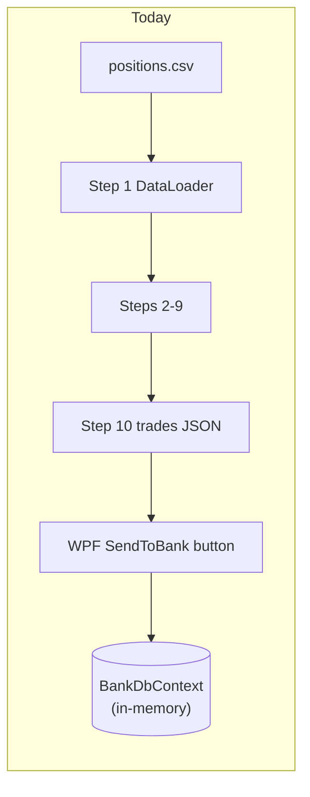
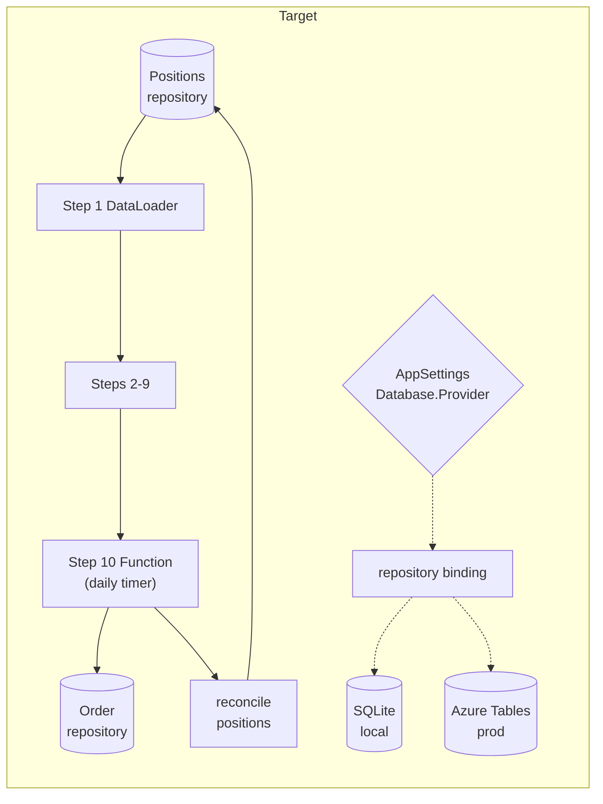
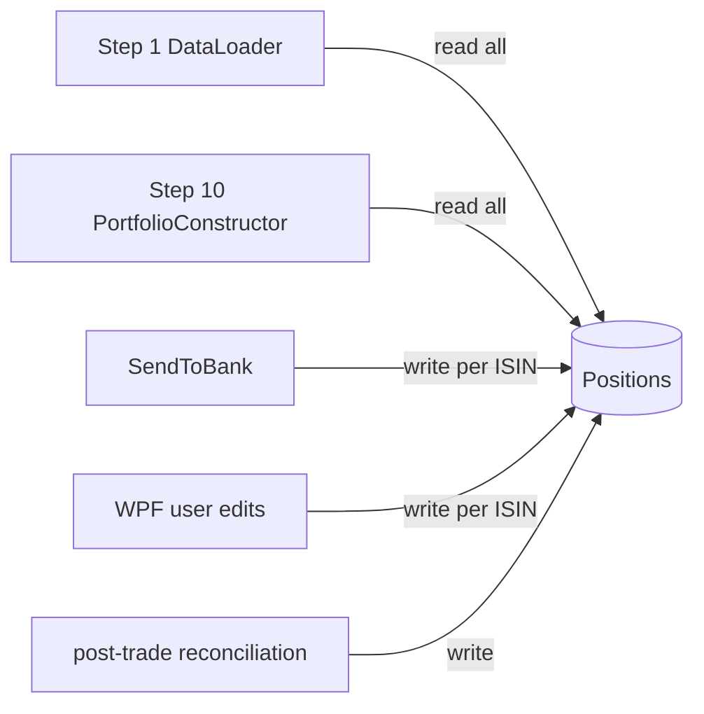
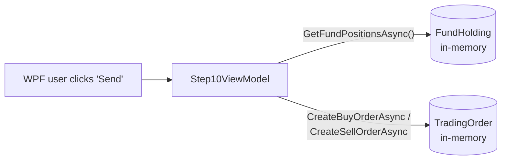
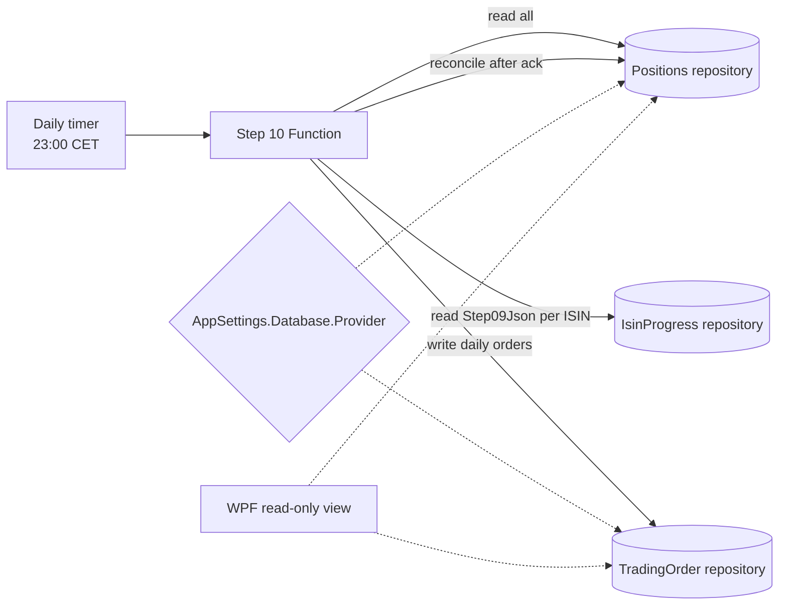
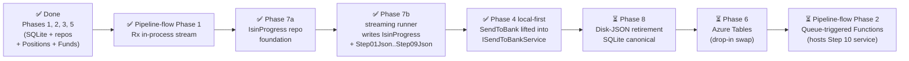

<!--
  STATUS: PHASES 1+2+3+5 SHIPPED 2026-05-10..2026-05-13. Phase 7
  (IsinProgress row + Step01Json…Step09Json inline columns)
  shipped 2026-05-26. Phase 4 local-first slice shipped 2026-05-27 —
  SendToBank submit loop lifted into ISendToBankService /
  SendToBankService (Application layer); WPF button now a thin
  caller; the eventual Function host is just a second caller. The
  cloud-hosted half (daily timer + reconciliation trigger
  decision) is blocked on Pipeline Phase 2. Phase 8 (disk-JSON
  retirement — SQLite becomes the canonical step-output source)
  scoped 2026-05-30; not yet started. Phase 6 (Azure Tables) still
  open and remains last per the agreed sequence. Per-phase status
  is annotated inline in §8 (Migration phases).

  AGREED SEQUENCE (2026-05-24): local-first. Tables (Phase 6) is the LAST
  step before the cloud deploy. The intent is to land Pipeline-flow Phase 1
  (Rx), Storage Phase 7 (IsinProgress + step JSON columns in SQLite), and
  Storage Phase 4 (SendToBank out of WPF) end-to-end on SQLite before
  swapping the binding to Azure Tables. See §8 "Recommended sequence."

  Authoring rules for AI assistants and humans editing this file:
  - DO NOT write code (no C#, no XAML, no JSON config snippets, no shell).
  - DO use Mermaid diagrams to express architecture, flows, and state.
  - Prose stays at the "what / why / where it lives" level — no API
    signatures, no class names, no method bodies. Implementation lives
    alongside the code; this doc captures the intent.
  - DO NOT modify other documents from this plan. Cross-references are
    one-way: link out from this file to other docs, but never edit those
    other docs to point back here.
  - DO NOT invent architecture. If a piece of the flow is not yet decided,
    write it as an open question, not as a confident design.
  - When marking a phase done, link to the relevant code in the repo so
    the doc stays a navigable map of what landed.
-->

# Storage Migration & Positions Table — Feature Plan

> **Related:**
> - [Docs/backend-nav-sync-plan.md](./backend-nav-sync-plan.md) — the
>   queue-driven Function pipeline this storage feeds.
> - [FikaFinans.InfrastructureV2.Tests/docs/pipeline-plan.md](../FikaFinans.InfrastructureV2.Tests/docs/pipeline-plan.md) —
>   the 10-step pipeline that reads positions in Step 1 and writes orders
>   in Step 10.

## Context

Three things in the current codebase don't match where the rest of the
plan is heading:

1. **There is no SQLite database today.** `BankDbContext` uses
   `UseInMemoryDatabase("FikaFinansBankDb")` —
   [BankDbContext.cs](../FikaFinans.Infrastructure/Bank/Persistence/BankDbContext.cs).
   No `.db` file on disk, no EF migrations folder. State evaporates on
   process exit. "Migrating to SQLite" is a first-time install, not a
   schema change.
2. **Positions are still a CSV input.**
   [PositionsCsvParser.cs](../FikaFinans.Infrastructure/Pipeline/Csv/PositionsCsvParser.cs)
   feeds Step 1; nothing reads positions from a table.
3. **SendToBank lives in WPF.**
   [Step10PortfolioConstructorViewModel.cs](../FikaFinans.Wpf/ViewModels/Steps/Step10PortfolioConstructorViewModel.cs)
   maps trades to `TradingOrder` rows on a button click. The pipeline
   backend that
   [backend-nav-sync-plan.md](./backend-nav-sync-plan.md) plans for has
   no order-submission path of its own.

This document plans:

- A pluggable storage layer — **SQLite locally, Azure Tables in
  production, switched by config**.
- A first-class **Positions table** that replaces `positions.csv` and
  the existing `FundHolding` EF entity.
- Moving Step 10's order-submission logic out of WPF and into the
  daily Step 10 Function from
  [backend-nav-sync-plan.md](./backend-nav-sync-plan.md).
- The migration order — local SQLite first, then positions, then
  Step 10 rewiring, then the Azure Tables backend behind the same
  contract.

## Today vs target

```mermaid
flowchart LR
  subgraph today[Today]
    csv["positions.csv"] --> step1a["Step 1 DataLoader"]
    step1a --> stepN["Steps 2-9"]
    stepN --> step10a["Step 10 trades JSON"]
    step10a --> wpfa["WPF SendToBank button"]
    wpfa --> mem[("BankDbContext<br/>(in-memory)")]
  end
```

```mermaid
flowchart LR
  subgraph target[Target]
    pos[("Positions<br/>repository")] --> step1b["Step 1 DataLoader"]
    step1b --> stepNb["Steps 2-9"]
    stepNb --> step10b["Step 10 Function<br/>(daily timer)"]
    step10b --> ord[("Order<br/>repository")]
    step10b --> recon["reconcile<br/>positions"]
    recon --> pos
    cfg{"AppSettings<br/>Database.Provider"} -.-> repos["repository binding"]
    repos -.-> sqlite[("SQLite<br/>local")]
    repos -.-> tables[("Azure Tables<br/>prod")]
  end
```

## Storage abstraction

The contract that lets the two backends swap. Reuses the rules from
[backend-nav-sync-plan.md §Storage](./backend-nav-sync-plan.md#storage--azure-tables--local-sqlite-mirror)
with one deliberate divergence (no ETag — see §3.1).

- One repository interface per logical entity (Positions, Orders,
  per-ISIN progress, etc.).
- No FKs, no navigation properties, no joins, no `IQueryable` leaks
  across the contract boundary.
- `PartitionKey` and `RowKey` are real properties on every entity. Same
  POCO serializes to both stores.
- Tables-shaped writes only — batch ops scoped to a single partition,
  ≤100 entities, ≤4 MB. SQLite layer pretends to honour the same cap
  so behaviour matches in both modes.

The existing `BankDbContext` relies on EF features (cascade deletes,
FK relations on `Fund`/`NavSnapshot`/`Transaction`/`JournalEntry`)
that the new contract forbids. Those entities are reshaped, not
preserved.

### 3.1 Entity-shape gap — keys reshape, no ETag

Current EF entities use surrogate `Guid Id` keys
([AccountConfiguration.cs](../FikaFinans.Infrastructure/Bank/Persistence/Configurations/AccountConfiguration.cs)
and the other six configurations). Azure Tables wants `PartitionKey`
+ `RowKey`. The migration picks a natural two-part key for every
entity and retires the surrogate `Guid Id`.

**Decision: no ETag on any DTO.** Last-write-wins everywhere.

The Azure Tables service still maintains its internal ETag on every
row — we cannot turn that off and don't try to. What we control is
whether *our writes check it*: every Tables write passes the wildcard
`ETag.All`, so writes never gate on the prior value. SQLite/EF gets
no `[ConcurrencyCheck]` column, so its UPDATE statements use only
the PK in their `WHERE` clause. **Both backends end up identical:
reading is non-locking, writing always succeeds, latest write wins.**

Why this is safe here:

- `Account`, `TradingOrder`, `Positions`, `Transaction`,
  `JournalEntry` — single writer at a time (WPF user action, or the
  daily Step 10 Function, never both). No racing reads-then-writes.
- `IsinProgress` — even if two queue workers both claim the same
  ISIN, they would write the same thing (`State = Processing`) and
  run the same pipeline on the same inputs. The Step JSON columns
  the second worker writes match what the first wrote. Latest write
  is still correct.

We give up the ability to detect "someone else wrote this row
between my read and my write." No code path needs that signal today.

`Timestamp` is kept only where it has independent diagnostic value
(`Positions.LastUpdatedAt`, `TradingOrder.SubmittedAt`,
`IsinProgress.ProcessingStartedAt`). Not a universal property.

### 3.2 Per-entity key shapes

| Entity | `PartitionKey` | `RowKey` | Timestamp |
| --- | --- | --- | --- |
| `Account` | `"accounts"` (single-portfolio) | account `Code` (already unique) | — |
| `TradingOrder` | `"orders/{yyyy-MM-dd}"` | composite `(isin, side)` for daily idempotency | `SubmittedAt` |
| `Transaction` | `"ledger/{yyyy-MM}"` | `Guid` surrogate | service-stamped |
| `JournalEntry` | same partition as parent `Transaction` | `Guid` | — |
| `Positions` | `"positions"` | ISIN (or `"CASH"`) | `LastUpdatedAt` |
| `IsinProgress` | `"isin-progress"` | ISIN | `ProcessingStartedAt` |

### 3.3 What's lost from EF

Cascade deletes, navigation properties, LINQ joins, and lazy loading
all disappear at the contract boundary. Code today that does (e.g.)
`account.Transactions` via a navigation property has to switch to a
partition scan against `Transactions` keyed by account. Real
refactor, not a config change.

Why we accept the reshape: Azure Tables literally cannot honour
the EF features — no joins, no FKs, no cross-partition transactions.
If the local SQLite store relies on those features, behaviour
diverges between local and prod, which is exactly what the storage
abstraction exists to prevent.

## Schema map

| Today (EF, SQLite-backed) | Target | Notes |
| --- | --- | --- |
| `Account` | `Account` (kept, repo-fronted) ✅ | Bank-sim ledger root. Reshaped per §3.2. |
| `Fund` | `Fund` (kept, repo-fronted) ✅ | Done 2026-05-13. Phase 5 introduced `IFundsRepository` + typed lookups (`GetByIsinAsync(Isin)`, `GetByIdAsync(FundId)`, `GetLatestNavByFundIdAsync`). Domain `Fund` survives as the rehydrated aggregate; EF mapping remains but `_dbFactory` is gone from all four bank-sim consumers. Pipeline still reads fund metadata from YR endpoint per [backend-nav-sync-plan.md §Data Fetch](./backend-nav-sync-plan.md#data-fetch--yr-fund-endpoint). |
| `NavSnapshot` | `NavSnapshot` (kept, repo-fronted) ✅ | Done 2026-05-13. Cascade FK from `Fund` → `NavHistory` dropped; `NavSnapshot` is now a top-level `DbSet` indexed on `FundId`. `Fund.NavHistory` is `Ignore`d in EF — the repo populates the backing field manually via `Fund.Rehydrate(...)` when needed. NAV history lives at partition `"nav/{isin}"`. |
| `FundHolding` | replaced by `Positions` ✅ | Done 2026-05-10. EF `DbSet`, configuration, and domain type all deleted. |
| `TradingOrder` | `TradingOrder` (kept, repo-fronted) ✅ | Output of Step 10's SendToBank. Written via `ISendToBankService` (Phase 4a, 2026-05-27) — same code path for the WPF button and the eventual daily Function. Backend pluggable (Phase 6). |
| `Transaction`, `JournalEntry` | kept (bank-sim only) ✅ | Repo-fronted; cascade-FK nav prop replaced by two-reads + in-memory join in `LedgerService`. |
| _(none)_ | `IsinProgress` ✅ (2026-05-26) | Repo + SQLite table + streaming-runner integration shipped. Per-ISIN row from [backend-nav-sync-plan.md §Progress Table](./backend-nav-sync-plan.md#progress-table--per-isin-state) — state + Step01Json…Step09Json + RunId. Written by `PipelineRunner.RunAllStreamingAsync` at four boundaries: claim post-Step-1, block columns post per-ISIN merge, Step09Json post-Step-9, release post-Step-10. |
| _(none)_ | `PortfolioTrades` | New. Step 10 daily output. PK/RK shape an open question — see §10. Phase 4. |

## Positions table

The headline addition. Replaces `positions.csv`.

### 5.1 Shape

Per-ISIN holdings + a single Cash pseudo-row. Same partition,
distinguished by `RowKey`.

| Column | Notes |
| --- | --- |
| `PartitionKey` | constant `"positions"` (single-portfolio assumption) |
| `RowKey` | ISIN; `"CASH"` for the cash pseudo-row |
| `Isin` | mirrors `RowKey` for non-cash rows; null/empty on Cash |
| `Name` | display name; `"Cash"` on the cash row |
| `CurrentValueKr` | required |
| `CostBasisKr` | required for fund rows; equals current value on the cash row by convention |
| `LastUpdatedAt` | timestamp of the last reconciliation |
| `Source` | `"manual"` / `"sendToBank"` / `"reconciled"` — provenance of the latest write |

The Cash row keeps its semantics from
[PositionsCsvParser.cs:24-35](../FikaFinans.Infrastructure/Pipeline/Csv/PositionsCsvParser.cs#L24)
— at most one, value carried as `cash_available_kr` into Step 1.

### 5.2 Lifecycle

```mermaid
flowchart LR
  s1["Step 1 DataLoader"] -->|read all| pos[("Positions")]
  s10r["Step 10 PortfolioConstructor"] -->|read all| pos
  send["SendToBank"] -->|write per ISIN| pos
  wpf["WPF user edits"] -->|write per ISIN| pos
  recon["post-trade reconciliation"] -->|write| pos
```

- **Step 1 (DataLoader)** reads the partition. Replaces the CSV
  parse. Internal data shape exposed to downstream agents stays the
  same.
- **Step 10 (PortfolioConstructor)** reads positions for current-value
  math when sizing trades. Today this flows transitively through Step
  9's enriched output per
  [pipeline-plan.md §4.10](../FikaFinans.InfrastructureV2.Tests/docs/pipeline-plan.md);
  Step 10 also reads the table directly for authoritative current
  values when needed.
- **SendToBank** writes the table after orders are submitted (post-trade
  reconciliation). Reconciliation trigger — synchronous after order
  ack vs. event callback from the bank stub — is an open question.
- **WPF user edits** write through the same repository when the active
  binding is SQLite.

### 5.3 Why a separate partition, not the per-ISIN progress row

- **Different lifecycles.** The progress row is cleared at run start
  (per [backend-nav-sync-plan.md §"Run boundary"](./backend-nav-sync-plan.md#run-boundary)).
  Positions must survive across runs.
- **Different writers.** The progress row is owned by pipeline
  Functions. Positions are owned by SendToBank + manual user edits.
- **Different read shapes.** Step 1 wants *all* positions in one
  partition scan. Progress-row reads are PK lookups per ISIN.

### 5.4 The table is the canonical input — CSV stops being a runtime concept ✅ Done — 2026-05-10

**Both Azure (Step 1 in the Function) and WPF read positions
exclusively from the table.** No code path resolves them through a
CSV file at runtime. The CSV format is not a parallel input, not a
fallback, not an emergency read.

Where CSV-shaped data still appears, it is generated *from* the
table on the fly:

- **Diagnostic exports.** A WPF "export current positions" action
  serializes the table to CSV for human inspection. One-way; reads
  from the table, never written back.
- **Internal conversions inside the pipeline.** If any agent's
  internal contract still wants a CSV-shaped DTO
  (`PositionsParseResult` today), an in-memory adapter projects table
  rows into that shape at the Step 1 boundary. The CSV-flavoured DTO
  becomes an internal data-transfer detail, not a file format.

**Test fixtures.**
[FikaFinans.InfrastructureV2.Tests](../FikaFinans.InfrastructureV2.Tests/)
today loads `docs/inputs/positions.csv`. The test setup migrates:
tests seed an in-memory positions repository directly via small
builder helpers (or, transitionally, via a CSV-to-repository adapter
that lives in test-only code). Existing `positions.csv` fixtures may
stay as historical references but are no longer wired into the
runtime path.

**Production seed strategy.** First production run has an empty
positions table. The first SendToBank cycle populates it; or, if
we choose, an admin endpoint accepts a one-shot bulk-write call to
prime it. There is no "import positions.csv" runtime path.

**Net effect.**
[PositionsCsvParser.cs](../FikaFinans.Infrastructure/Pipeline/Csv/PositionsCsvParser.cs)
survives — used by
[BankCsvImporter](../FikaFinans.Infrastructure/Bank/BankCsvImporter.cs)'s
one-shot seed, by the test-fixture
`InMemoryPositionsRepository.SeededFromCsv` adapter, and by the
`PositionsCsvParserTests` unit tests. It just has no runtime caller
from the agent pipeline anymore. A new
[PositionsCsvWriter](../FikaFinans.Infrastructure/Pipeline/Csv/PositionsCsvWriter.cs)
mirrors its column shape for the WPF diagnostic export.

## Step 10 + SendToBank rewiring

What moves and where.

### 6.1 Today

```mermaid
flowchart LR
  user["WPF user clicks 'Send'"] --> vm["Step10ViewModel"]
  vm -->|"GetFundPositionsAsync()"| fh[("FundHolding<br/>in-memory")]
  vm -->|"CreateBuyOrderAsync /<br/>CreateSellOrderAsync"| order[("TradingOrder<br/>in-memory")]
```

Manual-only. Backend: in-memory `BankDbContext`. State evaporates on
exit.

### 6.2 Target

```mermaid
flowchart LR
  timer["Daily timer<br/>23:00 CET"] --> fn["Step 10 Function"]
  fn -->|"read all"| pos[("Positions repository")]
  fn -->|"read Step09Json per ISIN"| isin[("IsinProgress repository")]
  fn -->|"write daily orders"| ord[("TradingOrder repository")]
  fn -->|"reconcile after ack"| pos
  cfg{"AppSettings.Database.Provider"} -.-> pos
  cfg -.-> ord
  wpf["WPF read-only view"] -.-> pos
  wpf -.-> ord
```

Step 10 Function (daily timer per
[backend-nav-sync-plan.md §"Step 10 — Daily Portfolio Trades"](./backend-nav-sync-plan.md#step-10--daily-portfolio-trades))
owns the path from Step 09 output to submitted order. WPF becomes
display-only by default. Whether a manual "send" trigger still exists
in WPF for ad-hoc local runs is an open question (see §10).

### 6.3 Idempotency and re-runs

Step 10 is idempotent at the day level (per backend-nav-sync-plan.md).
Re-running on the same day overwrites the same `TradingOrder` rows
rather than creating duplicates. The `(date, isin, side)` `RowKey`
shape from §3.2 enforces this — a second run hits the same row and
overwrites it.

### 6.4 Local vs prod, switched by config

Same Function logic. DI swap selects the SQLite or Azure Tables
binding for each repository. The config knob is
`AppSettings.Database.Provider` — already exists at
[AppSettings.cs](../FikaFinans.Application/Settings/AppSettings.cs)
with default `"InMemory"` today; new values `"Sqlite"` and
`"AzureTables"` join the enum and `"InMemory"` retires once the new
path is in.

## Configuration switching

- `AppSettings.Database.Provider` ∈ `{"Sqlite", "AzureTables"}`.
- For SQLite: `AppSettings.Database.Path` is the file path. Schema
  applied at startup via `EnsureCreated`-style check; no migrations
  initially. "Introduce EF migrations once the schema stabilises" is
  a follow-up.
- For Azure Tables: storage-account connection from managed identity
  per
  [backend-nav-sync-plan.md §Infrastructure Summary](./backend-nav-sync-plan.md#infrastructure-summary).
- Module wiring lives in
  [InfrastructureModule.cs](../FikaFinans.Infrastructure/DependencyInjection/InfrastructureModule.cs).
  One binding per repository per provider.

## Migration phases

Each phase is independently mergeable and testable. The hard ordering
constraint is that Phase 4 needs Phase 3.

### Recommended sequence — local-first, Tables last

Agreed 2026-05-24. The remaining phases land on SQLite end-to-end
first; Azure Tables is the **last** step before the cloud deploy.
The bet: if everything works under SQLite + Rx + WPF, the Tables
swap is mechanical — same repo contract, same POCOs, just a different
binding. Doing Tables earlier would mean debugging Azurite quirks
while the application logic is still in flux.

```mermaid
flowchart LR
  done["✅ Done<br/>Phases 1, 2, 3, 5<br/>(SQLite + repos<br/>+ Positions + Funds)"] --> rx["✅ Pipeline-flow Phase 1<br/>Rx in-process stream"]
  rx --> p7a["✅ Phase 7a<br/>IsinProgress repo<br/>foundation"]
  p7a --> p7b["✅ Phase 7b<br/>streaming runner<br/>writes IsinProgress<br/>+ Step01Json..Step09Json"]
  p7b --> p4local["✅ Phase 4 local-first<br/>SendToBank lifted into<br/>ISendToBankService"]
  p4local --> p8["⏳ Phase 8<br/>Disk-JSON retirement<br/>SQLite canonical"]
  p8 --> p6["⏳ Phase 6<br/>Azure Tables<br/>(drop-in swap)"]
  p6 --> p2["⏳ Pipeline-flow Phase 2<br/>Queue-triggered Functions<br/>(hosts Step 10 service)"]
```

Pipeline-flow phases live in
[pipeline-step-flow-plan.md](./pipeline-step-flow-plan.md); they
interleave with the storage phases because Phase 7's step JSON
columns only earn their keep once a per-ISIN stream is writing to
them.

1. **Stand up real SQLite locally.** ✅ **Done — 2026-05-10.**
   Replaced `UseInMemoryDatabase` with `UseSqlite` against
   `%USERPROFILE%\Documents\FikaFinans\fikafinans.db` (configurable via
   `AppSettings.Database.Path`). All seven `BankDbContext` consumers now
   take an `IDbContextFactory<BankDbContext>` and open a fresh context per
   public method — fixes the singleton-DbContext bug that was unsafe
   under real SQLite. Schema setup via `EnsureCreatedAsync()` in
   `DataSeeder.SeedAsync()`. The existing 7 tables stay as-is — this
   phase is purely "stop losing state on exit." `Provider` setting now
   accepts `Sqlite` (default), `InMemory` (kept for tests), or
   `AzureTables` (placeholder, throws — wired up in Phase 6).
2. **Introduce the repository abstraction.** ✅ **Done — 2026-05-10.**
   Five Tables-shaped repo interfaces under
   [FikaFinans.Application/Storage/Bank](../FikaFinans.Application/Storage/Bank/)
   (`IAccountsRepository`, `ITradingOrdersRepository`,
   `ITransactionsRepository`, `IJournalEntriesRepository`,
   `IPositionsRepository`) plus POCO row entities under
   `…/Storage/Bank/Entities/`. SQLite implementations under
   [FikaFinans.Infrastructure/Storage/Sqlite](../FikaFinans.Infrastructure/Storage/Sqlite/);
   each opens a fresh `BankDbContext` per public method via the
   factory from Phase 1. Bank-sim consumers (`TradingService`,
   `LedgerService`, `PortfolioQueryService`,
   [BankCsvImporter](../FikaFinans.Infrastructure/Bank/BankCsvImporter.cs))
   read/write through the interfaces. `Transaction.Entries` cascade-FK
   nav prop dropped in favour of a two-reads + in-memory join in
   `LedgerService`. Consumers that touch `Fund`/`NavSnapshot` closed
   their `IDbContextFactory<BankDbContext>` dependency under Phase 5 —
   see below.
3. **Add the Positions table; switch Step 1 onto it.** ✅ **Done — 2026-05-10.**
   New
   [PositionRow](../FikaFinans.Infrastructure/Storage/Sqlite/Entities/PositionRow.cs)
   table backs
   [IPositionsRepository](../FikaFinans.Application/Storage/Bank/IPositionsRepository.cs)
   (`PartitionKey = "positions"`; `RowKey = ISIN | "CASH"`). Schema
   carries `Units` + `AvgCostPerUnit` beyond the CSV shape — needed
   for the bank-sim's unit-based sell flow per the chunk-5 design
   note. [DataLoaderAgent](../FikaFinans.Infrastructure/Pipeline/Agents/DataLoaderAgent.cs)
   reads from the repo via an internal `ToPositionsParseResult`
   adapter; the CSV-flavoured `PositionsParseResult` DTO survives only
   as an in-process shape between the adapter and `Join(...)`.
   [BankCsvImporter](../FikaFinans.Infrastructure/Bank/BankCsvImporter.cs)
   is now a one-shot seed — first run reads `positions.csv` and
   upserts; subsequent runs short-circuit. WPF gained a one-way
   "Export Positions CSV" diagnostic that writes
   `%USERPROFILE%\Documents\FikaFinans\exports\positions-{yyyy}-W{ww}.csv`
   via a new
   [PositionsCsvWriter](../FikaFinans.Infrastructure/Pipeline/Csv/PositionsCsvWriter.cs).
   `positions.csv` is no longer a runtime read path — only a seed +
   test-fixture input + diagnostic output, exactly per §5.4.
4. **Move SendToBank into the Step 10 Function.** Split into two
   slices once the SendToBank submit loop turned out to be
   ~50 lines of orchestration over already-Application-shaped
   contracts (`ITradingService`, `IPortfolioQueryService`).

   **4a — Local-first: lift the submit loop into an Application
   service.** ✅ **Done — 2026-05-27.** New
   [`ISendToBankService`](../FikaFinans.Application/Bank/ISendToBankService.cs)
   + [`SendToBankResult`](../FikaFinans.Application/Bank/SendToBankResult.cs)
   contract and
   [`SendToBankService`](../FikaFinans.Application/Bank/SendToBankService.cs)
   implementation live entirely in the Application layer (depends
   only on `ITradingService` + `IPortfolioQueryService`, no WPF or
   Infrastructure leakage). The service walks every trade in a
   `TradesOutput`, maps it to the matching bank-sim
   `FundPositionDto` by ISIN, computes units for Trim / PartialSell
   from each position's NAV-per-unit, and submits the order. Skip
   reasons (Hold/NoOp, missing ISIN, zero-unit math, trading-
   service rejection) are tallied into `SendToBankResult.Skipped`
   and the diagnostic messages aggregated into
   `SendToBankResult.Warnings`.
   [`Step10PortfolioConstructorViewModel`](../FikaFinans.Wpf/ViewModels/Steps/Step10PortfolioConstructorViewModel.cs)
   is now a thin caller: the SendToBank button just awaits
   `_sendToBank.SubmitAsync(_lastOutput)` and writes the result
   into the existing summary text. The VM dropped its
   `ITradingService` / `IPortfolioQueryService` dependencies — the
   service owns them. Autofac singleton wiring in
   [`InfrastructureModule.cs`](../FikaFinans.Infrastructure/DependencyInjection/InfrastructureModule.cs)
   next to the other bank-sim services. 11 NUnit tests in
   [`FikaFinans.Application.Tests/Bank/SendToBankServiceTests.cs`](../FikaFinans.Application.Tests/Bank/SendToBankServiceTests.cs)
   cover every trade-type branch (Buy / TopUp → BuyOrder; Sell →
   SellOrder with full units; Trim / PartialSell → unit math from
   NAV-per-unit; Trim with zero units → silent skip; Hold / NoOp →
   silent skip; missing ISIN → warning + skip count; trading-
   service rejection → warning + skip count; mixed-trades tally;
   null-arg guard).

   Decision (resolved from §10 open question): the WPF manual
   trigger **stays**. Same `SubmitAsync` code path now serves both
   the manual button and the eventual Function — no duplicated
   logic, no fork between local-dev and cloud.

   **4b — Function host (daily timer).** **Not started.** Blocks
   on Pipeline Phase 2 — wraps `ISendToBankService` in a
   timer-triggered Function plus picks the reconciliation trigger
   (synchronous after ack vs event callback from the bank stub —
   still open in §10). With 4a done, the Function shell is a thin
   adapter; the trading logic doesn't move again.
5. **Retire direct EF reads of `Fund`, `NavSnapshot`, `FundHolding`.**
   ✅ **Done — 2026-05-10 (`FundHolding`) + 2026-05-13 (`Fund` /
   `NavSnapshot`).** `FundHolding` is fully deleted (EF `DbSet`,
   configuration, domain type, `FundHoldingId`). `Fund` and
   `NavSnapshot` survive as domain aggregates but are no longer
   reached via direct EF: a single
   [IFundsRepository](../FikaFinans.Application/Storage/Bank/IFundsRepository.cs)
   with typed lookups (`GetByIsinAsync(Isin)`, `GetByIdAsync(FundId)`,
   `GetLatestNavByFundIdAsync(FundId)`, `QueryNavHistoryAsync(Isin)`,
   `UpsertNavAsync`) covers every prior consumer. Implementation in
   [SqliteFundsRepository](../FikaFinans.Infrastructure/Storage/Sqlite/SqliteFundsRepository.cs);
   inserts go through new non-validating
   `Fund.Rehydrate(...)` / `NavSnapshot.Rehydrate(...)` factories.
   `Fund → NavHistory` cascade FK dropped; `NavSnapshot.FundId` is now
   a regular indexed column. All four bank-sim consumers
   (`PortfolioQueryService`, `TradingService` settle, `BankCsvImporter`
   seed, `SettlementEngine`) dropped their
   `IDbContextFactory<BankDbContext>` dependency; `DataSeeder` swapped
   its fund-seeding loop onto the repo (cascade fallout — chart of
   accounts + initial deposit stay on direct EF, fine for a bootstrap).
   Last EF-direct surface in the bank-sim is gone.
6. **Add the Azure Tables implementation behind each repository
   interface.** **Not started.** Five `AzureTables*Repository` classes
   that target Azurite locally / Azure Tables in prod. DI swap by
   config (`AppSettings.Database.Provider = "AzureTables"` — already
   accepted as a value, currently throws `NotImplementedException`
   in
   [InfrastructureModule](../FikaFinans.Infrastructure/DependencyInjection/InfrastructureModule.cs)).
   SQLite stays as the local-dev default.
7. **Per-ISIN progress row + step JSON columns** land in the same
   table-fronted contract as the rest of the data. Split into two
   slices once the local-first sequence (§8 "Recommended sequence")
   moved Phase 7 ahead of Phase 4.

   **7a — Repository foundation.** ✅ **Done — 2026-05-26.** New
   [`IsinProgressEntity`](../FikaFinans.Application/Storage/Bank/Entities/IsinProgressEntity.cs),
   [`IsinProgressState`](../FikaFinans.Application/Storage/Bank/IsinProgressState.cs)
   (`Free` / `Processing`), and
   [`IIsinProgressRepository`](../FikaFinans.Application/Storage/Bank/IIsinProgressRepository.cs)
   shipped in the Application layer. SQLite implementation lives in
   [`SqliteIsinProgressRepository`](../FikaFinans.Infrastructure/Storage/Sqlite/SqliteIsinProgressRepository.cs),
   backed by an `IsinProgress` table mapped by
   [`IsinProgressRowConfiguration`](../FikaFinans.Infrastructure/Bank/Persistence/Configurations/IsinProgressRowConfiguration.cs)
   with composite key `(PartitionKey, RowKey)` — partition is the
   constant `"isin-progress"`, RowKey is the ISIN. Row carries the
   state-machine fields (`State`, `RunId`, `NavDate`, `CurrentStep`,
   `LatestProcessedNavDate`, `ProcessingStartedAt`, `LastError`,
   `AttemptCount`) plus the nine inline step-output columns
   `Step01Json` … `Step09Json` (nullable strings). State persists as
   a string column for Tables wire compatibility; the repo converts
   to/from the enum at the entity boundary. Autofac registers the
   repo as a singleton next to the other SQLite repos. 9 NUnit tests
   in
   [`FikaFinans.InfrastructureV2.Tests/Storage/Sqlite/SqliteIsinProgressRepositoryTests.cs`](../FikaFinans.InfrastructureV2.Tests/Storage/Sqlite/SqliteIsinProgressRepositoryTests.cs)
   exercise round-trip upsert, partition scan, batch upsert (incl.
   cross-partition rejection), delete, missing-row null, and the
   null-arg guard against an in-memory SQLite database created per
   test. Drive-by fix: added the missing `HasConversion` for the
   `Isin` value-object on
   [`FundConfiguration`](../FikaFinans.Infrastructure/Bank/Persistence/Configurations/FundConfiguration.cs) —
   the model validator threw on `EnsureCreated` once the new tests
   actually exercised the SQLite path end-to-end.

   **7b — Streaming runner integration.** ✅ **Done — 2026-05-26.**
   [`PipelineRunner.RunAllStreamingAsync`](../FikaFinans.Application/Pipeline/PipelineRunner.cs)
   now writes the per-ISIN row at four phase boundaries via four new
   methods on
   [`IStreamingPipelineGateway`](../FikaFinans.Application/Pipeline/IStreamingPipelineGateway.cs):

   - **`ClaimIsinProgressAsync`** — after Step 1 + Step 3 outputs are
     loaded. For every fund: upsert with `State = Processing`,
     `RunId`, `CurrentStep = 1`, `ProcessingStartedAt = UtcNow`,
     `Step01Json` populated, and `Step02Json` … `Step09Json` cleared
     so prior-run columns can't coexist with the in-flight run.
   - **`WriteIsinProgressBlockAsync`** — after the per-ISIN block
     finishes (and the six boundary JSON files are saved). Populates
     `Step02Json` / `Step04Json` … `Step08Json` from the matching
     `PerIsinBlockResult` snapshot and bumps `CurrentStep = 8`.
     `Step03Json` stays null (Step 3 is universe-wide).
   - **`WriteIsinProgressStep9Async`** — after the universe-wide
     Step 9 barrier. The gateway loads the freshly-written Step 9
     output from disk and writes `Step09Json` per fund, bumping
     `CurrentStep = 9`.
   - **`ReleaseIsinProgressAsync`** — after Step 10 succeeds. Flips
     every fund's row to `State = Free` and clears
     `ProcessingStartedAt`; `RunId` + every step column are
     preserved as the latest-run record.

   The
   [`StreamingPipelineGateway`](../FikaFinans.Infrastructure/Pipeline/StreamingPipelineGateway.cs)
   implementation owns per-fund `FundRecord` serialization (via
   `JsonOptions.Default`) and batches writes in chunks of 100 rows
   through `IIsinProgressRepository.UpsertBatchAsync` to stay
   compatible with the Azure Tables batch cap. 4 new tests in
   [`FikaFinans.Application.Tests/Pipeline/PipelineRunnerTests.cs`](../FikaFinans.Application.Tests/Pipeline/PipelineRunnerTests.cs)
   verify the orchestration — claim/block/step9/release fire on the
   happy path; failures at Step 1, the per-ISIN block, or Step 10
   short-circuit the appropriate gateway calls. 6 new tests in
   [`FikaFinans.InfrastructureV2.Tests/Pipeline/StreamingPipelineGatewayIsinProgressTests.cs`](../FikaFinans.InfrastructureV2.Tests/Pipeline/StreamingPipelineGatewayIsinProgressTests.cs)
   wire a real `SqliteIsinProgressRepository` over an in-memory
   SQLite database and verify each method writes the expected
   columns + state transition. Phase 4 (SendToBank) follows next.
8. **Disk-JSON retirement — make SQLite the canonical step-output
   source.** **Not started; scoped 2026-05-30.** Phase 7 shipped the
   per-ISIN row + `Step01Json…Step09Json` columns as a *mirror* of
   the disk JSON written by
   [`StreamingPipelineGateway.SaveStepOutput`](../FikaFinans.Infrastructure/Pipeline/StreamingPipelineGateway.cs).
   The mirror is populated at four boundaries (Claim / Block / Step 9 /
   Release); the canonical source remains disk JSON. Concretely:
   `LoadStep1Output` and `LoadStep3Output` still read from disk;
   `WriteIsinProgressStep9Async` itself reads Step 9 off disk to
   populate the SQLite column; the WPF
   [`Step{N}ViewModel.LoadOutputAsync`](../FikaFinans.Wpf/ViewModels/Steps/)
   per-step tabs read from disk; the gate
   [`StreamingPipelineOptions.WriteDiskJsonArtifacts`](../FikaFinans.Application/Pipeline/StreamingPipelineOptions.cs)
   exists but defaults to `true` and nothing flips it.

   Phase 8 flips the canonical-source relationship: SQLite columns
   become the source of truth; disk JSON survives only as opt-in
   dev-debugging output (default `false`). Step 9 and Step 10 read
   their upstream inputs from `Step{N-1}Json` columns assembled
   into in-memory `DataLoaderOutput`. WPF per-step VMs read from
   the `IsinProgress` partition. The gate flips and the disk-write
   code eventually retires.

   Sub-step sequence (refined per-step before each lands):

   - **8a.** Thread Step 9's in-memory output into
     `WriteIsinProgressStep9Async`. ✅ **Done — 2026-05-30.** The
     iso-week parameter dropped; the gateway no longer reads the
     Step 9 file off disk. The caller in
     [`PipelineRunner.RunAllStreamingAsync`](../FikaFinans.Application/Pipeline/PipelineRunner.cs)
     invokes the universe-enricher agent directly (instead of via
     `RunStepAsync`) so the in-memory output is preserved and
     handed straight to the gateway. Gateway test in
     [`StreamingPipelineGatewayIsinProgressTests`](../FikaFinans.InfrastructureV2.Tests/Pipeline/StreamingPipelineGatewayIsinProgressTests.cs)
     drops the disk-write boilerplate and gains a null-guard test;
     four mock verifications in
     [`PipelineRunnerTests`](../FikaFinans.Application.Tests/Pipeline/PipelineRunnerTests.cs)
     updated for the new signature. Application.Tests 44/44;
     InfrastructureV2.Tests gateway 18/18.
   - **8b.** Retarget Step 9 + Step 10's universe-wide reads to
     assemble `DataLoaderOutput` from `Step08Json` / `Step09Json`
     columns. ✅ **Done — 2026-05-30.** New
     `LoadUniverseFromIsinProgressAsync(template, perFundSource)` on
     [`IStreamingPipelineGateway`](../FikaFinans.Application/Pipeline/IStreamingPipelineGateway.cs)
     partition-scans the `IsinProgress` rows and deserializes either
     `Step08Json` (when source = Recommender) or `Step09Json` (source
     = UniverseEnricher) per fund; universe-wide fields (IsoWeek,
     Family, RunId, etc.) come from the template. The Step 9 and
     Step 10 agents grew `RunFromInputAsync` / `RunFromInput`
     companions on
     [`IUniverseEnricherAgent`](../FikaFinans.Application/Pipeline/Agents/IUniverseEnricherAgent.cs)
     and
     [`IPortfolioConstructorAgent`](../FikaFinans.Application/Pipeline/Agents/IPortfolioConstructorAgent.cs)
     that take the input as a parameter (no disk read) while still
     writing their disk output (until 8c retargets the WPF readers).
     [`PipelineRunner.RunAllStreamingAsync`](../FikaFinans.Application/Pipeline/PipelineRunner.cs)
     now inlines Step 10 the same way it inlined Step 9 in 8a:
     gateway loads the universe from SQLite columns; the agent runs
     against the in-memory input. Five new gateway integration tests
     cover Step 8 / Step 9 source columns, missing-fund drop, null
     template, and unsupported step. One runner test moved its
     "Step 10 throws" mock from `Run` to `RunFromInput`.
     Application.Tests 44/44; InfrastructureV2.Tests 239/239.
   - **8c.** Retarget WPF per-step `LoadOutputAsync` to the
     `IIsinProgressRepository` partition scan. ✅ **Done —
     2026-05-30.** Steps 1, 2, 4, 5, 6, 7, 8, 9 now query the
     `IsinProgress` partition for rows matching the current
     `RunId`, deserialize the matching `Step{N}Json` column per
     fund, and bind the assembled list to `OutputJson` /
     `OutputSummaryText`. A small
     [`IsinProgressOutputLoader`](../FikaFinans.Wpf/Services/IsinProgressOutputLoader.cs)
     helper in
     [`FikaFinans.Wpf/Services`](../FikaFinans.Wpf/Services/)
     handles the partition scan + per-row deserialization so each
     VM stays a 3-line `LoadOutputAsync` body. The legacy disk
     read stays as a fallback when the SQLite load returns null —
     necessary because the per-step "Run this step" buttons still
     write to disk only (the SQLite columns are only populated by
     `RunAllStreamingAsync`); the fallback retires in 8e. Step 9
     refactored its `BuildSignalsChart` helper to take
     `IReadOnlyList<FundRecord>` instead of `DataLoaderOutput` so
     it works for both data paths. Step 3 (universe-wide
     `MacroContext`) and Step 10 (`TradesOutput`) stay disk-bound
     for now — different output shapes, separate retirement
     plan. No new tests (WPF has no test fixtures); manual smoke
     is the verification path. Application.Tests 44/44;
     InfrastructureV2.Tests 239/239 (no regression).
   - **8d.** Flip `WriteDiskJsonArtifacts` default to `false`.
     Smoke run confirms zero disk artifacts in the runtime path.
   - **8e.** Delete the dead disk-write/-read paths
     (`SaveStepOutput` body, `LoadStep1Output`, `LoadStep3Output`,
     unused `IPathsService` per-step paths).

   Open question (added to §10): **per-ISIN row inspector UI** as
   a *separate* WPF view vs. retargeting the existing per-step
   tabs. This plan assumes retargeting the existing tabs (8c)
   covers the inspection use case; a dedicated inspector view is
   out of scope.

   Out of scope: tests' use of disk JSON as fixtures;
   `docs/inputs/` and `docs/examples/` folders. Only the runtime
   path retires.

## Test strategy

- **Unit tests** stay against the repository interface — the same
  test hits both backends (Tables hits Azurite locally; the existing
  dev environment already has Azurite per the repo
  [CLAUDE.md](../CLAUDE.md)).
- **InfrastructureV2.Tests fixtures move to repository seeding.**
  Today's tests under
  [FikaFinans.InfrastructureV2.Tests/Agents/01-dataloader](../FikaFinans.InfrastructureV2.Tests/Agents/01-dataloader/)
  load `docs/inputs/positions.csv`. The new setup populates an
  in-memory positions repository via small builder helpers (or,
  transitionally, a CSV-to-repository adapter in test-only code).
  The runtime path never sees a CSV regardless.
- **A round-trip test for SendToBank** asserts: trade computed →
  TradingOrder written → positions reconciled → second run on the
  same day produces no duplicate orders.

## Open questions

- **Manual SendToBank trigger in WPF** — kept or removed? Currently
  kept; the WPF Bank tab still has its create-buy/sell/settle buttons
  against the local bank-sim. Phase 4 decides whether they stay
  alongside the daily Function or get removed in favour of a
  read-only WPF view.
- **`TradingOrder` `RowKey` exact form.** ✅ **Resolved 2026-05-10.**
  Composite `"{isin}/{side}"` per §3.2; second submission on the same
  ISIN+side+day overwrites the first (last-write-wins). PartialSell
  scenarios that need two same-day same-side trades will need a
  sequence suffix when they materialise — not a problem today.
- **Reconciliation trigger** — synchronous after ack vs event
  callback from the bank stub. Still open. The current bank-sim
  settlement reconciliation runs on the night-tick from `BankSimulator`
  per [SettlementEngine.cs](../FikaFinans.Infrastructure/Bank/SettlementEngine.cs);
  Phase 4 picks the production shape.
- **Cash row representation** — ✅ **Resolved 2026-05-10.**
  `RowKey = "CASH"` chosen; same partition as the per-ISIN rows.
  Mirrored across the SQLite-backed `Positions` table and the
  test-side `InMemoryPositionsRepository`.
- **Position schema beyond the CSV shape** — ✅ **Resolved 2026-05-10.**
  Added `Units` + `AvgCostPerUnit` (precision `decimal(18, 6)`) so
  the bank-sim's unit-based sell flow keeps its "sell N units; cost
  basis = N × AvgCostPerUnit" semantics without round-tripping
  through NAV. The CSV stays value-only; the extra columns ride on
  the row but aren't surfaced through the diagnostic export.
- **SQLite schema-evolution strategy** — `EnsureCreated` initially;
  proper EF migrations later. Still open. Today's seam: deleting
  the `.db` file and letting `EnsureCreated` rebuild it. Acceptable
  while there's no production data.
- **Storage-account split.** Whether `Account` /
  `Transaction` / `JournalEntry` (the bank-sim ledger) belong in the
  same storage account as the pipeline state, or in a separate one
  for blast-radius reasons. Still open. Decided at Phase 6.
- **`PortfolioTrades` PK/RK shape.** Single daily row vs per-ISIN
  column — already tracked in
  [backend-nav-sync-plan.md §"Step 10 — Daily Portfolio Trades"](./backend-nav-sync-plan.md#step-10--daily-portfolio-trades).
  Decided at Phase 4.
- **Funds repo shape** — ✅ **Resolved 2026-05-13.** Single
  `IFundsRepository` owns both `FundEntity` and `NavSnapshotEntity`
  rows. Funds live in partition `"funds"` keyed by ISIN; each fund's
  NAV history lives in `"nav/{isin}"` keyed by ISO 8601 timestamp.
  Typed lookups (`GetLatestNavAsync(Isin)`,
  `GetLatestNavByFundIdAsync(FundId)`) keep the contract value-object-
  typed at the API surface; the entity columns stay `string` for the
  Tables wire format.

## Out of scope

- The wire format of orders sent to a real bank/broker. Today's
  `ITradingService` is a local stub; replacing it with a real
  integration is a separate doc.
- Backups and disaster recovery for either the SQLite file or the
  Azure Tables data.
- WPF UI changes beyond "this view becomes read-only" — visual
  design is out of scope.
- Any code, ARM/Bicep, or DI snippets — same rule as
  [backend-nav-sync-plan.md](./backend-nav-sync-plan.md).
