# Storage Schema — FikaFinans

> **Companion document to**
> [storage-migration-plan.md](./storage-migration-plan.md). This document
> describes the on-disk schema **after Phases 1+2+3 land** — the
> Tables-shaped contract that both SQLite (local dev) and Azure Tables
> (production, Phase 6) honour.
>
> **Authoring rules:** no code samples (no C#, XAML, SQL DDL, JSON,
> shell). Mermaid diagrams + prose only. Cross-references are one-way:
> link out from this file, never edit other docs to point back here.

## Reading guide — the "Tables-shaped" contract

Every entity in this document follows the same five-rule contract:

1. **`PartitionKey` and `RowKey` are real properties** on every row.
   Together they are the natural key.
2. **No foreign keys, no cascade deletes, no navigation properties.**
   References between rows are stored as plain values; joining is the
   service layer's job.
3. **No ETag.** Last-write-wins on every upsert. Azure Tables maintains
   its internal ETag but our writes always pass the wildcard.
4. **Single-partition writes only.** Batch operations are scoped to one
   `PartitionKey`, ≤100 rows, ≤4 MB. SQLite asserts this in code so
   behaviour matches both backends.
5. **No `IQueryable` leak.** Repositories expose explicit typed methods
   (point read, partition scan, named secondary lookup). LINQ stops at
   the repo boundary.

Diagrams use the convention: **`<<PK>>`** marks a property that maps to
`PartitionKey`, **`<<RK>>`** marks `RowKey`, plain properties are
ordinary columns, **`<<idx>>`** marks an indexed non-key column.

## Tables overview

The five tables in scope for the storage migration's Phases 1+2+3, plus
the two Phase 5 holdovers and the two future arrivals.

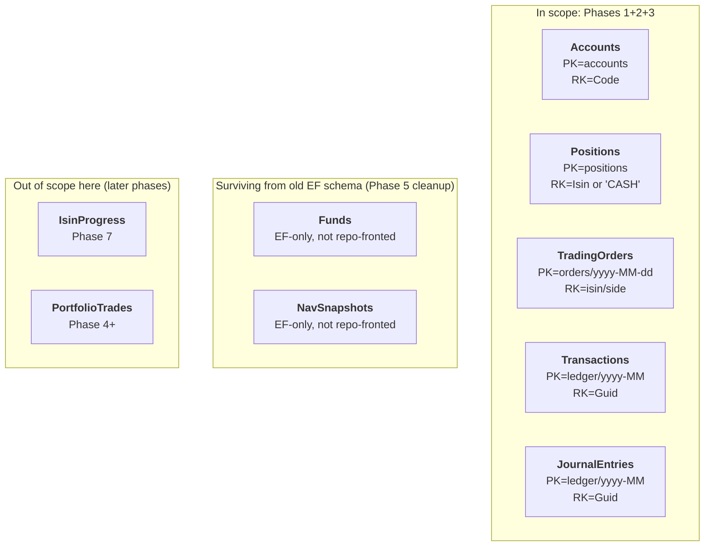

Retired by this migration: **`FundHoldings`** — its data role moves to
`Positions`.

## Per-table shape

### Accounts

The bank-sim's chart of accounts. One row per account
(`"1000"` cash, `"1100"` pending-buy, `"1200x"` per-fund holding,
`"2000"` pending-sell). Single partition since there's one portfolio.

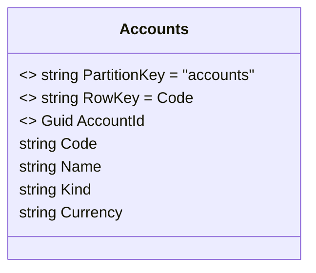

- **Writers:** `DataSeeder` (initial chart of accounts), nothing else
  (account list is fixed).
- **Readers:** `TradingService` (`GetByCodeAsync("1000")` etc.),
  `LedgerService` (balance computation via `JournalEntries.QueryByAccountAsync`),
  `PortfolioQueryService` (cash account display).
- **Why `Code` as `RowKey`:** every existing read in the codebase
  already looks up by `Code`, never by `Guid`. Storing `AccountId`
  (the Guid) as an indexed non-key column preserves domain identity
  for `JournalEntry.AccountId` linkage without changing the domain
  model.

### Positions

NEW. Replaces `FundHolding` and `positions.csv` simultaneously. Single
partition with a row per fund + one cash pseudo-row.

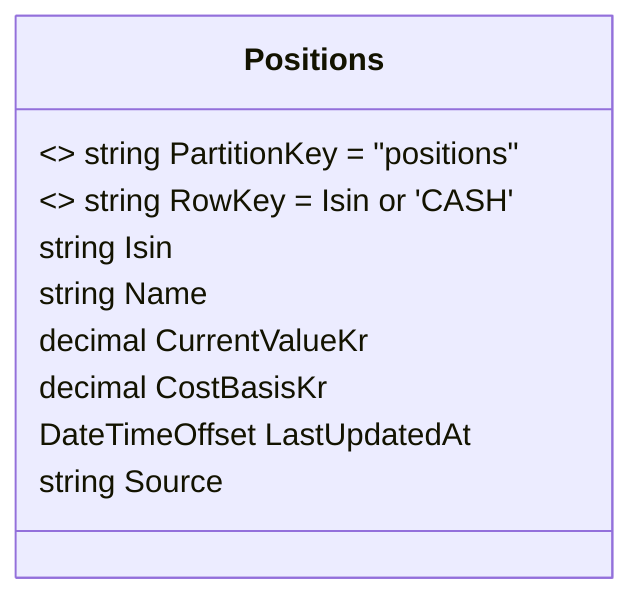

- **`Source` enum-as-string:** `"manual"` (WPF user edit),
  `"sendToBank"` (post-trade reconciliation),
  `"reconciled"` (post-settlement true-up),
  `"seed"` (one-shot import from `positions.csv` on first launch).
- **The cash pseudo-row** (`RowKey = "CASH"`) keeps its semantics from
  the old CSV format — at most one, value carried into Step 1's
  `cash_available_kr`. `Isin` is null/empty on this row by convention.
- **Writers:** `BankCsvImporter` (one-shot seed on first launch only),
  `TradingService` (post-trade reconcile), WPF manual edits (future).
- **Readers:** `DataLoaderAgent` (Step 1 — partition scan, replaces the
  CSV parser), `BankViewModel` (display + CSV export),
  `PortfolioQueryService` (current values for Step 10 sizing math).

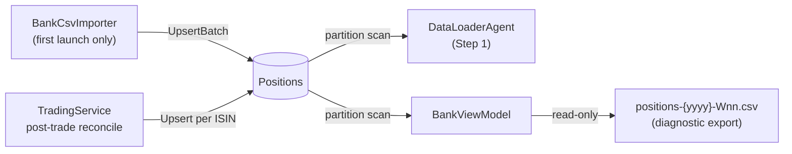

### TradingOrders

Daily-keyed orders. Partition rolls every day; `(isin, side)` within a
day is unique by construction (re-running Step 10 the same day
overwrites).

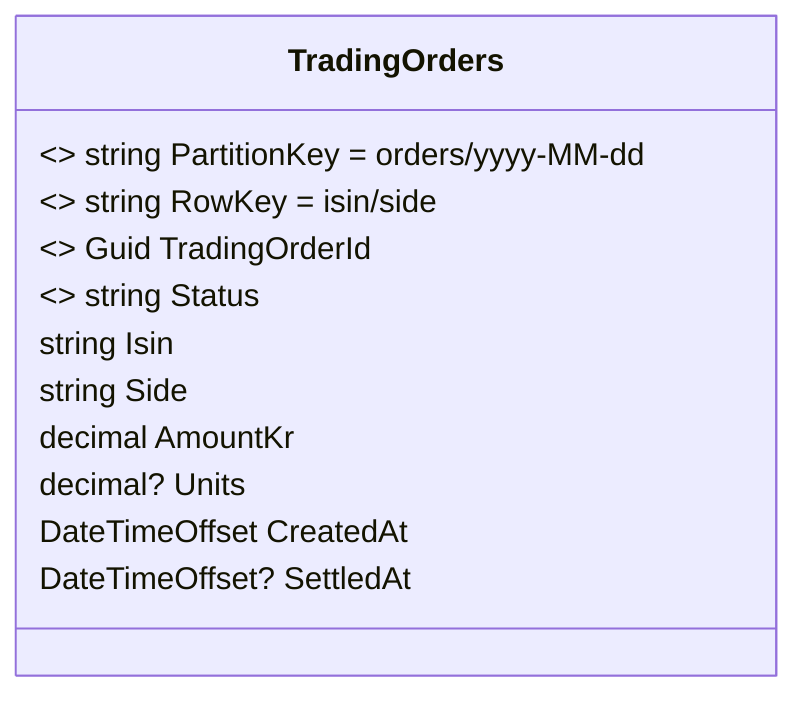

- **`PartitionKey` derives from `CreatedAt`** at the trading day's
  start. Step 10's daily run picks up exactly one partition.
- **Idempotency by composite RK:** if Step 10 runs twice the same day
  for the same `(isin, side)`, the second write overwrites the first.
  Edge case: same-day partial-sell + final-sell on one ISIN — flagged
  in [storage-migration-plan.md §10](./storage-migration-plan.md), may
  need a sequence suffix later.
- **Writers:** `TradingService.CreateBuyOrderAsync` /
  `CreateSellOrderAsync` (initial create), `SettlementEngine`
  (status update on settlement).
- **Readers:** `TradingService` (settlement lookup),
  `BankViewModel` (display).

State machine for one row:

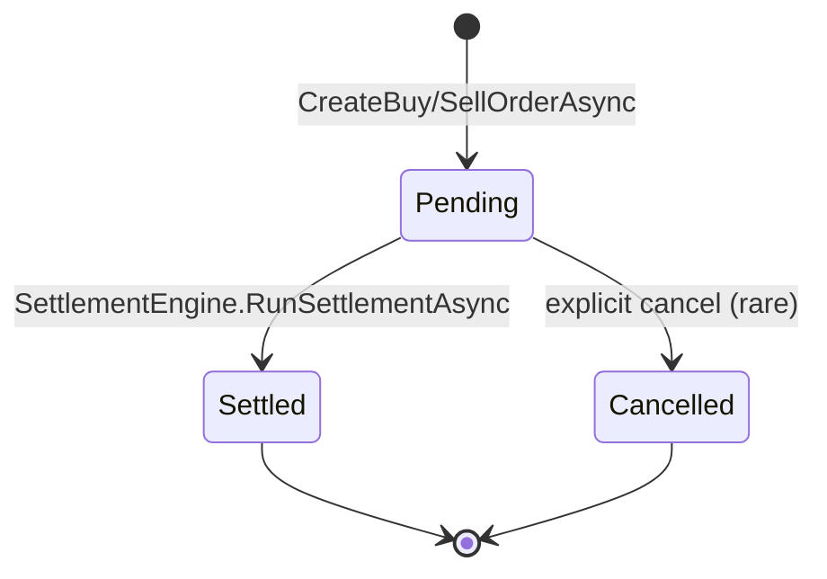

### Transactions and JournalEntries

The bank-sim's double-entry ledger. Partition rolls monthly. The two
tables share a partition naming scheme: a `JournalEntry`'s
`PartitionKey` always equals its parent `Transaction`'s `PartitionKey`,
so a per-month partition scan returns both the headers and lines in
one round trip per table.

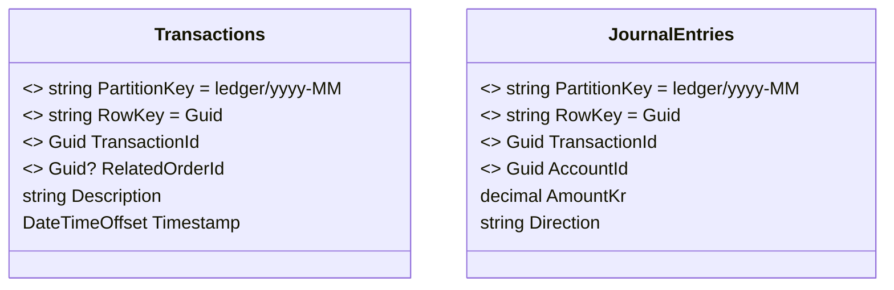

**Crucial difference from the old EF model:** there is **no foreign
key**, **no cascade delete**, and **no navigation property**
between these tables. The old `Transaction.Entries` collection still
exists on the **domain aggregate** but it is populated **manually by
the service layer**, not by EF lazy/eager loading.

The reconstruction pattern (in `LedgerService`):

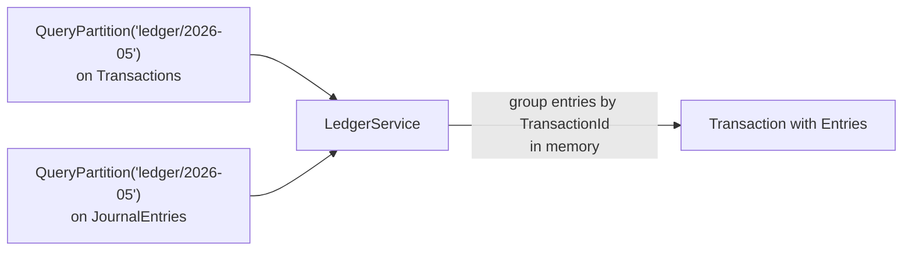

- **Writers:** `LedgerService.PostTransactionAsync` (writes one
  Transaction + ≥2 JournalEntries in a single per-partition batch).
- **Readers:** `LedgerService.GetAllTransactionsAsync`,
  `GetTransactionsByOrderAsync` (filter on `RelatedOrderId`),
  `GetAccountBalanceAsync` (queries `JournalEntries` only, sums by
  `AccountId`).

The `IJournalEntriesRepository` exposes a typed secondary lookup
`QueryByAccountAsync` for balance computation; under the covers it's a
partition scan + in-memory filter — exactly what Azure Tables would do.

### Funds and NavSnapshots — legacy survivors

Untouched by this migration. Still EF-fronted (no repository), still
have their existing FK/cascade configuration. Removed in Phase 5 once
[backend-nav-sync-plan.md §Data Fetch](./backend-nav-sync-plan.md#data-fetch--yr-fund-endpoint)
delivers the YR fund endpoint and the pipeline stops needing local
`Fund`/`NavSnapshot` rows at all.

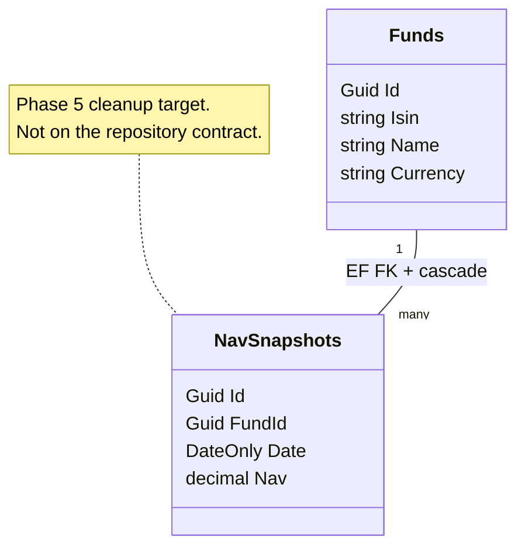

## Partition layout — what's on disk

A snapshot of how rows distribute across partitions in production
(Azure Tables) and locally (SQLite, where partitions are just rows
with the same `PartitionKey` value):

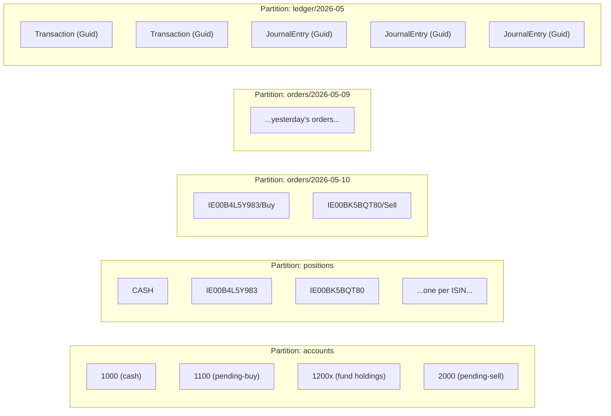

- **`accounts`** and **`positions`** are single eternal partitions —
  small, hot, scanned often.
- **`orders/{date}`** rolls daily. Old partitions are append-only and
  rarely read after settlement.
- **`ledger/{month}`** rolls monthly. Reporting reads scan one or two
  months at a time.

## Service-to-table access map

Who reads and writes each table after the migration:

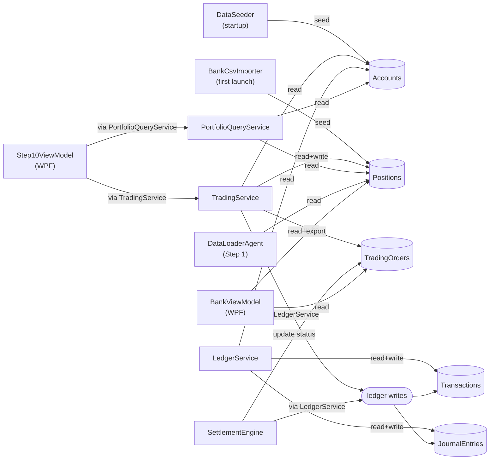

`DataLoaderAgent` is the only pipeline-layer reader of any of these
tables. The bank-sim services (Trading/Ledger/Settlement/Portfolio)
form a self-contained cluster around the ledger and orders.

## Key shapes summary — quick reference

| Table | PartitionKey | RowKey | Notes |
| --- | --- | --- | --- |
| `Accounts` | `"accounts"` | `Code` | Single eternal partition. |
| `Positions` | `"positions"` | `Isin` (or `"CASH"`) | Single eternal partition. |
| `TradingOrders` | `"orders/{yyyy-MM-dd}"` | `"{isin}/{side}"` | Rolls daily. |
| `Transactions` | `"ledger/{yyyy-MM}"` | Guid | Rolls monthly. |
| `JournalEntries` | `"ledger/{yyyy-MM}"` | Guid | Same partition as parent. |

## SQLite vs Azure Tables — the surface comparison

The same row shape lives in both backends. What differs:

| Concern | SQLite (local) | Azure Tables (Phase 6) |
| --- | --- | --- |
| `PartitionKey` + `RowKey` | composite primary key constraint | native — the fundamental addressing unit |
| Indexed non-key columns | `HasIndex` in EF configuration | secondary index pattern (manual, app-side) |
| Decimals | `HasPrecision(18,4)` / `(18,6)` | stored as IEEE 754 — decimal fidelity not native; PoC use only |
| Batch upsert | EF transaction inside one `SaveChangesAsync` | native single-partition batch (≤100 entities, ≤4 MB) |
| ETag | EF doesn't track it (no `[ConcurrencyCheck]`) | service maintains it; we always send wildcard |
| Schema setup | `EnsureCreated` on startup | created on first write; no DDL phase |

Repositories hide all of this behind a single interface per entity.
The contract pretends the SQLite store has the same constraints as
Azure Tables (single-partition batches, ≤100 rows) so consumers
don't accidentally write code that works locally and breaks in prod.

## Out of scope for this document

- The `IsinProgress` table from
  [backend-nav-sync-plan.md §Progress Table](./backend-nav-sync-plan.md#progress-table--per-isin-state) —
  arrives in Phase 7 of the migration plan, gets its own per-ISIN row
  with state machine and Step01Json…Step09Json output columns.
- The `PortfolioTrades` table from Step 10's daily run — shape still
  open per
  [backend-nav-sync-plan.md §"Step 10 — Daily Portfolio Trades"](./backend-nav-sync-plan.md#step-10--daily-portfolio-trades).
- Indexes, query plans, performance — repositories expose only the
  read shapes the services need; tuning is downstream.
- Auth, networking, connection-string handling — covered in
  [backend-nav-sync-plan.md §Infrastructure Summary](./backend-nav-sync-plan.md#infrastructure-summary).
