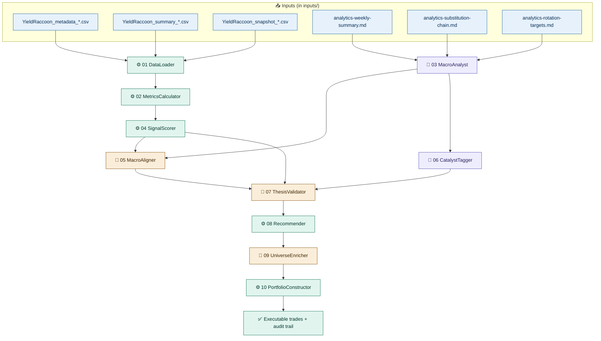

# Fund Pipeline — Implementation Plan

A self-contained specification for a 10-agent pipeline that turns weekly fund data and macro narrative into executable trade decisions. Point your Claude Code project at this folder and start with the prompt below.

---

## 🪂 Drop-in prompt for a Claude Code session

> You are working on a fund-rotation pipeline implementation. This `plan/` folder contains everything you need: agent contracts, configuration files, sample inputs, and reference outputs. **Before writing any code, read these files in this order:**
>
> 1. `instructions.md` (this file) — the map.
> 2. `pipeline-plan.md` — overall architecture, vocabularies, invariants.
> 3. The numbered agent contracts (`01-dataloader.md` through `10-portfolioconstructor.md`) — implement these one at a time, in dependency order.
> 4. `summary-csv-plan.md`, `snapshot-csv-plan.md`, `FUND-STATISTICS-EXPORT-AGENT-GUIDE.md` — input data schemas.
> 5. The `inputs/` folder — real sample data for testing.
> 6. The `examples/` folder — reference outputs from a prior chain run.
>
> Each agent's markdown file is its complete contract: I/O schemas, configuration consumed, failure modes, test fixtures. Build the agents in order 01 → 10, validating each step's output against the next agent's input expectations.
>
> The pipeline is **append-only**: each step preserves all prior fields and adds new ones. Step 10 is **strictly deterministic code** (no LLM calls) so backtests replay byte-identically. Steps 03 and 06 are **LLM-only** with prompt skeletons + AI Foundry evaluation rubrics in their contract files.
>
> Start by listing the files in this folder, then read `pipeline-plan.md`.

---

## Pipeline at a glance



| Symbol | Execution type |
|---|---|
| ⚙️ | Pure code — deterministic, no LLM |
| 🤖 | LLM only — full prompt + evaluation rubric in the contract |
| 🔀 | Hybrid — code computes structured fields, LLM produces explanatory text |

---

## Folder map

```
plan/
├── instructions.md                       ← you are here
├── pipeline-plan.md                      ← architecture, vocabularies, invariants
├── summary-csv-plan.md                   ← summary.csv schema spec
├── snapshot-csv-plan.md                  ← snapshot.csv schema spec
├── FUND-STATISTICS-EXPORT-AGENT-GUIDE.md ← agent-facing CSV reference
│
├── 01-dataloader.md                      ← agent 1 contract
├── 02-metricscalculator.md
├── 03-macroanalyst.md
├── 04-signalscorer.md
├── 05-macroaligner.md
├── 06-catalysttagger.md
├── 07-thesisvalidator.md
├── 08-recommender.md
├── 09-universeenricher.md
├── 10-portfolioconstructor.md
│
├── config-02-metrics.json                ← consumed by step 02
├── config-04-signals.json                ← consumed by step 04
├── config-09-conviction.json             ← consumed by step 09
├── config-10-portfolio.json              ← consumed by step 10
│
├── inputs/                               ← real sample data for development
│   ├── YieldRaccoon_metadata_schroder_2026-W18.csv
│   ├── YieldRaccoon_summary_schroder_2026-W18.csv
│   ├── YieldRaccoon_snapshot_schroder_2026-W18.csv
│   ├── analytics-weekly-summary.md
│   ├── analytics-substitution-chain.md
│   └── analytics-rotation-targets.md
│
└── examples/                             ← reference outputs from a prior chain run
    ├── chain-step5-fund-signals-20260429-202209.json
    └── chain-step6-actions-20260429-202223.json
```

---

## How the pieces fit together

**Each agent's contract** (`NN-name.md`) is the complete spec for that agent: input schema, output schema, failure modes, test fixtures, and (for LLM agents) prompt skeleton + AI Foundry evaluation rubric. Agents are independent — implement and test one at a time.

**Configuration files** (`config-NN-*.json`) hold the tunable parameters each agent reads. Step number in the filename matches the agent that consumes it. Real development values are pre-filled; rationale for non-obvious defaults lives in the agent's markdown contract, not in the JSON.

**Input data** (`inputs/`) is one ISO-week bundle from a real fund family. Use it to write integration tests against the full pipeline. The macro-report markdown files are the upstream input to MacroAnalyst (step 03); the three CSVs are inputs to DataLoader (step 01).

**Reference outputs** (`examples/`) are a real prior run from a similar pipeline (with slightly different conventions — they predate the rename). Use them as a sanity check for shape and behavior, not as a strict schema reference.

---

## Implementation order

Build agents in this order. Each step depends on the prior step's output schema being stable.

| Order | Agent | Type | Reads config? |
|---|---|---|---|
| 1 | DataLoader | ⚙️ | no |
| 2 | MetricsCalculator | ⚙️ | `config-02-metrics.json` |
| 3 | MacroAnalyst | 🤖 | no (v1) |
| 4 | SignalScorer | ⚙️ | `config-04-signals.json` |
| 5 | MacroAligner | 🔀 | no (v1) |
| 6 | CatalystTagger | 🤖 | no (v1) |
| 7 | ThesisValidator | 🔀 | no (v1) |
| 8 | Recommender | ⚙️ | no |
| 9 | UniverseEnricher | 🔀 | `config-09-conviction.json` |
| 10 | PortfolioConstructor | ⚙️ | `config-10-portfolio.json` |

After implementing each agent, validate against:
- **Its own test fixtures** (in the agent's markdown).
- **The next agent's input schema** (downstream contract).
- **The example outputs** (`examples/`) for shape compatibility.

Each step writes a JSON file named `NN-{agent}-{iso_week}-{run_id}.json`. The chain runner is a simple sequencer — invoke each agent in order, halt on the first error file (`NN-error-...json`).

---

## Key invariants — do not violate

| Invariant | Why |
|---|---|
| **Append-only** — each step preserves all prior fields, adds new ones | Audit trail in single file; debugging across steps |
| **Step 10 has zero LLM calls** | Backtest reproducibility — same inputs must produce byte-identical trades |
| **`{iso_week}` tag must match across the four input files** | Avoids stale-data bugs; DataLoader halts on mismatch |
| **`NaN` propagates as `null` in JSON; never coerce to 0** | Conviction scoring needs to know what's missing |
| **The producer's volatility-guard must not be re-implemented in agents** | Producer ships `sharpe = NaN` when vol < 0.01%; agents trust it |

---

## Where to look for what

| Question | File |
|---|---|
| Why does the pipeline have 10 agents? | `pipeline-plan.md` §1 |
| What does `Strength` / `Weakness` / `Watch` / `Neutral` mean? | `pipeline-plan.md` §5 + `04-signalscorer.md` |
| What does `CatalystEntry` vs `MomentumEntry` mean? | `pipeline-plan.md` §5 + `08-recommender.md` |
| How is conviction computed? | `09-universeenricher.md` |
| What's the cash-floor policy? | `10-portfolioconstructor.md` + `config-10-portfolio.json` |
| What does each CSV column mean? | `FUND-STATISTICS-EXPORT-AGENT-GUIDE.md` |
| Why is `sharpe_2w` sometimes `null`? | `summary-csv-plan.md` §7.3 |
| How do I backtest? | Load the historical week's bundle from `inputs/{iso_week}/` and re-run from step 01 |

---

## Status

| Layer | Status |
|---|---|
| Data input specs | ✅ done |
| Pipeline architecture | ✅ done |
| Agent contracts (10) | 🟡 3 of 10 detailed (01, 02, 03); 7 remaining |
| Configuration files | ✅ all 4 with real dev values |
| Operational (run scheduling, monitoring) | ❌ not in this folder |

When all 10 agent contracts are in place, this folder becomes a complete implementation reference. Operational concerns (deployment, scheduling, observability) live in a separate doc.
