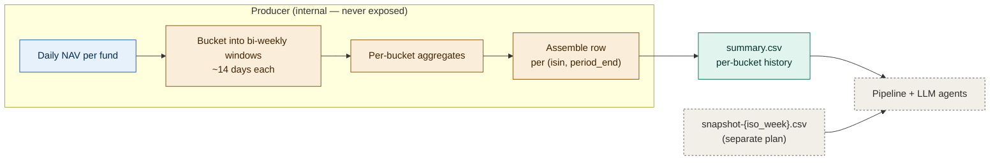

# summary.csv — Schema Plan

A specification for the bi-weekly fund summary CSV. This file holds the per-bucket time-series history of every fund in the universe. It is one of three sibling files: `metadata.csv` (static identity), `summary.csv` (this file — bi-weekly history), and `snapshot-{iso_week}.csv` (current rolling-horizon state).

This document specifies four column renames to `summary.csv`. Rolling-horizon metrics (12-week, 1-year) are **not** in this file — see the companion `snapshot-csv-plan.md`.

---

## Design constraint — LLM-context-friendly digest

`summary.csv` exists because raw daily NAV does not fit comfortably in an LLM's context window. The file is intentionally a **compact digest** of pre-calculated values. Two rules follow from this constraint and govern every decision in this spec:

| Rule | Implication |
|---|---|
| The CSV contains only pre-calculated, aggregated values | No daily NAV, no raw return series, no individual-day rows. Every numeric field is a roll-up over a defined window |
| Daily-level computation lives upstream of the producer | The producer reads daily NAV from its own data source, computes the aggregations, and emits the CSV. Consumers (the pipeline, any LLM agent reading the file) never see daily values |

This document specifies what fields the digest contains and what each value means. It does not specify how the producer ingests daily NAV — that is implementation-internal to the producer.

## Relationship to other files

| File | Holds | Granularity |
|---|---|---|
| `metadata.csv` | Static fund identity (ISIN, name, fee, category, etc.) | 1 row per fund |
| **`summary.csv`** (this file) | **Bi-weekly per-bucket history** | **~26 rows per fund** |
| `snapshot-{iso_week}.csv` | Rolling-horizon state at a single date | 1 row per fund, 1 file per week |

A consumer reads all three: `metadata.csv` for who the fund is, `summary.csv` for how it has moved over time (and to count "X of N positive windows"), and the latest `snapshot-{iso_week}.csv` for as-of-now rolling Sharpe / volatility / drawdown.

---

## Table of contents

1. [Purpose](#1-purpose)
2. [Producer flow](#2-producer-flow)
3. [Schema changes summary](#3-schema-changes-summary)
4. [Renames](#4-renames)
5. [Final schema](#5-final-schema)
6. [Field semantics](#6-field-semantics)
7. [Partial bucket and edge case handling](#7-partial-bucket-and-edge-case-handling)
8. [File naming](#8-file-naming)
9. [Validation expectations](#9-validation-expectations)
10. [Migration path](#10-migration-path)

---

## 1. Purpose

`summary.csv` provides per-bucket metrics (bi-weekly aggregation) over the trailing year. Each row captures one bucket of one fund. The pipeline uses these rows for two things:

| Use | What's needed |
|---|---|
| Counting positive windows ("X of 3 positive") | Last N bucket-level returns in chronological order |
| Surfacing recent volatility / drawdown context | Latest bucket's `current_drawdown_pct`, bucket extremes |

Rolling-horizon metrics (12-week and 1-year Sharpe, vol, return, drawdown) are not in this file. They live in `snapshot-{iso_week}.csv`. This split keeps each file aligned to its purpose: history versus current state.

This document specifies four column renames to make existing column names unambiguous now that snapshot.csv carries `_12w` and `_1y` counterparts. No new columns. No semantic change.

---

## 2. Producer flow

Daily NAV stays inside the producer. The CSV that emerges contains only per-bucket digested values. Rolling-horizon values are emitted to a separate `snapshot-{iso_week}.csv` file.

Consumers must never assume daily values are available. If a downstream agent needs something that cannot be computed from the digest, the right fix is to add a column to the digest (or to the snapshot file, depending on whether it is per-bucket or as-of-now), not to plumb daily NAV through.

---

## 3. Schema changes summary

| Change | Count | Notes |
|---|---|---|
| Renamed columns | 4 | Disambiguate horizon now that `_12w` / `_1y` counterparts exist in `snapshot.csv` |
| New columns | 0 | Rolling-horizon values go to `snapshot.csv`, not here |
| Unchanged columns | 13 | Identity, NAV levels, bucket extremes, drawdown snapshot |
| Total final columns | 17 | Same as today, four renamed |

Row granularity is unchanged: one row per `(isin, period_end)` bi-weekly bucket. Approximately 26 rows per fund per year.

---

## 4. Renames

These four columns get an explicit `_2w` horizon suffix because they now have 12-week and 1-year counterparts in `snapshot.csv`.

| Current name | New name | Reason |
|---|---|---|
| `total_return_pct` | `return_2w_pct` | Counterpart to snapshot's `return_12w_compound_pct`, `return_1y_compound_pct` |
| `ann_volatility` | `ann_volatility_2w_pct` | Counterpart to snapshot's `ann_volatility_12w`, `ann_volatility_1y`. Also adds missing `_pct` suffix |
| `sharpe_ratio` | `sharpe_2w` | Counterpart to snapshot's `sharpe_12w`, `sharpe_1y` |
| `max_drawdown_pct` | `max_drawdown_2w_pct` | Counterpart to snapshot's `max_drawdown_12w_pct`, `max_drawdown_1y_pct` |

### Columns deliberately *not* renamed

| Column | Why kept as-is |
|---|---|
| `current_drawdown_pct` | "current" specifies anchor at `period_end` — it's a snapshot value, not a horizon aggregate |
| `first_nav`, `last_nav`, `nav_high`, `nav_low` | Absolute NAV values, not percentage metrics with horizon |
| `best_day_pct`, `worst_day_pct` | No 12w / 1y counterpart — intrinsically within-bucket extremes |
| `pct_positive_days`, `skewness` | Same — intrinsically within-bucket properties |

Producers may *optionally* add `_2w` to the second group for full consistency, but consumers do not require it.

---

## 5. Final schema

The full set of 17 columns, grouped by purpose. Order in the CSV is the producer's choice but should be stable across runs.

| Group | Columns |
|---|---|
| Identity | `isin`, `name`, `period_start`, `period_end` |
| NAV levels | `first_nav`, `last_nav`, `nav_high`, `nav_low` |
| Snapshot drawdown | `current_drawdown_pct` |
| Bucket extremes | `best_day_pct`, `worst_day_pct`, `pct_positive_days`, `skewness` |
| 2-week (bucket) aggregates | `return_2w_pct`, `ann_volatility_2w_pct`, `sharpe_2w`, `max_drawdown_2w_pct` |

For 12-week and 1-year aggregates, see `snapshot-csv-plan.md`.

---

## 6. Field semantics

This section defines what each numeric field *means* — i.e. what value a consumer should expect when reading it. The producer is free to compute these values however it likes, but the resulting numbers must match these definitions.

All bucket-level fields are anchored to the bucket boundaries `[period_start, period_end]` (~14 days).

### 6.1 Bucket aggregates (renamed from prior schema)

| Field | Definition |
|---|---|
| `return_2w_pct` | (`last_nav` / `first_nav` − 1) × 100 — total return over the bucket |
| `ann_volatility_2w_pct` | annualized standard deviation of daily log-returns within the bucket, expressed as percent |
| `sharpe_2w` | (annualized bucket return − risk_free) / `ann_volatility_2w_pct` |
| `max_drawdown_2w_pct` | worst peak-to-trough decline within the bucket, non-positive percent |

The `risk_free_rate` choice is the producer's; whatever is chosen must be consistent across all funds in the file. A constant zero is acceptable for v1.

### 6.2 Snapshot drawdown

`current_drawdown_pct` is the distance from the bucket's high to its closing NAV: `(last_nav − nav_high) / nav_high × 100`. Non-positive. This is the only "current state" field in the file — everything else is a window aggregate.

### 6.3 Bucket extremes

| Field | Definition |
|---|---|
| `best_day_pct` | Largest single-day percentage gain within the bucket |
| `worst_day_pct` | Largest single-day percentage loss within the bucket (negative) |
| `pct_positive_days` | (positive_return_days / total_trading_days_in_bucket) × 100 |
| `skewness` | Daily return distribution skewness within the bucket. Negative = left-skewed (tail risk to the downside) |

### 6.4 NAV levels

`first_nav`, `last_nav`, `nav_high`, `nav_low` are the absolute NAV values bounding the bucket. Used by consumers for chart rendering and as inputs to derived computations.

---

## 7. Partial bucket and edge case handling

### 7.1 Partial trailing buckets

A "partial bucket" is one whose period spans fewer than 7 calendar days (typically the very latest entry when the file is generated mid-cycle).

Partial buckets should be **dropped from the file entirely.** Earlier observed behavior of emitting a 2-day partial bucket with NaN Sharpe contaminated downstream window-counting logic. If the producer cannot fill a complete bucket, it should not emit a row for that period.

### 7.2 NaN handling

Numeric fields must be valid numbers or `NaN` — never empty strings or zeroed substitutes.

| Field state | Consumer interpretation |
|---|---|
| Numeric value | Trust the value |
| `NaN` in a 2-week field | The bucket was malformed (rare after applying Section 7.1); treat as missing |
| `last_nav < 0` or non-finite NAV columns | Should never appear in a valid file; consumer halts and surfaces as data integrity error |

### 7.3 Sharpe with zero or near-zero volatility

When `ann_volatility_2w_pct` is below 0.01 (i.e. essentially constant NAV), the Sharpe denominator approaches zero and the ratio explodes. In this case:

> If `ann_volatility_2w_pct` < 0.01, set `sharpe_2w = NaN` rather than emitting a value > 100.

This avoids the chain output observed previously where bond funds emitted `sharpe = +41.14` purely on a near-zero denominator.

### 7.4 Fund with shorter history than one bucket

If a fund's first observed NAV is within the bucket period, the producer can either emit the row with `first_nav` set to that first observation (acknowledging an incomplete bucket) or skip the fund for that bucket entirely. The choice should be consistent across funds.

### 7.5 Currency considerations

All percentages are in the fund's reporting currency. Cross-fund comparisons of absolute returns require currency normalization downstream — that is not the producer's responsibility.

---

## 8. File naming

### Current

`YieldRaccoon_summary_{family}_2weeks_1year.csv`

The `_2weeks_1year` suffix described the file's window structure. Since the file no longer contains multi-horizon rolling values (those moved to `snapshot.csv`) and since the bucket size and lookback are configurable in the producer anyway, the suffix is misleading. The filename also lacks an ISO week tag, making it impossible to identify which week's run produced the file from name alone.

### New convention

`YieldRaccoon_summary_{family}_{iso_week}.csv`

| Component | Example | Notes |
|---|---|---|
| `{family}` | `Schroder`, `Storebrand`, `all` | Fund family name or `all` if unfiltered |
| `{iso_week}` | `2026-W18` | ISO 8601 week designation |

### Examples

- `YieldRaccoon_summary_Schroder_2026-W18.csv`
- `YieldRaccoon_summary_Storebrand_2026-W18.csv`
- `YieldRaccoon_summary_all_2026-W14.csv`

### Why ISO week

All weekly artifacts in the system (this file, `metadata.csv`, `snapshot.csv`, the three macro reports) share the same `{iso_week}` tag. A "week bundle" — every file produced for a given week's analysis — can be identified by a simple filename match. This is what enables backtesting from local files: load all artifacts matching a historical week and replay the pipeline against that bundle.

The summary file regenerates each week with the latest bucket appended (and possibly the oldest dropped if the producer's lookback window slides). Each weekly summary is therefore distinct, even though most of its rows overlap with the prior week's.

---

## 9. Validation expectations

The producer should validate before emitting the file. The consumer should validate before processing it. Both validations are cheap and catch most schema-drift bugs.

### 9.1 Producer-side checks

| Check | Action on failure |
|---|---|
| All 17 column headers present in expected order | Halt — schema drift |
| Every row has 17 fields (no truncation) | Halt — file corruption |
| `period_end > period_start` for every row | Halt — invalid bucket |
| `period_end - period_start ≈ 14 days` (within ±2 days) | Halt — partial bucket should not be emitted (per Section 7.1) |
| No row has `last_nav < 0` or non-finite NAV | Halt — drop the offending fund entirely |

### 9.2 Consumer-side checks (pipeline)

| Check | Action on failure |
|---|---|
| Headers match expected schema | Halt with explicit error |
| Each ISIN appears at least once | Warn for ISINs in metadata.csv but missing from summary.csv |
| `period_end` is monotonic per ISIN | Halt — ordering required for "last 3 windows" logic |
| Numeric fields parse as numbers (or NaN) | Halt — type error |

---

## 10. Migration path

The four renames are breaking changes for any existing consumer reading `total_return_pct`, `ann_volatility`, `sharpe_ratio`, or `max_drawdown_pct`. Two viable paths.

### Option A — clean cutover (preferred for small consumer surface)

1. Producer ships the renamed columns with the new filename.
2. Consumer reads the new file directly.
3. Old file is deprecated.

Suitable if the only consumer is the fund pipeline and it can be updated in lockstep with the producer.

### Option B — parallel period (preferred when multiple consumers)

1. For one or two cycles, producer emits both the old file (legacy schema, legacy name) and the new file (renamed schema, new name).
2. Consumers migrate one at a time.
3. Producer drops the legacy emission.

Safer but doubles the producer's work briefly.

### Compatibility shim (not recommended)

A view mapping renamed columns back to their old names is technically possible but defeats the disambiguation purpose. Do not ship this; update consumers instead.

---

*End of plan.*
