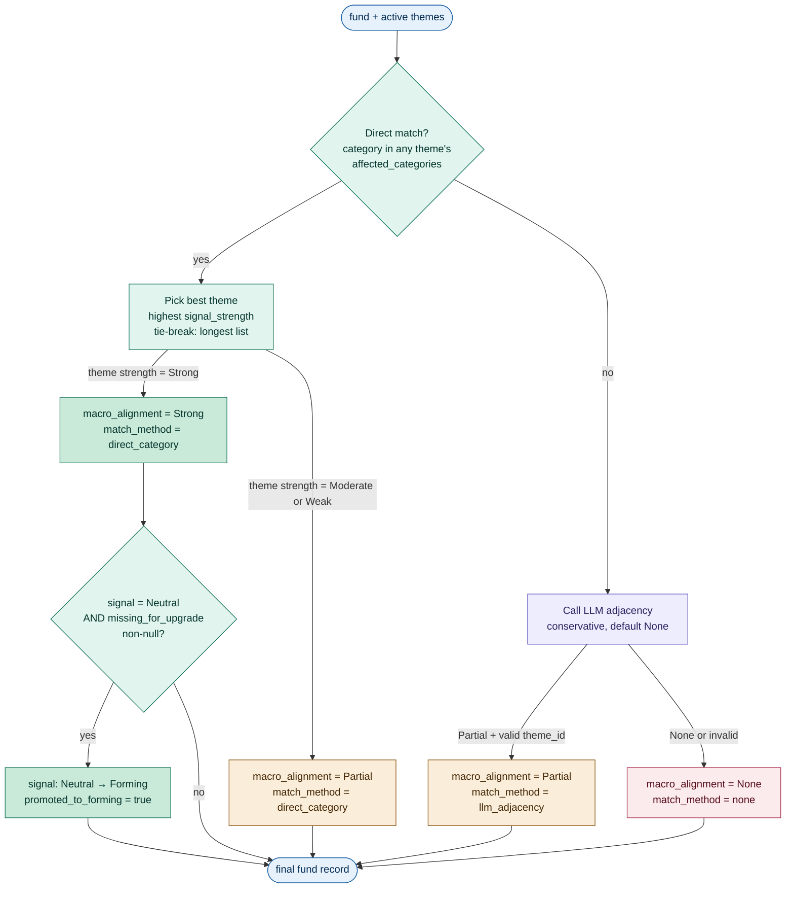
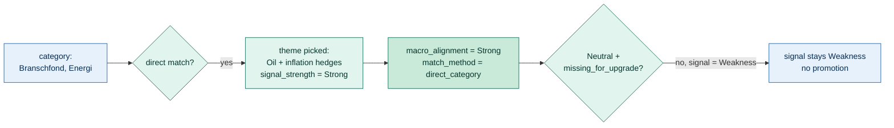
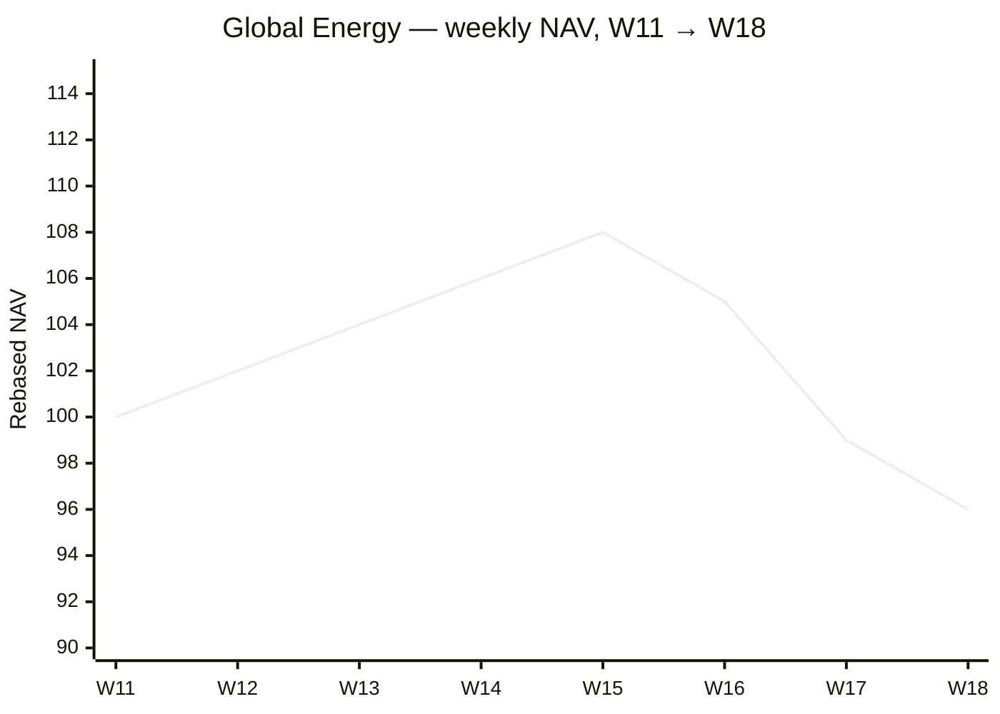
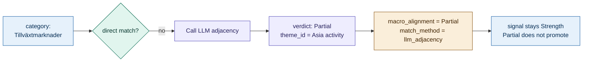
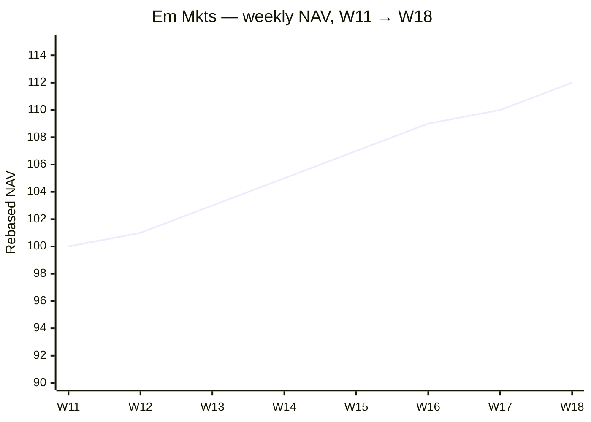
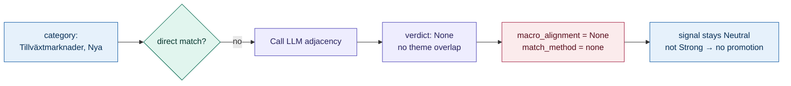
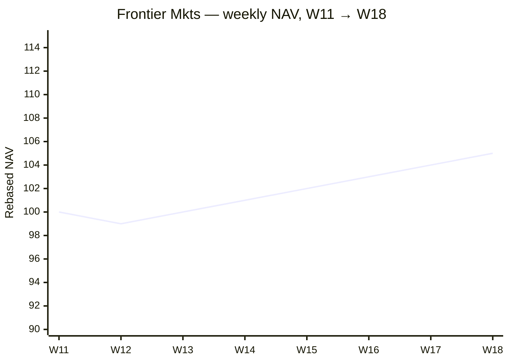

# Agent 05: MacroAligner

> Determine whether each fund's category aligns with active macro rotation themes; promote near-buy candidates to Forming when alignment is Strong.

## Execution type

🔀 Hybrid — code does category-to-theme matching; LLM is consulted only for ambiguous cases.

## Inputs

| Source | What for |
| --- | --- |
| `04-signal-{iso_week}-{run_id}.json` | Per-fund signals from SignalScorer |
| `03-macro-{iso_week}-{run_id}.json` | Active rotation themes from MacroAnalyst |

## Outputs

### Output file

Pattern: `05-macro-align-{iso_week}-{run_id}.json`

### Output schema

Adds `macro_alignment` and `matched_theme` to each fund record. May also promote `signal` from `Neutral` to `Forming`.

```json
{
  "generated_at": "...",
  "iso_week": "...",
  "config_version": "1.0.0",
  "funds": [
    {
      "isin": "...",
      "metadata": { /* preserved */ },
      "metrics": { /* preserved */ },
      "signal": "Strength" | "Weakness" | "Forming" | "Neutral",
      "rule_fired": "...",
      "macro_alignment": "Strong" | "Partial" | "None",
      "matched_theme": {
        "id": "rot_theme_*_{iso_week}" | null,
        "label": "string | null",
        "match_method": "direct_category" | "llm_adjacency" | "none"
      },
      "promoted_to_forming": true | false,
      "promotion_reason": "string | null"
    }
  ]
}
```

## Configuration consumed

None for v1. Future versions may consume:

- Category-to-theme alias table (e.g. "Branschfond, Energi" ≡ "Energy" theme)
- LLM adjacency confidence threshold

## Vocabulary owned

| Macro alignment | Meaning |
| --- | --- |
| `Strong` | Direct match: `metadata.category` appears in `rotation_theme.affected_categories` |
| `Partial` | Adjacent / sector-overlap match decided by LLM |
| `None` | No theme matches; default state |

## What it does



For each fund:

1. **Try direct match (code).** Check if `metadata.category` appears in any active `rotation_theme.affected_categories`. If yes:
   - `macro_alignment = Strong` (if theme `signal_strength = Strong`)
   - `macro_alignment = Partial` (if theme `signal_strength = Moderate` or `Weak`)
   - `match_method = direct_category`
   - Pick the theme with highest signal_strength; tie-break by longest `affected_categories` list (more specific wins).

2. **Try LLM adjacency (only if no direct match).** Send the fund's category and the active themes' labels + affected_categories to the LLM. Prompt: "Is there partial alignment between this fund's category and any active theme — defensive proximity, sector adjacency, factor overlap? Return one of {Partial, None} and the theme id." Use sparingly to avoid LLM cost.

3. **Promote Neutral → Forming where appropriate.** If `signal = Neutral` AND `macro_alignment = Strong` AND `criteria_evaluation.missing_for_upgrade` is non-null (the fund missed exactly one buy criterion): set `signal = Forming`, `promoted_to_forming = true`, `promotion_reason = "Strong macro alignment + 1 missing buy criterion"`. Note: only direct-match Strong promotes; LLM-adjacency yields Partial at best, which never promotes.

4. **No demotion.** A `Strength` signal with `macro_alignment = None` stays Strength — momentum stands on its own. A `Weakness` signal stays Weakness regardless of macro context.

## Concrete shapes

### A rotation theme (from step 03's output)

The diagram's "active theme" boxes look like this in JSON. The agent only reads
`id`, `label`, `signal_strength`, and `affected_categories` — `rationale` is for
audit:

```json
{
  "id": "rot_theme_energy_2026-W18",
  "label": "Integrated oil + inflation hedges",
  "signal_strength": "Strong",
  "affected_categories": [
    "Branschfond, Energi",
    "Råvarufond"
  ],
  "rationale": "Hormuz disruption + sticky core CPI keep upstream + integrateds bid; inflation hedges (TIPS, gold) co-rally."
}
```

For a fund with `metadata.category = "Branschfond, Energi"`, that string is in
`affected_categories`, so the agent picks this theme via `direct_category` and
sets `macro_alignment = Strong` (because `signal_strength = Strong`).

### An LLM adjacency verdict (when there's no direct match)

The LLM only ever returns one of these two shapes:

```json
{
  "alignment": "Partial",
  "theme_id": "rot_theme_asia_2026-W18",
  "rationale": "EM has overlap with Asia activity beneficiaries."
}
```

```json
{
  "alignment": "None",
  "theme_id": null,
  "rationale": "Frontier markets do not align with any active theme."
}
```

The agent only trusts a `Partial` if `theme_id` matches one of the active themes
it sent in. Anything else (invalid JSON, unknown id, network blip) collapses to
`None` and a warning is appended to `data_quality.warnings`.

### A fund record after MacroAligner runs (Strong + promoted)

The case where the algorithm fires both branches — direct Strong match plus the
Neutral → Forming promotion (step-05 fields highlighted in the table):

```json
{
  "isin": "LU0000000123",
  "metadata": { "category": "Branschfond, Energi", "name": "...", "...": "..." },
  "metrics": { "windows_positive_count": 3, "sharpe_12w": 0.42, "...": "..." },
  "signal": "Forming",
  "rule_fired": "neutral_default",
  "criteria_evaluation": {
    "buy_3of3_passed": true,
    "buy_max_dd_passed": true,
    "buy_min_sharpe_12w_passed": false,
    "missing_for_upgrade": "sharpe_12w_above_threshold",
    "data_quality_warnings": []
  },
  "macro_alignment": "Strong",
  "matched_theme": {
    "id": "rot_theme_energy_2026-W18",
    "label": "Integrated oil + inflation hedges",
    "match_method": "direct_category"
  },
  "promoted_to_forming": true,
  "promotion_reason": "Strong macro alignment + 1 missing buy criterion"
}
```

For a fund where `macro_alignment = None`, `matched_theme` shrinks to
`{ "id": null, "label": null, "match_method": "none" }` and
`promoted_to_forming` is `false` (or the field is absent).

## Worked examples

### Global Energy (LU0256331488) — Strong alignment

| Field | Value |
| --- | --- |
| `metadata.category` | "Branschfond, Energi" |
| Active theme | "Integrated oil + inflation hedges" with `affected_categories` including "Branschfond, Energi" |
| `match_method` | `direct_category` |
| `macro_alignment` | `Strong` |
| `signal` (from step 04) | `Weakness` |
| Promotion? | No — only Neutral can be promoted |



NAV trajectory (rebased to 100 at W11) — what the fund actually looked like leading into W18:



The fund rallied through W15, then gave back ~11% in three weeks. SignalScorer
sees the W17–W18 segment: `sharpe_2w < 0`, drawdown breach → `Weakness`. The
Strong macro alignment (energy theme is on) doesn't override the momentum
verdict — no demotion in either direction.

### Em Mkts (LU0106252389) — Partial alignment

| Field | Value |
| --- | --- |
| `metadata.category` | "Tillväxtmarknader" |
| Active themes | None directly match emerging markets, but a "Asian domestic activity" theme exists |
| LLM consulted? | Yes |
| LLM verdict | `Partial` (emerging markets has overlap with Asia activity beneficiaries) |
| `match_method` | `llm_adjacency` |
| `macro_alignment` | `Partial` |
| `signal` | `Strength` (unchanged) |



NAV trajectory (rebased to 100 at W11):



A clean grind higher across the whole window — no drawdown breach,
positive sharpe across 2w/12w. SignalScorer locks in `Strength`.
MacroAligner's *direct* match misses (no theme has "Tillväxtmarknader"
in `affected_categories`), so the LLM is consulted and finds an
adjacency to the active "Asian domestic activity" theme → `Partial`.
The Strength signal is unchanged — momentum stands on its own.

### Frontier Mkts (LU0562313402) — None, but promoted

| Field | Value |
| --- | --- |
| `metadata.category` | "Tillväxtmarknader, Nya" |
| Active themes | None match frontier markets |
| `macro_alignment` | `None` |
| `signal` (from step 04) | `Neutral` (close to Strength: 3/3 windows positive but sharpe_12w fell below threshold) |
| Promotion? | No — needs `macro_alignment = Strong` to promote |



NAV trajectory (rebased to 100 at W11) — note the slow, low-vol grind:



Same direction as Em Mkts but ~half the slope and almost no volatility.
Step 02 reports 3/3 positive 2-week windows but `sharpe_12w` lands just
below threshold (returns are positive, but too small relative to the
denominator). SignalScorer emits `Neutral` with
`criteria_evaluation.missing_for_upgrade = "sharpe_12w_above_threshold"`.
MacroAligner finds no theme — neither direct nor LLM — so
`macro_alignment = None`, and the promotion check fails (needs Strong).
Were a frontier-markets theme active that week, this fund would have
been promoted to `Forming`.

## LLM prompt skeleton (for adjacency check)

### System prompt

```text
You are evaluating whether a fund's category has "partial" alignment with any
active macro rotation theme. Partial alignment means defensive proximity, sector
adjacency, or factor overlap — not direct category match.

Return one of:
- {"alignment": "Partial", "theme_id": "<id>", "rationale": "<one sentence>"}
- {"alignment": "None", "theme_id": null, "rationale": "<one sentence>"}

Be conservative. Default to None unless there is a clear adjacency reason.
```

### User prompt template

```text
Fund category: {fund_category}

Active themes (id, label, affected_categories):
{theme_list}

Is there partial alignment? Return JSON.
```

## Failure modes

| Trigger | Behavior |
| --- | --- |
| `03-macro` output has `rotation_themes = []` | All funds get `macro_alignment = None`; no LLM calls |
| LLM returns invalid JSON for adjacency | Default to `macro_alignment = None`; warn |
| LLM returns a `theme_id` not in the active themes | Drop the result; default to None |
| Fund's category is null or empty | `macro_alignment = None` (cannot match); warn |

## Test fixtures

| Scenario | Inputs | Expected |
| --- | --- | --- |
| Direct match, Strong theme | category in affected_categories, theme strength Strong | `macro_alignment = Strong`, no LLM call |
| Direct match, Moderate theme | same as above but theme is Moderate | `macro_alignment = Partial` |
| No direct, LLM finds adjacency | category not in any affected_categories, but plausible | LLM call, `Partial` returned |
| No direct, LLM says None | obscure category, no theme overlap | `None`, LLM call cost incurred |
| Promotion case | signal=Neutral, criteria_evaluation.missing_for_upgrade non-null, Strong alignment | `signal = Forming`, `promoted_to_forming = true` |
| No promotion (Strength) | signal=Strength, Strong alignment | signal stays Strength |
| No promotion (Weakness) | signal=Weakness, Strong alignment | signal stays Weakness |

## Evaluation prompt — AI Foundry custom rubric

```text
You are evaluating MacroAligner's output for a single fund.

Inputs you will see:
- The fund's metadata.category
- The active rotation_themes from MacroAnalyst
- The agent's verdict: macro_alignment + matched_theme

Score on three dimensions, 1-5 each:

1. Match accuracy (1-5)
   Does the assigned theme actually relate to the fund's category?
   - 5: Direct match or strong adjacency.
   - 3: Plausible but loose adjacency.
   - 1: Match is wrong (theme is unrelated).

2. Strength calibration (1-5)
   Is the alignment level (Strong/Partial/None) appropriate?
   - 5: Strong reserved for direct matches with Strong-signal themes; Partial for genuine adjacencies.
   - 3: Boundary case (could be Partial or Strong).
   - 1: Strong was used for a loose match, or Partial was used when None applies.

3. Promotion appropriateness (1-5, only if promoted_to_forming = true)
   Was promoting Neutral → Forming justified?
   - 5: Fund has Strong alignment + clear missing_for_upgrade.
   - 1: Promoted on weak alignment or without missing_for_upgrade.

For each dimension output:
- Score (1-5)
- One-sentence justification

Flag for review if any dimension scores ≤ 2.
```

## Edge cases

- A fund's category matches multiple themes: pick the one with highest signal_strength; tie-break by longest `affected_categories` (more specific theme wins).
- LLM adjacency is computed lazily — only when no direct match exists. For a 1,400-fund universe this means most funds skip the LLM call entirely.
- Funds with `signal = Forming` from a prior step (shouldn't happen in v1 — only MacroAligner promotes) pass through unchanged.
- The `matched_theme` object always contains non-null `id` and `label` when alignment is Strong or Partial; both null when alignment is None.
