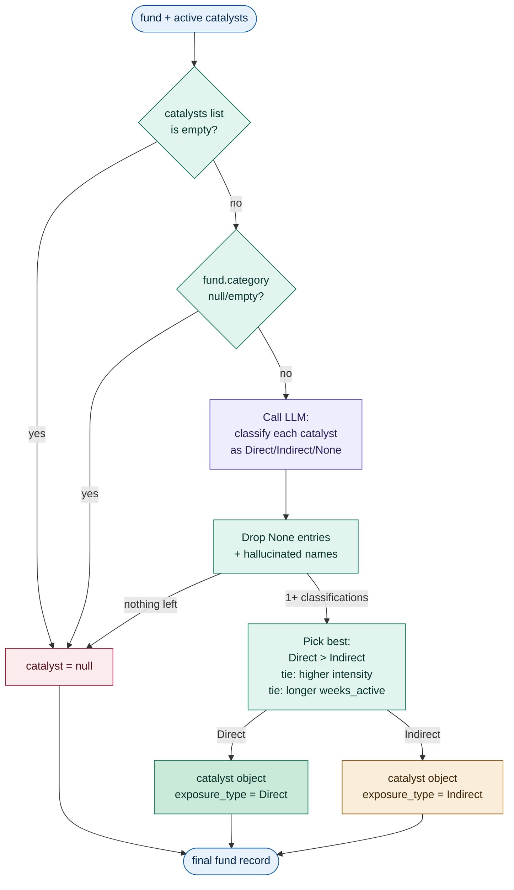
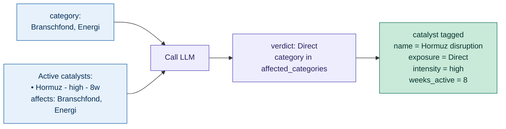
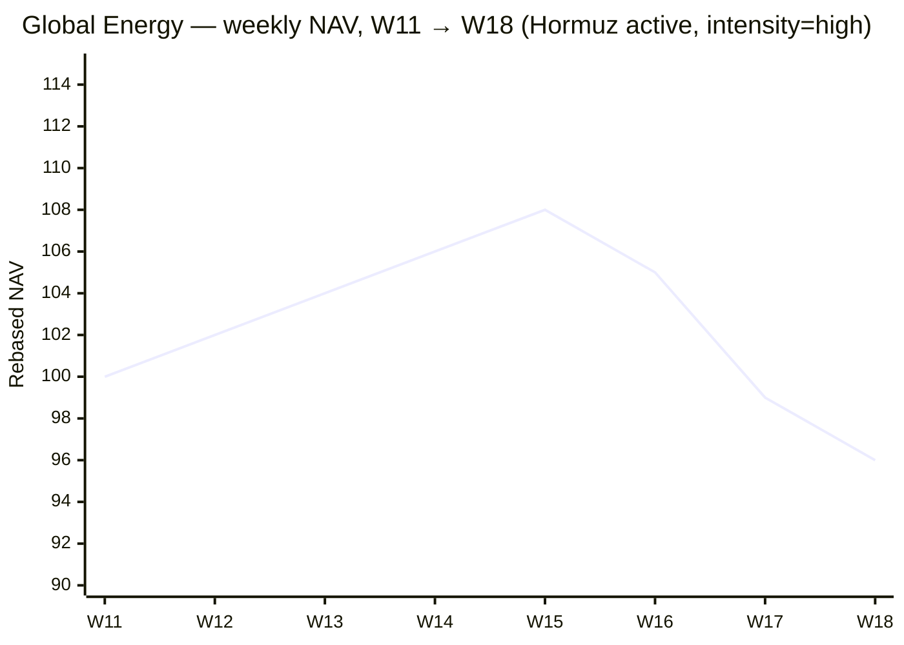
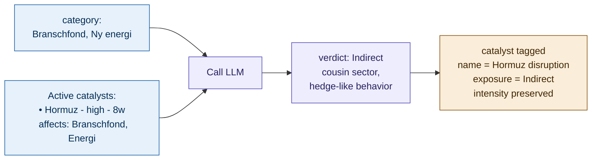
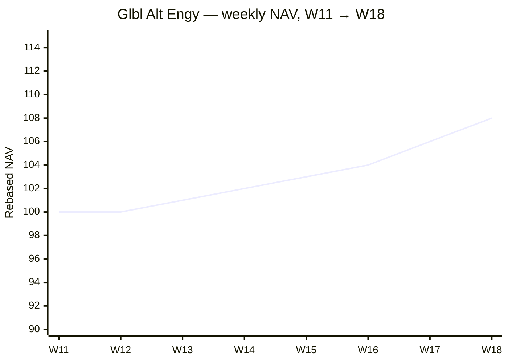
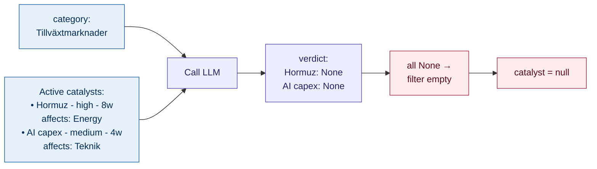
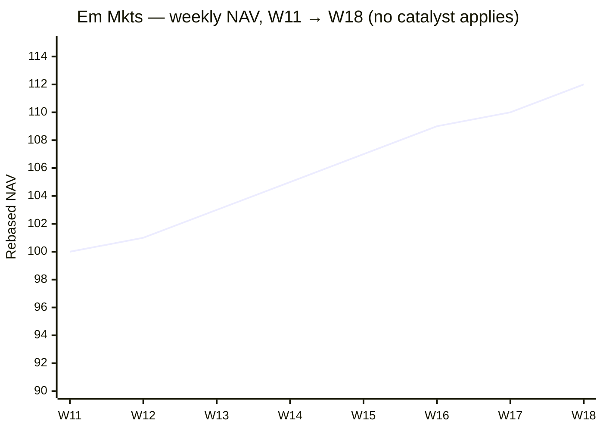

# Agent 06: CatalystTagger

> Tag each fund with the active macro catalyst that affects it (or null if none).

## Execution type

🤖 LLM

## Inputs

| Source | What for |
| --- | --- |
| `05-macro-align-{iso_week}-{run_id}.json` | Per-fund records with metadata, signals, and macro alignment |
| `03-macro-{iso_week}-{run_id}.json` | Active catalysts list from MacroAnalyst |

## Outputs

### Output file

Pattern: `06-catalyst-{iso_week}-{run_id}.json`

### Output schema

Adds a `catalyst` object (or null) to each fund record. All prior fields preserved.

```json
{
  "generated_at": "...",
  "iso_week": "...",
  "config_version": "1.0.0",
  "funds": [
    {
      "isin": "...",
      "metadata": { /* preserved */ },
      "metrics": { /* preserved */ },
      "signal": "...",
      "macro_alignment": "...",
      "matched_theme": { /* preserved */ },

      "catalyst": {
        "name": "string (e.g. 'Hormuz disruption')",
        "intensity": "low" | "medium" | "high",
        "weeks_active": int,
        "exposure_type": "Direct" | "Indirect",
        "rationale": "string (≤2 sentences)"
      } | null
    }
  ]
}
```

## Configuration consumed

None for v1.

## Vocabulary owned

| `exposure_type` | Meaning |
| --- | --- |
| `Direct` | The fund's category is the catalyst's primary affected category (e.g. Energy fund + Hormuz catalyst) |
| `Indirect` | The fund is affected via correlation or sector adjacency, not as the primary beneficiary |

A few quick examples for calibration:

| Fund category | Catalyst | Verdict | Why |
| --- | --- | --- | --- |
| Branschfond, Energi | Hormuz disruption | `Direct` | Category is in `affected_categories` |
| Råvarufond | Hormuz disruption | `Direct` | Commodities are the catalyst's primary co-beneficiary |
| Branschfond, Ny energi | Hormuz disruption | `Indirect` | Hedge flow during oil shocks; not the primary |
| Globalfond | Hormuz disruption | `Indirect` | Energy weight in the index gives second-order lift |
| Räntefond, Företag | Hormuz disruption | `None` (→ null) | No mechanism — credit spreads aren't the channel |
| Branschfond, Teknik | AI capex cycle | `Direct` | Tech is the catalyst's primary affected category |
| USA-fond | AI capex cycle | `Indirect` | Mega-cap tech weight in the index, not pure-play |
| Branschfond, Bioteknik | AI capex cycle | `None` (→ null) | Wrong sector; LLM should not stretch |

## What it does



For each fund:

1. Pull the list of active catalysts from `03-macro` output. Each has `name`, `intensity`, `weeks_active`, `affected_categories`. Catalysts with empty `affected_categories` are filtered defensively.
2. **Empty list short-circuit.** If there are no active catalysts (or the fund's category is null/empty), set `catalyst = null` without calling the LLM.
3. **LLM classification.** Send the fund's `metadata.name` + `metadata.category` and the full active-catalyst list to the LLM. The LLM returns one verdict per catalyst: Direct, Indirect, or None.
4. **Filter and pick.** Drop None entries and any classification referencing a catalyst name not in the active list (hallucination guard).
   Pick the strongest remaining: Direct beats Indirect; ties broken by higher `intensity`, then longer `weeks_active`.
5. **Preserve source fields.** `intensity` and `weeks_active` come straight from the source catalyst — the agent never rewrites them.

The agent does **not** invent new catalysts — only assigns existing ones. If no catalyst's `affected_categories` matches a fund (even loosely), `catalyst = null`.

## Concrete shapes

### A catalyst (from step 03's output)

The diagram's "active catalyst" boxes look like this in JSON. The agent only
reads `name`, `intensity`, `weeks_active`, and `affected_categories`:

```json
{
  "name": "Hormuz disruption",
  "intensity": "high",
  "weeks_active": 8,
  "affected_categories": [
    "Branschfond, Energi",
    "Energy"
  ],
  "rationale": "Strait of Hormuz tensions sustain a structural oil-price premium; integrated energy + commodities benefit while broad equities re-rate down."
}
```

For a fund with `metadata.category = "Branschfond, Energi"`, that string is in
`affected_categories` — the LLM should return Direct exposure.

### An LLM classification (per catalyst)

The LLM emits one of these per active catalyst, in a JSON array:

```json
{
  "catalyst_name": "Hormuz disruption",
  "exposure_type": "Direct",
  "rationale": "Energy sector fund directly benefits from oil price spikes from Hormuz tensions."
}
```

```json
{
  "catalyst_name": "AI capex cycle",
  "exposure_type": "None",
  "rationale": "Energy fund has no AI exposure."
}
```

The agent drops `None` entries and any `catalyst_name` not in the active list,
then picks the strongest remaining.

### A fund record after CatalystTagger runs (Direct match)

The case where Direct exposure resolves on a high-intensity catalyst (step-06
field highlighted in the table):

```json
{
  "isin": "LU0256331488",
  "metadata": { "category": "Branschfond, Energi", "name": "Global Energy", "...": "..." },
  "metrics": { "...": "..." },
  "signal": "Weakness",
  "macro_alignment": "Strong",
  "matched_theme": {
    "id": "rot_theme_energy_2026-W18",
    "label": "Integrated oil + inflation hedges",
    "match_method": "direct_category"
  },
  "catalyst": {
    "name": "Hormuz disruption",
    "intensity": "high",
    "weeks_active": 8,
    "exposure_type": "Direct",
    "rationale": "Energy sector fund directly benefits from oil price spikes from Hormuz tensions."
  }
}
```

For a fund with no exposure, `catalyst` is simply `null`.

## Worked examples

### Global Energy (LU0256331488) — Direct catalyst

| Field | Value |
| --- | --- |
| `metadata.category` | "Branschfond, Energi" |
| Active catalyst | "Hormuz disruption", intensity=high, affected_categories=["Branschfond, Energi", "Energy", ...] |
| LLM verdict | `Direct` exposure |
| `catalyst.name` | "Hormuz disruption" |
| `catalyst.intensity` | "high" |
| `catalyst.weeks_active` | 8 |
| `catalyst.exposure_type` | "Direct" |
| `catalyst.rationale` | "Energy sector fund directly benefits from oil price spikes from Hormuz tensions." |



NAV trajectory (rebased to 100 at W11):



The Hormuz catalyst has been on for 8 weeks — that includes the rally W11 → W15
(oil-price premium pricing in) AND the W16 → W18 reversal. CatalystTagger
doesn't care which phase we're in: the fund's category is the catalyst's
primary affected category, so it gets tagged Direct regardless of the recent
drawdown. **ThesisValidator (step 07) is the agent that asks "is the price
action consistent with the catalyst?"** — and for this fund, the answer is no,
which is what triggers the rotation-out signal downstream.

### Glbl Alt Engy (LU1983299162) — Indirect catalyst

| Field | Value |
| --- | --- |
| `metadata.category` | "Branschfond, Ny energi" |
| Active catalyst | "Hormuz disruption" affecting Energy categories |
| LLM verdict | `Indirect` exposure (alt energy benefits secondarily as a hedge against fossil fuel volatility) |
| `catalyst.exposure_type` | "Indirect" |
| `catalyst.rationale` | "Alternative energy fund benefits indirectly as investors hedge fossil fuel exposure during oil shocks." |



NAV trajectory (rebased to 100 at W11):



Note the *opposite* shape from Global Energy — alt energy lags fossil energy
through the early rally, then accelerates as the W16 reversal pushes investors
to hedge. The "Branschfond, Ny energi" category is **not** in Hormuz's
`affected_categories` list, so a direct match would be a stretch. The LLM
correctly downgrades to Indirect: there's a real economic link (oil-shock
hedging flows), but the fund isn't the primary beneficiary.

### Em Mkts (LU0106252389) — No catalyst

| Field | Value |
| --- | --- |
| `metadata.category` | "Tillväxtmarknader" |
| Active catalysts | "Hormuz disruption" (Energy), "AI capex cycle" (Tech) |
| LLM verdict | None (Em Mkts is not a primary or secondary beneficiary of either) |
| `catalyst` | `null` |



NAV trajectory (rebased to 100 at W11):



A clean grind higher with no obvious catalyst link — neither oil prices nor
the AI capex cycle drives this category. The LLM correctly returns None for
both active catalysts, and the agent leaves `catalyst = null`. Downstream,
this fund's `signal = Strength` carries entirely on momentum
(SignalScorer's verdict) — there's no macro story to lean on. ThesisValidator
will flag it as a *"momentum entry without catalyst backing"*, and Recommender
de-emphasizes those vs. catalyst-backed names.

## LLM prompt skeleton

### System prompt

```text
You are a catalyst tagging agent. You receive a fund (name + category) and a list
of active macro catalysts (each with affected_categories). Your job is to classify
the fund's exposure to each catalyst as one of:

- "Direct": the fund's category is in the catalyst's affected_categories list,
  or the fund's primary investment thesis is the catalyst.
- "Indirect": the fund benefits secondarily through correlation, sector adjacency,
  or hedge-like behavior. NOT the primary beneficiary.
- "None": no meaningful exposure.

Return JSON for each catalyst evaluated. If none apply, return an empty list.

Constraints:
- Do not invent catalysts. Only consider those provided in the input.
- Direct exposure REQUIRES the fund category being in or very close to the catalyst's
  affected_categories. Cousin sectors are Indirect at best.
- A fund can have at most one catalyst tagged in the final output. If multiple
  apply, the upstream agent will pick the strongest.
- Each rationale must be ≤2 sentences and reference a specific mechanism.
```

### User prompt template

```text
Fund:
- name: {fund.metadata.name}
- category: {fund.metadata.category}

Active catalysts:
{catalyst_list_json}

Classify the fund's exposure to each catalyst. Return JSON:
[
  {
    "catalyst_name": "...",
    "exposure_type": "Direct" | "Indirect" | "None",
    "rationale": "..."
  }
]
```

### Retry corrective prompt

```text
Your previous response failed validation: {error_message}

Re-emit valid JSON. Use only the catalyst names from the input. Stay within the
exposure_type enum {Direct, Indirect, None}.
```

## Failure modes

| Trigger | Behavior |
| --- | --- |
| `03-macro` output has `catalysts = []` | All funds get `catalyst = null`; no LLM calls |
| LLM returns invalid JSON | Retry once with corrective prompt; on second failure, set `catalyst = null` for that fund and warn |
| LLM references a catalyst name not in the active list | Drop that entry; warn |
| Multiple Direct exposures classified for one fund | Pick the highest-intensity catalyst; tie-break by longest `weeks_active` |
| Fund category is null | `catalyst = null` immediately; no LLM call |

## Test fixtures

| Scenario | Inputs | Expected |
| --- | --- | --- |
| Direct match | Energy fund + Hormuz catalyst | `catalyst.exposure_type = "Direct"`, full object populated |
| Indirect match | Alt energy fund + Hormuz catalyst | `catalyst.exposure_type = "Indirect"` |
| No match | Em Mkts fund + Hormuz only | `catalyst = null` |
| Two competing catalysts | Tech fund + AI catalyst + Hormuz catalyst | Pick AI (higher Direct match), drop Hormuz |
| LLM hallucinates a catalyst | Output references "Banking crisis" not in input | Filtered out; warn |
| Empty catalysts in macro context | `03-macro` had `catalysts = []` | All funds catalyst=null, no LLM cost |

## Evaluation prompt — AI Foundry custom rubric

```text
You are evaluating CatalystTagger's output for a single fund.

Inputs you will see:
- The fund's metadata (name, category)
- The active catalysts from MacroAnalyst (each with affected_categories)
- The agent's verdict (catalyst object or null)

Score on four dimensions, 1-5 each:

1. Match correctness (1-5)
   - 5: Catalyst is appropriate; the fund clearly fits affected_categories.
   - 3: Plausible but loose; could defensibly be null.
   - 1: Wrong catalyst or null when there's an obvious match.

2. Exposure type calibration (1-5)
   - 5: Direct used only when the category is in affected_categories or near-equivalent;
        Indirect used for genuine secondary beneficiaries.
   - 3: Borderline call (Direct vs Indirect).
   - 1: Direct used loosely; Indirect used when None applies.

3. Rationale quality (1-5)
   - 5: Specific mechanism is explained in ≤2 sentences with a concrete economic link.
   - 3: Vague but plausible.
   - 1: Generic boilerplate or unclear reasoning.

4. Conservatism (1-5)
   - 5: When the catalyst doesn't really fit, the agent returns null instead of forcing a tag.
   - 1: Tags catalysts even when affected_categories clearly excludes the fund.

For each dimension output:
- Score (1-5)
- One-sentence justification, citing the fund category and catalyst's affected_categories specifically.

Flag for review if Match correctness ≤ 2 (this is the most consequential dimension).
```

## Edge cases

- A catalyst with `affected_categories = []` (empty) — should never happen post-MacroAnalyst validation, but defensively skip such catalysts entirely.
- Funds with `signal = Neutral` and no active catalysts: `catalyst = null` is the dominant outcome (~50–80% of universe in normal weeks).
- Catalyst tagged on a fund with `signal = Weakness`: this is the rotation-trigger pattern. Energy with Direct Hormuz catalyst + Weakness signal → ThesisValidator decides Invalid (price action contradicts catalyst → exit).
- Reports may flag a "fading" catalyst with `intensity = low`. These should still be tagged on directly-affected funds; ThesisValidator and Recommender handle the de-emphasis.
