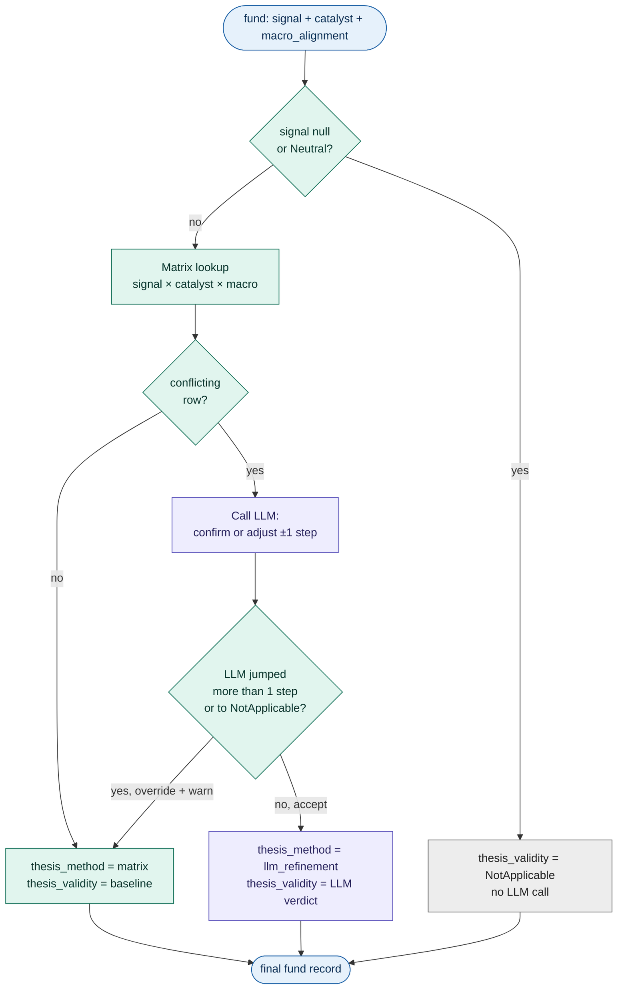
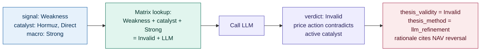
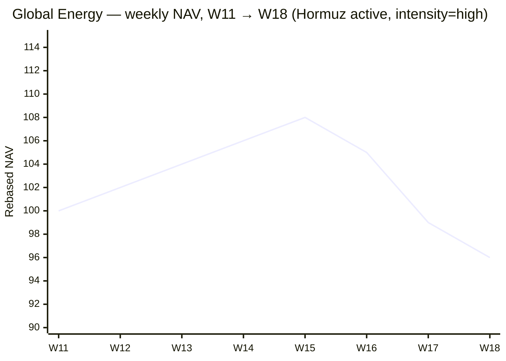
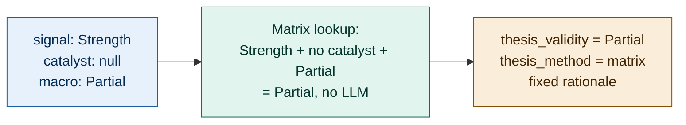
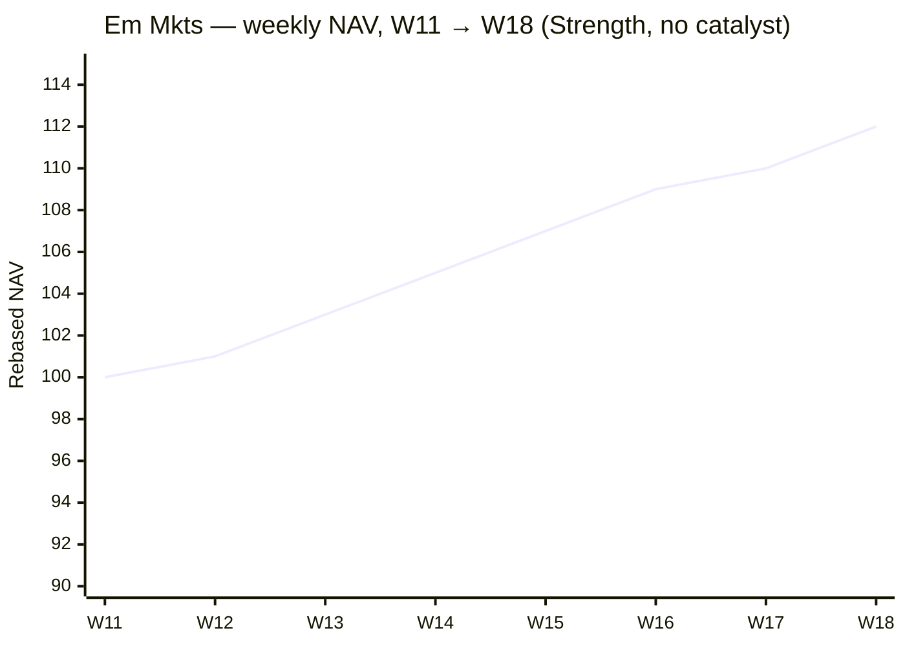
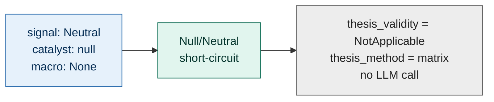
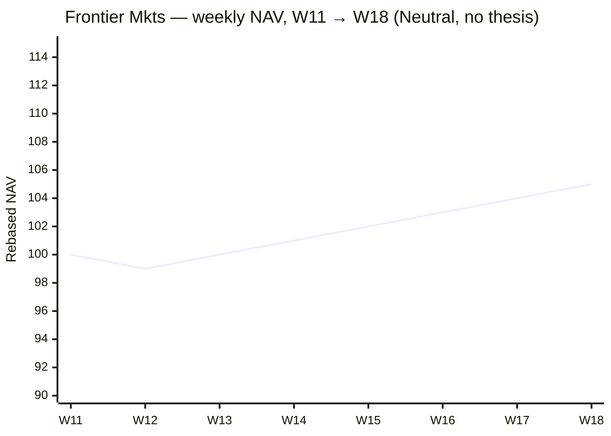

# Agent 07: ThesisValidator

> Determine whether each fund's investment thesis is Valid, Partial, Invalid, or NotApplicable based on signal + macro alignment + catalyst combination.

## Execution type

🔀 Hybrid — code computes a baseline from a decision matrix; LLM refines edge cases that produce conflicting inputs.

## Inputs

| Source | What for |
| --- | --- |
| `06-catalyst-{iso_week}-{run_id}.json` | Per-fund records with signal, macro_alignment, and catalyst |

## Outputs

### Output file

Pattern: `07-thesis-{iso_week}-{run_id}.json`

### Output schema

Adds `thesis_validity` and `thesis_rationale` to each fund record. All prior fields preserved.

```json
{
  "generated_at": "...",
  "iso_week": "...",
  "config_version": "1.0.0",
  "funds": [
    {
      "isin": "...",
      "metadata": { /* preserved */ },
      "metrics": { /* preserved */ },
      "signal": "...",
      "macro_alignment": "...",
      "catalyst": { /* preserved, may be null */ },

      "thesis_validity": "Valid" | "Partial" | "Invalid" | "NotApplicable",
      "thesis_rationale": "string (≤2 sentences)",
      "thesis_method": "matrix" | "llm_refinement"
    }
  ]
}
```

## Configuration consumed

None for v1. Future versions may consume the decision matrix as a tunable mapping.

## Vocabulary owned

| `thesis_validity` | Meaning |
| --- | --- |
| `Valid` | Story intact — signal and supporting context align |
| `Partial` | Some support but not all conditions met |
| `Invalid` | Thesis broken — price action contradicts the fundamental narrative |
| `NotApplicable` | No directional signal to anchor a thesis to (Neutral funds) |

## Decision matrix (code baseline)

The matrix produces a thesis_validity from the four-tuple `(signal, catalyst_present, macro_alignment, currently_held)`. Most cases are deterministic; a small slice invokes the LLM for refinement.

| Signal | Catalyst? | Macro alignment | → Baseline thesis | LLM refinement? |
| --- | --- | --- | --- | --- |
| Strength | yes | Strong | **Valid** | no |
| Strength | yes | Partial / None | **Partial** | optional (catalyst without macro tailwind) |
| Strength | no | Strong | **Valid** | no |
| Strength | no | Partial | **Partial** | no |
| Strength | no | None | **Partial** | no |
| Weakness | yes | Strong | **Invalid** | yes — confirm contradiction |
| Weakness | yes | Partial / None | **Invalid** | yes |
| Weakness | no | Strong | **Partial** | yes — momentum decay vs macro support |
| Weakness | no | Partial / None | **Partial** | no |
| Forming | yes | Strong | **Partial** | no |
| Forming | no | Strong | **Partial** | no |
| Forming | yes/no | None | **NotApplicable** | no |
| Neutral | any | any | **NotApplicable** | no |

The "thesis = Invalid" case (Weakness + Catalyst still active) is the most important pattern: **the catalyst is still firing externally, but the fund's price action is breaking down**. That's exactly when to exit — the thesis is broken regardless of what the macro reports say.

## What it does



For each fund:

1. **Null/Neutral short-circuit.** If `signal` is null or `Neutral`,
   `thesis_validity = NotApplicable` immediately — no LLM call, no matrix
   lookup. Neutral funds have no directional thesis to validate.
2. **Matrix lookup (code).** Hand the four-tuple
   `(signal, catalyst_present, macro_alignment, signal == Forming)` to the
   decision matrix above. Most rows resolve to a deterministic
   `thesis_validity` and an LLM-call flag.
3. **LLM refinement (only when flagged).** Conflicting rows call the LLM with
   the baseline label and the fund context. The LLM may confirm the baseline
   or shift it by **at most one step** along
   `Invalid ↔ Partial ↔ Valid`. NotApplicable is its own thing — the LLM
   cannot pull an actionable signal there.
4. **Override the LLM if it jumps too far.** If the LLM returns a label
   two steps from baseline (e.g. Invalid → Valid) or moves to/from
   NotApplicable, keep the matrix baseline, write a warning to
   `data_quality.warnings`, and stamp `thesis_method = matrix`.
5. **Always emit a rationale.** Matrix-only cases get a short, deterministic
   rationale that names the input pattern. LLM cases get the LLM's rationale
   verbatim (≤2 sentences, mentioning the catalyst/signal/macro by name).

The agent never invents a thesis_validity outside the four-value enum, and
never demotes the matrix below `Invalid` (the strongest negative verdict).

## Concrete shapes

### A fund record after CatalystTagger (input shape)

The diagram's "fund" box looks like this in JSON. Step 07 reads `signal`,
`catalyst` (may be null), and `macro_alignment` — the rest is preserved
unchanged:

```json
{
  "isin": "LU0256331488",
  "metadata": { "category": "Branschfond, Energi", "name": "Global Energy", "...": "..." },
  "signal": "Weakness",
  "macro_alignment": "Strong",
  "matched_theme": {
    "id": "rot_theme_energy_2026-W18",
    "label": "Integrated oil + inflation hedges",
    "match_method": "direct_category"
  },
  "catalyst": {
    "name": "Hormuz disruption",
    "intensity": "high",
    "weeks_active": 8,
    "exposure_type": "Direct",
    "rationale": "Energy sector fund directly benefits from oil price spikes from Hormuz tensions."
  }
}
```

### An LLM thesis-refinement verdict

The LLM emits one of these per fund (only on conflicting rows):

```json
{
  "thesis_validity": "Invalid",
  "rationale": "Catalyst still firing externally but the fund's NAV reversed in the last two weeks — price action contradicts the Hormuz narrative. Thesis broken regardless of the active catalyst."
}
```

The agent compares the LLM's `thesis_validity` to the matrix baseline. A move
of one step (e.g. Invalid → Partial, Partial → Valid) is accepted; a
two-step jump or any move to/from `NotApplicable` is overridden back to the
baseline and a warning is appended to `data_quality.warnings`.

### A fund record after ThesisValidator runs (Invalid + LLM-refined)

The canonical exit case — Weakness signal with a still-firing Direct catalyst
(step-07 fields highlighted in the table):

```json
{
  "isin": "LU0256331488",
  "metadata": { "category": "Branschfond, Energi", "name": "Global Energy", "...": "..." },
  "signal": "Weakness",
  "macro_alignment": "Strong",
  "matched_theme": { "...": "..." },
  "catalyst": {
    "name": "Hormuz disruption",
    "exposure_type": "Direct",
    "intensity": "high",
    "weeks_active": 8,
    "rationale": "..."
  },
  "thesis_validity": "Invalid",
  "thesis_rationale": "Catalyst still active but price action reversed — Hormuz tailwind no longer translating to NAV gains. Thesis broken regardless of external narrative.",
  "thesis_method": "llm_refinement"
}
```

For a fund where the matrix is decisive on its own,
`thesis_method = "matrix"` and `thesis_rationale` is the short, fixed string
from the matrix branch the fund landed on.

## Worked examples

### Global Energy (LU0256331488) — Invalid (the canonical exit case)

| Field | Value |
| --- | --- |
| `signal` | Weakness |
| `catalyst` | Hormuz disruption, Direct, intensity high |
| `macro_alignment` | Strong (energy theme still active) |
| Baseline | Invalid |
| LLM refinement | Confirmed Invalid — momentum reversed despite catalyst still firing |
| `thesis_validity` | `Invalid` |
| `thesis_method` | `llm_refinement` |
| `thesis_rationale` | "Catalyst still active but price action reversed — Hormuz tailwind no longer translating to NAV gains. Thesis broken regardless of external narrative." |



NAV trajectory (rebased to 100 at W11):



This is the picture ThesisValidator was built to recognize. The Hormuz
catalyst is still firing — `intensity = high`, `weeks_active = 8` — and
the energy theme is `macro_alignment = Strong`. By any narrative measure
this fund should be working. But the W16 → W18 segment shows the price
walking away from the story: down ~11% in three weeks. SignalScorer
emits `Weakness`, the matrix returns `Invalid`, and the LLM confirms
with a rationale that names the price-vs-narrative split. That's the
exit trigger Recommender (step 08) acts on.

### Em Mkts (LU0106252389) — Partial

| Field | Value |
| --- | --- |
| `signal` | Strength |
| `catalyst` | null |
| `macro_alignment` | Partial |
| Baseline | Partial |
| LLM refinement | no — clean matrix case |
| `thesis_validity` | `Partial` |
| `thesis_method` | `matrix` |
| `thesis_rationale` | "Strength momentum without catalyst or Strong macro tailwind." |



NAV trajectory (rebased to 100 at W11):



A clean grind higher — SignalScorer locks in `Strength` on the back of 3/3
positive windows and a healthy 12w Sharpe. But there's no specific catalyst
tagged (CatalystTagger correctly returned `null` — neither Hormuz nor AI
capex applies to Em Mkts), and the macro alignment is only `Partial`
(LLM adjacency, not a direct theme match). The matrix sees
`Strength + no catalyst + Partial` and lands on `Partial`
deterministically — no LLM call needed. The
position is tradeable but not a high-conviction one; Recommender will class
it as a *"momentum entry without catalyst backing"* and weight it
accordingly.

### Frontier Mkts (LU0562313402) — NotApplicable (Neutral)

| Field | Value |
| --- | --- |
| `signal` | Neutral |
| `catalyst` | null |
| `macro_alignment` | None |
| Baseline | NotApplicable |
| `thesis_validity` | `NotApplicable` |
| `thesis_method` | `matrix` |
| `thesis_rationale` | "No directional signal — no thesis to validate." |



NAV trajectory (rebased to 100 at W11):



Slow, low-volatility drift higher — not enough to fire a Strength signal,
not enough decay to fire Weakness. SignalScorer settles on `Neutral`. From
ThesisValidator's perspective, that ends the conversation immediately:
without a directional signal there's no thesis worth validating, and the
agent skips the matrix lookup entirely. `NotApplicable` is the dominant
outcome across a normal week (~50–80% of the universe), and it costs zero
LLM budget to emit.

## When the LLM is invoked

The LLM is consulted only for the rows in the matrix marked "yes" or "optional" — roughly when the inputs are conflicting (Weakness + active catalyst, or Strength with catalyst but weak macro). The LLM's job is to write a more specific `thesis_rationale` and confirm the baseline label, not to override it. If the LLM returns a label that differs from the baseline by more than one step (e.g. Valid → Invalid), the agent logs a warning and keeps the baseline.

## LLM prompt skeleton

### System prompt

```text
You are a thesis validator. You will be given a fund's signal, catalyst (if any),
macro alignment, and a baseline thesis_validity from a decision matrix.

Your job is to either CONFIRM the baseline or recommend an ADJACENT label
(Valid ↔ Partial, Partial ↔ Invalid). You may not jump two steps.

Constraints:
- Your output MUST be valid JSON: {"thesis_validity": "<label>", "rationale": "..."}.
- thesis_validity must be one of {Valid, Partial, Invalid, NotApplicable}.
- rationale must be ≤2 sentences and specific to the inputs (cite the catalyst,
  signal, or macro alignment by name).
- If the baseline is correct, restate it; do not invent a different one to seem useful.

The most consequential pattern: signal=Weakness with active catalyst means the
thesis is BROKEN even though the catalyst is firing. Price action overrides
narrative.
```

### User prompt template

```text
Fund: {fund.metadata.name} ({fund.isin})
Category: {fund.metadata.category}

Signal: {fund.signal} ({fund.rule_fired})
Catalyst: {fund.catalyst or "none"}
Macro alignment: {fund.macro_alignment}
Currently held: {fund.currently_held}

Decision-matrix baseline thesis_validity: {baseline}

Confirm or adjust by one step. Return JSON with rationale.
```

## Failure modes

| Trigger | Behavior |
| --- | --- |
| LLM returns invalid JSON | Retry once with corrective prompt; on second failure use baseline |
| LLM returns label two steps from baseline (e.g. Valid → Invalid) | Override LLM, use baseline, log warning |
| LLM returns label not in enum | Use baseline; log warning |
| Fund has `signal = null` (DataLoader / SignalScorer skipped it) | `thesis_validity = NotApplicable`, no LLM call |
| Catalyst object exists but exposure_type missing | Treat as no catalyst for matrix purposes; warn |

## Test fixtures

| Scenario | Inputs | Expected | LLM call? |
| --- | --- | --- | --- |
| Strength + catalyst + Strong macro | Energy fund pre-rollover | Valid | no |
| Strength only (no catalyst, no macro) | Smlr Coms momentum | Partial | no |
| Weakness + catalyst Direct | Energy post-rollover | Invalid (matrix), confirmed by LLM | yes |
| Weakness + no catalyst, with macro Strong | Theoretical: defensive theme weakening | Partial (matrix), LLM confirms | yes |
| Weakness + no catalyst, no macro | Indian Opports clean sell | Partial | no |
| Forming + Strong macro | Promoted near-buy | Partial | no |
| Neutral (any combination) | Most universe in normal weeks | NotApplicable | no |
| LLM tries to jump Valid → Invalid | Override scenario | Use baseline (Valid), warn | yes |

## Evaluation prompt — AI Foundry custom rubric

```text
You are evaluating ThesisValidator's output for a single fund.

Inputs you will see:
- The fund's signal, catalyst (or null), macro_alignment, currently_held
- The agent's verdict: thesis_validity + thesis_rationale + thesis_method

Score on four dimensions, 1-5 each:

1. Matrix consistency (1-5)
   Does the assigned thesis_validity match the decision matrix for this input combo?
   - 5: Exact match.
   - 3: Adjacent (Valid↔Partial or Partial↔Invalid) — defensible LLM refinement.
   - 1: Two steps off or wrong direction.

2. The "Invalid catalyst-still-active" detection (1-5, only when applicable)
   When signal=Weakness and catalyst is Direct/active, did the agent correctly
   emit Invalid?
   - 5: Yes, with a rationale that explicitly notes the price-vs-narrative split.
   - 3: Emitted Partial when Invalid was warranted.
   - 1: Emitted Valid (catastrophic — would prevent the exit).

3. Rationale quality (1-5)
   - 5: ≤2 sentences, names the catalyst/macro/signal specifically, explains the link.
   - 3: Vague but plausible.
   - 1: Generic, off-topic, or contradicts the verdict.

4. Method appropriateness (1-5)
   - 5: matrix used for clean cases; llm_refinement only for genuinely conflicting inputs.
   - 1: LLM consulted unnecessarily, or matrix used when refinement was needed.

For each dimension output:
- Score (1-5)
- One-sentence justification

Flag for review if dimension 2 ≤ 2 (this is the rotation-trigger case).
```

## Edge cases

+ A fund with `catalyst.exposure_type = "Indirect"` and `signal = Weakness`: treat as if `catalyst is present` for matrix purposes (still triggers Invalid path), but LLM's rationale should note the indirect link is also breaking.
+ `signal = Forming` with `macro_alignment = None`: cannot occur in v1 because MacroAligner only promotes Neutral → Forming when macro is Strong. Defensive: treat as NotApplicable.
+ A fund with conflicting inputs (e.g. Strength + catalyst that the substitution-chain reports as fading): LLM may pick Partial — that's acceptable. The matrix's Valid is the upper bound.
+ Funds with `currently_held = false` get the same thesis treatment as held funds. The held flag is a portfolio-state concern that PortfolioConstructor handles, not a thesis-validity concern.
