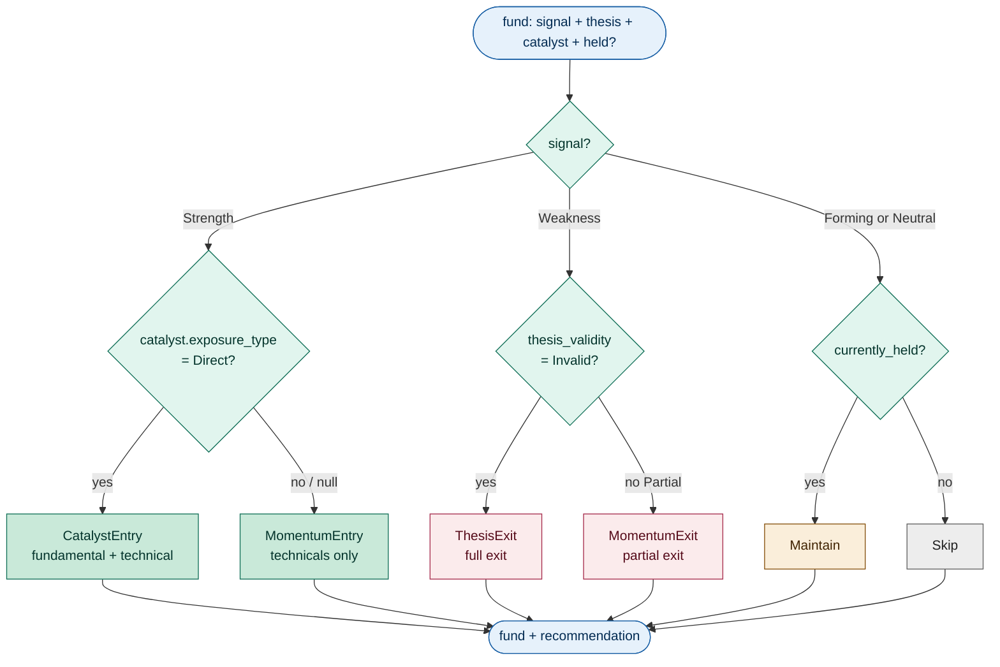
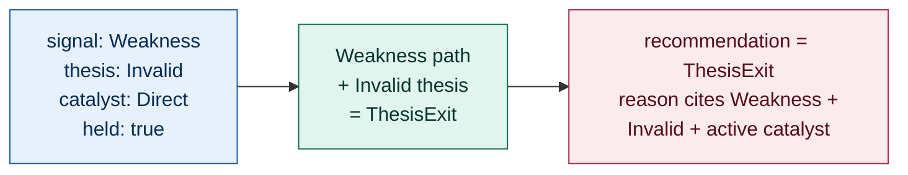
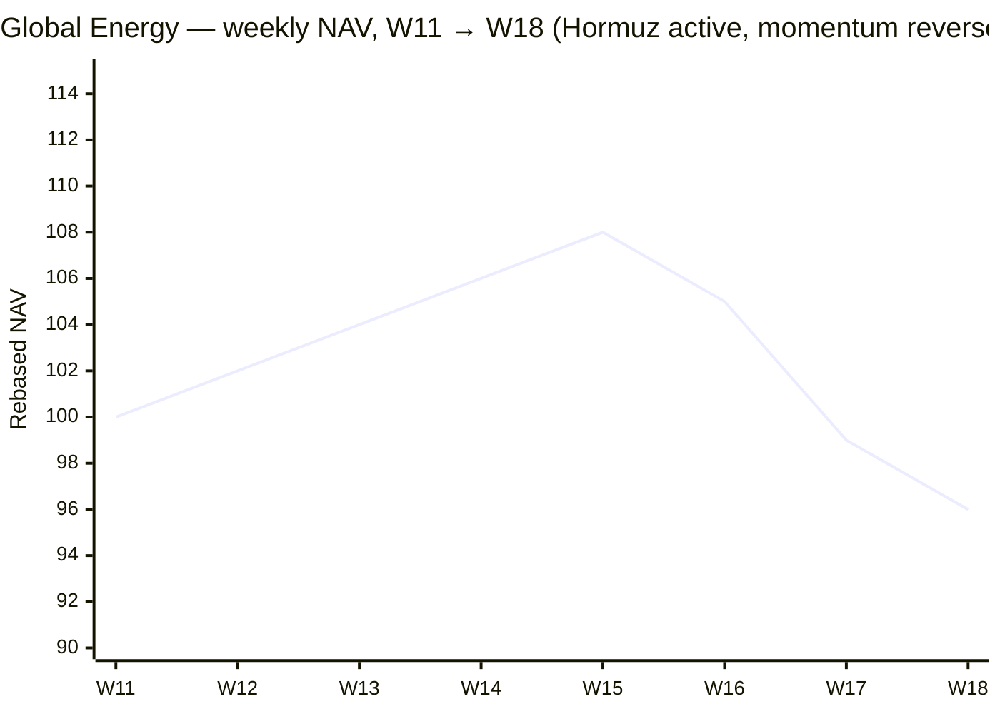
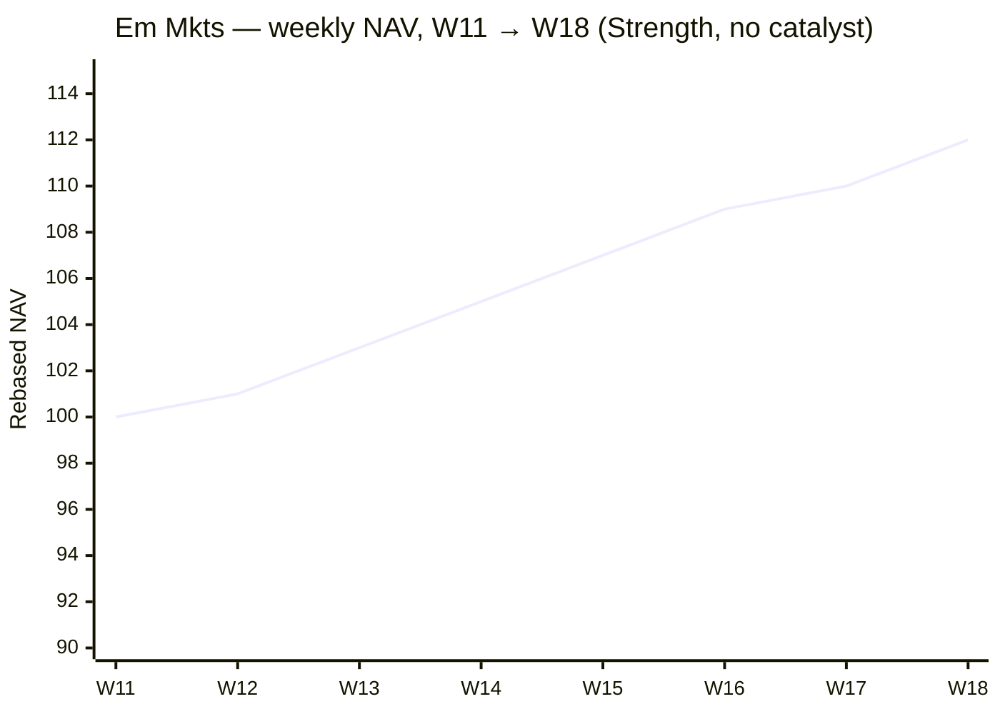
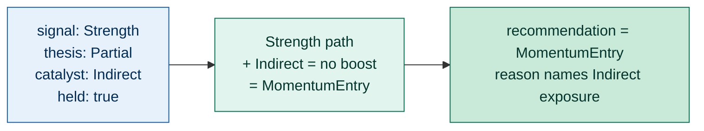
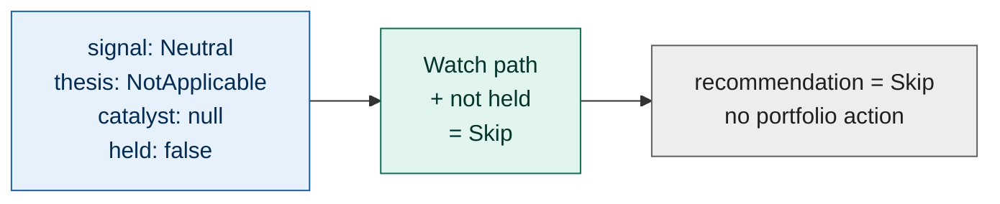
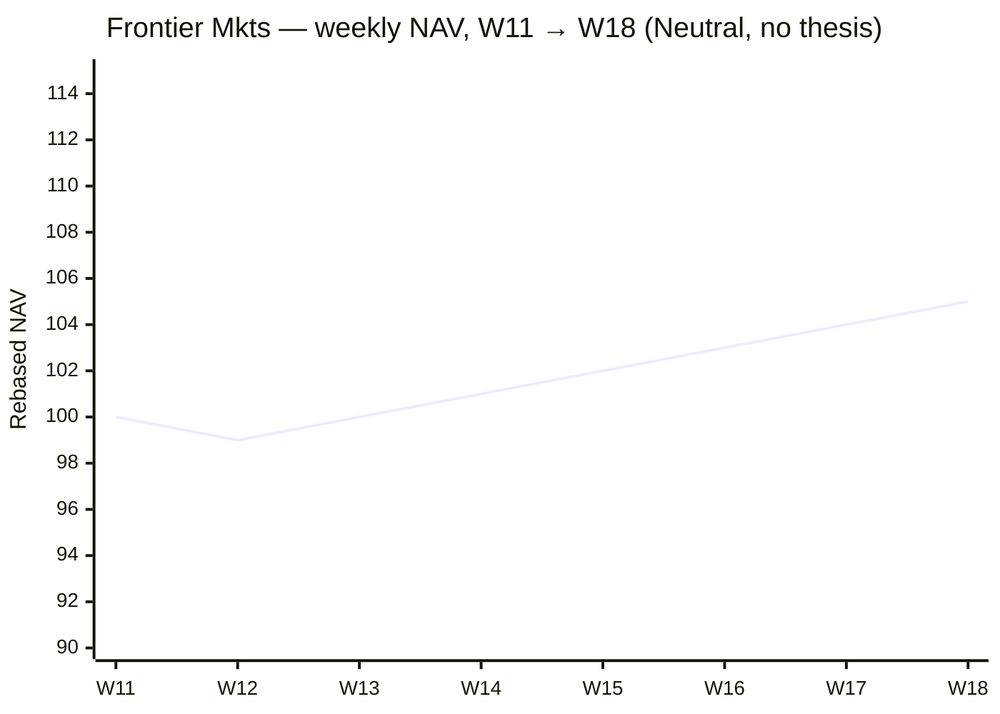

# Agent 08: Recommender

> Map (signal, thesis_validity, catalyst, currently_held) into a single recommendation type via a deterministic mapping table.

## Execution type

⚙️ Code

## Inputs

| Source | What for |
| --- | --- |
| `07-thesis-{iso_week}-{run_id}.json` | Per-fund records with full context (signal, macro, catalyst, thesis) |

## Outputs

### Output file

Pattern: `08-recommendation-{iso_week}-{run_id}.json`

### Output schema

Adds `recommendation` and `recommendation_reason` to each fund record. All
prior fields preserved.

```json
{
  "generated_at": "...",
  "iso_week": "...",
  "config_version": "1.0.0",
  "funds": [
    {
      "isin": "...",
      "metadata": { /* preserved */ },
      "signal": "...",
      "thesis_validity": "...",
      "catalyst": { /* preserved */ },
      "currently_held": true | false,

      "recommendation": "CatalystEntry" | "MomentumEntry" | "ThesisExit" | "MomentumExit" | "Maintain" | "Skip",
      "recommendation_reason": "string (short, structured)"
    }
  ]
}
```

## Configuration consumed

None. Pure deterministic mapping.

## Vocabulary owned

| `recommendation` | Meaning |
| --- | --- |
| `CatalystEntry` | Strength signal with active Direct catalyst — fundamental driver entry |
| `MomentumEntry` | Strength signal without (Direct) catalyst — pure technical entry |
| `ThesisExit` | Weakness signal with broken thesis (Invalid) — full exit |
| `MomentumExit` | Weakness signal with intact-but-weak thesis (Partial) — exit, but not as decisively |
| `Maintain` | Held position with no directional signal — keep |
| `Skip` | Not held with no directional signal — no action |

## Mapping table

The complete mapping over the four-tuple
`(signal, thesis_validity, catalyst.exposure_type, currently_held)`. All
combinations are exhaustive — no fund record can fall through.

| Signal | Thesis | Catalyst exposure | Held? | Recommendation |
| --- | --- | --- | --- | --- |
| Strength | Valid | Direct | any | **CatalystEntry** |
| Strength | Valid | Indirect or null | any | **MomentumEntry** |
| Strength | Partial | Direct | any | **CatalystEntry** |
| Strength | Partial | Indirect or null | any | **MomentumEntry** |
| Weakness | Invalid | any | any | **ThesisExit** |
| Weakness | Partial | any | any | **MomentumExit** |
| Forming | any | any | held | **Maintain** |
| Forming | any | any | not held | **Skip** |
| Neutral | NotApplicable | any | held | **Maintain** |
| Neutral | NotApplicable | any | not held | **Skip** |
| Neutral | any (defensive) | any | held | **Maintain** |
| Neutral | any (defensive) | any | not held | **Skip** |

### Why these mappings

| Mapping | Rationale |
| --- | --- |
| Strength + Catalyst → CatalystEntry | Fundamental + technical agreement is the highest-conviction entry pattern |
| Strength + no Catalyst → MomentumEntry | Technicals alone are sufficient for entry but signal weaker conviction (UniverseEnricher will score lower) |
| Weakness + Invalid thesis → ThesisExit | Thesis broken means the original investment reason is gone — full exit, no partial holds |
| Weakness + Partial thesis → MomentumExit | Technicals failing but thesis still has some support — exit, but less decisively (PortfolioConstructor may PartialSell rather than full Sell) |
| Forming → Maintain (held) / Skip (not held) | Watch state — don't enter fresh positions, keep existing ones, see if signal develops |

The distinction between **CatalystEntry** and **MomentumEntry** matters
downstream because UniverseEnricher uses it for conviction weighting (catalyst
presence boosts the macro_alignment + thesis_validity components) and for
rotation pairing (CatalystEntry is more likely to be paired with a ThesisExit
in the same theme).

## What it does



For each fund:

1. **Switch on signal first.** `Strength` and `Weakness` are actionable;
   `Forming` and `Neutral` collapse to held/not-held outcomes regardless
   of any other field.
2. **Strength path — split by catalyst.** A `Direct` catalyst exposure
   upgrades the entry to `CatalystEntry` (highest conviction). Indirect
   exposure or `null` catalyst falls back to `MomentumEntry`. The
   `thesis_validity` (Valid vs Partial) does not change the
   recommendation type at this step — UniverseEnricher uses it later for
   conviction weighting.
3. **Weakness path — split by thesis_validity.** `Invalid` means the
   original investment story is gone → `ThesisExit` (full exit).
   `Partial` means the technicals are decaying but the story isn't
   fully dead → `MomentumExit` (downstream may convert to `PartialSell`
   rather than a full `Sell`).
4. **Watch path (Forming / Neutral).** No new directional signal. If the
   fund is currently held, emit `Maintain`. If not, emit `Skip`. This is
   the dominant outcome on a normal week.
5. **Always emit a reason.** A short structured string keyed on the input
   tuple — not free-form prose. Audit trails downstream rely on the
   shape being consistent across runs.

The agent never invents a recommendation outside the six-value enum, never
calls an LLM, and never reads any field outside the tuple
`(signal, thesis_validity, catalyst.exposure_type, currently_held)`.

## Concrete shapes

### A fund record after ThesisValidator (input shape)

The diagram's "fund" box looks like this in JSON. Step 08 reads `signal`,
`thesis_validity`, `catalyst.exposure_type` (may be null), and
`currently_held` — the rest is preserved unchanged:

```json
{
  "isin": "LU0256331488",
  "metadata": { "category": "Branschfond, Energi", "name": "Global Energy", "...": "..." },
  "signal": "Weakness",
  "macro_alignment": "Strong",
  "matched_theme": { "...": "..." },
  "catalyst": {
    "name": "Hormuz disruption",
    "exposure_type": "Direct",
    "intensity": "high",
    "weeks_active": 8,
    "rationale": "..."
  },
  "thesis_validity": "Invalid",
  "thesis_method": "llm_refinement",
  "thesis_rationale": "Catalyst still active but price action reversed — thesis broken.",
  "currently_held": true
}
```

### A fund record after Recommender runs (ThesisExit case)

The canonical exit pattern — Weakness signal with broken thesis (step-08
fields highlighted at the bottom):

```json
{
  "isin": "LU0256331488",
  "metadata": { "category": "Branschfond, Energi", "name": "Global Energy", "...": "..." },
  "signal": "Weakness",
  "macro_alignment": "Strong",
  "catalyst": { "exposure_type": "Direct", "...": "..." },
  "thesis_validity": "Invalid",
  "thesis_rationale": "...",
  "currently_held": true,

  "recommendation": "ThesisExit",
  "recommendation_reason": "Weakness + Invalid thesis (catalyst still active but momentum reversed)"
}
```

For other paths the shape is identical — only the two new fields differ.
Recommender never mutates upstream fields.

## Worked examples

### Global Energy (LU0256331488) — ThesisExit

| Field | Value |
| --- | --- |
| `signal` | Weakness |
| `thesis_validity` | Invalid |
| `catalyst.exposure_type` | Direct |
| `currently_held` | true |
| `recommendation` | **ThesisExit** |
| `recommendation_reason` | "Weakness + Invalid thesis (catalyst still active but momentum reversed)" |



NAV trajectory (rebased to 100 at W11):



This is exactly the trade Recommender exists to surface. The Hormuz catalyst
is still firing — `intensity = high`, `weeks_active = 8` — and the energy
theme is still `macro_alignment = Strong`. ThesisValidator already saw
through the narrative and emitted `Invalid` based on the W16 → W18 reversal.
Recommender's job here is mechanical: Weakness + Invalid → `ThesisExit`,
no LLM, no portfolio reasoning. PortfolioConstructor (step 10) will turn
this into a full `Sell` on the next run because the position is currently
held.

### Em Mkts (LU0106252389) — MomentumEntry

| Field | Value |
| --- | --- |
| `signal` | Strength |
| `thesis_validity` | Partial |
| `catalyst` | null |
| `currently_held` | false |
| `recommendation` | **MomentumEntry** |
| `recommendation_reason` | "Strength + Partial thesis, no catalyst — pure momentum entry" |

```mermaid
flowchart LR
    classDef io fill:#E6F1FB,stroke:#185FA5,color:#042C53
    classDef code fill:#E1F5EE,stroke:#0F6E56,color:#04342C
    classDef entry fill:#C9E9D9,stroke:#0F6E56,color:#04342C

    A[signal: Strength<br/>thesis: Partial<br/>catalyst: null<br/>held: false]:::io
    B[Strength path<br/>+ no Direct catalyst<br/>= MomentumEntry]:::code
    C[recommendation = MomentumEntry<br/>reason names "no catalyst"<br/>so UniverseEnricher weights<br/>conviction lower]:::entry

    A --> B --> C
```

NAV trajectory (rebased to 100 at W11):



A clean grind higher. SignalScorer locked in `Strength` on the back of 3/3
positive windows; ThesisValidator settled on `Partial` because there's no
catalyst and the macro alignment was only adjacency-based. Recommender
splits the Strength path on `catalyst.exposure_type` — `null` here, so
the path is `MomentumEntry`, not `CatalystEntry`. The conviction
distinction propagates downstream: UniverseEnricher will give this a
lower thesis_validity weighting than a Strength + Direct-catalyst peer,
and PortfolioConstructor will size the new buy accordingly.

### Glbl Alt Engy (LU1983299162) — MomentumEntry (Indirect catalyst)

| Field | Value |
| --- | --- |
| `signal` | Strength |
| `thesis_validity` | Partial |
| `catalyst.exposure_type` | Indirect |
| `currently_held` | true |
| `recommendation` | **MomentumEntry** |
| `recommendation_reason` | "Strength + Indirect catalyst exposure — counted as momentum, not catalyst" |



This is the Indirect-catalyst calibration case. CatalystTagger correctly
flagged Glbl Alt Engy as `Indirect` exposure to the Hormuz catalyst — it's
not a primary beneficiary, just a sector-adjacent flow. Recommender treats
`Indirect` and `null` the same way: the path falls through to
`MomentumEntry`. The held flag has no effect on the *type* — but
PortfolioConstructor will read `currently_held = true` and convert this to
a `TopUp` (or `Hold`) rather than a fresh `Buy`. Reserving `CatalystEntry`
for `Direct`-only keeps the highest-conviction bucket clean for downstream
weighting.

### Frontier Mkts (LU0562313402) — Skip

| Field | Value |
| --- | --- |
| `signal` | Neutral |
| `thesis_validity` | NotApplicable |
| `catalyst` | null |
| `currently_held` | false |
| `recommendation` | **Skip** |
| `recommendation_reason` | "Neutral signal, fund not held — no action" |



NAV trajectory (rebased to 100 at W11):



Slow drift higher — not enough to fire a Strength signal, not enough decay
for Weakness. ThesisValidator already collapsed this to `NotApplicable`.
Recommender's Watch path simply checks the held flag: not held, so `Skip`.
This is the dominant outcome across a normal week (~50–80% of the
universe), and like the rest of the deterministic agents it costs zero
compute beyond a switch statement.

### Frntr Mkts but held (hypothetical) — Maintain

Same metrics as above but the fund is currently held: the Watch path goes
the other way and `recommendation = Maintain`,
`recommendation_reason = "Neutral signal, held position — no change"`.
PortfolioConstructor reads `Maintain` as an explicit "do nothing" signal,
not as a missing recommendation — important for the audit trail.

## Failure modes

| Trigger | Behavior |
| --- | --- |
| Fund record missing `signal` | Set `recommendation = Skip`, `recommendation_reason = "no_signal_no_action"`, log warning |
| Fund record missing `thesis_validity` | Treat as `NotApplicable` (matrix default for ambiguous cases) |
| Unknown `signal` value (not in enum) | Halt — schema integrity error (`08-error-...json`) |
| Unknown `recommendation` derived (shouldn't happen with exhaustive matrix) | Halt — code bug |

## Test fixtures

| Scenario | Inputs | Expected |
| --- | --- | --- |
| Catalyst entry | Strength + Valid + Direct + not held | CatalystEntry |
| Momentum entry (no catalyst) | Strength + Partial + null + not held | MomentumEntry |
| Momentum entry (Indirect catalyst) | Strength + Partial + Indirect + not held | MomentumEntry |
| Top-up case (held + Strength) | Strength + Valid + Direct + held | CatalystEntry (PortfolioConstructor decides TopUp vs Hold) |
| Thesis exit | Weakness + Invalid + Direct + held | ThesisExit |
| Momentum exit | Weakness + Partial + null + held | MomentumExit |
| Forming held | Forming + Partial + null + held | Maintain |
| Forming not held | Forming + Partial + null + not held | Skip |
| Neutral held | Neutral + NotApplicable + null + held | Maintain |
| Neutral not held | Neutral + NotApplicable + null + not held | Skip |
| Weakness on not-held fund | Weakness + Invalid + any + not held | ThesisExit (downstream PortfolioConstructor converts to NoOp) |

## Edge cases

+ **Weakness on a not-held fund** → emits `ThesisExit` or `MomentumExit`
  even though there's nothing to exit. PortfolioConstructor handles this
  gracefully (converts to `NoOp` since `currently_held = false`). Don't
  suppress here — keep the recommendation honest so audit trails reflect
  the signal.
+ **CatalystEntry on a held fund** → emits `CatalystEntry`;
  PortfolioConstructor decides whether it's `TopUp` (under target weight)
  or `Hold` (already at target).
+ **Forming with Indirect catalyst** → still emits `Maintain` (held) /
  `Skip` (not held). The Indirect catalyst doesn't change the
  actionability of a Forming signal.
+ **Fund with `signal = Weakness` AND `catalyst.exposure_type = Direct`
  AND `thesis_validity = Partial`** (LLM declined to mark Invalid):
  emits `MomentumExit`, not `ThesisExit`. The thesis isn't fully broken —
  just weakening.
+ The recommendation is a per-fund classification; nothing about
  portfolio shape, sizing, or pairing happens here. Those are downstream
  concerns (UniverseEnricher and PortfolioConstructor).
