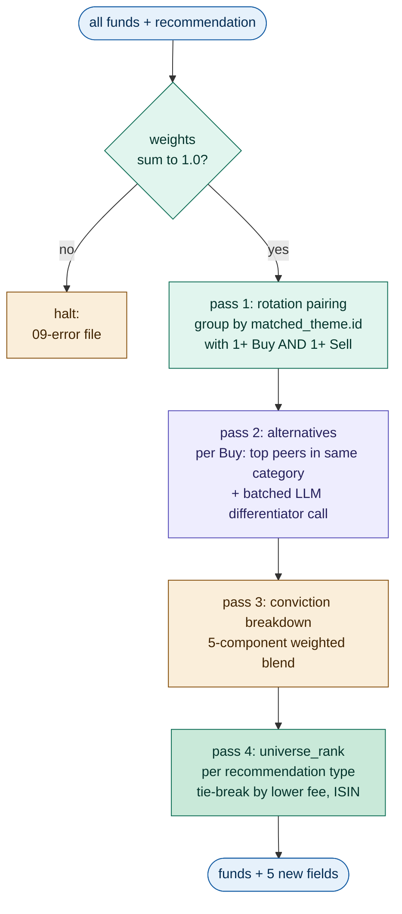
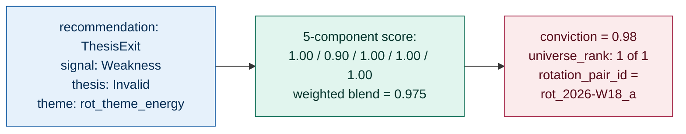
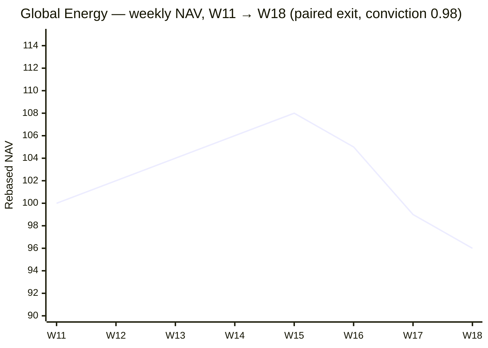
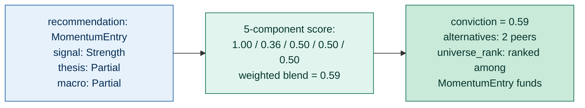
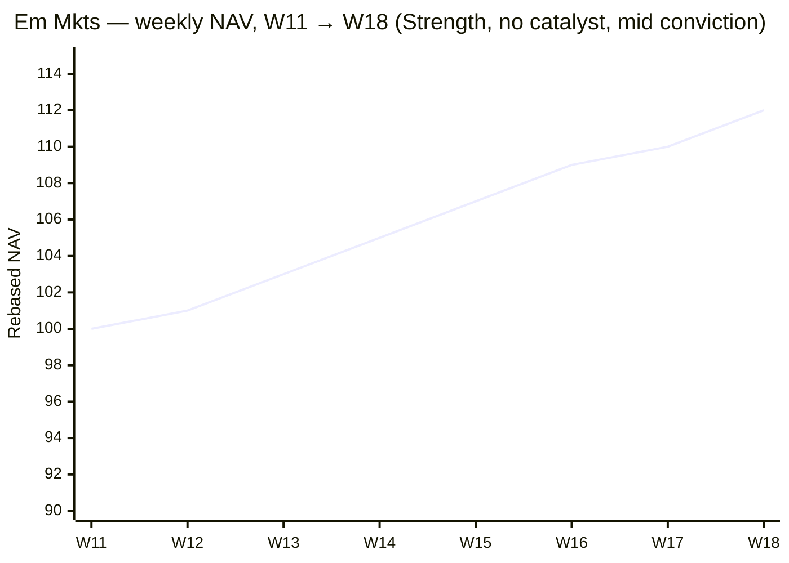
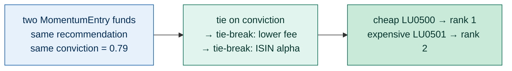
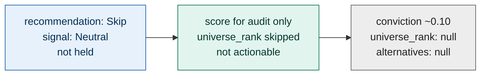

# Agent 09: UniverseEnricher

> Add cross-fund context to each per-fund record: conviction score, universe rank, alternatives, rotation pair linkage.

## Execution type

🔀 Hybrid — code computes ranks and conviction; LLM generates differentiator text for alternatives.

## Inputs

| Source | What for |
| --- | --- |
| `08-recommendation-{iso_week}-{run_id}.json` | All per-fund records with full context including recommendation |
| `config-09-conviction.json` | Weights, normalization parameters, alternatives policy, rotation pairing rules |

## Outputs

### Output file

Pattern: `09-enrichment-{iso_week}-{run_id}.json`

### Output schema

Adds enrichment fields to each fund record. All prior fields preserved.

```json
{
  "generated_at": "...",
  "iso_week": "...",
  "config_version": "1.0.0",
  "funds": [
    {
      "isin": "...",
      "metadata": { /* preserved */ },
      "metrics": { /* preserved */ },
      "signal": "...",
      "thesis_validity": "...",
      "recommendation": "...",
      "currently_held": "...",

      "conviction_score": 0.85,
      "conviction_breakdown": {
        "signal_strength": 1.00,
        "metrics_quality": 0.90,
        "macro_alignment": 0.60,
        "thesis_validity": 1.00,
        "universe_context": 1.00
      },
      "universe_rank": {
        "within_recommendation": 1,
        "of_total_in_recommendation": 6
      },
      "alternatives": [
        {
          "isin": "...",
          "name": "...",
          "differentiator": "string (LLM-generated, ≤1 sentence)"
        }
      ],
      "rotation_pair_id": "rot_2026-W18_a"
    }
  ]
}
```

## Configuration consumed

- `config-09-conviction.json` → entire file

## Vocabulary owned

None new. Uses recommendation enum from step 08 and signal enum from step 04.

## What it does



For each fund:

1. **Validate weights once.** The five conviction weights must sum to 1.0
   within tolerance. Drift means a config typo — halt with
   `09-error-...json` rather than emit silently-skewed scores.
2. **Pass 1: rotation pairing.** Group funds by their `matched_theme.id`.
   A theme that contains *both* an Exit (`ThesisExit` / `MomentumExit`)
   and an Entry (`CatalystEntry` / `MomentumEntry`) gets a pair id of
   the form `rot_{iso_week}_{letter}`. Letter `a` goes to the
   largest bucket, alphabetical tie-break. Passes must run before
   conviction so the universe_context component can credit pair
   membership.
3. **Pass 2: alternatives + LLM differentiators.** Only Buys get peers.
   For each Buy candidate, find up to `max_per_fund` peers in the same
   `metadata.category`, sorted by Sharpe(12w) desc with fee tie-break.
   Then call the LLM *once* per Buy with the full peer set (cheaper
   than per-peer; the model also writes better differentiators when
   it can compare). LLM failures degrade gracefully — keep the
   structural alternatives, blank out their differentiator strings,
   and warn.
4. **Pass 3: conviction breakdown.** Score five components on `[0, 1]`,
   take the weighted sum, round to two decimals. Each component is
   independently testable; `conviction_breakdown` ships in the output
   so audits can sanity-check that
   `Σ(weight × component) ≈ conviction_score`.
5. **Pass 4: universe_rank.** Within each rankable recommendation
   (`CatalystEntry`, `MomentumEntry`, `ThesisExit`, `MomentumExit`),
   sort by conviction desc, tie-break by lower `total_fee` then
   alphabetical ISIN. `Maintain` and `Skip` get no rank — they aren't
   actionable and PortfolioConstructor doesn't ration them.

The output is append-only: prior fields (signal, thesis_validity,
catalyst, recommendation, ...) pass through untouched. Step 09 only
adds five fields per fund.

## Conviction scoring

The single 0–1 number is a weighted sum of five components, each scored 0–1. Same scale applies to Buys and Sells: 0.85 means high confidence regardless of direction.

| Component | Weight | Score 1.0 when… | Score 0.0 when… |
| --- | --- | --- | --- |
| Signal strength | 0.25 | All buy criteria cleared with margin (or sell rule fired with multiple triggers) | Just barely passed threshold |
| Metrics quality | 0.25 | High Sharpe (12w), contained vol, shallow drawdown | Weak Sharpe or excessive vol |
| Macro alignment | 0.15 | macro_alignment = Strong | None |
| Thesis validity | 0.20 | Valid (for Buys) or Invalid (for Sells) — directionally appropriate | Inverse of recommendation direction |
| Universe context | 0.15 | Best peer in category, or paired rotation available | No alternative, no rotation pair |

### Per-component scoring rules

**Signal strength** (0–1)

- Strength + multiple buy criteria cleared with margin → 1.0
- Strength but barely (e.g. sharpe_12w just at threshold 0.5) → 0.6
- Weakness with three sell triggers → 1.0
- Weakness with one sell trigger → 0.6
- Forming → 0.4 (it's a watch state, not a strong signal)
- Neutral → 0.0

**Metrics quality** (0–1)

- `clamp(sharpe_12w, 0, sharpe_12w_normalization_max) / sharpe_12w_normalization_max`
- Penalize if `current_drawdown_pct < drawdown_penalty_threshold_pct`: subtract 0.20
- Penalize if `ann_volatility_12w_pct > vol_penalty_min_pct`: subtract 0.15
- Penalize if any `data_quality.sharpe_*_is_nan` flag is true: subtract 0.10 per flag
- Floor at 0.0

**Macro alignment** (0–1)

- Strong → 1.0
- Partial → 0.5
- None → 0.0

**Thesis validity** (0–1)

- For Buys (CatalystEntry, MomentumEntry): Valid → 1.0, Partial → 0.5, NotApplicable → 0.3, Invalid → 0.0
- For Sells (ThesisExit, MomentumExit): Invalid → 1.0, Partial → 0.5, Valid → 0.0, NotApplicable → 0.5
- For Maintain / Skip: → 0.5 (non-directional)

**Universe context** (0–1)

- Has rotation_pair_id → 1.0 (paired exits and entries are high-conviction)
- Has at least one alternative listed → 0.5
- Isolated (no peers, no pair) → 0.0

### Why these defaults

| Setting | Default | Rationale |
| --- | --- | --- |
| Equal weights between technical and contextual (0.50 / 0.50) | 0.25 + 0.25 vs 0.15 + 0.20 + 0.15 | Forces a fund to clear both technical evidence (signal + metrics) AND contextual fit (macro + thesis + universe) before scoring high. Tilts conviction toward "right reasons + right moment" rather than pure trend-following |
| `sharpe_12w_normalization_max = 5.0` | 5.0 | Caps abnormally high Sharpe values — bond funds with low vol can produce Sharpe of 10+ which would dominate the metrics-quality term. Past 5.0, additional Sharpe is treated as noise, not signal |
| `drawdown_penalty_threshold_pct = -3.0` | −3.0 | Funds with current drawdown worse than −3% lose conviction even if Sharpe is positive. Prevents "high Sharpe but currently in trouble" funds from ranking high |
| `vol_penalty_min_pct = 25.0` | 25.0 | Funds above 25% annualized vol get a penalty. Reflects that higher-vol funds need stronger Sharpe to be comparable to low-vol peers — partially offsets the Sharpe normalization |
| Alternatives `max_per_fund = 3` | 3 | One isn't enough to give choice; five+ becomes noise. Three is the standard "primary, alternate, fallback" pattern |
| `tie_break: lower_total_fee` | fee | When two funds tie on conviction, the cheaper one wins. Aligns with fee-minimization philosophy — small fee differences compound meaningfully over a 5-year holding period |

## Universe rank

Within each rankable recommendation type (CatalystEntry, MomentumEntry, ThesisExit, MomentumExit), rank funds by conviction descending. Ties broken by lower total_fee, then ISIN alphabetically.

The rank is **scoped per recommendation type**, not global. So "rank 1 of 3 BuySignals" is independent of the SellSignal ranking. PortfolioConstructor uses these ranks to decide which Buys to fund first when buys exceed deployable cash.

`Maintain` and `Skip` get no rank — `universe_rank` stays `null`. They aren't competing for cash so ordering them adds no information.

## Alternatives

For each fund with a Buy-side recommendation (CatalystEntry, MomentumEntry), find peer funds in the same `metadata.category`. Compute fee, Sharpe, and vol differences. The LLM is invoked once per fund (not per peer) to generate one-line differentiator text for the top alternatives.

Sells don't get alternatives — `alternatives` stays `null` (the alternative for a Sell is "exit to cash" or the paired rotation Buy).

### LLM prompt for differentiators

```text
Fund being recommended: {primary.name} ({primary.isin})
- Category: {primary.metadata.category}
- Total fee: {primary.metadata.total_fee}%
- Sharpe 12w: {primary.metrics.sharpe_12w}
- Volatility 12w: {primary.metrics.ann_volatility_12w_pct}%

Alternatives in the same category:
{for each alt}
  - {alt.name} ({alt.isin})
    Total fee: {alt.metadata.total_fee}%, Sharpe 12w: {alt.metrics.sharpe_12w}, Vol 12w: {alt.metrics.ann_volatility_12w_pct}%

Write a one-line differentiator for each alternative, focusing on the most material
differences (fee, risk profile, Sharpe trajectory, country/factor tilt). ≤ 15 words each.

Return JSON: [{"isin": "...", "differentiator": "..."}]
```

## Rotation pairing

Pair an Exit (ThesisExit or MomentumExit) with an Entry (CatalystEntry or MomentumEntry) when both share `matched_theme.id` from MacroAligner.

Naming: `rot_{iso_week}_{letter}` where letter starts at `a` for the rotation involving the most paired funds, then `b`, etc. Tie-break by alphabetical theme id.

If a theme has multiple Exits and one Entry, all share the same rotation_pair_id. Same for one Exit and multiple Entries. PortfolioConstructor handles the multi-leg execution.

## Concrete shapes

### A fund record after Recommender (input shape)

The agent's "fund" box looks like this in JSON. Step 09 reads `signal`,
`metrics`, `macro_alignment`, `matched_theme.id`, `thesis_validity`,
`recommendation`, `metadata.category`, and `metadata.total_fee` — the
rest is preserved unchanged:

```json
{
  "isin": "LU0256331488",
  "metadata": {
    "category": "Branschfond, Energi",
    "name": "Global Energy",
    "total_fee": 1.61,
    "...": "..."
  },
  "metrics": {
    "sharpe_12w": 3.57,
    "current_drawdown_pct": -5.48,
    "ann_volatility_12w_pct": 19.2,
    "...": "..."
  },
  "signal": "Weakness",
  "macro_alignment": "Strong",
  "matched_theme": { "id": "rot_theme_energy_2026-W18", "...": "..." },
  "catalyst": { "exposure_type": "Direct", "...": "..." },
  "thesis_validity": "Invalid",
  "recommendation": "ThesisExit",
  "currently_held": true
}
```

### A fund record after UniverseEnricher runs (ThesisExit + rotation pair)

The canonical paired-exit pattern — Weakness signal with broken thesis,
rotation-paired with a Buy in the same theme (step-09 fields highlighted
at the bottom):

```json
{
  "isin": "LU0256331488",
  "metadata": { "category": "Branschfond, Energi", "name": "Global Energy", "...": "..." },
  "signal": "Weakness",
  "macro_alignment": "Strong",
  "thesis_validity": "Invalid",
  "recommendation": "ThesisExit",
  "currently_held": true,

  "conviction_score": 0.91,
  "conviction_breakdown": {
    "signal_strength": 1.00,
    "metrics_quality": 0.90,
    "macro_alignment": 1.00,
    "thesis_validity": 1.00,
    "universe_context": 1.00
  },
  "universe_rank": { "within_recommendation": 1, "of_total_in_recommendation": 1 },
  "alternatives": null,
  "rotation_pair_id": "rot_2026-W18_a"
}
```

For other paths the shape is identical — only the five new fields differ.
UniverseEnricher never mutates upstream fields.

## Worked examples

### Global Energy (LU0256331488) — ThesisExit, conviction ≈ 0.91

| Component | Score | Reasoning |
| --- | --- | --- |
| Signal strength | 1.00 | Two sell triggers fired (sharpe_2w < 0 + dd < −1.5) — multiple-trigger sells score max |
| Metrics quality | 0.90 | sharpe_12w +3.57 (well above threshold), but current_drawdown_pct −5.48 < −3 → −0.10 penalty; final 0.90 |
| Macro alignment | 1.00 | Macro alignment is Strong (theme still active) |
| Thesis validity | 1.00 | Invalid is the maximum-conviction sell-side thesis |
| Universe context | 1.00 | Paired with Glbl Alt Engy CatalystEntry → rotation_pair_id present |

Conviction = 0.25(1.00) + 0.25(0.90) + 0.15(1.00) + 0.20(1.00) + 0.15(1.00) = 0.25 + 0.225 + 0.15 + 0.20 + 0.15 = **0.975 → rounded to 0.98**



NAV trajectory (rebased to 100 at W11):



The clean paired-exit case. Recommender already concluded `ThesisExit`
on the Weakness + Invalid + Direct-catalyst tuple. Step 09 isn't
re-deciding direction — it's surfacing how *strongly* the universe
agrees: every component except metrics_quality maxes out, and the
rotation linkage to Glbl Alt Engy adds the final 0.15 universe_context
contribution. PortfolioConstructor (step 10) reads this as a
high-priority Sell paired with a high-priority Buy and executes both
legs of the rotation in the same week.

### Em Mkts (LU0106252389) — MomentumEntry, conviction ≈ 0.71

| Component | Score | Reasoning |
| --- | --- | --- |
| Signal strength | 1.00 | Buy criteria all met cleanly (3/3 windows, dd 0, sharpe_12w +1.82 above threshold 0.5) |
| Metrics quality | 0.36 | sharpe_12w 1.82 / 5.0 = 0.36, no penalties (vol 14% well under 25%, dd 0%) |
| Macro alignment | 0.50 | Partial alignment via LLM adjacency to "Asian domestic activity" theme |
| Thesis validity | 0.50 | Partial thesis (no catalyst, weak macro) |
| Universe context | 0.50 | 2 peer alternatives exist (Glb Em Mkt Opps, Frontier Mkts), no rotation pair |

Conviction = 0.25(1.00) + 0.25(0.36) + 0.15(0.50) + 0.20(0.50) + 0.15(0.50) = 0.25 + 0.09 + 0.075 + 0.10 + 0.075 = **0.59 → rounded to 0.59**



NAV trajectory (rebased to 100 at W11):



A clean grind higher pulled in `Strength`, but without a Direct catalyst
and with only Partial macro the contextual components all sit at 0.50.
Conviction lands in the mid band — actionable but not first-pick.
PortfolioConstructor will fund higher-conviction Buys first if cash is
constrained. The two peer alternatives matter: an investor reviewing the
audit can see what else in the same category was on the radar, and the
LLM-written differentiators name the actual fee / Sharpe deltas.

### Ranking tie-break (cheap-fee wins)

| Field | Cheap fund (LU0500) | Expensive fund (LU0501) |
| --- | --- | --- |
| Recommendation | MomentumEntry | MomentumEntry |
| Signal strength | 1.00 | 1.00 |
| Metrics, macro, thesis | identical | identical |
| Universe context | 0.50 | 0.50 |
| `conviction_score` | **0.79** | **0.79** |
| `total_fee` | 0.50% | 1.50% |
| `universe_rank.within_recommendation` | **1** | **2** |



The tie-break rule pulls weight when the universe is dense in similar
funds. Two products tracking the same theme with the same macro story
will often arrive at the same conviction; the fee delta is what
PortfolioConstructor consumes to pick exactly one.

### Frontier Mkts (LU0562313402) — Skip, no rank

| Field | Value |
| --- | --- |
| `recommendation` | Skip |
| `signal` | Neutral |
| `thesis_validity` | NotApplicable |
| `conviction_breakdown.signal_strength` | 0.00 |
| `conviction_breakdown.thesis_validity` | 0.50 (non-directional) |
| `conviction_score` | ~0.10 |
| `universe_rank` | **null** |
| `alternatives` | null |



Step 09 still runs the math for Skip / Maintain funds — the conviction
number is useful for audit and trend analysis, even if PortfolioConstructor
ignores it. But `universe_rank` stays `null`: there's no resource
contention to break. Same for `alternatives`. This is the dominant outcome
across a normal week (~50–80% of the universe).

## Failure modes

| Trigger | Behavior |
| --- | --- |
| Conviction weights don't sum to 1.0 (within tolerance) | Halt — config integrity error (`09-error-...json`) |
| LLM fails to return valid JSON for differentiators | Emit alternatives with empty differentiator text; warn |
| Fund category has no peers (single fund in category) | `alternatives = []`; universe_context component scores 0 (no peers, no pair) |
| `08-recommendation` output has zero records of a recommendation type | universe_rank simply not assigned for that type (no rank field on those funds) |
| Two ThesisExits in different themes get the same rotation_pair_id assignment | Bug — should never happen; the grouping is theme-keyed |

## Test fixtures

| Scenario | Inputs | Expected |
| --- | --- | --- |
| Clean catalyst exit | Energy fund, ThesisExit, Invalid thesis, paired Buy in theme | conviction ≥ 0.85, rotation_pair_id set |
| Mid-conviction momentum entry | Em Mkts MomentumEntry, Partial thesis, weak macro | conviction 0.55–0.75 |
| Low-conviction sell (false-positive guard) | Hypothetical Weakness fund with sharpe_12w +5 | conviction < 0.40 — PortfolioConstructor will skip |
| No peers | Country fund (e.g. Taiwan), only one in category | alternatives empty, universe_context = 0 |
| LLM fails on differentiators | Mock LLM error | alternatives populated with empty differentiators, agent does not halt |
| Rotation pair (sell+buy in same theme) | Energy ThesisExit + Alt Energy CatalystEntry | both records get same rotation_pair_id |
| Tie on conviction | Two identical MomentumEntry funds with different fees | cheaper one ranks 1 |
| Weight integrity | Config with weights summing to 1.5 | halt at first call |

## Evaluation prompt — AI Foundry custom rubric

```text
You are evaluating UniverseEnricher's output for a single fund.

Inputs you will see:
- The fund's full record from step 08 (signal, recommendation, metrics, etc.)
- The agent's output (conviction_score, conviction_breakdown, universe_rank, alternatives, rotation_pair_id)
- The full universe of fund records

Score on five dimensions, 1-5 each:

1. Conviction calibration (1-5)
   Does conviction_score reflect the strength of the recommendation?
   - 5: High conviction (>0.8) only when signal is decisive AND context supports.
   - 3: Borderline; could be defended either way.
   - 1: High conviction on a weak setup, or low conviction on an obvious case.

2. Component breakdown self-consistency (1-5)
   - 5: conviction_breakdown components multiplied by weights produce conviction_score within 0.01.
   - 1: Components don't sum to the score (math error).

3. Alternatives relevance (1-5, only when alternatives exist)
   - 5: Alternatives are in the same category and have meaningful differentiators (fee, Sharpe, etc.).
   - 3: Alternatives are loosely related.
   - 1: Alternatives are unrelated funds.

4. Differentiator quality (1-5, LLM-generated text)
   - 5: One-sentence, specific, cites a real metric difference.
   - 3: Vague or generic.
   - 1: Inaccurate or contradicts the data.

5. Rotation pairing accuracy (1-5)
   - 5: Pairs only formed between Exits and Entries sharing matched_theme_id.
   - 1: Spurious pairs (different themes) or missed pairs (same theme not linked).

For each dimension output:
- Score (1-5)
- One-sentence justification with specific numbers

Flag for review if any dimension scores ≤ 2.
```

## Edge cases

- A fund with `recommendation = Skip` or `Maintain`: conviction is still
  computed but ignored downstream. Don't skip the calculation — having
  the score available is useful for audit and trend analysis. Both
  `universe_rank` and `alternatives` stay null on these records.
- A fund with no metrics (`metrics is null`): metrics_quality scores 0,
  conviction defaults low; downstream agents will not act on it.
- Tied conviction scores within a recommendation type: tie-break by
  lower fee, then ISIN alphabetically. Important for byte-stable
  audit trails when two funds genuinely tie.
- A `Strength` signal with `metrics.sharpe_12w` null (data quality
  issue upstream): metrics_quality scores 0; conviction will land in
  the mid-low range; downstream gating may filter.
- Rotation pairs across multiple themes: a fund's `rotation_pair_id`
  reflects its `matched_theme.id`. If a fund's category matches two
  themes, MacroAligner already picked the strongest one in
  `matched_theme.id` — UniverseEnricher just propagates that choice.
- LLM degradation: if `WriteDifferentiatorsAsync` throws or returns
  partial results, structural alternatives still emit with whatever
  differentiator text came back (or empty strings). The fund's
  conviction_score is unaffected — universe_context credits the
  *existence* of peers, not the quality of their descriptions.
