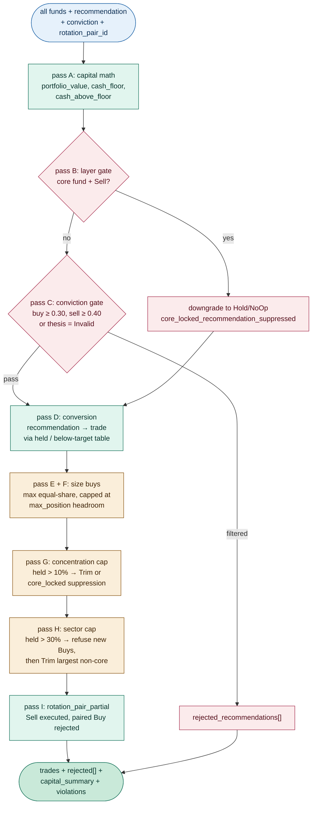
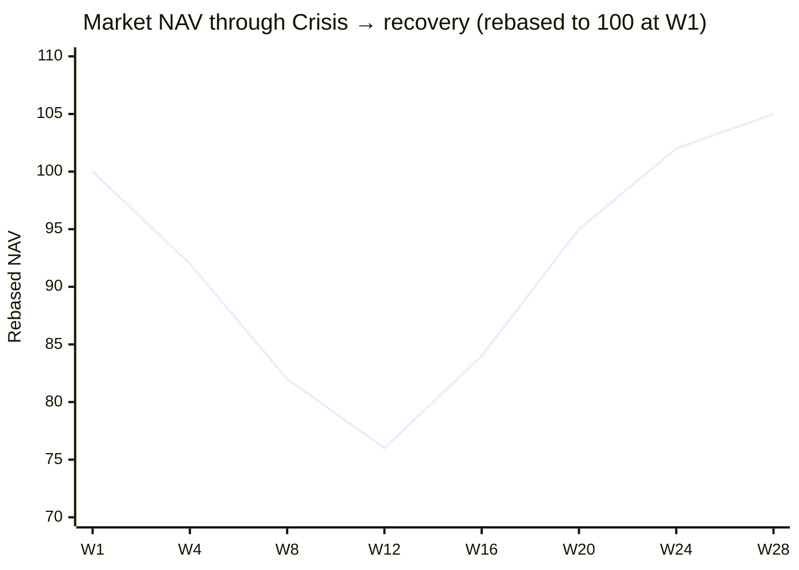
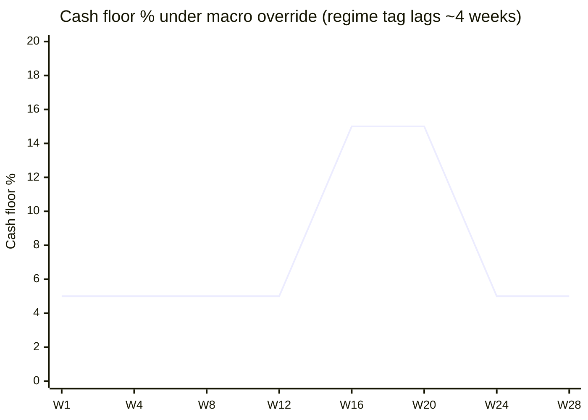
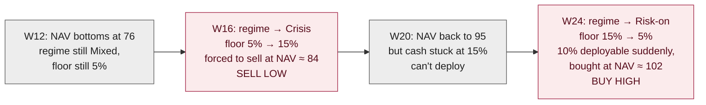
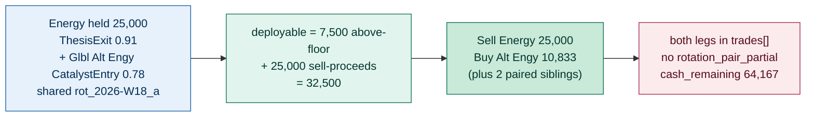
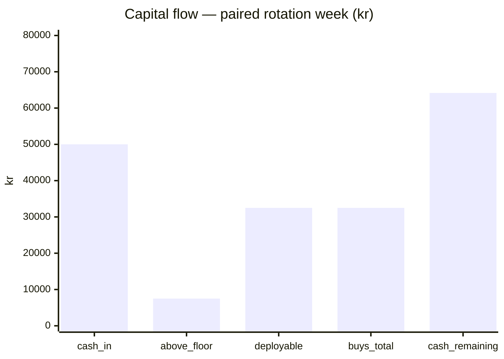
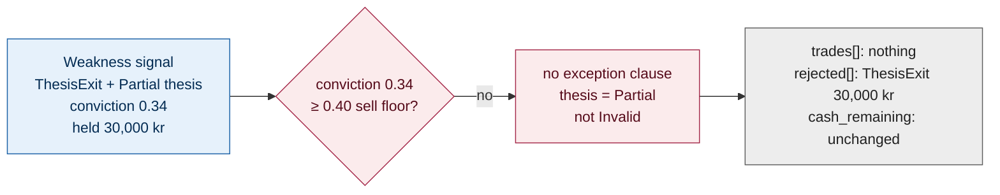
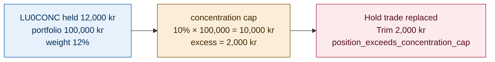
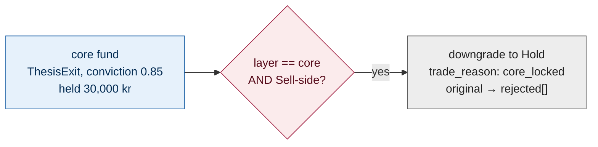
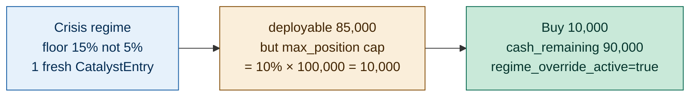

# Agent 10: PortfolioConstructor

> Convert per-fund recommendations into executable trades subject to cash policy, concentration constraints, and conviction gating. The only agent that knows about portfolio state.

## Execution type

⚙️ Code — **strictly no LLM**. Determinism is required for backtest reproducibility.

## Inputs

| Source | What for |
| --- | --- |
| `09-enrichment-{iso_week}-{run_id}.json` | All per-fund records with full context including conviction, rotation_pair_id, and `layer` (`core` / `active`). Also carries `frozen_positions[]` and `cash_available_kr` propagated from DataLoader. |
| `config-10-portfolio.json` | Cash policy, constraints, conviction guards, sizing rules |

### Input expectations

- Every fund record carries a `recommendation` (one of six types from step 08).
- Every fund record carries a `conviction_score`, `universe_rank`, and `layer` (from step 01).
- The step-09 envelope carries `cash_available_kr` and `frozen_positions[]` unmodified from DataLoader (append-only invariant). PortfolioConstructor reads these directly — it does **not** re-open `positions.csv`.
- `frozen_positions[]` values count toward `portfolio_value_kr` for sizing but are never traded.

## Outputs

### Output file

Pattern: `10-trades-{iso_week}-{run_id}.json`

### Output schema

```json
{
  "generated_at": "...",
  "iso_week": "...",
  "config_version": "1.0.0",
  "trades": [
    {
      "isin": "...",
      "fund_name": "...",
      "trade": "Buy" | "TopUp" | "Trim" | "Sell" | "PartialSell" | "Hold" | "NoOp",
      "trade_reason": "string (structured tag)",
      "amount_kr": number,
      "source_recommendation": "CatalystEntry" | "MomentumEntry" | "ThesisExit" | "MomentumExit" | "Maintain" | "Skip",
      "source_conviction": 0.0,
      "rotation_pair_id": "rot_..._a" | null,
      "trim_reason": "concentration_cap" | "rotation_pair" | "signal_decay" | null,
      "scaling_factor": 1.0,
      "audit_notes": []
    }
  ],
  "rejected_recommendations": [
    {
      "isin": "...",
      "source_recommendation": "...",
      "rejected_because": "string (specific rule)",
      "would_have_been": "string (e.g. 'Buy 20000 kr')"
    }
  ],
  "capital_summary": {
    "portfolio_value_kr": number,
    "active_positions_value_kr": number,
    "frozen_positions_value_kr": number,
    "cash_available_kr": number,
    "sell_proceeds_kr": number,
    "total_deployable_kr": number,
    "total_buy_amount_kr": number,
    "cash_remaining_kr": number,
    "cash_floor_kr": number,
    "cash_above_floor_kr": number,
    "cash_policy": {
      "floor_pct": 0.05,
      "regime_override_active": false,
      "regime_used": "Stagflation"
    }
  },
  "constraint_violations": [
    {
      "type": "string (enum)",
      "isin": "string | null",
      "value": "any",
      "message": "string (≤2 sentences)"
    }
  ]
}
```

## Configuration consumed

- `config-10-portfolio.json` → entire file

## Vocabulary owned

| `trade` | Meaning |
| --- | --- |
| `Buy` | Open new position with fresh capital |
| `TopUp` | Add to existing held position (below target weight) |
| `Trim` | Reduce existing held position (concentration cap or signal decay) |
| `Sell` | Close held position fully |
| `PartialSell` | Reduce held position partially (Weakness with Partial thesis) |
| `Hold` | Held position with directional signal but already at target — no action |
| `NoOp` | Not held + Skip recommendation, or rejected by gating — no action |

## What it does



For each input fund:

1. **Pass A — capital math.** Sum held positions, frozen positions, and cash to get `portfolio_value_kr`. Resolve cash floor (5% default; 10–15% if `macro_override_enabled` and the regime hits the table). Compute `cash_above_floor_kr` = max(0, cash − floor).
2. **Pass B — layer gate.** A `core` fund with a Sell-side recommendation (`ThesisExit`, `MomentumExit`) is downgraded to `Hold` (or `NoOp` if not held), the original goes to `rejected_recommendations[]`, and a `core_locked_recommendation_suppressed` violation is logged. Concentration- or sector-cap Trims on a `core` fund are also suppressed in passes G/H.
3. **Pass C — conviction gate.** Sells with `conviction < skip_sell_below_conviction` (0.40) are filtered **unless** `thesis_validity = Invalid` (decisive exit overrides the floor). Buys with `conviction < skip_buy_below_conviction` (0.30) are filtered always. A high-conviction (≥ 0.8) Sell that still gets filtered raises `conviction_gate_unusual` for review.
4. **Pass D — conversion.** Translate `(recommendation, currently_held, below_target)` → `trade` via the table below. Sells get sized to `current_value_kr` immediately; Buys/TopUps land at amount = 0 until pass F.
5. **Pass E — sell proceeds.** `total_deployable_kr` = `cash_above_floor_kr` + Σ Sell/PartialSell amounts.
6. **Pass F — size buys.** Each Buy targets `max(default_buy_target_pct, 1/N) × total_deployable_kr`, capped at `(max_position_pct × portfolio − current_value)` so a fresh Buy never lands above the concentration cap. Anything below `min_trade_kr` after capping is dropped to `rejected_recommendations[]` and `min_trade_dropout` violation; the freed cash redistributes to the survivors (still respecting headroom).
7. **Pass G — concentration cap.** Any held position whose post-trade value exceeds `max_position_pct × portfolio_value_kr` is converted to a `Trim` (`trim_reason = concentration_cap`); for `core` funds the Trim is suppressed and `core_locked_recommendation_suppressed` is logged instead.
8. **Pass H — sector cap.** If post-trade exposure to any `metadata.category` exceeds `max_sector_pct × portfolio_value_kr`, refuse new Buys in that sector first (smallest-amount first), then Trim the largest non-core member. All sector actions raise `sector_exceeds_cap`.
9. **Pass I — rotation pairing.** When a `rotation_pair_id` has a Sell in `trades[]` but its paired Buy was rejected by the conviction gate, sector cap, or min-trade dropout, log `rotation_pair_partial`. The Sell still executes; Buy without a paired Sell does not raise a violation.

Every halt-condition (config drift, schema-invalid step-09 input, held-fund value null/negative) emits `10-error-{iso_week}-{run_id}.json` instead of the success file.

## Concrete shapes

### Input — a fund record after UniverseEnricher

The agent's "fund" view in JSON. Step 10 reads `recommendation`, `conviction_score`, `thesis_validity`, `currently_held`, `current_value_kr`, `rotation_pair_id`, `metadata.category`, and `layer`:

```json
{
  "isin": "LU0256331488",
  "metadata": {
    "category": "Branschfond, Energi",
    "name": "Global Energy",
    "total_fee": 1.61,
    "...": "..."
  },
  "currently_held": true,
  "current_value_kr": 25000.0,
  "layer": "active",
  "thesis_validity": "Invalid",
  "recommendation": "ThesisExit",
  "conviction_score": 0.91,
  "rotation_pair_id": "rot_2026-W18_a"
}
```

### Output — a clean rotation pair

Sell + paired Buy, both legs execute, no constraint violations:

```json
{
  "iso_week": "2026-W18",
  "config_version": "1.0.0",
  "trades": [
    {
      "isin": "LU0256331488",
      "fund_name": "Global Energy",
      "trade": "Sell",
      "trade_reason": "thesis_exit_full",
      "amount_kr": 25000.00,
      "source_recommendation": "ThesisExit",
      "source_conviction": 0.91,
      "rotation_pair_id": "rot_2026-W18_a",
      "trim_reason": null,
      "scaling_factor": 1.0,
      "audit_notes": []
    },
    {
      "isin": "LU0302445910",
      "fund_name": "Glbl Alt Engy",
      "trade": "Buy",
      "trade_reason": "catalyst_entry_fresh",
      "amount_kr": 10833.00,
      "source_recommendation": "CatalystEntry",
      "source_conviction": 0.78,
      "rotation_pair_id": "rot_2026-W18_a",
      "trim_reason": null,
      "scaling_factor": 1.0,
      "audit_notes": []
    }
  ],
  "rejected_recommendations": [],
  "capital_summary": {
    "portfolio_value_kr":      850000.00,
    "active_positions_value_kr": 800000.00,
    "frozen_positions_value_kr":      0.00,
    "cash_available_kr":         50000.00,
    "sell_proceeds_kr":          25000.00,
    "total_deployable_kr":       32500.00,
    "total_buy_amount_kr":       10833.00,
    "cash_remaining_kr":         64167.00,
    "cash_floor_kr":             42500.00,
    "cash_above_floor_kr":        7500.00,
    "cash_policy": {
      "floor_pct":              0.05,
      "regime_override_active": false,
      "regime_used":            null
    }
  },
  "constraint_violations": []
}
```

For other recommendation paths the shape is identical — only `trades[]` content differs.

## Layer enforcement (pre-conversion gate)

Before any recommendation is translated to a trade, each fund's `layer` is checked.

| Layer | Allowed trades | Forbidden trades | Behavior on a forbidden recommendation |
| --- | --- | --- | --- |
| `core` | `Buy`, `TopUp`, `Hold`, `NoOp` | `Sell`, `PartialSell`, `Trim` | Recommendation is downgraded: `ThesisExit`/`MomentumExit` → `Hold` (with `trade_reason = core_locked`); concentration- or sector-cap Trims on a `core` fund are also suppressed with `trade_reason = core_locked`. The original recommendation lands in `rejected_recommendations[]` for audit. |
| `active` | all | none | Standard processing (table below). |

Funds with `layer == "writeoff"` never reach this agent — DataLoader filtered them into `frozen_positions[]`. They contribute to `portfolio_value_kr` and `frozen_positions_value_kr` in the capital summary, never to `trades[]`.

The layer gate runs **before** conviction gating, so a forbidden Sell on a `core` fund never consumes a "rejected by conviction" slot.

## Recommendation → Trade conversion

The conversion table expands the six recommendation types into seven trade types based on portfolio state.

| Recommendation | Held? | Below target? | Trade emitted | Trade reason |
| --- | --- | --- | --- | --- |
| CatalystEntry | no | n/a | **Buy** | catalyst_entry_fresh |
| CatalystEntry | yes | yes | **TopUp** | catalyst_entry_topup |
| CatalystEntry | yes | no (at/above target) | **Hold** | catalyst_entry_at_target |
| MomentumEntry | no | n/a | **Buy** | momentum_entry_fresh |
| MomentumEntry | yes | yes | **TopUp** | momentum_entry_topup |
| MomentumEntry | yes | no | **Hold** | momentum_entry_at_target |
| ThesisExit | yes | n/a | **Sell** | thesis_exit_full |
| ThesisExit | no | n/a | **NoOp** | thesis_exit_not_held |
| MomentumExit | yes | n/a | **PartialSell** or **Sell** (see sizing) | momentum_exit_decay |
| MomentumExit | no | n/a | **NoOp** | momentum_exit_not_held |
| Maintain | yes | n/a | **Hold** | maintain_default |
| Maintain | no | n/a | **NoOp** | maintain_no_position |
| Skip | yes | n/a | **Hold** | skip_held |
| Skip | no | n/a | **NoOp** | skip_default |

Plus one cross-cutting case:

| Trigger | Trade emitted | Trade reason |
| --- | --- | --- |
| Held position exceeds `max_position_pct_of_portfolio` (regardless of recommendation) | **Trim** | concentration_cap |
| Held sector exposure exceeds `max_sector_pct_of_portfolio` | **Trim** on largest fund in that sector | sector_cap |

## Cash policy enforcement

The cash floor is the minimum cash held as a fraction of total portfolio value. Default 5% always; macro override raises it during stressed regimes (default off).

```text
active_positions_value_kr = Σ funds[].current_value_kr  (where currently_held = true)
frozen_positions_value_kr = Σ frozen_positions[].current_value_kr
portfolio_value_kr        = active_positions_value_kr + frozen_positions_value_kr + cash_available_kr

cash_floor_kr        = portfolio_value_kr × cash_policy.floor_pct
cash_above_floor_kr  = cash_available_kr − cash_floor_kr   (clamped at 0)
total_deployable_kr  = cash_above_floor_kr + sell_proceeds_kr
```

Frozen positions are part of `portfolio_value_kr` (they're real money, just stuck) so the cash floor is computed against the full portfolio. They never contribute to `sell_proceeds_kr`.

The floor is enforced strictly. Buys cannot dip into reserved cash, even for a high-conviction CatalystEntry.

### Why cash floor defaults to 5% with macro override OFF

The macro override (raise floor to 10–15% during Stagflation/Crisis) was tested against a full year of Schroder data. Result: every variant net-lost vs. the fixed 5% floor.

| Variant | Avg cash held | Drawdown saved | Opportunity cost | **Net** |
| --- | --- | --- | --- | --- |
| Fixed 5% | 5.0% | baseline | baseline | baseline |
| Naive override (no confirmation) | 6.8% | +0.73% | −1.99% | **−1.26%** |
| Confirmed 2 windows | 5.2% | +0.32% | −2.01% | **−1.69%** |
| Hysteresis | 8.3% | +0.73% | −2.81% | **−2.08%** |

**Why both legs of the round-trip cost money.** The macro regime tag is a *lagging* indicator — it flips to `Crisis` after the drawdown is well underway, and back to `Risk-on` only after the recovery is mostly behind us. When the floor goes 5% → 15% at the bottom, the only way to reach the higher floor is to sell into already-depressed prices: **sell low**. When the floor drops 15% → 5% at the top, that 10% slice of the portfolio becomes "deployable" and gets bought at conviction into an already-recovered market: **buy high**. The drawdown saved (+0.32 to +0.73%) is real but small; the opportunity cost of being light on the way back up (−1.99 to −2.81%) is bigger. Net loss in every variant.

The two charts below share an x-axis so the timing mismatch is visible: the NAV bottoms at W12 and recovers by W20, but the regime tag (and therefore the cash floor) doesn't flip up until W16 and doesn't flip back down until W24.





The two flip points are exactly where the override does its damage:



The hysteresis row in the table proves the point cleanly — it's deliberately slow to flip back to `Risk-on` to avoid whipsaws, which means it stays defensive *deeper* into the recovery (the W24 flip in the chart shifts to W26 or W28) → worst opportunity cost → biggest net loss.

**This is not an indictment of macro signal in general.** The macro regime, catalysts, and rotation themes from steps 03–07 still drive the pipeline — they tell the agent *which funds make sense right now* (does the energy thesis still hold? is this fund's category aligned with an active theme?). That's a contextual / filtering job, and lagging indicators do it perfectly well: a regime that's been `Crisis` for four weeks is still genuinely `Crisis` today. The cash-floor override is the only place macro was asked to *call the turn* — to predict that a Crisis is *about to* hurt and pull back **before** it does. That's a fundamentally different problem; lagging indicators can't solve it.

Re-enabling the override would need a different trigger (a leading composite — credit spreads, yield-curve inversion, market breadth — rather than a regime tag built from backward-looking returns) plus multi-year bear-cycle data to calibrate against. Until then, fixed 5%.

5% baseline is enough operational dry powder for new BuySignals during normal weeks, with negligible drag (∼0.3% on the test universe).

## Conviction gating

Before sizing, recommendations are filtered through conviction thresholds to prevent low-quality trades.

| Rule | Default threshold | Behavior |
| --- | --- | --- |
| Skip Sell if `conviction < skip_sell_below_conviction` | 0.40 | UNLESS `thesis_validity = Invalid` (those are decisive exits regardless of conviction) |
| Skip Buy if `conviction < skip_buy_below_conviction` | 0.30 | Always — buys are reversible, no exception clause |

Filtered recommendations land in `rejected_recommendations[]` with reason text. They do not appear in `trades[]`.

### Why these defaults

The conviction-gated sell rule is the **defense-in-depth against the Taiwan / China A / Glb Clmt Chg false-positive pattern**. In our earlier chain output, three Sells fired on funds with strong Sharpe (+8.5, +16.9, +17.2) but only 2/3 positive windows — pure noise rotation. Their UniverseEnricher convictions land at ~0.31 / 0.34 / 0.36, all below 0.40 → all filtered. Meanwhile the clean sells (Indian Opports, Emerging Europe, Energy with Invalid thesis) score 0.62+ → all execute.

The asymmetry (sells gated higher than buys) reflects that selling is more costly: triggering a tax event, breaking a position you may want back later. Buys are reversible — you can always exit if the trade doesn't work. The exception clause (`thesis_validity = Invalid` overrides the conviction floor) preserves the rotation case: when the thesis is broken, exit decisively regardless of conviction.

## Sizing logic

The pipeline does NOT receive explicit `amount_kr` from upstream. PortfolioConstructor sizes trades based on:

1. **Default Buy target.** Each Buy gets `max(default_buy_target_pct, 1/N) × total_deployable_kr` — i.e., the configured 5% per buy when there are many candidates, naturally rising to an equal split (33% for 3 buys, 100% for 1 buy) when there are few. This matches both worked examples in the original spec (47.5k deployable / 3 buys → 15.8k each; 32.5k / 3 → 10.8k each).
2. **Concentration headroom cap.** Each buy is then capped at `(max_position_pct × portfolio_value − current_value)`, so a fresh Buy can never land above the 10% concentration cap. This is the difference between "size to fit" and "size and trim" — we want zero trim feedback loops.
3. **Conviction-rank scaling.** When `Σ buys > total_deployable_kr` (only when the headroom cap allows large requests), scale all buys proportionally by `total_deployable_kr / Σ buys`.
4. **Min trade dropout.** Any buy that falls below `min_trade_kr` (default 5,000) — typically because its concentration headroom shrank to a sliver — is dropped; the freed cash redistributes to remaining buys (still respecting their headrooms).
5. **Sells.** ThesisExit emits Sell with `amount_kr = current_value_kr` (full exit). MomentumExit emits PartialSell at 50% of position by default; if conviction ≥ 0.7, escalates to full Sell.

### Worked sizing example — chain output bug fixed

The earlier chain output we examined had this issue:

| Field | Value |
| --- | --- |
| `cash_available_kr` | 50,000 |
| `sell_proceeds_kr` | 0 |
| `total_buy_amount_kr` | 60,000 (3 Buys × 20,000 each) |
| `cash_remaining_kr` | **−10,000** ← BUG |

Under the spec's sizing logic with cash floor 5%:

| Step | Calculation |
| --- | --- |
| `portfolio_value_kr` | 50,000 (cash only, assume no held positions for simplicity) |
| `cash_floor_kr` | 50,000 × 0.05 = 2,500 |
| `cash_above_floor_kr` | 50,000 − 2,500 = 47,500 |
| `total_deployable_kr` | 47,500 + 0 = 47,500 |
| Default per Buy with 3 buys | max(5%, 33%) × 47,500 = 15,833 |
| Headroom cap (10% × 50k = 5k) | min(15,833, 5,000) = 5,000 |
| Σ buys at 5,000 each | 15,000 (within deployable) |
| Final | Em Mkts 5,000 / Glb Em Mkt Opps 5,000 / QEP Glbl Qual 5,000 |
| `cash_remaining_kr` | 47,500 − 15,000 = 32,500 |

The constraint violation `cash_remaining_kr_negative` cannot occur because sizing scales buys to fit deployable AND respects the position cap BEFORE emission, never after.

## Rotation pair handling

When a Sell and a Buy share the same `rotation_pair_id` (assigned by UniverseEnricher), they form a rotation pair. The default policy (`execute_atomically_if_possible = true`):

- Sell proceeds fund the paired Buy first; remaining proceeds go to other Buys or cash above floor.
- If the Buy half cannot execute (sector cap, concentration, conviction floor): Sell still executes, proceeds go to cash, and a `rotation_pair_partial` constraint violation is raised.
- If the Sell half cannot execute (already not held — a NoOp): the Buy still executes from cash above floor, no violation.

## Worked examples

### Global Energy → Glbl Alt Engy (clean rotation pair)

Continuing the rotation from step 09. Energy held at 25,000 kr in a portfolio of 850,000 kr; the paired Buy is a fresh CatalystEntry on Glbl Alt Engy.

| Step | Computation |
| --- | --- |
| Conviction gating | Sell 0.91 ≥ 0.40 ✓ ; Buy 0.78 ≥ 0.30 ✓ |
| Sell Energy | `Sell` 25,000 kr, sell_proceeds_kr = 25,000 |
| `cash_floor_kr` | 850,000 × 0.05 = 42,500 |
| `cash_above_floor_kr` | 50,000 − 42,500 = 7,500 |
| `total_deployable_kr` | 7,500 + 25,000 = 32,500 |
| One Buy (paired) | max(5%, 100%) × 32,500 = 32,500 |
| Concentration cap | min(32,500, 10% × 850,000 = 85,000) = 32,500 (under cap) |
| Final | 1 Sell 25,000 + 1 Buy 32,500 — but wait, see note below |

In a real chain run there are usually 2–3 other Buys competing for the same deployable, which scales each down. With **three** total Buys (paired Energy → Alt Energy plus two unrelated MomentumEntries):

| Step | Computation |
| --- | --- |
| Three Buys at max(5%, 33%) × 32,500 | 10,833 each → 32,499 total ✓ |
| Concentration cap (each ≤ 85,000) | no clamp — 10,833 well under |
| Output | 1 Sell + 3 Buys, no constraint violations |



Capital flow for the rotation week:



The clean execution case. Conviction is high on both legs, so neither hits the gate; both legs share `rotation_pair_id` → execute atomically; no concentration / sector breach because the Buy of 10,833 sits well under the 85,000 position cap.

### Conviction-gated Sell — false-positive guard

A Weakness signal fires on a fund with strong Sharpe (e.g. Taiwan: sharpe_12w +8.5, only 1/3 positive windows). UniverseEnricher conviction lands at 0.34 — low — and `thesis_validity = Partial` (catalyst still active). PortfolioConstructor's gate filters it.

| Field | Value |
| --- | --- |
| `recommendation` | `ThesisExit` (from step 08) |
| `conviction_score` | 0.34 |
| `thesis_validity` | `Partial` (not `Invalid` — no exception clause) |
| `currently_held` | true, 30,000 kr |
| Gate result | 0.34 < 0.40 AND thesis ≠ Invalid → **filtered** |
| Trade emitted | none — fund absent from `trades[]` |
| Where it lives | `rejected_recommendations[]` with `rejected_because = "conviction_below_floor (...)"` |



The defense-in-depth case. The Recommender saw a `Weakness` signal and concluded `ThesisExit` because the recommendation table is local. UniverseEnricher rolled context in and downgraded conviction to 0.34. PortfolioConstructor uses that to stop a sell that would have triggered a tax event over what is statistically pure noise. If the same fund were `Invalid` thesis (catalyst broke), the conviction floor would not apply — exit decisive.

### Concentration cap → Trim

A held position drifted to 12% of portfolio (cap 10%). Recommendation is `Maintain` so step 8 doesn't act, but step 10 must enforce the cap.

| Field | Value |
| --- | --- |
| Held position | LU0CONC, 12,000 kr |
| Other holdings | LU0FILL 80,000 kr (different category) |
| Cash | 8,000 kr |
| Portfolio value | 100,000 kr |
| Concentration cap | 10% × 100,000 = 10,000 kr |
| Excess | 12,000 − 10,000 = 2,000 kr |
| Trade emitted | **Trim 2,000 kr** with `trim_reason = concentration_cap` |
| Hold trade for `Maintain` | replaced — fund only appears once in `trades[]` |



The cap is enforced post-trade, so a `TopUp` that would push the position above the line is also caught. For `core` funds the trim is suppressed and `core_locked_recommendation_suppressed` is logged instead — the position keeps drifting; the operator decides what to do.

### Core-locked Sell suppression

A `core` fund hits a `ThesisExit`. Step 10 refuses to sell it.

| Field | Value |
| --- | --- |
| `layer` | `core` |
| `recommendation` | `ThesisExit` |
| `conviction_score` | 0.85 |
| `currently_held` | true |
| Layer gate | core + Sell-side → suppress |
| Trade emitted | `Hold` with `trade_reason = core_locked` |
| Where original lives | `rejected_recommendations[]` with `rejected_because = "core_locked"` |
| Violation logged | `core_locked_recommendation_suppressed` |



The layer gate runs **before** conviction gating — a high-conviction core sell never gets a "rejected by conviction" line; it's rejected for a more fundamental reason. Core funds *can* still receive Buys and TopUps (no asymmetry there) — they're permanent strategic positions, not write-offs.

### Macro override — Crisis regime raises the floor

`macro_override_enabled = true` and macro regime = `Crisis`: floor jumps from 5% to 15%. Single fresh Buy in a 100,000 kr portfolio.

| Step | Computation |
| --- | --- |
| Cash | 100,000 kr (portfolio = cash) |
| Cash floor (Crisis) | 15% × 100,000 = 15,000 kr |
| `cash_above_floor_kr` | 85,000 kr |
| `total_deployable_kr` | 85,000 kr (no sells) |
| One Buy at max(5%, 100%) × 85,000 | 85,000 kr |
| Concentration cap | 10% × 100,000 = 10,000 kr |
| Final Buy | min(85,000, 10,000) = **10,000 kr** |
| `cash_remaining_kr` | 100,000 − 10,000 = 90,000 kr |
| `regime_override_active` | true; `regime_used` = `Crisis` |



Override-on means more cash sits idle. The backtest table earlier shows why this is currently off by default — the regime tags lag drawdowns rather than lead them, so the override historically lost money on the test universe. The mechanism stays in code and config so it can be re-enabled when there's bear-cycle data to retune against.

## Constraint violations

Anything the agent cannot resolve cleanly is surfaced explicitly rather than silently glossed.

| Type | When it fires |
| --- | --- |
| `cash_remaining_kr_negative` | Should never fire after correct sizing — would indicate a code bug |
| `position_exceeds_concentration_cap` | After execution, a held position is above `max_position_pct_of_portfolio`; agent emits a Trim |
| `sector_exceeds_cap` | Sector concentration above `max_sector_pct_of_portfolio`; agent refuses incremental Buys then Trims largest non-core |
| `rotation_pair_partial` | One leg of a rotation pair was rejected; the other executed alone |
| `conviction_gate_unusual` | A high-conviction (≥0.8) Sell was filtered (rare; means thesis was Valid despite Weakness) |
| `min_trade_dropout` | A buy was dropped because its scaled / headroom-capped amount fell below `min_trade_kr` |
| `held_fund_not_in_universe` | A held fund has no record in the agent input — log, don't halt |
| `core_locked_recommendation_suppressed` | A `Sell`/`PartialSell`/`Trim` was suppressed because the fund's layer is `core`; original recommendation surfaced in `rejected_recommendations[]` |

## Failure modes

| Trigger | Behavior |
| --- | --- |
| `09-enrichment` is missing or schema-invalid | Halt — `10-error-{iso_week}-{run_id}.json` |
| `config-10-portfolio.json` config_version doesn't match | Halt — config drift |
| Σ conviction weights drift (config-09 issue) | Already caught by step 09; this agent receives a halt notification |
| Cash floor cannot be maintained even after dropping all buys | Emit empty `trades[]`, surface as `cash_floor_unmet` violation |
| Held fund's `current_value_kr` is null or negative | Halt — data integrity error |

## Test fixtures

| Scenario | Inputs | Expected |
| --- | --- | --- |
| Clean chain | 16 funds, 3 Buys + 1 Sell + held positions | 4 trades, no violations |
| TopUp on near-cap fund drops below min trade | 3 fresh + 1 TopUp at 4.4% weight, headroom 4.5k vs 5k min | Buy on near-cap fund dropped, 3 fresh execute, `min_trade_dropout` violation |
| Conviction-gated sell | 1 Sell with conviction 0.31 | Rejected; appears in `rejected_recommendations` |
| Conviction-gated sell with Invalid thesis | 1 Sell with conviction 0.31 BUT thesis_validity = Invalid | Executed despite conviction floor (exception clause) |
| Rotation pair both sides execute | Sell-Buy in same rotation_pair_id, different categories, both pass gates | Both trades emitted with same rotation_pair_id |
| Rotation pair, Buy side fails sector cap | Sell + Buy paired, sector at cap | Sell executes alone, `rotation_pair_partial` violation |
| Concentration cap breach | Held position 12% of portfolio | Trim trade emitted with `trim_reason = concentration_cap` |
| Cash bug (chain output regression) | 3 Buys, total > available cash | Buys scaled to fit and capped at concentration headroom; no negative cash_remaining |
| Macro override on (testing only) | macro_override_enabled = true, regime = Crisis | Floor raised to 15%, fewer/smaller buys |
| Core fund with ThesisExit | A `layer: "core"` fund recommended ThesisExit | Suppressed → `Hold` with `trade_reason = core_locked`; original lands in `rejected_recommendations[]`; `core_locked_recommendation_suppressed` violation raised |
| Core fund hits concentration cap | A `core` fund grows to 12% of portfolio | Trim suppressed (`core_locked`); cap violation logged but no trade emitted |
| Frozen position in portfolio | `frozen_positions[]` has 1 entry worth 182 kr | Included in `portfolio_value_kr` and `frozen_positions_value_kr`; never appears in `trades[]` |
| Core fund with CatalystEntry | A `layer: "core"` fund recommended CatalystEntry | Buy/TopUp executes normally (allowed for core) |

## Edge cases

- A fund with `recommendation = Maintain` and `currently_held = false` — should not occur (Recommender prevents it), but defensively emit `NoOp` with `audit_notes` flagging the inconsistency.
- A held fund that doesn't appear in step 09 enrichment (filtered out earlier): emit `Hold` to preserve the position; raise `held_fund_not_in_universe` violation; do not Trim.
- A `Sell` on a fund with `current_value_kr = 0` (held but zero value — rare): emit `NoOp`, log warning.
- Multiple rotation pairs with overlapping themes: each gets its own letter suffix (rot_..._a, _b, _c). PortfolioConstructor handles them independently — the atomicity is per-pair, not across all rotations.
- Empty universe (no recommendations of any type): emit empty `trades[]`, capital_summary still populated, no violations.
- Only Sells, no Buys: cash builds up; floor is automatically respected; no violation.
- Only Buys, no Sells: cash drained from above-floor; if buys exceed cash above floor, sized down by conviction rank.
- A high-conviction (>0.8) Sell on a non-held fund (NoOp anyway): conviction gating doesn't fire; agent emits NoOp with the audit note "would have been Sell but not held".

## What this agent does NOT do

| NOT in scope | Where it lives instead |
| --- | --- |
| LLM-based reasoning of any kind | step 09 (UniverseEnricher) — alternatives differentiator text |
| Picking which fund to Sell among multiple held in a Weakness theme | step 09 — universe_rank decides |
| Generating trade rationales beyond `trade_reason` tags | step 09 — those should already be in conviction_breakdown / signal narratives |
| Cross-week consistency checks (was Buy executed last week?) | A separate operational layer; PortfolioConstructor is stateless across runs |
| Settlement, broker integration, order routing | Outside this pipeline entirely |
