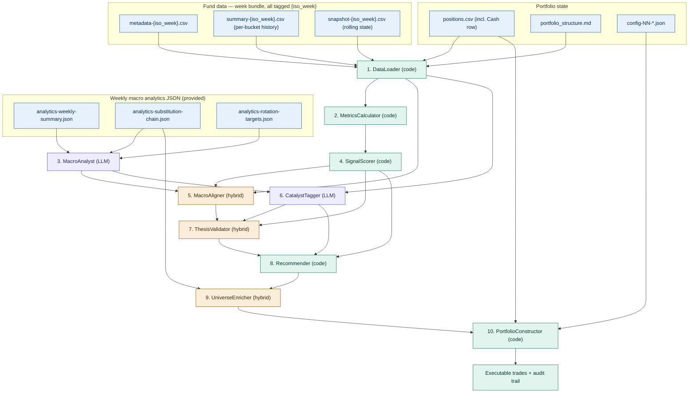

# Fund Pipeline — Implementation Plan

A ten-agent chain that turns fund metadata, NAV history, and weekly macro narrative into executable trade decisions. This document describes the pipeline as a plan only — no code, no implementation details, no choice of language or framework. Every agent boundary is defined by its input file, output file, and the contract between them.

---

## Table of contents

1. [Architecture overview](#1-architecture-overview)
2. [Inputs](#2-inputs)
3. [Configuration files](#3-configuration-files)
4. [The ten agents](#4-the-ten-agents)
5. [Vocabularies](#5-vocabularies-controlled-enums)
6. [File naming and versioning](#6-file-naming-and-versioning)
7. [Failure modes catalogue](#7-failure-modes-catalogue)
8. [Tuning guide](#8-tuning-guide)
9. [Glossary](#9-glossary)

---

## 1. Architecture overview

### Pipeline diagram



### Key invariants

The architecture rests on four invariants that should never be violated, regardless of how the agents are implemented.

**Append-only chain.** Each agent reads its predecessor's output and adds new fields. It never modifies fields produced by earlier agents. This means the final step-10 record contains the full audit history of every decision back to step 1, in one file.

**Single ownership per field.** Every column in the final fund record is produced by exactly one agent. If a field looks wrong, there is one and only one agent to inspect.

**Code at the construction boundary.** PortfolioConstructor (step 10) must be deterministic. No LLM call, no randomness. Same step-9 input plus same configuration must always produce the same trades. This is required for backtesting and reproducibility.

**Macro analytics are inputs, not outputs.** The three weekly JSON files (`analytics-weekly-summary.json`, `analytics-substitution-chain.json`, `analytics-rotation-targets.json`) are produced upstream by the KanelBrief market-intelligence pipeline and are treated as fixed inputs to this pipeline. Their schema is documented in `inputs/analytics-json-schema.md`.

**Week bundle convention.** Every weekly artifact carries an ISO-week identifier — `{iso_week}` in the CSV filenames, `periodIsoWeek` inside the analytics JSON payloads, and the same tag in every step output. A "week bundle" is the complete set of files for a given ISO week. Live operation reads the current week's bundle; backtests load a historical week's bundle. The pipeline halts before any agent runs if the CSV `{iso_week}` does not match the JSON `periodIsoWeek` across all six input files.

### Execution types

Each agent is one of three execution categories:

| Type | Symbol | What it means | Determinism |
|---|---|---|---|
| Code | ⚙️ | Pure algorithmic logic, no LLM | Fully deterministic |
| LLM | 🤖 | LLM reasoning is the primary work | Non-deterministic without seed pinning |
| Hybrid | 🔀 | Code computes deterministic parts; LLM produces explanatory text or judgment calls | Partially deterministic — code outputs reproducible, LLM outputs may drift |

Five agents are pure code (1, 2, 4, 8, 10), two are pure LLM (3, 6), three are hybrid (5, 7, 9).

---

## 2. Inputs

### 2.1 Fund metadata — `metadata-{iso_week}.csv`

Static information about every fund in the universe at the time of export. One row per fund. Filename: `YieldRaccoon_metadata_{family}_{iso_week}.csv` (e.g. `YieldRaccoon_metadata_Schroder_2026-W18.csv`).

The metadata content changes rarely (fund renames, fee adjustments, recategorizations) but the file is regenerated each week to keep all weekly artifacts on the same `{iso_week}` cadence. This makes a "week bundle" trivially identifiable by filename match.

| Column | Type | Required | Notes |
|---|---|---|---|
| isin | string | yes | Primary key. International Securities Identification Number |
| name | string | yes | Display name |
| company_name | string | yes | Fund family / manager |
| currency_code | string | yes | ISO 4217 (NOK, SEK, USD, EUR) |
| category | string | yes | Free-form category. Used for macro alignment matching |
| fund_type | string | yes | EQUITY_FUND \| INTEREST_FUND \| MIXED_FUND |
| is_index_fund | boolean | yes | |
| managed_type | string | yes | ACTIVE \| INDEX |
| total_fee | number | yes | Total expense ratio in percent (e.g. 1.89 for 1.89%) |
| management_fee | number | yes | Management fee component, in percent |
| risk | integer | yes | 1 (lowest) to 7 (highest) |
| rating | integer | optional | 1 to 5; may be empty |
| sharpe_ratio | number | optional | Long-term Sharpe from data provider; may be empty |
| standard_deviation | number | optional | Long-term annualized volatility, percent |
| recommended_holding_period | string | yes | Enum (`ONE_YEAR`, `TWO_YEAR`, `THREE_YEAR`, `FIVE_YEAR`, `AT_LEAST_FIVE_YEARS`) |
| capital | number | yes | Fund AUM in fund currency |
| number_of_owners | integer | yes | Number of unit-holders |

### 2.2 NAV time series — `summary-{iso_week}.csv`

Bi-weekly bucketed performance metrics per fund, covering the last twelve months. Multiple rows per fund (one per bucket). Per-bucket history only — rolling-horizon values live in `snapshot-{iso_week}.csv` (Section 2.3). Filename: `YieldRaccoon_summary_{family}_{iso_week}.csv`. See `summary-csv-plan.md` for the full schema and rename history.

| Column | Type | Notes |
|---|---|---|
| isin | string | Foreign key to metadata |
| name | string | Denormalized for convenience |
| period_start | date | YYYY-MM-DD |
| period_end | date | YYYY-MM-DD |
| first_nav | number | NAV at period_start |
| last_nav | number | NAV at period_end |
| nav_high | number | Bucket high |
| nav_low | number | Bucket low |
| return_2w_pct | number | Bucket return in percent |
| ann_volatility_2w_pct | number | Annualized volatility from bucket daily returns |
| max_drawdown_2w_pct | number | Maximum drawdown within bucket |
| current_drawdown_pct | number | Drawdown at period_end |
| sharpe_2w | number | Bucket Sharpe (annualized) |
| best_day_pct | number | Best single-day return |
| worst_day_pct | number | Worst single-day return |
| pct_positive_days | number | Percentage of days with positive return |
| skewness | number | Daily return distribution skewness |

Partial trailing buckets (fewer than ~7 calendar days) are dropped at the producer, not emitted as rows.

### 2.3 Snapshot — `snapshot-{iso_week}.csv`

Per-week, per-fund rolling-horizon state. One file per ISO week; one row per fund within each file. Filename: `YieldRaccoon_snapshot_{family}_{iso_week}.csv`. Cloud agents read the latest week's file for live operation, or a historical week's file for backtest replay. See `snapshot-csv-plan.md` for the full schema.

| Column | Type | Notes |
|---|---|---|
| isin | string | Foreign key to metadata |
| as_of_date | date | YYYY-MM-DD — same value across all rows in a single file |
| return_12w_compound_pct | number | Compound return over trailing 12 weeks |
| ann_volatility_12w | number | Annualized volatility over trailing 12 weeks |
| sharpe_12w | number | Sharpe at 12-week horizon |
| max_drawdown_12w_pct | number | Worst peak-to-trough within trailing 12 weeks |
| return_1y_compound_pct | number | Compound return over trailing 52 weeks |
| ann_volatility_1y | number | Annualized volatility over trailing 52 weeks |
| sharpe_1y | number | Sharpe at 1-year horizon |
| max_drawdown_1y_pct | number | Worst peak-to-trough within trailing 52 weeks |

File is write-once. Backtest by loading the historical week's file rather than recomputing.

### 2.4 Portfolio positions — `inputs/positions.csv`

Currently held funds with values, plus a single Cash pseudo-row representing available SEK.

| Column | Type | Notes |
|---|---|---|
| `isin` | string | Foreign key to `metadata.csv`. Required for fund rows; **omitted** on the `Cash` row. |
| `name` | string | Human-readable fund name (also `"Cash"` for the cash row). Must match `metadata.name` exactly when no ISIN is present. |
| `current_value_kr` | number | Current market value in SEK |
| `cost_basis_kr` | number | Original purchase value, for P&L calc. Optional on Cash row. |

The literal `Cash` row is **not** a fund — it carries the user's available SEK and is carved out by DataLoader into the top-level `cash_available_kr` field of its output. PortfolioConstructor reads it from there. Multiple Cash rows are an error (halt). Missing Cash row → `cash_available_kr: 0` with a warning.

### 2.4a Layer policy — `inputs/portfolio_structure.md`

Lists pinned funds with one of two layers:

| Layer | Effect |
|---|---|
| `core` | Pinned long-term holding (typically the monthly-savings target). Stays in `funds[]` with `layer: "core"`; **PortfolioConstructor will never emit a Sell or Trim** for these funds. Buy/TopUp is allowed. |
| `writeoff` | Frozen — cannot trade (e.g. sanctioned, suspended). DataLoader **filters these out** of `funds[]` and surfaces them via a top-level `frozen_positions[]` array carrying name, ISIN (if known), and current value. Their value still counts toward `portfolio_value_kr` for sizing math, but no agent ever scores or trades them. |

Funds that are not pinned default to `layer: "active"`.

The pinning table uses fund **name** (and optionally ISIN) — DataLoader matches against `metadata.name` (case-sensitive) for fund rows, and against `name == "Cash"` for the cash row.

### 2.5 Macro analytics (3 JSON files)

Provided as input — produced upstream by the KanelBrief weekly market-intelligence pipeline, not generated here. All three files cover the same ISO week and chain by GUID. Full schema lives in `inputs/analytics-json-schema.md`.

| File | Purpose | Top-level shape |
|---|---|---|
| `analytics-weekly-summary.json` | Net mood + 2–3 recurring themes | `{ netMood, moodSummary, themes[] }` |
| `analytics-substitution-chain.json` | Capital rotation chains derived from the weekly themes | `{ weeklySummaryRunId, chains[] }` |
| `analytics-rotation-targets.json` | Actionable rotation targets graded by signal strength | `{ substitutionChainRunId, targets[] }` |

**Common envelope (every file).** All three files carry the same self-describing envelope:

| Field | Type | Notes |
|---|---|---|
| `reportType` | string discriminator | `"weekly-summary"` / `"substitution-chain"` / `"rotation-targets"` |
| `runId` | GUID string | Unique per run |
| `runDate` | `yyyy-MM-dd` | UTC calendar date the agent executed |
| `createdAt` | ISO 8601 with offset | Exact start timestamp |
| `modelId` | string | LLM model used upstream |
| `status` | enum `RunStatus` | `Success` / `Partial` / `Failed`. `Failed` ⇒ do not consume content |
| `durationSeconds`, `inputTokens`, `outputTokens`, `totalTokens` | numbers | LLM telemetry — informational only |
| `periodStart` | ISO 8601 with offset | Inclusive start of the analyzed period (UTC) |
| `periodEnd` | ISO 8601 with offset | **Exclusive** end of the analyzed period |
| `periodIsoWeek` | `YYYY-Www` | E.g. `"2026-W17"` — same value in all three files |

**Cross-file linkage.** `analytics-substitution-chain.json` references its parent via `weeklySummaryRunId` (= the weekly summary's `runId`). `analytics-rotation-targets.json` references its parent via `substitutionChainRunId`. The pipeline verifies both FK references plus a `periodIsoWeek` triple-match before MacroAnalyst runs; any mismatch halts the chain.

**Body shapes.**

`weekly-summary.themes[]`:

| Field | Type | Notes |
|---|---|---|
| `category` | string (free-form) | Short theme name, e.g. `"AI and semiconductor leadership"` |
| `summary` | string | 1–2 sentences |
| `confidence` | enum `ConfidenceLevel` | `High` (≥5 daily briefs reinforce), `Medium` (3–4), `Low` (exactly 2) |
| `sentiment` | enum `MarketSentiment` | `RiskOn` / `RiskOff` / `Mixed` — the theme's own trajectory |

`substitution-chain.chains[]`:

| Field | Type | Notes |
|---|---|---|
| `capitalFleeing` | string | Sector/asset class losing capital |
| `flowsToward` | string | Sector/asset class gaining capital — must differ from `capitalFleeing` |
| `mechanism` | string | Why; references a theme name from the parent weekly summary |

`rotation-targets.targets[]`:

| Field | Type | Notes |
|---|---|---|
| `category` | string (free-form) | Asset/sector worth watching — note: this is **not** drawn from the fund universe; it's prose |
| `signalStrength` | enum `SignalStrength` | `Strong` (≥2 chains agree), `Moderate` (1 chain), `Weak` (contrarian — target is on the *fleeing* side; bet on reversal) |
| `rationale` | string | Cites the chains supporting the target |
| `riskCaveat` | string | What would invalidate the target |

**Conventions.**

- All JSON keys are `camelCase`. All dates are ISO 8601; period bounds are **inclusive-start, exclusive-end**.
- `category`, `mechanism`, `summary`, `rationale`, `riskCaveat`, `moodSummary` are free-form prose. Do not pattern-match on them — fund↔theme matching is the responsibility of MacroAligner (LLM-led).
- `themes[]`, `chains[]`, and `targets[]` may legitimately be empty on a `Success` run. Empty is not an error.
- A `Failed` run delivers possibly-empty arrays and must not be consumed; MacroAnalyst halts the pipeline.

### 2.6 Configuration files — `config-NN-*.json`

All tunable parameters live in four per-step JSON files. See [Section 3](#3-configuration-files).

---

## 3. Configuration files

Tunable parameters live in four per-step JSON files. Each agent reads exactly the file whose number matches its step. Field-level details (defaults, rationale) live in the consuming agent's contract; the JSON files carry inline `_doc` strings for context.

| File | Consumed by | Covers |
|---|---|---|
| `config-02-metrics.json` | step 02 MetricsCalculator | Primary Sharpe horizon, partial-bucket policy, fee deduction, data-quality flags |
| `config-04-signals.json` | step 04 SignalScorer | Buy / sell / watch rule thresholds, NaN-Sharpe handling |
| `config-09-conviction.json` | step 09 UniverseEnricher | Conviction weights, metrics-quality normalization, alternatives, rotation pairing, tie-breaks |
| `config-10-portfolio.json` | step 10 PortfolioConstructor | Cash policy, position/sector constraints, conviction-gating guards, sizing rules |

Steps 01, 03, 05, 06, 07, 08 take no config in v1. Every step output records the `config_version` of each consumed file, so outputs remain comparable across config revisions.

The `macro_override_enabled: false` default in `config-10-portfolio.json` reflects what we found in backtesting — raising the cash floor on macro signal lost money on the test universe because the regime tags fired after the drawdown rather than before. Keep the override mechanism in the config so it can be re-enabled when there's evidence to support it, but ship it off.

---

## 4. The ten agents

Each agent is documented below with the same structure: role, execution type, inputs, outputs, what it does (with a small worked example), error handling, and edge cases. JSON examples are illustrative — full schemas would be developed during implementation.

### 4.1 DataLoader

**Role.** Load and normalize all input files. Validate schemas. Join data by ISIN.

**Execution type.** ⚙️ Code only.

**Inputs.**
- `metadata.csv`
- `summary.csv`
- `snapshot.csv`
- `positions.csv` (includes the Cash row)
- `portfolio_structure.md` (layer pinnings)

**Outputs.** A single JSON document containing normalized records:

```json
{
  "generated_at": "2026-04-29T20:00:00Z",
  "iso_week": "2026-W18",
  "config_version": "1.0.0",
  "funds": [
    {
      "isin": "LU0256331488",
      "metadata": { "name": "...", "category": "...", "total_fee": 2.38, "...": "..." },
      "nav_buckets": [
        { "period_start": "...", "period_end": "...", "last_nav": 122.88, "...": "..." }
      ],
      "currently_held": true,
      "current_value_kr": 25000
    }
  ]
}
```

**What it does — example.** Reads metadata.csv (50 funds), summary.csv (1300+ buckets), positions.csv (8 held + 1 Cash row), portfolio_structure.md (2 core pins, 1 writeoff pin matching a held fund). Validates that every NAV bucket's ISIN exists in metadata. Carves out the Cash row → `cash_available_kr`. Filters the 1 writeoff match → `frozen_positions[]`. Marks funds whose ISIN appears in positions.csv as `currently_held: true` with their `current_value_kr`. Tags 2 funds with `layer: "core"` and the rest with `layer: "active"`. Output: 49 fund records (writeoff removed), 7 with `currently_held: true`, 1 entry in `frozen_positions[]`, `cash_available_kr` populated.

**Error handling.**
- Missing required column → halt with explicit error.
- ISIN in summary.csv but not in metadata.csv → warn, drop the orphan NAV rows.
- ISIN in positions.csv (non-Cash row) but not in metadata.csv → halt (held position must be known).
- Multiple Cash rows in positions.csv → halt (ambiguous).
- Pinning in portfolio_structure.md with no metadata match → warn, skip (do not halt).

**Edge cases.**
- Empty positions.csv → all funds get `currently_held: false`, `cash_available_kr: 0`.
- Cash-row-only positions.csv → all funds `currently_held: false`, `cash_available_kr` set.
- Fund with no NAV history → keep in output but flag `nav_buckets: []`; downstream agents must skip metric computation.
- NAV with NaN entries → preserve, do not drop here. Numerical handling is MetricsCalculator's responsibility.
- Writeoff-pinned fund not currently held → silently filtered, no `frozen_positions[]` entry (nothing to track).
- `portfolio_structure.md` missing → all funds default to `layer: "active"`, `frozen_positions: []`.

---

### 4.2 MetricsCalculator

**Role.** Assemble per-fund metrics object by combining bucket-level history (from `summary.csv`) with rolling-horizon values (from `snapshot.csv`) and metadata-derived values (fee).

**Execution type.** ⚙️ Code only.

**Inputs.** DataLoader output, which includes records from all three CSVs joined by `isin`.

**Outputs.** Per-fund metrics object added to each fund record:

```json
{
  "metrics": {
    "windows_positive_count": 2,
    "windows_total": 3,
    "current_drawdown_pct": -5.48,
    "ann_volatility_2w_pct": 21.42,
    "sharpe_2w": -3.59,
    "sharpe_12w": 4.21,
    "sharpe_1y": 0.79,
    "ann_volatility_12w": 18.4,
    "ann_volatility_1y": 21.42,
    "return_12w_compound_pct": 16.06,
    "return_1y_compound_pct": 42.30,
    "max_drawdown_12w_pct": -5.48,
    "max_drawdown_1y_pct": -12.6,
    "net_return_after_fee_12w_pct": 13.68,
    "total_fee_pct": 2.38,
    "as_of_date": "2026-04-29",
    "data_quality": {
      "buckets_used": 26,
      "sharpe_2w_is_nan": false,
      "sharpe_12w_is_nan": false
    }
  }
}
```

**Where each value comes from:**

| Field | Source |
|---|---|
| `windows_positive_count`, `windows_total` | Counted from the last 3 rows of `summary.csv` for this ISIN |
| `current_drawdown_pct`, `ann_volatility_2w_pct`, `sharpe_2w` | Selected from the latest row of `summary.csv` for this ISIN |
| `sharpe_12w`, `sharpe_1y`, `ann_volatility_12w`, `ann_volatility_1y` | Selected from the row in latest `snapshot-{iso_week}.csv` for this ISIN |
| `return_12w_compound_pct`, `return_1y_compound_pct` | Selected from snapshot row |
| `max_drawdown_12w_pct`, `max_drawdown_1y_pct` | Selected from snapshot row |
| `total_fee_pct` | Selected from `metadata.csv` |
| `net_return_after_fee_12w_pct` | Computed: `return_12w_compound_pct − total_fee_pct × (12/52)` |
| `as_of_date` | Selected from snapshot row (single value across all funds) |
| `data_quality` flags | Computed from observed NaN values |

**What it does — example.** For Schroder ISF Global Energy: counts windows positive over last 3 buckets in summary (2 of 3 — Mar 16, Mar 30 positive; Apr 13 negative). Selects sharpe_2w from latest summary row (−3.59). Selects sharpe_12w (+4.21) and sharpe_1y (+0.79) from snapshot-2026-W18.csv. Computes net_return_after_fee_12w_pct as `16.06 − 2.38 × (12/52) ≈ 15.51`. No daily NAV access required.

**Why three Sharpe horizons.**

| Horizon | Use case | Where consumed |
|---|---|---|
| 2 weeks | Change detector — catches regime breaks fast | SignalScorer (sell trigger), audit display |
| 12 weeks | Primary momentum signal — balanced noise vs lag | SignalScorer (buy criteria), conviction scoring |
| 1 year | Long-term fund quality reference | Comparison against `metadata.sharpe_ratio`, used in conviction's metrics-quality term |

**Error handling.**
- All NaN Sharpe values are preserved, not coerced to 0.
- If snapshot row is missing for an ISIN that exists in summary, set rolling fields to NaN and record `data_quality.snapshot_missing: true`.
- If snapshot's `as_of_date` is older than the latest summary `period_end` by more than 14 days, warn — file pair may be stale.

**Edge cases.**
- Fund with fewer than 3 buckets total → `windows_total < 3`; SignalScorer must handle this rather than treating missing windows as negative.
- Fund younger than 12 weeks → `sharpe_12w` will be NaN in the snapshot file; conviction-scoring penalizes accordingly.
- Multiple snapshot files present → use the one with the highest `iso_week` for live runs; for backtests, the runner specifies which file to use.

---

### 4.3 MacroAnalyst

**Role.** Load the three weekly analytics JSON files, validate envelope and cross-references, and emit a normalized macro context the rest of the pipeline can consume. Most fields are passed through verbatim; the agent's job is validation and shape adaptation, not synthesis.

**Execution type.** 🔀 Hybrid — code does parsing and validation, LLM is invoked only to derive the optional `catalysts[]` projection from `RiskOff` themes (see below). If catalyst extraction is disabled, the agent is pure code.

**Inputs.**
- `analytics-weekly-summary.json`
- `analytics-substitution-chain.json`
- `analytics-rotation-targets.json`

Schema: `inputs/analytics-json-schema.md`.

**Outputs.** Normalized macro context:

```json
{
  "iso_week": "2026-W17",
  "period_start": "2026-04-20T00:00:00+00:00",
  "period_end": "2026-04-27T00:00:00+00:00",
  "source_run_ids": {
    "weekly_summary": "c41c5aa3-3670-49f0-9f07-6d1052054cbb",
    "substitution_chain": "67752ad4-0dfc-4332-b6a2-270576c5d9d3",
    "rotation_targets": "4ac05b6d-e791-4eb7-b264-17558775429e"
  },
  "macro_regime": "Mixed",
  "mood_summary": "The week finished with a mixed but slightly risk-on tilt...",
  "themes": [
    { "category": "AI and semiconductor leadership", "summary": "...", "confidence": "High", "sentiment": "RiskOn" },
    { "category": "Geopolitical oil shock and inflation pressure", "summary": "...", "confidence": "High", "sentiment": "RiskOff" }
  ],
  "chains": [
    { "capital_fleeing": "Cyclicals and consumer discretionary", "flows_toward": "Energy", "mechanism": "..." }
  ],
  "rotation_targets": [
    { "category": "AI and semiconductors", "signal_strength": "Strong", "rationale": "...", "risk_caveat": "..." },
    { "category": "Energy", "signal_strength": "Moderate", "rationale": "...", "risk_caveat": "..." },
    { "category": "Rate-sensitive growth and consumer sectors", "signal_strength": "Weak", "rationale": "...", "risk_caveat": "..." }
  ],
  "catalysts": [
    {
      "id": "cat_2026_W17_oil",
      "derived_from_theme": "Geopolitical oil shock and inflation pressure",
      "summary": "Middle East tensions repeatedly lifted crude...",
      "sentiment": "RiskOff"
    }
  ]
}
```

**Field mapping (passthrough).**

| Output field | Source |
|---|---|
| `iso_week` | `weekly-summary.periodIsoWeek` (verified equal across all three files) |
| `period_start`, `period_end` | `weekly-summary.periodStart` / `periodEnd` |
| `source_run_ids.*` | `runId` from each file |
| `macro_regime` | `weekly-summary.netMood` — passed through unchanged (`RiskOn` / `RiskOff` / `Mixed`) |
| `mood_summary` | `weekly-summary.moodSummary` |
| `themes[]` | `weekly-summary.themes[]` — verbatim |
| `chains[]` | `substitution-chain.chains[]` with key rename to snake_case |
| `rotation_targets[]` | `rotation-targets.targets[]` with key rename — **all tiers preserved including Weak** |
| `catalysts[]` | LLM projection from `themes[]` where `sentiment = RiskOff` (see below) |

**Catalyst derivation.** The new format does not ship catalysts as a first-class object. MacroAnalyst projects each `RiskOff` theme into a catalyst entry, copying `category` → `derived_from_theme` and `summary` → `summary`. The LLM is invoked only to write a one-line `id` slug; if disabled, code generates the slug deterministically (`cat_{iso_week}_{slugify(category)}`). Catalyst-to-fund mapping happens later in CatalystTagger — MacroAnalyst does not touch fund metadata.

**What it does — example.** Loads the three W17 JSONs. Verifies `periodIsoWeek = "2026-W17"` in all three. Verifies `substitution-chain.weeklySummaryRunId` matches `weekly-summary.runId` and `rotation-targets.substitutionChainRunId` matches `substitution-chain.runId`. Passes through `netMood = "Mixed"` as `macro_regime`. Carries the three themes, three chains, and four targets (one Strong, two Moderate, one Weak — the contrarian "Rate-sensitive growth" target is preserved). Projects the single `RiskOff` theme into one catalyst.

**LLM prompt skeleton (catalyst slug only).** "Given a theme `{category, summary}`, emit a stable, lowercase, hyphenated slug ≤ 20 chars suitable for use as an id suffix. Output JSON `{ id_suffix: '...' }`." Constrained, deterministic, low-temperature. The mapping itself is code.

**Error handling.**
- Any of the three files has `status = "Failed"` → halt with error file. `Partial` → proceed with a warning.
- `periodIsoWeek` differs across files → halt.
- FK mismatch (`weeklySummaryRunId` or `substitutionChainRunId` does not match upstream `runId`) → halt.
- `netMood` not in `MarketSentiment` enum → halt.
- `signalStrength` not in `SignalStrength` enum on any target → halt.
- Empty `themes[]` / `chains[]` / `targets[]` on `Success` → valid; pass through.

**Edge cases.**
- All themes `Mixed` sentiment → `catalysts: []`. Valid.
- No `Strong` rotation targets → downstream MacroAligner will not produce any `Strong` alignments. Valid.
- `periodEnd` is exclusive — do not subtract a day when emitting downstream date strings unless the downstream consumer expects an inclusive end (none currently do).

---

### 4.4 SignalScorer

**Role.** Score each fund as Strength / Weakness / Forming / Neutral based on its own metrics.

**Execution type.** ⚙️ Code only.

**Inputs.** Fund records with metrics from MetricsCalculator. Rule thresholds from config.

**Outputs.** Signal label and rule trace per fund:

```json
{
  "signal": "Weakness",
  "rule_fired": "sell_sharpe_negative_and_drawdown_breach",
  "criteria_evaluation": {
    "sharpe_2w_lt_0": true,
    "current_drawdown_pct_lt_-1.5": true,
    "positive_windows_le_1": false,
    "buy_3of3": false
  }
}
```

**What it does — example.** For Global Energy: `sharpe_2w = -3.59` (triggers `sharpe_2w_lt_0`), `current_drawdown_pct = -5.48` (triggers `dd_lt_-1.5`). Two sell criteria fire; signal = Weakness, `rule_fired = sell_sharpe_negative_and_drawdown_breach`. For Em Mkts: 3 of 3 windows positive, drawdown 0, Sharpe_12w +5.2. All buy criteria met; signal = Strength, `rule_fired = buy_3of3_zero_dd`.

**Important — sell rule tightening.** Earlier versions of this rule fired Weakness on funds that merely had `windows_positive < 3` and `thesis = Partial`. That generated false positives on funds with strong Sharpe (Taiwan, Glb Clmt Chg, China A in test data). The tightened rule requires *at least one* of: negative 2-week Sharpe, drawdown worse than –1.5%, or one-or-fewer positive windows. Funds that have one negative bucket but otherwise strong metrics now fall into Forming or Neutral instead of Weakness.

**Error handling.**
- Missing `sharpe_2w` (NaN) → treat as 0 for the rule check, but record `metrics.data_quality.sharpe_2w_is_nan: true` so downstream conviction can penalize.
- Fewer than 3 windows available → emit `signal: Forming`, `rule_fired: insufficient_history`.

**Edge cases.**
- All buy criteria met *and* a sell criterion also fires (rare, conflicting signal) → emit `signal: Forming`, `rule_fired: conflicting_signals`. Downstream agents handle this as ambiguous rather than picking a side.

---

### 4.5 MacroAligner

**Role.** Determine whether each fund's category aligns with one of MacroAnalyst's `rotation_targets[]` and inherit that target's `signal_strength` as the fund's `macro_alignment`.

**Execution type.** 🔀 Hybrid — code does case-insensitive token-level fuzzy matching as a fast path; LLM resolves ambiguous or near-misses. Because the upstream JSON's `category` is free-form prose (e.g. `"AI and semiconductors"`, `"Rate-sensitive growth and consumer sectors"`) — never a controlled vocabulary aligned to fund metadata — LLM resolution is the common path, not the exception.

**Inputs.**
- Fund records (with `metadata.category`, `metadata.name`)
- MacroAnalyst output (with `rotation_targets[]`)

**Outputs.** Macro alignment per fund:

```json
{
  "macro_alignment": "Strong",
  "matched_target_category": "AI and semiconductors",
  "matched_target_signal_strength": "Strong",
  "match_reason": "Direct sector overlap — fund is a semiconductor-focused tech fund"
}
```

Or, when nothing matches:

```json
{
  "macro_alignment": "None",
  "matched_target_category": null,
  "matched_target_signal_strength": null,
  "match_reason": "No active rotation target overlaps this fund's category"
}
```

**What it does — example.** For a Schroder ISF Global Energy (category: `"Branschfond, Energi"`): LLM matches the `Moderate` target `"Energy"` → `macro_alignment = Moderate`. For a hypothetical AI semiconductor sector fund: matches the `Strong` target `"AI and semiconductors"` → `macro_alignment = Strong`. For Schroder ISF Greater China (category: `"Kina & närliggande"`): no overlap with any 2026-W17 target → `macro_alignment = None`. For an interest-rate-sensitive growth fund: matches the `Weak` (contrarian) target `"Rate-sensitive growth and consumer sectors"` → `macro_alignment = Weak` — flagged so conviction scoring knows the category is on the *fleeing* side of a chain.

**Matching algorithm.**

1. **Code fast path.** Tokenize the fund's `metadata.category` and each target's `category` (lowercase, drop punctuation). If there is a non-trivial token overlap (e.g. `"energy"` ∈ both), shortlist the target. Multiple shortlisted candidates → invoke LLM. Single candidate with strong overlap (≥2 shared content tokens) → accept.
2. **LLM path.** Prompt the LLM with the fund's `name` + `category`, the full list of rotation targets (each as `{category, signal_strength, rationale}`), and ask: "Which one target — if any — describes a sector the fund is meaningfully exposed to? Output `null` if none." Constrain output to one of the target categories or `null`. Temperature 0.

**Weak (contrarian) handling.** A `Weak` target represents capital *fleeing* a category. Funds matched to a Weak target inherit `macro_alignment = Weak`. Downstream:
- UniverseEnricher's conviction scoring **does not boost** macro_alignment for Weak (treat the contribution as 0, same as `None`) on fresh-buy candidates.
- For a held position with `macro_alignment = Weak`, ThesisValidator should treat the Weak alignment as a thesis headwind, not support.
- The `match_reason` text should explicitly call out the contrarian nature so audit reviewers see it.

**Error handling.**
- `rotation_targets[]` empty → all funds get `macro_alignment: None`. Valid.
- LLM emits a target category that is not in `rotation_targets[]` → drop with warning, retry once; second failure → fall back to `None` with `match_reason: "LLM hallucination — fell back to None"`.

**Edge cases.**
- A fund's category overlaps multiple targets → pick the highest-strength target (Strong > Moderate > Weak). Tie-break by which target's `rationale` is longer (more specific signal).
- A fund's category is `"Mixed"` or `"Global"` (broad) → bias toward `None` unless a target explicitly covers broad large-cap (e.g. `"Large-cap tech leadership"`).

---

### 4.6 CatalystTagger

**Role.** Tag each fund with the active macro catalyst (if any) it is most directly exposed to.

**Execution type.** 🤖 LLM only.

**Inputs.**
- Fund records (with `metadata.category`, `metadata.name`)
- MacroAnalyst output (with `catalysts[]` — each derived from a `RiskOff` theme in the weekly summary)

**Outputs.** Catalyst tag per fund:

```json
{
  "catalyst": {
    "id": "cat_2026_W17_oil",
    "derived_from_theme": "Geopolitical oil shock and inflation pressure",
    "summary": "Middle East tensions repeatedly lifted crude...",
    "exposure": "Direct",
    "match_reason": "Sector fund concentrated in upstream oil & gas"
  }
}
```

Or `"catalyst": null` for funds with no exposure.

**What it does — example.** The W17 macro context has one derived catalyst from the `RiskOff` theme `"Geopolitical oil shock and inflation pressure"`. Schroder ISF Global Energy (category `"Branschfond, Energi"`) is tagged with `exposure: "Direct"`. Schroder ISF Glbl Alt Engy (category `"Branschfond, Ny energi"`) is tagged `exposure: "Indirect"` — secondary energy exposure. Schroder ISF Em Mkts (category `"Tillväxtmarknadsfond"`) is *not* tagged — emerging markets has no first-order link to the Hormuz oil shock.

**LLM prompt skeleton.** "For fund `{name, category}` and the candidate catalysts `{catalysts}` (each described by `derived_from_theme` and `summary`), determine the most applicable catalyst and tag exposure as `Direct`, `Indirect`, or `null`. `Direct` = the fund's category is the dominant sector the theme affects. `Indirect` = adjacent sector, factor overlap, or supply-chain coupling. `null` = no meaningful exposure. Output JSON `{ catalyst_id, exposure, match_reason }` or `{ catalyst: null }`. Do not invent exposure that the theme summary does not support."

**Error handling.**
- `catalysts[]` is empty → all funds get `catalyst: null`. Valid (a `RiskOn`-only week has no catalysts).
- LLM emits a `catalyst_id` not in the input list → drop with warning.
- LLM emits `exposure` outside `{Direct, Indirect}` when not null → coerce to `Indirect` with warning.

**Edge cases.**
- Multiple catalysts plausibly apply → emit only the highest-exposure one (Direct over Indirect); tie-break on the catalyst whose `summary` more specifically names the fund's sector.
- A fund whose category is broad (e.g. `"Global, Mix bolag"`) → typically `null` unless every theme is `RiskOff` and the fund is unhedged broad equity.

---

### 4.7 ThesisValidator

**Role.** Determine whether each fund's investment thesis is currently Valid, Partial, or Invalid.

**Execution type.** 🔀 Hybrid — code computes a baseline from signals, LLM refines for nuanced cases.

**Inputs.**
- Fund records (with `signal`, `macro_alignment`, `catalyst`, metrics)

**Outputs.** Thesis validity per fund:

```json
{
  "thesis_validity": "Invalid",
  "thesis_rationale": "Catalyst still active but momentum reversed despite catalyst presence — thesis broken."
}
```

**What it does — example.** Global Energy: signal=Weakness, catalyst=Hormuz still active, macro=Strong, but price action broke down. The conflict between "catalyst still firing" and "price breaking down" defines an Invalid thesis. Em Mkts: signal=Strength, catalyst=null, macro=Partial — `thesis = Partial` (Strong technicals but no fundamental thesis to anchor on).

**Decision matrix (code baseline).**

| Signal | Catalyst active? | Macro align | Thesis baseline |
|---|---|---|---|
| Strength | yes | Strong | Valid |
| Strength | no | Strong | Valid |
| Strength | no | None / Partial | Partial |
| Weakness | yes | Strong | **Invalid** (price action contradicts catalyst) |
| Weakness | no | any | Partial → invokes LLM for refinement |
| Forming | any | Strong | Partial |
| Forming | any | None | NotApplicable |
| Neutral | any | any | NotApplicable |

**LLM refinement** is invoked only when the baseline is `Partial` and the fund has unusual configurations (e.g. catalyst-tagged but Weakness signal — this conflict deserves a written rationale rather than just a label).

**Error handling.**
- Inconsistent inputs (Strength signal but catalyst expired) → fall back to baseline matrix; do not break.

---

### 4.8 Recommender

**Role.** Map signal + thesis + catalyst into a recommendation type.

**Execution type.** ⚙️ Code only — pure deterministic mapping.

**Inputs.** Fund records with signal, thesis_validity, catalyst, currently_held.

**Outputs.** Recommendation per fund:

```json
{
  "recommendation": "ThesisExit",
  "recommendation_reason": "Weakness + Invalid thesis"
}
```

**Mapping table.**

| Signal | Thesis | Catalyst? | Held? | → Recommendation |
|---|---|---|---|---|
| Strength | Valid | yes | any | CatalystEntry |
| Strength | Valid / Partial | no | any | MomentumEntry |
| Weakness | Invalid | any | any | ThesisExit |
| Weakness | Partial | any | any | MomentumExit |
| Forming | any | any | held | Maintain |
| Forming | any | any | not held | Skip |
| Neutral | any | any | held | Maintain |
| Neutral | any | any | not held | Skip |

**What it does — example.** Global Energy: Weakness + Invalid thesis → ThesisExit. Em Mkts: Strength + Partial thesis + no catalyst + not held → MomentumEntry. Frontier Mkts (held with Forming signal) → Maintain.

**Error handling.** None expected — the mapping is exhaustive over the four signal × four thesis × held states.

---

### 4.9 UniverseEnricher

**Role.** Add cross-fund context to each record: conviction score, universe rank, alternatives, rotation pairing.

**Execution type.** 🔀 Hybrid — code computes ranks and conviction, LLM generates alternative differentiator descriptions.

**Inputs.**
- All fund records with recommendations (full universe required)
- MacroAnalyst output (`chains[]` from `analytics-substitution-chain.json`, used for rotation pairing reasoning)

**Outputs.** Enrichment fields appended to each fund record:

```json
{
  "conviction_score": 0.85,
  "conviction_breakdown": {
    "signal_strength": 1.00,
    "metrics_quality": 0.90,
    "macro_alignment": 0.60,
    "thesis_validity": 1.00,
    "universe_context": 1.00
  },
  "universe_rank": {
    "within_recommendation": 1,
    "of_total_in_recommendation": 6
  },
  "alternatives": [
    {
      "isin": "LU1983299162",
      "name": "Schroder ISF Glbl Alt Engy",
      "differentiator": "secondary energy exposure, lower fee 0.09pp"
    }
  ],
  "rotation_pair_id": "rot_2026_W18_a"
}
```

**Conviction scoring.** A weighted combination of five components, each scored 0 to 1 and combined per the `weights` block in `config-09-conviction.json`:

| Component | Weight | Score = 1 when… | Score = 0 when… |
|---|---|---|---|
| Signal strength | 0.25 | All buy criteria cleared with margin | Just barely passed threshold |
| Metrics quality | 0.25 | Sharpe_12w high, vol contained, dd shallow | Weak Sharpe or excessive vol |
| Macro alignment | 0.15 | macro_alignment = Strong | None |
| Thesis validity | 0.20 | Valid (for Buys) or Invalid (for Sells) | Inverse of recommendation direction |
| Universe context | 0.15 | Best peer in category, or paired rotation available | No alternative, no pair |

The same scale applies to Buy and Sell — conviction 0.85 means "high confidence" regardless of direction.

**Universe rank.** Within each recommendation type (CatalystEntry, MomentumEntry, ThesisExit, MomentumExit), rank funds by conviction descending. Used downstream by PortfolioConstructor when buy candidates exceed deployable capital.

**Alternatives.** For each Buy candidate, find up to three peer funds in the same `category`. Compute fee, Sharpe, vol differences. The LLM is invoked to generate the one-line `differentiator` text — the *selection* of peers is code, the *description* of why they differ is LLM.

**Rotation pairing.** When a `*Exit` fund and an `*Entry` fund both align (via MacroAligner) to rotation targets that sit on opposite ends of a single `chain` from `analytics-substitution-chain.json` — i.e. the Exit's matched target is the chain's `capitalFleeing` side and the Entry's matched target is the chain's `flowsToward` side — link them with a shared `rotation_pair_id` of the form `rot_{iso_week}_{letter}`. The chain's `mechanism` text is carried through as `rotation_pair_rationale` for audit display.

**What it does — example.** Three buys in current run (Em Mkts, Glb Em Mkt Opps, QEP Glbl Qual). Conviction scores 0.72 / 0.81 / 0.65 → ranked 2 / 1 / 3. For each, find peers in same category, generate differentiators. A Schroder Global Energy SELL is matched (via MacroAligner) to the `Energy` rotation target; a Glbl Alt Engy BUY is also matched to a related target on the `flowsToward` side of the same `Cyclicals → Energy` chain. They are paired with `rotation_pair_id = rot_2026_W17_a` and `rotation_pair_rationale` lifted from the chain's `mechanism`.

**Error handling.**
- Empty universe (no Buys, no Sells) → emit empty rank/alternatives but valid output.
- LLM fails on differentiator → emit alternative without text; PortfolioConstructor still has fee/Sharpe deltas to work with.

**Edge cases.**
- Two funds tied on conviction → sort secondarily by lower fee, then alphabetical ISIN.
- A *Exit* fund with no matching *Entry* in the same theme → emit no `rotation_pair_id`. Not all sells need to pair.

---

### 4.10 PortfolioConstructor

**Role.** Convert recommendations into executable trades, subject to portfolio policy.

**Execution type.** ⚙️ Code only. **Strictly no LLM** — this layer must be deterministic for backtesting.

**Inputs.**
- All fund records with full enrichment
- Current positions
- Cash + policy from config

**Outputs.** The final pipeline artifact:

```json
{
  "iso_week": "2026-W18",
  "trades": [
    {
      "isin": "LU0256331488",
      "trade": "Sell",
      "trade_reason": "thesis_exit",
      "amount_kr": 25000,
      "source_recommendation": "ThesisExit",
      "rotation_pair_id": "rot_2026_W18_a"
    },
    {
      "isin": "LU1983299162",
      "trade": "Buy",
      "trade_reason": "rotation_paired_entry",
      "amount_kr": 24000,
      "source_recommendation": "CatalystEntry",
      "rotation_pair_id": "rot_2026_W18_a"
    }
  ],
  "rejected_recommendations": [
    {
      "isin": "LU0270814014",
      "source_recommendation": "MomentumExit",
      "rejected_because": "conviction 0.31 below threshold 0.40",
      "would_have_been": "Sell 0 kr (not held)"
    }
  ],
  "capital_summary": {
    "portfolio_value_kr": 850000,
    "cash_available_kr": 50000,
    "sell_proceeds_kr": 25000,
    "total_deployable_kr": 75000,
    "total_buy_amount_kr": 24000,
    "cash_remaining_kr": 51000,
    "cash_floor_kr": 42500,
    "cash_above_floor_kr": 8500,
    "cash_policy": {
      "floor_pct": 0.05,
      "regime_override_active": false
    }
  },
  "constraint_violations": []
}
```

**Recommendation → trade conversion.** The construction layer is the only place in the pipeline that knows about portfolio state. It expands the six recommendation types into six trade types based on whether the fund is held:

| Recommendation | Held? | Trade |
|---|---|---|
| CatalystEntry | no | Buy (fresh) |
| CatalystEntry | yes, below target | TopUp |
| CatalystEntry | yes, at target | Hold |
| MomentumEntry | no | Buy (fresh) |
| MomentumEntry | yes, below target | TopUp |
| MomentumEntry | yes, at target | Hold |
| ThesisExit | yes | Sell (full) |
| ThesisExit | no | NoOp |
| MomentumExit | yes | Sell (full) or PartialSell |
| MomentumExit | no | NoOp |
| Maintain | yes | Hold |
| Skip | any | NoOp |

A `Trim` trade can also be issued when no recommendation exists but a held position has drifted above its concentration cap.

**Conviction gating on sells.** Recommendations with `conviction < skip_sell_below_conviction` (default 0.40) are *not* executed unless `thesis_validity = Invalid`. They appear in `rejected_recommendations` with reason. This is the safety valve that catches the "false positive sell" pattern on funds with strong metrics but partial-thesis flags.

**Cash policy enforcement.** The cash floor (default 5% of portfolio value) is enforced strictly. When buys exceed cash above floor, scale down by descending universe rank: lowest-conviction Buy is shrunk first, then second-lowest, etc. If the lowest-rank Buy would fall below `min_trade_kr`, drop it entirely and recompute. Macro override is off by default — see [Section 8](#8-tuning-guide).

**Constraint violations.** Anything the construction layer cannot resolve cleanly is surfaced explicitly:
- `cash_remaining_kr_negative` — would have over-allocated; trade has been scaled down to fit.
- `position_exceeds_concentration_cap` — issued a Trim or refused a TopUp.
- `sector_exceeds_cap` — refused a Buy that would breach sector concentration.
- `rotation_pair_partial` — one half of a rotation pair was rejected; the other was executed alone.

**What it does — example.** Three buys (Em Mkts 20k, Glb Em Mkt Opps 20k, QEP Glbl Qual 20k = 60k total) with cash 50k, sell proceeds 22k, deployable 72k, floor 5% (~42k). After floor: 30k available for buys. Scale by rank: shrink each by 50%. Final: 10k / 10k / 10k. One sell at 22k. Rotation pair (Energy → Alt Energy) flagged. No constraint violations.

**Error handling.**
- Recommendation references ISIN not in fund universe → halt (data integrity error).
- Cash floor cannot be maintained even after all buys are zeroed → emit `constraint_violations[]` and proceed.

**Edge cases.**
- No actionable recommendations at all → emit empty `trades: []`. This is valid.
- All sells but no buys (regime exit) → cash builds up; floor honored automatically; no constraint violation.

---

## 5. Vocabularies (controlled enums)

All enum values are defined here and referenced from agent contracts. Updates require config bump.

### 5.1 Signal labels (SignalScorer output)

| Value | Meaning |
|---|---|
| Strength | All buy criteria met cleanly |
| Weakness | At least one sell criterion fired |
| Forming | Partial signal — one criterion missing for Buy, not yet a sell |
| Neutral | No directional signal in either direction |

### 5.2 Recommendation types (Recommender output)

| Value | Meaning |
|---|---|
| CatalystEntry | Strength signal with active catalyst |
| MomentumEntry | Strength signal without catalyst |
| ThesisExit | Weakness signal with broken thesis (Invalid) |
| MomentumExit | Weakness signal with intact-but-weak thesis (Partial) |
| Maintain | Held position, no directional signal |
| Skip | Not held, no directional signal |

### 5.3 Trade types (PortfolioConstructor output)

| Value | Meaning |
|---|---|
| Buy | Open new position |
| TopUp | Add to existing position |
| Trim | Reduce existing position (concentration or drift) |
| Sell | Close position fully |
| Hold | Held position, no trade |
| NoOp | Not held, no trade — appears in rejected/audit log |

### 5.4 Macro regime (MacroAnalyst output)

Mirrors the upstream `MarketSentiment` enum (`netMood` field of `analytics-weekly-summary.json`). MacroAnalyst passes this through unchanged; it does not infer a separate regime label.

| Value | Meaning |
|---|---|
| RiskOn | Investors are taking risk — equities up, credit spreads tight, defensives lag |
| RiskOff | Investors are de-risking — bonds and cash bid, equities and high-beta sectors weak |
| Mixed | Conflicting signals across sectors and assets — no clean directional read |

### 5.5 Thesis validity (ThesisValidator output)

| Value | Meaning |
|---|---|
| Valid | Story intact; signal and thesis align |
| Partial | Some support but not all criteria met |
| Invalid | Thesis broken — price action contradicts the fundamental story |
| NotApplicable | No directional signal to anchor a thesis to |

### 5.6 Rotation alignment (MacroAligner output)

Mirrors the upstream `SignalStrength` enum from `analytics-rotation-targets.json`. The fund inherits the matched target's strength.

| Value | Meaning |
|---|---|
| Strong | Fund's category matches a `Strong` rotation target (≥2 chains agree) |
| Moderate | Fund's category matches a `Moderate` rotation target (1 chain) |
| Weak | Fund's category matches a `Weak` (contrarian) target — the category is on the *fleeing* side of a chain. Conviction scoring should not boost on Weak alignment for fresh buys |
| None | No target matches |

---

## 6. File naming and versioning

### File naming convention

Each agent writes a single artifact named `{step}-{iso_week}-{run_id}.json`:

- `01-dataloader-2026-W18-a3f7.json`
- `02-metrics-2026-W18-a3f7.json`
- `03-macro-2026-W18-a3f7.json`
- `04-signal-2026-W18-a3f7.json`
- `05-macro-align-2026-W18-a3f7.json`
- `06-catalyst-2026-W18-a3f7.json`
- `07-thesis-2026-W18-a3f7.json`
- `08-recommendation-2026-W18-a3f7.json`
- `09-enrichment-2026-W18-a3f7.json`
- `10-trades-2026-W18-a3f7.json`

The `run_id` is a short hash that lets multiple runs per week coexist (e.g. for backtesting different config versions).

### Replay and backtesting

Because all five code-only agents (1, 2, 4, 8, 10) are deterministic, they can be replayed against any historical artifact. The three LLM agents (3, 6) and two hybrid agents (5, 9) are not byte-for-byte deterministic by default, but their structured outputs are — meaning a re-run might phrase a `differentiator` slightly differently but the fund selections and conviction scores remain identical.

For strict reproducibility:
- Pin `model` and `temperature: 0` for LLM calls.
- Cache LLM responses keyed by hash of input + model + prompt version.
- Record the `config_version` of each consumed `config-NN-*.json` file in every step output.

### Pipeline halt convention

When an agent fails its post-conditions, it writes `{step}-error-{iso_week}-{run_id}.json` describing the failure and halts. The chain runner detects this file and does not invoke later agents. This avoids garbage-in / garbage-out propagation.

---

## 7. Failure modes catalogue

These are real failure patterns observed during analysis and design. Each agent should be tested against the relevant patterns.

### 7.1 NaN Sharpe from partial bucket

**Observed in.** Schroder summary.csv contained a trailing 2-day bucket (2026-04-28 → 2026-04-29) with `sharpe_ratio = NaN`, contaminating signal computations.

**Fix.** MetricsCalculator drops buckets shorter than `min_bucket_days` (default 7). SignalScorer treats a NaN `sharpe_2w` as 0 for rule evaluation but records the data quality flag for conviction scoring to penalize.

### 7.2 False-positive sells on strong-momentum funds

**Observed in.** Earlier sell rule fired Weakness on Taiwan (Sharpe +8.5, dd 0), Glb Clmt Chg (Sharpe +16.9, dd 0), China A (Sharpe +17.2, dd 0) because thesis was Partial and only 2 of 3 windows were positive.

**Fix.** Tightened sell rule to require *at least one* of: negative 2-week Sharpe, drawdown < –1.5%, or one-or-fewer positive windows. Funds with merely 2-of-3 windows but otherwise strong metrics now fall into Forming, not Weakness.

**Defense in depth.** PortfolioConstructor additionally gates sells with `conviction < 0.40` (unless thesis is Invalid). This catches false positives that slip through the signal layer.

### 7.3 Capital over-allocation

**Observed in.** Step 6 produced 3 buys × 20,000 kr = 60,000 kr against 50,000 kr cash, emitting `cash_remaining_kr: -10000`.

**Fix.** PortfolioConstructor enforces the cash floor strictly and scales buys by descending conviction rank. Negative cash_remaining is now impossible — any over-spec is surfaced as a `constraint_violations` entry.

### 7.4 Macro regime tags too noisy for cash override

**Observed in.** Backtesting the macro override (raise floor to 7–10% on `RiskOff` / `Mixed`) over the 2025–2026 Schroder year produced 16 regime flips, with `netMood` often flipping `RiskOff` *after* drawdowns rather than before. Net effect: 1.3–2.1% drag against a 32.7% portfolio return.

**Fix.** Macro override defaulted off in config. Cash floor is fixed at 5%. Override logic remains in code so it can be re-enabled when there's evidence to support it (e.g. a multi-year sample including a real bear).

### 7.5 LLM invents an out-of-enum macro_regime

**Risk.** LLM may emit `macro_regime: "Risk-mixed-stagflation-lite"` or other novel labels.

**Fix.** MacroAnalyst validates output against the enum. Invalid → retry once with corrective prompt. Second failure → halt with error file rather than passing garbage to SignalScorer.

### 7.6 Rotation pair only partially executable

**Risk.** Energy SELL (proceeds 25k) + Alt Energy BUY (target 25k) is paired, but Alt Energy already exceeds the sector concentration cap.

**Fix.** PortfolioConstructor emits the SELL but rejects the BUY half, recording `constraint_violations: [{ type: rotation_pair_partial, pair_id, executed_leg, rejected_leg }]`. Cash from the orphan SELL goes to floor / carry rather than chasing an unsuitable second-best alternative.

---

## 8. Tuning guide

The pipeline has three categories of tunable parameters. Each has a recommended re-evaluation cadence.

### 8.1 Signal-rule thresholds — quarterly

The `signal_rules` block in config (drawdown thresholds, Sharpe minimums, window counts). These should be reviewed quarterly against rolling backtests. Symptoms suggesting recalibration:

- Sell rule fires on funds whose 12-week return is positive (false positive).
- Buy rule misses funds with strong but slightly noisy momentum (false negative).
- Forming label dominates the universe (rules too strict).

### 8.2 Conviction weights — semi-annually

The `conviction_weights` block. The default 0.25 / 0.25 / 0.15 / 0.20 / 0.15 reflects "technical evidence and contextual fit are equally weighted." Adjust if:

- High-conviction sells turn out to underperform (signal weight too high).
- Low-conviction buys outperform high-conviction ones (metrics quality weight too low — chasing momentum without quality).

### 8.3 Cash policy — annually, or after a regime shift

The `cash_policy` block, especially `macro_override_enabled`. The default off setting is calibrated against bull-market-like data. Consider re-enabling the override when:

- A multi-year backtest including a real bear cycle (e.g. 2007–2009, 2022) is available.
- The drag from raised cash is materially less than the drawdown saved in those bear samples.

### 8.4 Configuration snapshot in every output

Every step output includes the `config_version` it was produced under. This makes outputs comparable across runs even after parameter changes — a step 5 file with `config_version: 1.0.0` is known to differ in rules from one with `config_version: 1.1.0`.

---

## 9. Glossary

**Catalyst.** A macro or geopolitical event that creates directional pressure on a specific category of funds. Examples: "Hormuz disruption" affecting Energy, "AI capex cycle" affecting Tech.

**Conviction score.** A 0-to-1 number expressing how strongly the system supports a recommendation. A weighted blend of signal strength, metrics quality, macro alignment, thesis validity, and universe context.

**Drawdown.** Percentage decline from a recent high. `current_drawdown_pct` is the latest observed drop from the highest NAV in the bucket. `max_drawdown_pct` is the worst within the bucket.

**Macro regime.** One of {RiskOn, RiskOff, Mixed}. Passed through by MacroAnalyst from `netMood` in `analytics-weekly-summary.json`.

**Momentum.** Persistence of price direction. Captured here primarily by the count of consecutive positive bi-weekly buckets and the sign of rolling Sharpe.

**Rotation.** A paired Sell-then-Buy pattern where capital moves from one fund to another in a related theme. Tracked via `rotation_pair_id`.

**Sharpe ratio.** Risk-adjusted return: (return − risk-free rate) / volatility, annualized. The pipeline computes this at three horizons (2-week, 12-week, 1-year) for different decision contexts.

**Signal.** The output of SignalScorer: one of {Strength, Weakness, Forming, Neutral}. Not the same as a recommendation — signal is intrinsic to the fund, recommendation accounts for context.

**Thesis.** The fundamental investment story for a fund (catalyst-driven, momentum-driven, defensive, etc.). The pipeline does not generate theses; it validates whether a presumed thesis is still intact (Valid / Partial / Invalid).

**Universe.** The set of funds available for analysis in a given run. Defined by `metadata.csv`.

**Window.** A bi-weekly NAV bucket (~14 days). The pipeline typically evaluates the last three windows (~6 weeks) for momentum criteria.

---

*End of plan.*
