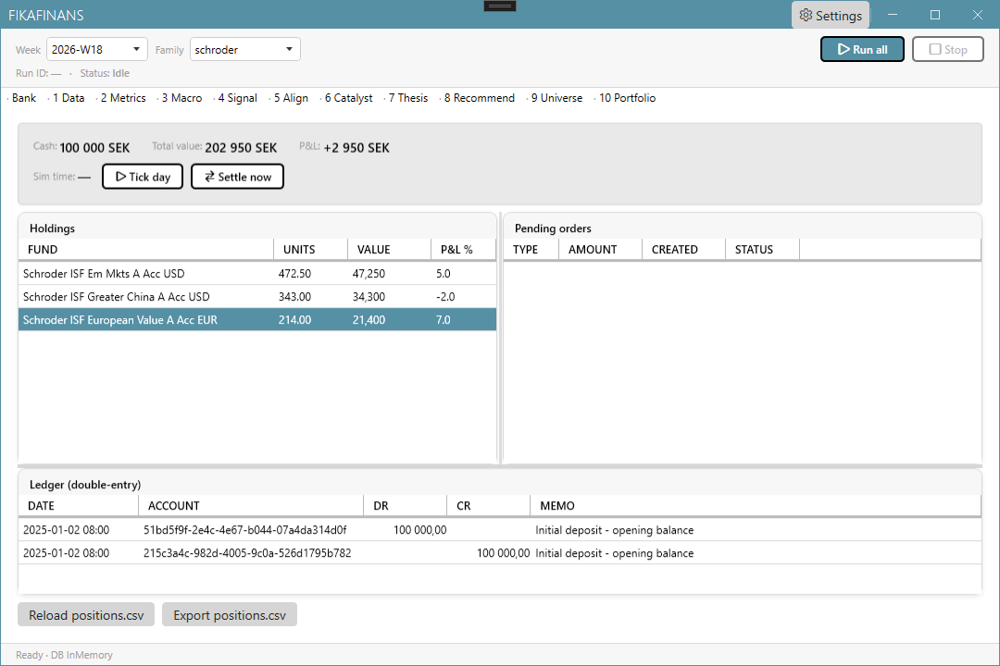
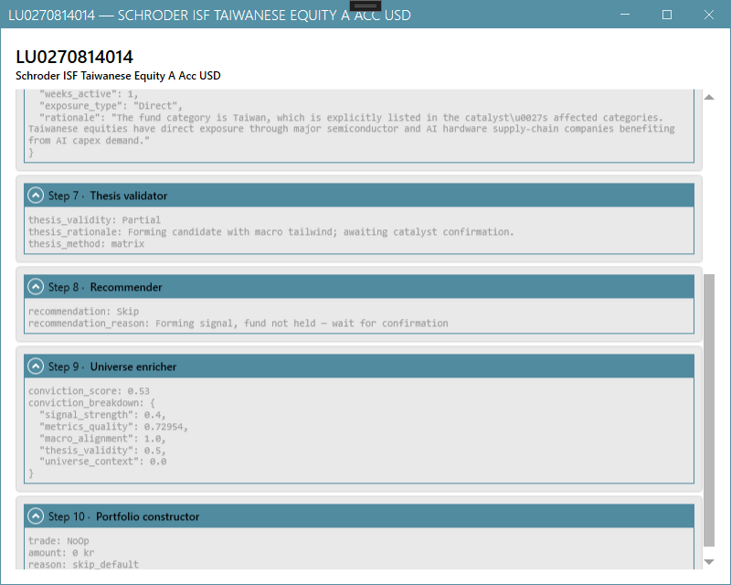
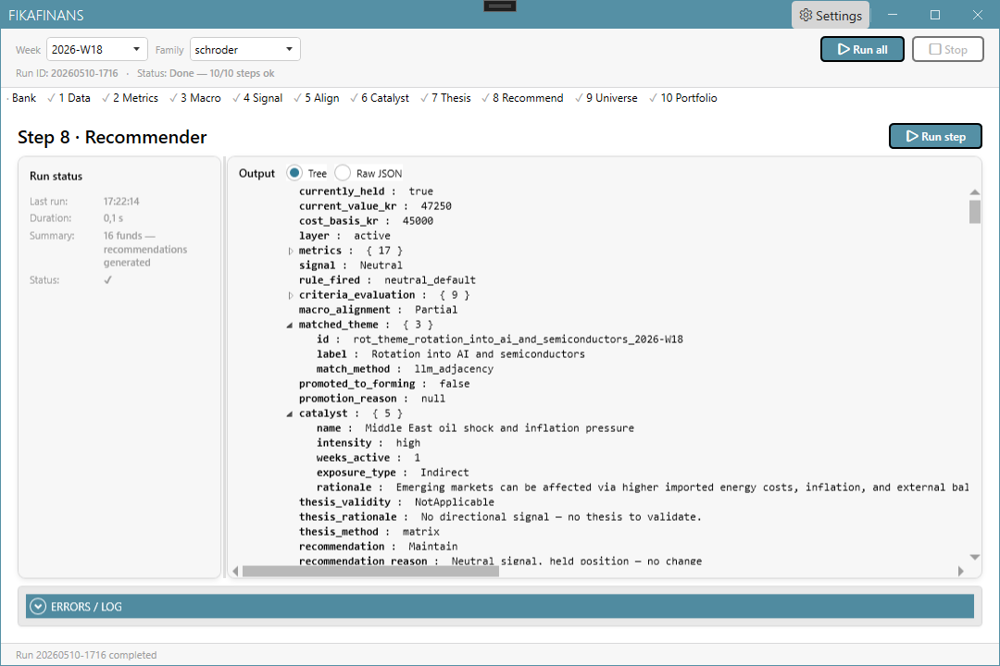
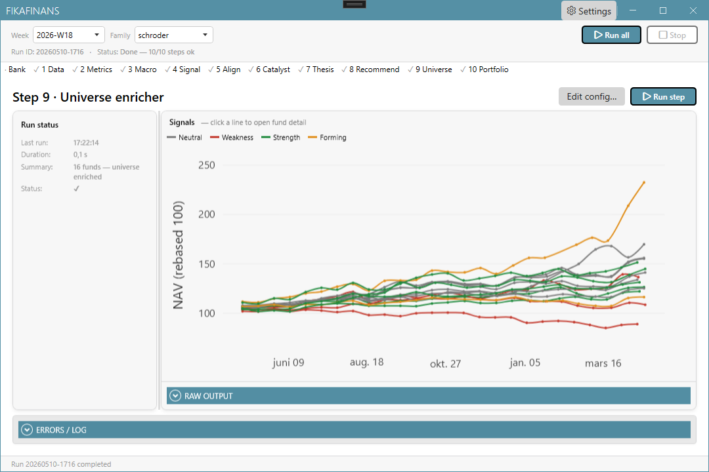
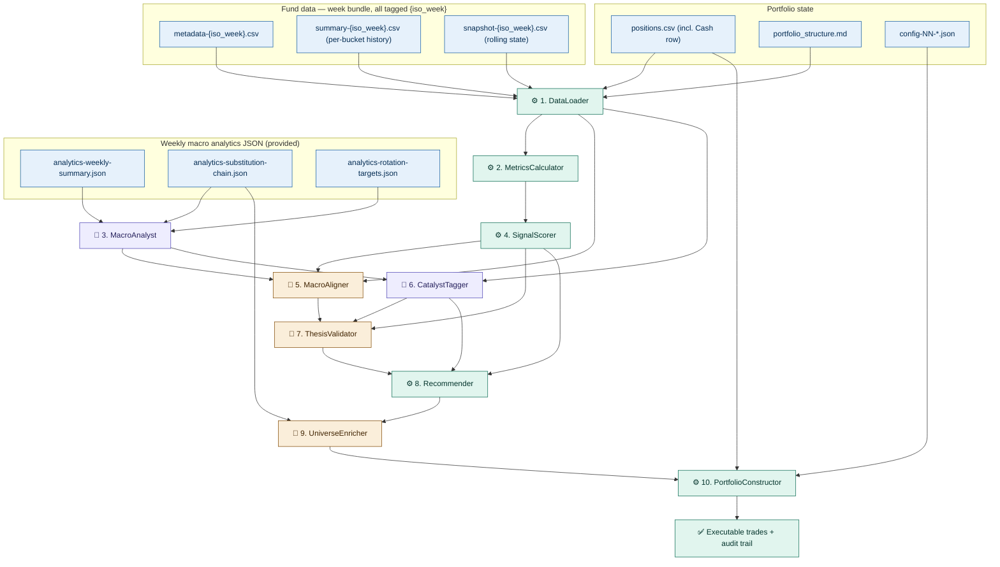

# FikaFinans

> A personal fund-rotation pipeline that turns weekly fund data and macro
> narrative into executable trade decisions. Built as a skills portfolio for
> **Microsoft Agent Framework** + **Azure AI Foundry**.
>
> 🚧 **Status — active development.** The desktop pipeline runs end-to-end
> today; the cloud backend is the work in flight (see the [roadmap](#-roadmap)).
> The first public demo will land once the Azure Functions + Queue Storage +
> Tables stack is in place.

## 🔗 Continuation of

Two upstream projects do the heavy lifting; this one joins their output and turns it into actual trade decisions:

- **[KanelBulleKapital](https://github.com/Muhomorik/KanelBulleKapital)** —
  weekly market-intelligence pipeline. Produces the three macro analytics JSONs
  (`weekly-summary`, `substitution-chain`, `rotation-targets`) that feed step 03
  of this pipeline.
- **[SemanticKernel-FundDocsQnA-dotnet-nextjs](https://github.com/Muhomorik/SemanticKernel-FundDocsQnA-dotnet-nextjs)** —
  the existing F1 backend (a.k.a. *YieldRacoon*). Owns the fund universe, NAV
  crawler, and per-ISIN data endpoint that this pipeline consumes.

KanelBulleKapital tells *what the market is doing*. 

YieldRacoon tells *what each fund is doing*. FikaFinans joins the two and decides *what to trade*.

## 🎬 Screenshots

| Bank view | Fund detail |
| --- | --- |
|  |  |
| **Step 8 — Recommender** | **Step 9 — UniverseEnricher** |
|  |  |

## 📋 Overview

A 10-agent pipeline that turns weekly fund data and macro narrative into a deterministic set of trades.

- **Shape.** Mix of pure-code agents, LLM agents, and hybrids. The chain is append-only; step 10 is strictly deterministic so backtests replay byte-identically.
- **Today.** Runs end-to-end inside a WPF desktop app backed by **SQLite + EF Core**.
- **Tomorrow.** Orchestration moves to **Azure Functions** (Consumption plan), with **Queue Storage** bridging to YieldRacoon and **Azure Tables** as the system of record — see the roadmap below.
- **Why.** Skills portfolio for **Microsoft Agent Framework** (`Microsoft.Agents.AI`) layered on **Azure AI Foundry** (`Azure.AI.Projects`).

## ✅ Roadmap

**Done:**

- [x] Build MVP in a test project with hardcoded input data.
- [x] Port the test-project code into the WPF app with real layered architecture (`Domain` / `Application` / `Infrastructure` / `Wpf`) and live GUI updates — still hardcoded data.
- [x] Replace hardcoded fixtures with a real **SQLite + EF Core** datastore and run all 10 pipeline steps against it (every agent implemented in [FikaFinans.Infrastructure/Pipeline/Agents/](FikaFinans.Infrastructure/Pipeline/Agents/)).

**Next — derived from [Docs/backend-nav-sync-plan.md](Docs/backend-nav-sync-plan.md):**

- [ ] **Queue Storage as the producer/consumer bridge** — YieldRacoon's F1 App Service publishes NAV signals onto the queue; FikaFinans consumes them. No direct coupling between the two backends.
- [ ] **Queue-triggered Azure Function** on the Consumption plan — one ISIN per message, ~1 minute per fund, no long-running orchestrator.
- [ ] **Progress Table** (per-ISIN, in Azure Tables) — doubles as dedup record + in-flight processing lock; atomic `Free → Processing → Free` claim via ETag optimistic concurrency.
- [ ] **Step output columns inline on the per-ISIN row** (`Step01Json` … `Step09Json`) instead of blob storage, with runtime + integration-test size guards against the 32K Azure Tables string cap.
- [ ] **One queue per step boundary** — `pipeline-start` + 8 chained `step{N}-done` queues + `*-poison` siblings; each step Function reads its column, runs, writes the next column, enqueues the next signal.
- [ ] **Step 10 daily timer Function** — fires once at 23:00 CET, fans in every fund's `Step09Json`, emits the day's trades.
- [ ] **YR per-ISIN fund-data endpoint** + FF-side adapter (the queue carries signals only; fund data travels out of band).
- [ ] **Storage migration** — pluggable `SQLite ↔ Azure Tables` behind one repository interface; replace `positions.csv` with a Positions table; move Step 10's "send to bank" out of WPF and into the Function. Tracked in [Docs/storage-migration-plan.md](Docs/storage-migration-plan.md).
- [ ] **Analytics-JSON migration** — Step 03's three weekly JSONs stop being files in `docs/inputs/` and start coming live (or cached) from the KanelBrief API. Tracked in [Docs/analytics-json-migration-plan.md](Docs/analytics-json-migration-plan.md).
- [ ] **Stuck-row janitor**, **visibility-extension margin**, and **progress dashboard** — open questions from the backend plan that need to be closed before the first real run.

## 🏗️ Pipeline architecture

Ten agents wired in a fixed order — each step's output is the next step's
input, and the chain is **append-only** (no agent ever mutates fields produced
by an earlier agent). Step 10 is the only place that knows about portfolio
state, and it has **zero LLM calls** so backtests replay byte-identically.



| Symbol | Execution type |
| --- | --- |
| ⚙️ | Pure code — deterministic, no LLM |
| 🤖 | LLM only — full prompt + evaluation rubric in the contract |
| 🔀 | Hybrid — code computes structured fields, LLM produces explanatory text |

## 📚 Pipeline steps

Every step has a self-contained contract under [FikaFinans.InfrastructureV2.Tests/docs/](FikaFinans.InfrastructureV2.Tests/docs/) — input schema, output schema, failure modes, test fixtures, and (for LLM agents) prompt skeleton + evaluation rubric.

| # | Agent | Type | What it does |
| --- | --- | --- | --- |
| 01 | [DataLoader](FikaFinans.InfrastructureV2.Tests/docs/01-dataloader.md) | ⚙️ Code | Load, validate, and normalize the four CSV input files into a single per-fund record set keyed by ISIN. |
| 02 | [MetricsCalculator](FikaFinans.InfrastructureV2.Tests/docs/02-metricscalculator.md) | ⚙️ Code | Assemble per-fund metrics by combining bucket history, rolling snapshot values, and metadata-derived fee data. |
| 03 | [MacroAnalyst](FikaFinans.InfrastructureV2.Tests/docs/03-macroanalyst.md) | 🤖 LLM | Read the three weekly macro analytics JSON reports and emit a structured macro context with regime, catalysts, and rotation themes. |
| 04 | [SignalScorer](FikaFinans.InfrastructureV2.Tests/docs/04-signalscorer.md) | ⚙️ Code | Map per-fund metrics to a single Signal label (Strength / Weakness / Forming / Neutral) using deterministic rules. |
| 05 | [MacroAligner](FikaFinans.InfrastructureV2.Tests/docs/05-macroaligner.md) | 🔀 Hybrid | Determine whether each fund's category aligns with active macro rotation themes; promote near-buy candidates to Forming when alignment is Strong. |
| 06 | [CatalystTagger](FikaFinans.InfrastructureV2.Tests/docs/06-catalysttagger.md) | 🤖 LLM | Tag each fund with the active macro catalyst that affects it (or null if none). |
| 07 | [ThesisValidator](FikaFinans.InfrastructureV2.Tests/docs/07-thesisvalidator.md) | 🔀 Hybrid | Determine whether each fund's investment thesis is Valid, Partial, Invalid, or NotApplicable based on signal + macro alignment + catalyst combination. |
| 08 | [Recommender](FikaFinans.InfrastructureV2.Tests/docs/08-recommender.md) | ⚙️ Code | Map (signal, thesis_validity, catalyst, currently_held) into a single recommendation type via a deterministic mapping table. |
| 09 | [UniverseEnricher](FikaFinans.InfrastructureV2.Tests/docs/09-universeenricher.md) | 🔀 Hybrid | Add cross-fund context to each per-fund record: conviction score, universe rank, alternatives, rotation pair linkage. |
| 10 | [PortfolioConstructor](FikaFinans.InfrastructureV2.Tests/docs/10-portfolioconstructor.md) | ⚙️ Code | Convert per-fund recommendations into executable trades subject to cash policy, concentration constraints, and conviction gating. |

The full architecture, vocabularies, invariants, and glossary live in [FikaFinans.InfrastructureV2.Tests/docs/pipeline-plan.md](FikaFinans.InfrastructureV2.Tests/docs/pipeline-plan.md).

## 🛠️ Tech Stack

### Desktop

| Technology | Version | Purpose |
| --- | --- | --- |
| .NET | 9.0 | Framework |
| WPF | — | Desktop UI |
| Entity Framework Core | 9.0 | SQLite persistence |
| DevExpressMvvm | 24.1.6 | MVVM framework |
| Autofac | 9.0.0 | Dependency injection |
| Rx.NET | 6.1.0 | Reactive programming |
| MahApps.Metro | 2.4.11 | Modern UI toolkit |
| WebView2 | 1.0.2903 | Embedded Chromium browser |
| Magick.NET | 14.10.2 | Privacy filter image processing |
| NLog | 6.0.7 | Logging |

### Cloud / AI (target architecture)

| Technology | Purpose |
| --- | --- |
| Azure Functions | Serverless compute (per-step queue triggers + Step 10 daily timer) |
| Azure Tables | NoSQL key-value storage — system of record for the per-ISIN row |
| Azure Queue Storage | Bridge between YieldRacoon producer and FikaFinans consumer |
| Azure AI Foundry | Model hosting + Foundry Agents Service |

### .NET SDK packages for Foundry agents

| Package | Status | Role |
| --- | --- | --- |
| `Azure.AI.Projects` | **GA 2.0** | `AIProjectClient`, agent administration, the Foundry SDK foundation |
| `Azure.AI.Extensions.OpenAI` | Active | Bridge to the OpenAI .NET SDK |
| `Microsoft.Agents.AI` | **1.0 RC** | MAF — provider-agnostic `AIAgent` abstraction, layered on top of AI Projects via `.AsAIAgent(...)` |
| `Azure.Identity` | GA | `DefaultAzureCredential` for keyless auth (`az login` locally) |
| `OpenAI` | GA | Official OpenAI .NET SDK, pulled in transitively |

## 📁 Solution layout

```text
FikaFinans/
├── FikaFinans.Domain/                  # Domain models, aggregates, repository interfaces (no external deps)
├── FikaFinans.Application/             # Application services, orchestration, contracts
├── FikaFinans.Infrastructure/          # SQLite + EF Core, Foundry clients, all 10 pipeline agents
├── FikaFinans.Wpf/                     # MahApps.Metro + DevExpressMvvm desktop app
├── FikaFinans.Domain.Tests/            # NUnit tests for the domain layer
├── FikaFinans.Application.Tests/       # NUnit tests for the application layer
├── FikaFinans.InfrastructureV2.Tests/  # Canonical pipeline test project (specs + fixtures + step outputs)
├── Docs/                               # Repo-level design docs (backend, storage, analytics migration)
└── FikaFinans.sln
```

## 📚 Related docs

| Document | Purpose |
| --- | --- |
| [Docs/backend-nav-sync-plan.md](Docs/backend-nav-sync-plan.md) | Azure Functions + Queue Storage + Progress Table design |
| [Docs/storage-migration-plan.md](Docs/storage-migration-plan.md) | Pluggable SQLite ↔ Azure Tables behind one repository interface |
| [Docs/analytics-json-migration-plan.md](Docs/analytics-json-migration-plan.md) | Step 03 input migration from files to live KanelBrief API |
| [FikaFinans.InfrastructureV2.Tests/docs/pipeline-plan.md](FikaFinans.InfrastructureV2.Tests/docs/pipeline-plan.md) | Full pipeline architecture, vocabularies, invariants, glossary |
| [FikaFinans.InfrastructureV2.Tests/docs/instructions.md](FikaFinans.InfrastructureV2.Tests/docs/instructions.md) | Implementation roadmap + per-agent contract index |
